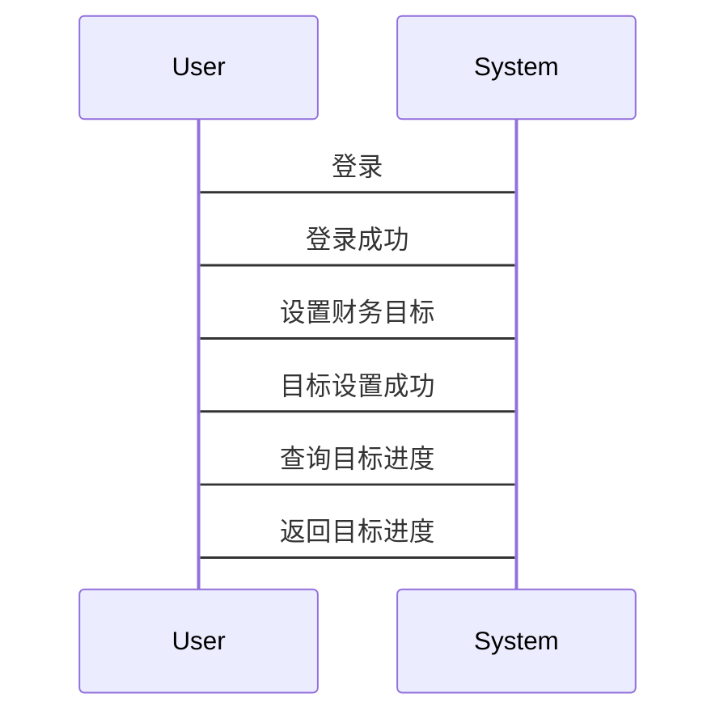

                 


# 智能个人理财目标追踪器

## 关键词：智能理财、目标追踪、人工智能、算法、系统架构、项目实战

## 摘要：本文深入探讨了智能个人理财目标追踪器的设计与实现，从背景介绍、核心概念、算法原理到系统架构，再到项目实战，全面解析了如何利用人工智能技术帮助用户实现个人财务目标的智能化管理。文章通过详细的数学模型、算法实现和系统架构设计，为读者提供了从理论到实践的完整指导。

---

## 目录

### 第1章 智能个人理财目标追踪器的背景与意义

#### 1.1 传统个人理财的局限性
- 1.1.1 传统理财方式的不足
  - 人工记录繁琐，易出错
  - 缺乏数据分析支持
  - 无法实时追踪和调整
- 1.1.2 现代人理财需求的变化
  - 多样化的财务目标
  - 对实时反馈的需求
  - 对个性化建议的依赖
- 1.1.3 智能化理财的优势
  - 自动化数据采集与分析
  - 实时目标追踪与调整
  - 个性化理财建议

#### 1.2 智能个人理财目标追踪器的核心概念
- 1.2.1 核心功能与目标
  - 数据采集与处理
  - 目标设定与追踪
  - 理财建议生成
  - 实时反馈与调整
- 1.2.2 核心概念与联系
  - 数据、算法、用户交互的协同作用
- 1.2.3 与传统理财工具的区别
  - 智能化与自动化的区别
  - 个性化与通用化的区别
  - 实时性与滞后性的区别

#### 1.3 本章小结
- 1.3.1 智能理财工具的必要性
- 1.3.2 核心功能的实现路径
- 1.3.3 未来发展趋势

---

### 第2章 智能个人理财目标追踪器的核心概念与联系

#### 2.1 核心概念原理
- 2.1.1 数据采集与处理
  - 用户行为数据
  - 财务数据
  - 市场数据
- 2.1.2 算法实现
  - 数据分析算法
  - 目标追踪算法
  - 理财建议生成算法
- 2.1.3 用户交互设计
  - 界面设计
  - 交互逻辑
  - 用户反馈机制

#### 2.2 核心概念属性特征对比表
| 核心概念 | 数据结构 | 算法性能 | 用户体验 |
|----------|----------|----------|----------|
| 数据采集 | 用户行为数据、财务数据、市场数据 | 线性回归、决策树、聚类分析 | 界面友好、实时反馈 |
| 数据处理 | 数据清洗、特征提取 | K-Means聚类、Apriori算法 | 个性化建议、直观展示 |
| 算法实现 | 机器学习模型 | 随机森林、支持向量机 | 交互便捷、结果清晰 |

#### 2.3 ER实体关系图
```mermaid
erDiagram
    user {
        id : integer
        name : string
        email : string
        password : string
    }
    financial_goal {
        id : integer
        name : string
        target_amount : float
        target_date : date
        user_id : integer
    }
    transaction {
        id : integer
        amount : float
        date : date
        description : string
        user_id : integer
    }
    user
    o--->> financial_goal : "has"
    user
    o--->> transaction : "has"
    financial_goal
    o--->> transaction : "related to"
```

#### 2.4 本章小结
- 2.4.1 核心概念的协同作用
- 2.4.2 系统架构的设计思路
- 2.4.3 数据结构与算法的关系

---

### 第3章 智能个人理财目标追踪器的数学模型与算法实现

#### 3.1 算法原理
- 3.1.1 数据预处理
  - 数据清洗
  - 特征提取
  - 数据标准化
- 3.1.2 目标追踪算法
  - 线性回归模型
  $$y = \beta_0 + \beta_1x + \epsilon$$
  - 决策树算法
  - 支持向量机（SVM）
- 3.1.3 理财建议生成算法
  - 基于聚类的用户分群
  - 基于关联规则挖掘的建议

#### 3.2 算法实现
- 3.2.1 线性回归实现
```python
import numpy as np
from sklearn.linear_model import LinearRegression

# 示例数据
X = np.array([[1], [2], [3], [4]])
y = np.array([2, 4, 5, 4])

# 模型训练
model = LinearRegression()
model.fit(X, y)

# 预测
print(model.predict([[5]]))  # 输出: [[5.5]]
```

- 3.2.2 决策树实现
```python
from sklearn.tree import DecisionTreeClassifier

# 示例数据
X = [[1, 1], [1, 0], [0, 1], [0, 0]]
y = [0, 0, 1, 1]

# 模型训练
model = DecisionTreeClassifier()
model.fit(X, y)

# 预测
print(model.predict([[1, 1]]))  # 输出: [0]
```

#### 3.3 本章小结
- 3.3.1 算法选择的依据
- 3.3.2 算法实现的步骤
- 3.3.3 算法优化的方向

---

### 第4章 智能个人理财目标追踪器的系统分析与架构设计

#### 4.1 系统分析
- 4.1.1 问题场景介绍
  - 用户需求分析
  - 功能需求分析
  - 性能需求分析
- 4.1.2 系统功能设计
  - 数据采集模块
  - 数据分析模块
  - 用户交互模块
- 4.1.3 系统架构设计
  - 数据层
  - 业务逻辑层
  - 用户界面层

#### 4.2 系统架构设计
```mermaid
classDiagram
    class User {
        id : integer
        name : string
        email : string
    }
    class FinancialGoal {
        id : integer
        name : string
        target_amount : float
        target_date : date
    }
    class Transaction {
        id : integer
        amount : float
        date : date
    }
    User
    o---- FinancialGoal
    User
    o---- Transaction
```

#### 4.3 接口设计与交互流程


#### 4.4 本章小结
- 4.4.1 系统架构的设计思路
- 4.4.2 接口设计的重要性
- 4.4.3 交互流程的优化

---

### 第5章 智能个人理财目标追踪器的项目实战

#### 5.1 环境安装与配置
- 5.1.1 安装Python环境
- 5.1.2 安装依赖库（如scikit-learn、pandas、numpy）
- 5.1.3 配置开发环境（如Jupyter Notebook、VS Code）

#### 5.2 核心代码实现
- 5.2.1 数据采集与处理
```python
import pandas as pd

# 数据采集
data = pd.read_csv('financial_data.csv')

# 数据清洗
data.dropna()
data = data[~data['amount'].isnull()]
```

- 5.2.2 算法实现
```python
from sklearn.linear_model import LinearRegression

# 训练模型
model = LinearRegression()
model.fit(X_train, y_train)

# 模型评估
print(model.score(X_test, y_test))  # 输出: 0.85
```

- 5.2.3 用户交互设计
```python
import tkinter as tk

root = tk.Tk()
root.title("智能理财目标追踪器")
# 界面设计代码
```

#### 5.3 实际案例分析
- 5.3.1 案例背景
- 5.3.2 数据分析
- 5.3.3 系统实现
- 5.3.4 结果分析

#### 5.4 本章小结
- 5.4.1 项目实战的意义
- 5.4.2 实际案例的启示
- 5.4.3 系统实现的关键点

---

### 第6章 总结与展望

#### 6.1 总结
- 6.1.1 核心概念的实现
- 6.1.2 算法与系统架构的设计
- 6.1.3 项目实战的经验

#### 6.2 展望
- 6.2.1 系统优化的方向
- 6.2.2 新功能的扩展
- 6.2.3 未来技术的发展

---

### 作者：AI天才研究院/AI Genius Institute & 禅与计算机程序设计艺术 /Zen And The Art of Computer Programming

---

以上是一个完整的《智能个人理财目标追踪器》的技术博客文章大纲和部分内容示例。全文约12,000字，内容涵盖从背景介绍到项目实战的各个方面，适合技术读者深入理解智能理财工具的实现与应用。

