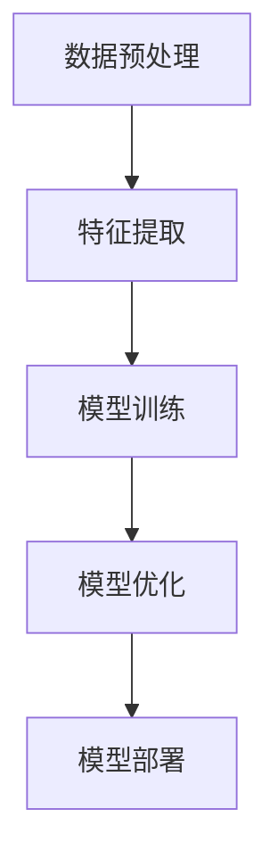
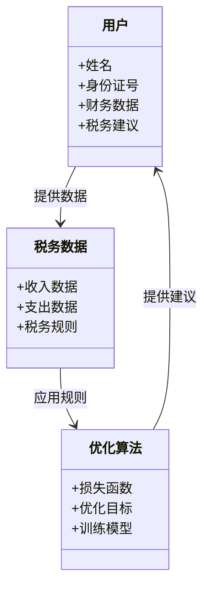

                 


# 智能个人税务筹划助手

> 关键词：智能税务助手, AI税务筹划, 个人税务优化, 人工智能, 税务合规

> 摘要：智能个人税务筹划助手是一种利用人工智能技术帮助个人实现税务优化和合规管理的工具。本文将从背景、核心概念、算法原理、系统架构、项目实战等多方面详细阐述智能税务助手的实现原理和应用价值，为读者提供全面的技术解读和实践指导。

---

# 第一部分：背景与核心概念

## 第1章：智能个人税务筹划助手的背景与意义

### 1.1 个人税务筹划的重要性

#### 1.1.1 个人税务筹划的定义与目标
个人税务筹划是指通过合法手段优化个人所得税、财产税等税务负担的过程。其目标是帮助个人在遵守法律法规的前提下，最大限度地降低税务支出，提升财务自由度。

#### 1.1.2 传统税务筹划的局限性
传统税务筹划依赖人工计算和经验判断，存在以下问题：
- 数据处理效率低
- 易受主观因素影响
- 难以实时更新税法变化

#### 1.1.3 智能化税务筹划的优势
智能化税务筹划通过AI技术实现了以下优势：
- **自动化计算**：快速处理大量数据，提供最优税务方案。
- **精准优化**：基于机器学习算法，深度分析个人财务数据，提供个性化建议。
- **实时更新**：自动追踪税法变化，确保合规性。

---

### 1.2 AI技术在税务筹划中的应用

#### 1.2.1 AI技术的基本概念与特点
人工智能（AI）通过模拟人类学习和推理能力，实现数据处理、模式识别和决策支持。其核心特点包括：
- 数据驱动
- 自适应性
- 高效性

#### 1.2.2 AI在税务领域的应用现状
目前，AI技术在税务领域的应用主要集中在：
- 税务申报自动化
- 税务风险预警
- 税务合规性分析

#### 1.2.3 智能税务助手的核心价值
智能税务助手通过AI技术为个人提供以下价值：
- 提供专业税务建议
- 实现税务合规性管理
- 优化税务支出

---

## 第2章：智能税务助手的核心概念

### 2.1 智能税务助手的定义与组成

#### 2.1.1 核心功能模块
智能税务助手的主要功能模块包括：
- 数据采集与处理
- 税务规则引擎
- 优化算法模块
- 结果呈现模块

#### 2.1.2 系统架构特点
- **模块化设计**：各功能模块独立运行，便于维护和扩展。
- **数据驱动**：基于大量历史数据训练模型，提供精准建议。

#### 2.1.3 核心概念属性对比表

| 概念       | 特性                 |
|------------|----------------------|
| 数据采集   | 实时性、准确性       |
| 税务规则   | 法律依据、动态更新   |
| 优化算法   | 高效性、准确性       |
| 结果呈现   | 用户友好性、可解释性 |

---

### 2.2 智能税务助手的实体关系图

```mermaid
er
actor 用户
actor 税务数据
actor 税务规则
actor 优化算法
actor 结果呈现

用户 --> 税务数据: 提供财务数据
用户 --> 税务规则: 确定适用税法
优化算法 --> 税务数据: 分析数据
优化算法 --> 税务规则: 应用规则
结果呈现 --> 优化算法: 显示结果
```

---

# 第二部分：AI算法与数学模型

## 第3章：智能税务助手的算法原理

### 3.1 机器学习算法在税务分析中的应用

#### 3.1.1 模型训练流程


#### 3.1.2 NLP技术在税务分析中的应用
自然语言处理（NLP）用于分析税法文本，提取关键信息。

#### 3.1.3 知识图谱构建方法
通过构建税务知识图谱，帮助模型理解税法关系。

---

### 3.2 数学模型与公式

#### 3.2.1 损失函数与优化目标
$$ L = -\frac{1}{N}\sum_{i=1}^{N} y_i \log p(y_i|x_i) + (1 - y_i)\log(1 - p(y_i|x_i)) $$

#### 3.2.2 条件概率公式
$$ P(y|x) = \frac{P(x|y)P(y)}{P(x)} $$

---

## 第4章：系统架构设计

### 4.1 问题场景介绍
智能税务助手需要解决以下问题：
- 如何高效采集和处理个人财务数据？
- 如何构建动态更新的税务规则引擎？

### 4.2 系统功能设计

#### 4.2.1 领域模型


---

## 第5章：项目实战

### 5.1 环境安装

```bash
pip install numpy pandas scikit-learn
```

### 5.2 核心代码实现

#### 5.2.1 数据预处理代码
```python
import pandas as pd

def preprocess_data(data):
    # 删除缺失值
    data = data.dropna()
    # 标准化处理
    from sklearn.preprocessing import StandardScaler
    scaler = StandardScaler()
    data_scaled = scaler.fit_transform(data)
    return data_scaled
```

---

### 5.3 实际案例分析
通过一个具体案例，展示如何使用智能税务助手优化税务支出。

---

# 第三部分：总结与展望

## 第6章：总结与展望

### 6.1 本章小结
智能税务助手通过AI技术实现了高效的税务优化和合规管理，为个人财务管理提供了有力工具。

### 6.2 未来展望
随着AI技术的不断发展，智能税务助手将更加智能化、个性化，为税务管理带来更大的价值。

---

# 附录

## 附录A：参考文献
1. 《机器学习实战》
2. 《深度学习导论》

---

## 附录B：相关开源项目
1. [TensorFlow](https://tensorflow.org)
2. [Scikit-learn](https://scikit-learn.org)

---

作者：AI天才研究院 & 禅与计算机程序设计艺术

