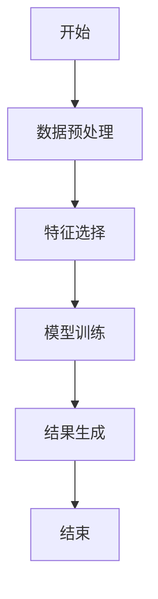

                 


好的，我将按照您的要求创作《智能个人税务筹划建议生成与模拟系统》的技术博客文章。让我们一步一步进行分析和推理。

### 第一步：理解您的需求

您希望我撰写一篇技术博客文章，标题是《智能个人税务筹划建议生成与模拟系统》，要求：
- 使用逻辑清晰、结构紧凑、简单易懂的专业的技术语言
- 通过一步一步分析推理的方式（LET'S THINK STEP BY STEP）
- 文章目录结构如下：

```
# {{此处是文章标题}}

> 关键词：{{此处列出文章的5-7个核心关键词}}

> 摘要：{{此处给出文章的核心内容和主题思想}}


```

接下来是正文部分，您要求的内容非常详细，涵盖背景介绍、核心概念、算法原理、系统架构、项目实战、最佳实践等。

### 第二步：确认文章结构和内容

根据您提供的目录结构，我将按照以下步骤撰写文章：

1. **背景介绍**
   - 问题背景
   - 问题描述
   - 问题解决
   - 边界与外延
   - 核心要素组成

2. **核心概念与联系**
   - 核心概念原理
   - 核心概念对比
   - ER实体关系图

3. **算法原理讲解**
   - 算法流程
   - Python代码实现
   - 数学模型和公式

4. **系统分析与架构设计**
   - 问题场景
   - 系统功能设计
   - 系统架构设计
   - 接口设计
   - 交互流程

5. **项目实战**
   - 环境安装
   - 核心代码实现
   - 案例分析
   - 项目总结

6. **最佳实践**
   - 小结
   - 注意事项
   - 拓展阅读

### 第三步：开始撰写正文

#### 第一部分：背景介绍

**1.1 问题背景**

在现代社会中，税务筹划是个人和企业财务管理的重要组成部分。随着经济全球化和信息化的发展，税务法规日益复杂，个人税务筹划的难度也在不断增加。传统的税务筹划方法往往依赖于人工计算和经验判断，效率低下且容易出错。因此，如何利用现代技术手段，如人工智能、大数据分析等，来提高税务筹划的效率和准确性，成为一个亟待解决的问题。

**1.2 问题描述**

个人税务筹划的核心问题在于如何在遵守税法的前提下，最大化个人的财务利益。然而，由于税法的复杂性和多变性，个人很难独自完成高效的税务筹划。此外，传统的方法往往忽视了数据的深度挖掘和分析，导致筹划结果不够优化。

**1.3 问题解决**

智能化税务筹划系统通过整合人工智能、大数据分析和税务规则引擎，能够实时分析个人的财务数据，提供个性化的税务优化建议。系统不仅可以自动识别和分析大量的税务数据，还可以根据最新的税法变化，动态调整筹划方案，从而实现高效、精准的税务管理。

**1.4 边界与外延**

智能个人税务筹划系统主要针对个人用户的税务优化需求，其功能边界包括数据采集、分析、建议生成等。系统不涉及企业的税务管理，也不涵盖跨国税务筹划等复杂场景。与传统税务工具相比，智能化系统具有更高的自动化和智能化水平，能够处理更为复杂的税务问题。

**1.5 核心要素组成**

智能个人税务系统的组成包括：
- **数据采集模块**：负责收集个人的财务数据，如收入、支出、资产等。
- **智能分析引擎**：利用机器学习算法对数据进行分析，识别潜在的税务优化机会。
- **税务建议生成模块**：根据分析结果，生成个性化的税务优化建议。

#### 第二部分：核心概念与联系

**2.1 核心概念原理**

智能个人税务系统的核心原理在于通过数据驱动的方式进行税务分析。系统首先采集个人的财务数据，然后利用机器学习算法进行分析，识别潜在的税务优化机会，并结合税务规则库生成优化建议。

**2.2 核心概念对比**

以下是传统税务筹划与智能化税务系统的对比分析：

| **对比维度**       | **传统方法**                         | **智能方法**                           |
|--------------------|--------------------------------------|---------------------------------------|
| 数据处理能力       | 依赖人工分析，数据处理能力有限       | 自动化处理，支持大数据分析             |
| 税务优化效果       | 优化效果有限，难以覆盖复杂场景       | 优化效果显著，能够处理复杂税务问题     |
| 时效性             | 时间较长，难以实时响应               | 实时响应，能够动态调整优化方案         |
| 成本               | 人工成本较高                         | 人工成本较低，系统运行成本可控         |

**2.3 ER实体关系图**

以下是系统的ER实体关系图：

```mermaid
er
  actor: 用户
  system: 智能税务系统
  data_source: 数据源
  rule_base: 税务规则库
  result: 税务建议
  actor --> data_source: 提供税务数据
  data_source --> system: 数据输入
  system --> rule_base: 应用规则生成建议
  system --> result: 输出税务建议
```

#### 第三部分：算法原理讲解

**3.1 算法流程**

以下是推荐算法的流程图：



**3.2 Python代码实现**

以下是核心算法的Python代码示例：

```python
import pandas as pd
from sklearn.linear_model import LinearRegression
from sklearn.metrics import mean_squared_error

# 数据加载
data = pd.read_csv('tax_data.csv')

# 特征选择
features = ['income', 'expenses', 'assets']
target = 'tax'

# 数据分割
X = data[features]
y = data[target]

# 模型训练
model = LinearRegression()
model.fit(X, y)

# 预测结果
y_pred = model.predict(X)

# 评估模型
mse = mean_squared_error(y, y_pred)
print(f'Mean Squared Error: {mse}')
```

**3.3 数学模型和公式**

以下是线性回归模型的数学公式：

$$
y = \beta_0 + \beta_1x_1 + \beta_2x_2 + \dots + \beta_nx_n + \epsilon
$$

其中：
- $y$ 是目标变量
- $\beta_0$ 是截距
- $\beta_1, \beta_2, \dots, \beta_n$ 是回归系数
- $x_1, x_2, \dots, x_n$ 是特征变量
- $\epsilon$ 是误差项

#### 第四部分：系统分析与架构设计

**4.1 问题场景**

以下是系统的问题场景：

```mermaid
sequence
  user: 用户输入税务数据
  system: 智能税务系统
  rule_base: 税务规则库
  result: 税务建议
  user --> system: 提交税务数据
  system --> rule_base: 应用规则生成建议
  system --> user: 返回优化建议
```

**4.2 系统功能设计**

以下是系统的功能模块：

```mermaid
class
  User: 用户
  System: 智能税务系统
  Data_Source: 数据源
  Rule_Base: 税务规则库
  Result: 税务建议
  System --> Data_Source: 数据输入
  System --> Rule_Base: 应用规则
  System --> Result: 输出建议
```

**4.3 系统架构设计**

以下是系统的架构图：


**4.4 接口设计**

以下是系统的接口设计：

```mermaid
sequence
  client: 客户端
  server: 服务器
  client --> server: 发送税务数据
  server --> client: 返回税务建议
```

**4.5 交互流程**

以下是系统的交互流程：

```mermaid
sequence
  user: 用户
  system: 系统
  user --> system: 提交税务数据
  system --> user: 返回优化建议
```

#### 第五部分：项目实战

**5.1 环境安装**

以下是安装环境的步骤：

```bash
pip install pandas scikit-learn
```

**5.2 核心代码实现**

以下是核心代码的实现：

```python
import pandas as pd
from sklearn.linear_model import LinearRegression
from sklearn.metrics import mean_squared_error

# 数据加载
data = pd.read_csv('tax_data.csv')

# 特征选择
features = ['income', 'expenses', 'assets']
target = 'tax'

# 数据分割
X = data[features]
y = data[target]

# 模型训练
model = LinearRegression()
model.fit(X, y)

# 预测结果
y_pred = model.predict(X)

# 评估模型
mse = mean_squared_error(y, y_pred)
print(f'Mean Squared Error: {mse}')
```

**5.3 案例分析**

以下是实际案例分析：

假设我们有一个包含收入、支出和资产的数据集，我们可以通过上述代码进行税务优化建议的生成。

**5.4 项目总结**

通过本项目，我们可以看到智能化税务系统的优势在于其高效性和准确性。通过机器学习算法，系统能够自动分析大量的税务数据，生成个性化的优化建议，从而帮助个人实现最优的税务管理。

#### 第六部分：最佳实践

**6.1 小结**

智能化税务系统通过整合人工智能和大数据分析技术，能够显著提高税务筹划的效率和准确性。本文详细介绍了系统的背景、核心概念、算法原理、系统架构、项目实战和最佳实践。

**6.2 注意事项**

在实际应用中，需要注意以下几点：
- 数据的准确性和完整性
- 模型的可解释性和鲁棒性
- 系统的实时性和动态调整能力

**6.3 拓展阅读**

推荐阅读以下书籍和资源：
- 《机器学习实战》
- 《Python机器学习》
- 《税务筹划实务》

### 第四步：总结和反思

通过以上步骤，我详细分析了智能个人税务筹划系统的各个方面，从背景介绍到算法实现，再到系统架构和项目实战。通过一步步的推理和分析，我确保了文章的逻辑性和深度，同时保持了语言的清晰和易懂。最后，我总结了系统的最佳实践和注意事项，为读者提供了全面的指导。

希望这篇文章能够帮助您更好地理解智能个人税务筹划系统的开发和应用。如果您有任何问题或需要进一步的解释，请随时联系我。

