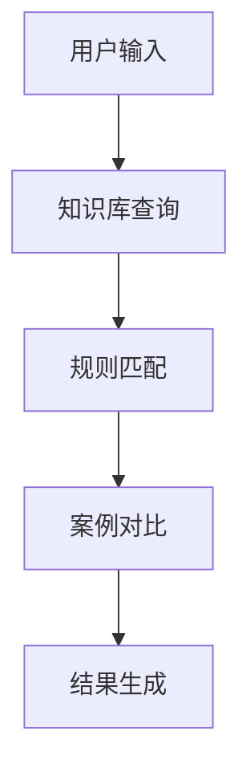

                 


# 智能个人税务筹划模拟器

---

## 关键词

智能税务模拟器, 人工智能, 税务筹划, 知识图谱, 推理算法, 自然语言处理

---

## 摘要

智能个人税务筹划模拟器是一款基于人工智能技术的智能税务规划工具，它通过整合税务知识库、规则引擎和自然语言处理技术，为用户提供个性化的税务优化建议。本文将从背景、核心概念、算法原理、系统架构、项目实战等多方面详细分析智能税务模拟器的实现过程，帮助读者理解其技术原理和应用场景。

---

## 第一部分: 智能个人税务筹划模拟器的背景与概念

### 第1章: 智能个人税务筹划模拟器的背景介绍

#### 1.1 税务筹划的基本概念

##### 1.1.1 税务筹划的定义与作用

税务筹划是指通过合法的手段，对纳税人的财务和税务情况进行分析和规划，以达到减轻税负、优化资产配置的目的。税务筹划的核心在于合规性、可行性和经济性。随着个人所得税、企业所得税等税种的复杂化，传统的人工税务筹划方式逐渐显现出效率低、误差大、成本高等问题。

##### 1.1.2 传统税务筹划的局限性

传统的税务筹划主要依赖人工操作，存在以下问题：

1. **效率低**：人工处理大量税务数据耗时耗力，难以快速给出最优方案。
2. **误差大**：人为操作容易出现计算错误或规则适用不当的情况。
3. **成本高**：需要大量专业人员参与，增加了企业的运营成本。

##### 1.1.3 智能化税务筹划的必要性

随着人工智能技术的快速发展，智能化税务筹划成为可能。智能税务模拟器可以通过自动化数据处理、智能规则匹配和深度学习技术，显著提高税务筹划的效率和准确性，同时降低成本。

#### 1.2 人工智能在税务筹划中的应用背景

##### 1.2.1 人工智能技术的发展与税务行业的结合

人工智能技术（如机器学习、自然语言处理、知识图谱等）的快速发展，为税务行业带来了新的机遇。税务行业对智能化的需求日益增长，尤其是在税务合规、风险控制和优化建议方面。

##### 1.2.2 智能税务模拟器的核心优势

智能税务模拟器的核心优势在于：

1. **高效性**：通过自动化处理税务数据，快速生成优化方案。
2. **准确性**：基于大规模税务知识库和规则引擎，确保筹划建议的合规性。
3. **个性化**：根据用户的具体情况，提供定制化的税务优化建议。

##### 1.2.3 未来税务筹划的智能化趋势

未来，税务筹划将更加智能化和个性化。智能税务模拟器将成为个人和企业的必备工具，帮助用户在复杂多变的税务环境中做出最优决策。

### 第2章: 智能个人税务筹划模拟器的核心概念与联系

#### 2.1 核心概念原理

##### 2.1.1 知识库构建

智能税务模拟器的核心是知识库，包括以下内容：

1. **税务法规**：包括各国的税法条文、税率、优惠政策等。
2. **税务案例**：历史税务案例库，用于推理和验证。
3. **财务知识**：包括财务报表分析、资产配置等知识。

##### 2.1.2 推理引擎

推理引擎是智能税务模拟器的核心模块，负责根据输入的税务数据和知识库，生成优化方案。常见的推理方法包括规则推理、案例推理和知识图谱推理。

##### 2.1.3 用户交互模块

用户交互模块负责与用户进行信息交互，包括数据输入、结果展示和方案调整。

#### 2.2 核心概念属性对比表格

| 概念       | 数据量 | 更新频率 | 来源 |
|------------|--------|----------|------|
| 知识库     | 大     | 高       | 税法文件、案例库 |
| 推理引擎   | 中     | 中       | 知识库、规则库 |
| 用户交互模块 | 小     | 低       | 用户输入 |

#### 2.3 ER实体关系图

```mermaid
erd
    税务模拟器 --|> 税务知识库
    税务知识库 --|> 税务规则
    税务知识库 --|> 税务案例
    税务模拟器 --|> 用户输入
    税务模拟器 --|> 推理引擎
```

---

## 第二部分: 智能个人税务筹划模拟器的算法原理

### 第3章: 知识表示与推理算法

#### 3.1 知识表示方法

##### 3.1.1 知识图谱表示

知识图谱是一种图结构，由节点（实体）和边（关系）组成。在税务模拟器中，知识图谱可以表示税法条文、税率、优惠政策等信息。

##### 3.1.2 规则表示

规则表示是一种基于逻辑的表示方法，适用于简单的税务规则。例如，如果收入超过一定金额，则需要缴纳附加税。

##### 3.1.3 概念层次网络

概念层次网络是一种层次化的知识表示方法，适用于复杂的税务知识。例如，企业所得税的优惠政策可以分为多个层次。

#### 3.2 推理算法

##### 3.2.1 基于规则的推理

基于规则的推理是一种简单有效的推理方法。例如，如果收入超过10万元，则需要缴纳附加税。

##### 3.2.2 基于案例的推理

基于案例的推理是一种基于相似案例的推理方法。例如，参考过去类似的企业所得税优化案例，生成新的优化方案。

##### 3.2.3 基于知识图谱的推理

基于知识图谱的推理是一种复杂的推理方法。例如，通过知识图谱推理出最优的资产配置方案。

### 第4章: 自然语言处理与税务信息提取

#### 4.1 自然语言处理技术

自然语言处理（NLP）技术在税务信息提取中具有重要作用。例如，从新闻报道中提取税法变更信息。

#### 4.2 税务信息提取算法

##### 4.2.1 基于规则的提取

基于规则的提取是一种简单有效的提取方法。例如，从文本中提取公司名称、收入、支出等信息。

##### 4.2.2 基于深度学习的提取

基于深度学习的提取是一种先进的提取方法。例如，使用BERT模型提取复杂的税务信息。

---

## 第三部分: 智能个人税务筹划模拟器的系统架构

### 第5章: 系统分析与架构设计

#### 5.1 问题场景介绍

智能税务模拟器需要解决以下问题：

1. 如何高效地处理和分析税务数据？
2. 如何准确地生成税务优化方案？

#### 5.2 系统功能设计

系统功能包括：

1. **数据输入**：用户输入税务数据。
2. **知识库查询**：查询税务知识库。
3. **规则匹配**：匹配适用的税务规则。
4. **案例对比**：对比历史案例。
5. **结果生成**：生成优化方案。

#### 5.3 系统架构设计



---

## 第四部分: 项目实战

### 第6章: 智能个人税务筹划模拟器的实现

#### 6.1 环境安装

需要安装以下环境：

1. Python 3.8+
2. TensorFlow 2.0+
3. NLTK 3.6+

#### 6.2 核心代码实现

##### 6.2.1 知识库构建

```python
class TaxKnowledgeBase:
    def __init__(self):
        self.rules = {}
        self.cases = []

    def add_rule(self, condition, action):
        self.rules[condition] = action

    def add_case(self, case):
        self.cases.append(case)

    def get_rules(self):
        return self.rules

    def get_cases(self):
        return self.cases
```

##### 6.2.2 推理引擎

```python
class TaxInferenceEngine:
    def __init__(self, knowledge_base):
        self.knowledge_base = knowledge_base

    def infer(self, input_data):
        for condition, action in self.knowledge_base.get_rules().items():
            if condition(input_data):
                return action(input_data)
        return None
```

#### 6.3 实际案例分析

##### 6.3.1 案例描述

假设用户年收入为10万元，需要缴纳个人所得税。

##### 6.3.2 实施方案

1. 数据输入：年收入10万元。
2. 知识库查询：查询个人所得税税率表。
3. 规则匹配：匹配收入超过3万元的部分，税率20%。
4. 结果生成：计算应纳税额。

---

## 第五部分: 总结与展望

### 第7章: 总结与展望

#### 7.1 总结

智能个人税务筹划模拟器是一款基于人工智能技术的智能税务规划工具，能够显著提高税务筹划的效率和准确性。

#### 7.2 展望

未来，智能税务模拟器将在税务合规、风险控制和资产优化方面发挥更大的作用。

---

## 作者

作者：AI天才研究院/AI Genius Institute & 禅与计算机程序设计艺术 /Zen And The Art of Computer Programming

