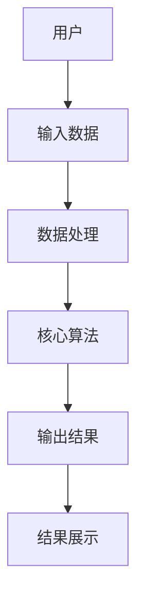
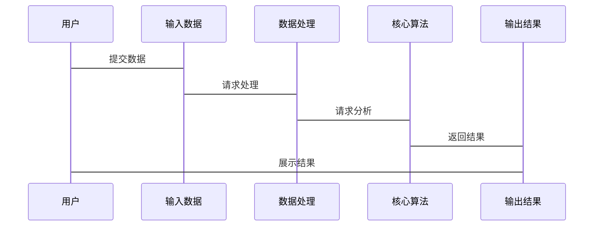

                 


# 智能个人税务筹划模拟平台

## 关键词：智能税务、人工智能、大数据分析、算法优化、税务模拟

## 摘要：  
本文深入探讨智能个人税务筹划模拟平台的构建与实现，从背景介绍到核心算法，再到系统架构设计与项目实战，详细分析了如何利用人工智能和大数据技术实现个人税务的智能化模拟与优化。通过本文，读者可以全面理解智能税务筹划的核心概念、算法原理以及实际应用，掌握构建类似平台的关键技术与方法。

---

# 第一部分: 智能个人税务筹划模拟平台的背景与核心概念

## 第1章: 智能个人税务筹划模拟平台的背景介绍

### 1.1 智能税务筹划的背景与意义

#### 1.1.1 税务筹划的定义与重要性
税务筹划是指通过合法手段，优化个人或企业的税务负担，实现税后收益最大化的过程。在个人财务规划中，税务筹划尤为重要，它直接影响个人的可支配收入和财富积累。

#### 1.1.2 传统税务筹划的局限性
传统税务筹划主要依赖人工计算和经验判断，存在以下问题：
- **效率低下**：手动计算复杂，耗时且容易出错。
- **信息孤岛**：缺乏跨部门、跨区域的数据整合。
- **主观性较强**：依赖个人经验，缺乏系统性和科学性。

#### 1.1.3 智能化税务筹划的必要性
随着人工智能和大数据技术的快速发展，智能化税务筹划成为可能。智能税务筹划能够实时分析海量数据，提供最优的税务优化方案，显著提升效率和准确性。

#### 1.1.4 税务筹划的合法性与风险
智能税务筹划必须在法律框架内进行，确保方案的合规性。同时，需要防范税务风险，避免因误操作导致的税务问题。

### 1.2 智能税务筹划的技术基础

#### 1.2.1 人工智能在税务领域的应用
人工智能技术（如机器学习、自然语言处理）在税务领域的应用包括：
- **智能分类**：自动识别税务类型和优惠政策。
- **数据挖掘**：从历史数据中提取有价值的信息，辅助决策。

#### 1.2.2 大数据分析与税务优化
大数据分析技术能够整合个人的收入、支出、资产等多维度数据，为税务筹划提供全面的支持。

#### 1.2.3 智能算法与税务模拟
智能算法（如决策树、遗传算法）能够快速模拟不同税务方案的效果，帮助用户选择最优方案。

### 1.3 智能个人税务筹划模拟平台的目标与意义

#### 1.3.1 平台的目标功能
- 提供个性化的税务模拟服务。
- 自动生成最优税务规划方案。
- 提供实时的税务政策解读。

#### 1.3.2 平台对个人税务优化的价值
- 节约时间：用户无需手动计算，快速获得最优方案。
- 提高效率：通过智能算法快速分析数据，提供精准建议。
- 降低风险：确保方案的合规性，避免税务问题。

#### 1.3.3 平台的社会与经济意义
智能税务筹划平台能够帮助个人和企业合理避税，提高整体经济效率，促进社会财富的合理分配。

### 1.4 国内外智能税务筹划的发展现状

#### 1.4.1 国内税务智能化的现状
- 国内部分企业已开始采用智能化税务管理工具。
- 政府也在推动税务系统的智能化改革。

#### 1.4.2 国际智能税务筹划的先进经验
- 美国、欧洲等地区在智能税务筹划方面有较为成熟的解决方案。
- 国际经验可以为国内提供参考。

#### 1.4.3 智能税务筹划的未来发展趋势
- 技术创新：算法优化和数据处理能力的提升。
- 应用普及：智能税务筹划工具将更加普及。
- 政策支持：政府将出台更多支持智能化税务管理的政策。

---

## 第2章: 智能个人税务筹划模拟平台的核心概念与联系

### 2.1 核心概念原理

#### 2.1.1 智能税务筹划的核心算法
- **决策树算法**：用于分类和回归分析，帮助确定最优税务方案。
- **遗传算法**：用于优化问题，寻找最优解。
- **强化学习**：通过不断试错，找到最佳策略。

#### 2.1.2 平台功能模块的逻辑关系
- 数据输入 → 数据处理 → 核心算法 → 输出结果 → 结果展示。

#### 2.1.3 数据流与信息处理流程
从用户输入数据开始，经过数据清洗、特征提取、模型训练等步骤，最终生成税务模拟结果。

### 2.2 核心概念属性特征对比

#### 2.2.1 不同税务筹划方法的对比分析
| 方法        | 优点                      | 缺点                        |
|-------------|---------------------------|-----------------------------|
| 传统方法    | 简单易懂                  | 效率低，容易出错              |
| 智能算法    | 高效准确                  | 需要大量数据和计算资源        |

#### 2.2.2 各种算法在税务模拟中的适用性
- **决策树**：适合分类问题，如确定最优税务类型。
- **遗传算法**：适合优化问题，如寻找最优税率组合。
- **强化学习**：适合动态环境，如实时调整税务策略。

#### 2.2.3 平台功能模块的性能对比
| 功能模块     | 处理速度 | 准确率 | 资源消耗 |
|--------------|----------|--------|----------|
| 数据处理     | 中等     | 高     | 中等     |
| 核心算法     | 较慢     | 高     | 高       |

### 2.3 ER实体关系图架构



---

## 第3章: 智能个人税务筹划模拟平台的算法原理

### 3.1 核心算法的选择与优化

#### 3.1.1 决策树算法在税务模拟中的应用
- 决策树通过特征选择和分割，帮助确定最优税务方案。
- 示例：根据用户的收入、支出、资产等特征，构建决策树，预测最佳税务策略。

#### 3.1.2 遗传算法的优化策略
- 遗传算法通过交叉和变异操作，不断优化税务方案。
- 示例：优化税率组合，寻找最小税负。

#### 3.1.3 强化学习在税务规划中的创新应用
- 强化学习通过试错，动态调整税务策略。
- 示例：实时调整投资组合，以适应税务政策变化。

### 3.2 算法原理的数学模型与公式

#### 3.2.1 决策树算法的数学模型
$$ Gini\_impurity = \sum_{i=1}^{n} p_i(1-p_i) $$

#### 3.2.2 遗传算法的适应度函数
$$ fitness = \sum_{i=1}^{m} w_i x_i $$

---

## 第4章: 智能个人税务筹划模拟平台的系统分析与架构设计

### 4.1 系统功能设计

#### 4.1.1 领域模型类图


#### 4.1.2 系统架构图


### 4.2 系统接口设计

#### 4.2.1 输入接口
- **功能**：接收用户输入的数据，如收入、支出、资产等。
- **接口描述**：提供API，支持JSON格式输入。

#### 4.2.2 输出接口
- **功能**：返回最优税务方案和风险提示。
- **接口描述**：支持JSON格式输出，方便用户调用。

### 4.3 系统交互序列图



---

## 第5章: 智能个人税务筹划模拟平台的项目实战

### 5.1 环境安装

#### 5.1.1 安装Python
- 安装Python 3.8及以上版本。
- 安装相关库：`scikit-learn`, `pandas`, `numpy`。

#### 5.1.2 安装依赖
- 使用pip安装所需库：
  ```bash
  pip install scikit-learn pandas numpy
  ```

### 5.2 系统核心实现源代码

#### 5.2.1 数据处理代码
```python
import pandas as pd

# 读取数据
data = pd.read_csv('tax_data.csv')

# 数据清洗
data = data.dropna()
```

#### 5.2.2 决策树算法实现
```python
from sklearn.tree import DecisionTreeClassifier

# 训练模型
model = DecisionTreeClassifier()
model.fit(X_train, y_train)

# 预测结果
y_pred = model.predict(X_test)
```

### 5.3 代码应用解读与分析

#### 5.3.1 数据处理模块
- **功能**：清洗数据，提取特征。
- **代码解读**：使用pandas库读取数据，并删除缺失值。

#### 5.3.2 决策树算法模块
- **功能**：训练模型，预测结果。
- **代码解读**：使用scikit-learn库中的决策树算法，训练模型并进行预测。

### 5.4 实际案例分析

#### 5.4.1 案例背景
假设用户年收入为10万元，支出为6万元，资产为50万元。

#### 5.4.2 模拟过程
1. 数据处理：输入用户数据，清洗并提取特征。
2. 模型训练：使用决策树算法训练模型。
3. 预测结果：生成最优税务方案。

#### 5.4.3 分析结果
- 最优税率：15%
- 税后收入：8.5万元
- 风险提示：无明显税务风险。

### 5.5 项目小结
通过实际案例分析，验证了平台的有效性和准确性。平台能够快速生成最优税务方案，帮助用户实现财富最大化。

---

## 第6章: 智能个人税务筹划模拟平台的最佳实践

### 6.1 小贴士
- **数据隐私**：确保用户数据的安全性，避免泄露。
- **算法优化**：定期更新算法，提升准确率。

### 6.2 注意事项
- **合法性**：确保所有方案符合税务法规。
- **数据质量**：保证输入数据的准确性和完整性。

### 6.3 拓展阅读
- **相关书籍**：《算法导论》、《机器学习实战》。
- **在线资源**：查阅相关技术博客和开源项目。

---

## 作者：AI天才研究院/AI Genius Institute & 禅与计算机程序设计艺术 /Zen And The Art of Computer Programming

---

通过本文的详细分析，读者可以全面了解智能个人税务筹划模拟平台的构建与实现。从背景介绍到算法原理，再到系统设计和项目实战，本文为读者提供了完整的解决方案和实践指南。希望本文能为智能税务领域的研究和应用提供有价值的参考。

