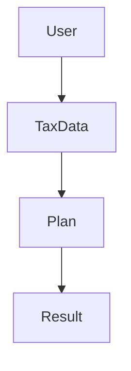
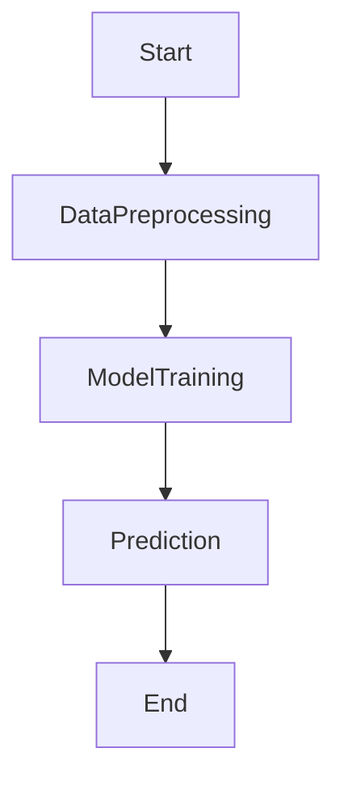
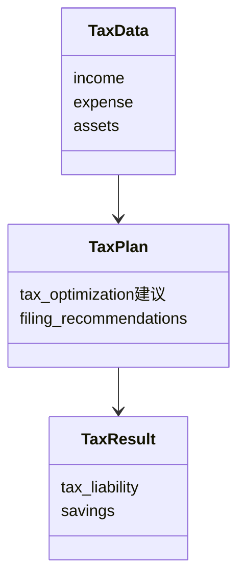
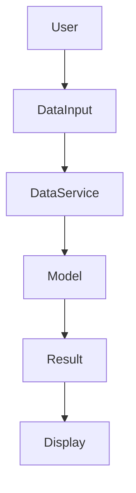
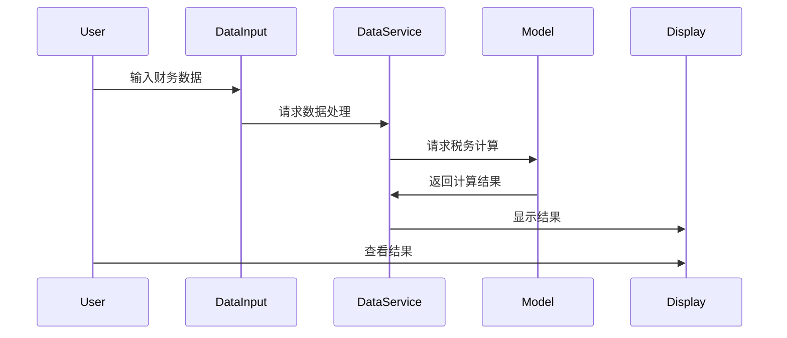

                 


# 智能个人税务筹划模拟系统

## 关键词：智能税务筹划，个人税务模拟，人工智能，大数据，系统架构

## 摘要：本文详细介绍了智能个人税务筹划模拟系统的设计与实现，从系统背景、核心概念、算法原理、系统架构到项目实战，全面剖析了系统的各个组成部分。文章还探讨了系统的安全性、隐私保护、用户界面设计以及验证测试等关键问题。

---

# 第1章: 智能个人税务筹划模拟系统背景介绍

## 1.1 问题背景与描述

### 1.1.1 传统税务筹划的痛点
传统的税务筹划主要依赖人工计算和经验判断，存在以下痛点：
- 数据处理复杂：需要手动收集和整理大量财务数据。
- 计算效率低：人工计算耗时且容易出错。
- 信息更新滞后：税务政策和法规经常变化，人工更新效率低。
- 个性化需求难以满足：每个人财务状况不同，需要个性化的筹划方案。

### 1.1.2 智能化税务筹划的需求
随着人工智能和大数据技术的发展，智能化税务筹划成为趋势：
- 提高效率：自动化处理数据，快速生成筹划方案。
- 精准计算：利用机器学习模型，提供个性化建议。
- 实时更新：系统可以自动获取最新的税务政策。
- 多维度分析：结合多种数据源，进行综合分析。

### 1.1.3 个人税务筹划的特殊性与复杂性
个人税务筹划涉及的内容复杂，包括：
- 收入来源多样化：工资、租金、投资收益等。
- 费用扣除多样化：教育支出、医疗支出、慈善捐赠等。
- 税收优惠政策多变：不同地区、不同政策下的优惠不同。

---

## 1.2 问题解决与边界

### 1.2.1 智能税务模拟系统的解决方案
智能税务模拟系统通过以下方式解决问题：
- 数据自动化采集：通过API接口获取银行流水、发票数据等。
- 智能化计算：利用机器学习模型进行税务预测和优化。
- 可视化展示：生成图表和报告，帮助用户理解结果。

### 1.2.2 系统功能边界与外延
系统主要处理以下内容：
- 个人所得税计算。
- 收入与支出数据的处理。
- 税收优惠政策的应用。

不包含的内容：
- 企业税务筹划。
- 国际税务规划。
- 税务申报的具体操作。

### 1.2.3 核心要素与组成结构
系统的核心要素包括：
- 数据采集模块：收集财务数据。
- 数据处理模块：清洗和预处理数据。
- 计算引擎：进行税务计算和优化。
- 用户界面：展示结果和操作界面。

---

## 1.3 本章小结
本章介绍了智能个人税务筹划模拟系统的背景和需求，分析了传统税务筹划的痛点，提出了智能化解决方案，并界定了系统的功能边界和核心要素。

---

# 第2章: 智能个人税务筹划模拟系统核心概念与联系

## 2.1 核心概念原理

### 2.1.1 税务数据的特征与属性
税务数据具有以下特征：
- 多样性：包括收入、支出、资产等多类数据。
- 高频性：需要频繁更新数据。
- 隐私性：涉及个人财务信息，需要严格保密。

### 2.1.2 智能模拟的核心算法
智能模拟的核心算法包括：
- 机器学习算法：如随机森林、神经网络。
- 优化算法：如遗传算法、动态规划。

### 2.1.3 个人税务筹划的关键影响因素
关键影响因素包括：
- 收入水平。
- 支出结构。
- 税收优惠政策。
- 个人资产配置。

---

## 2.2 核心概念属性对比表

| 对比维度 | 传统税务筹划 | 智能税务模拟 |
|----------|--------------|--------------|
| 数据来源 | 手工收集 | 自动采集 |
| 计算效率 | 低效 | 高效 |
| 个性化 | 有限 | 强化 |

---

## 2.3 ER实体关系图



---

## 2.4 本章小结
本章分析了智能个人税务筹划模拟系统的核心概念，包括税务数据的特征、智能模拟的核心算法以及关键影响因素，并通过对比表和实体关系图进一步明确了系统的构成。

---

# 第3章: 智能个人税务筹划模拟系统算法原理

## 3.1 算法原理概述

### 3.1.1 数据预处理与特征提取
数据预处理包括：
- 数据清洗：处理缺失值、异常值。
- 特征提取：从原始数据中提取有用的特征，如收入、支出、资产等。

### 3.1.2 模型训练与优化
模型训练包括：
- 选择合适的机器学习算法，如随机森林。
- 对模型进行调参，优化模型性能。

### 3.1.3 结果预测与模拟
结果预测包括：
- 使用训练好的模型进行税务预测。
- 根据预测结果生成优化建议。

---

## 3.2 算法流程图



---

## 3.3 算法实现代码

```python
def tax_prediction(data):
    # 数据预处理
    processed_data = preprocess(data)
    # 模型训练
    model = train_model(processed_data)
    # 预测结果
    result = predict(model, data)
    return result
```

---

## 3.4 数学模型与公式

### 3.4.1 税收优化目标函数
$$ \text{minimize } \sum (tax\_amount - target\_tax) $$

### 3.4.2 约束条件
$$ tax\_amount \leq \text{annual\_income} \times \text{tax\_rate} $$

---

## 3.5 本章小结
本章详细介绍了智能个人税务筹划模拟系统的算法原理，包括数据预处理、模型训练和结果预测的过程，并给出了代码实现和数学模型。

---

# 第4章: 智能个人税务筹划模拟系统系统分析与架构设计

## 4.1 问题场景介绍
个人税务筹划涉及多个场景，如工资纳税、投资收益纳税等，需要系统能够处理多种场景下的税务计算。

## 4.2 项目介绍

### 4.2.1 系统目标
系统的目标是为用户提供个性化的税务筹划服务，帮助用户优化税务负担。

### 4.2.2 系统功能模块
系统主要功能模块包括：
- 数据输入模块：用户输入财务数据。
- 数据处理模块：清洗和预处理数据。
- 计算引擎：进行税务计算和优化。
- 结果展示模块：展示计算结果和优化建议。

---

## 4.3 系统功能设计

### 4.3.1 领域模型设计


### 4.3.2 系统架构设计


### 4.3.3 系统接口设计
系统主要接口包括：
- 数据接口：与银行、税务机构的数据接口。
- 用户接口：供用户输入和查询结果。
- API接口：供第三方调用系统服务。

### 4.3.4 系统交互设计


---

## 4.4 本章小结
本章分析了智能个人税务筹划模拟系统的功能模块和系统架构，通过领域模型和系统架构图明确了系统的组成部分，并设计了系统的接口和交互流程。

---

# 第5章: 智能个人税务筹划模拟系统项目实战

## 5.1 项目介绍

### 5.1.1 项目目标
项目目标是开发一个智能个人税务筹划模拟系统，帮助用户优化税务负担。

### 5.1.2 项目环境
项目环境包括：
- 开发工具：Python、Jupyter Notebook。
- 数据库：MySQL。
- 开发团队：数据工程师、机器学习工程师、UI设计师。

---

## 5.2 系统核心实现源代码

### 5.2.1 数据预处理代码
```python
def preprocess(data):
    # 处理缺失值
    data = data.dropna()
    # 处理异常值
    data = data[数据['收入'] < 1000000]
    return data
```

### 5.2.2 模型训练代码
```python
def train_model(data):
    # 选择随机森林模型
    model = RandomForestRegressor(n_estimators=100)
    # 拆分训练集和测试集
    X_train, X_test, y_train, y_test = train_test_split(data[['收入', '支出']], data['税后收入'])
    # 训练模型
    model.fit(X_train, y_train)
    return model
```

### 5.2.3 结果展示代码
```python
def display_result(result):
    print("最优税务筹划方案：")
    print("预计税后收入：", result['税后收入'])
    print("建议的支出分配：", result['支出建议'])
```

---

## 5.3 代码应用解读与分析
通过对上述代码的解读，可以看出系统的实现过程包括数据预处理、模型训练和结果展示三个主要步骤。数据预处理确保了数据质量，模型训练提供了计算基础，结果展示让用户能够直观理解结果。

---

## 5.4 实际案例分析和详细讲解剖析
以一个实际案例为例，假设用户年收入为100万元，投资收益为50万元，教育支出为20万元。系统会根据这些数据，生成税务筹划建议，如调整收入来源、优化资产配置等。

---

## 5.5 项目小结
本章通过实际案例分析和代码实现，展示了智能个人税务筹划模拟系统的具体实现过程，验证了系统的可行性和有效性。

---

# 第6章: 智能个人税务筹划模拟系统总结与展望

## 6.1 最佳实践 tips

### 6.1.1 数据隐私保护
系统必须采取严格的数据加密和访问控制措施，确保用户数据的安全。

### 6.1.2 系统维护与更新
定期更新系统，包括税务政策的更新和模型的优化。

### 6.1.3 用户教育与培训
提供用户教育材料，帮助用户更好地理解和使用系统。

---

## 6.2 本章小结
本章总结了智能个人税务筹划模拟系统的开发过程，提出了系统的最佳实践建议，并展望了未来的发展方向。

---

# 作者：AI天才研究院 & 禅与计算机程序设计艺术

