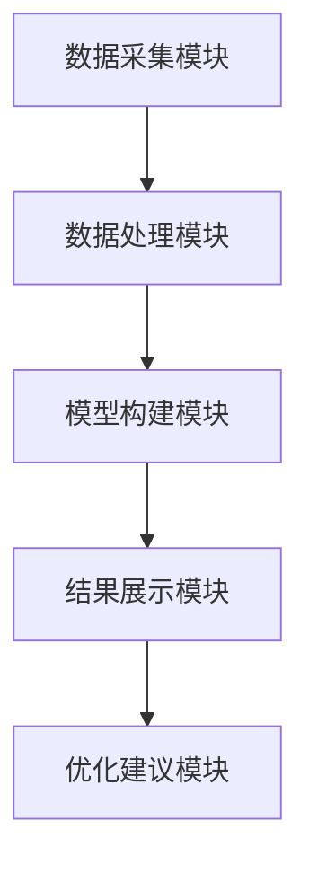

                 


# 智能个人财务 Stress Testing 工具

> 关键词：智能财务工具，Stress Testing，个人财务管理，风险管理，人工智能

> 摘要：本文深入探讨了智能个人财务 Stress Testing 工具的核心概念、算法原理、系统架构与设计、项目实战等内容。通过详细分析 Stress Testing 的背景与目标，结合机器学习算法与数学模型，展示了如何利用智能工具实现个人财务风险管理与优化。本文旨在为个人用户与开发者提供一份全面的技术指南，帮助他们更好地理解和应用智能个人财务 Stress Testing 工具。

---

## 第1章：智能个人财务 Stress Testing 工具的背景与目标

### 1.1 个人财务风险管理的重要性

#### 1.1.1 个人财务风险管理的核心概念
个人财务风险管理是指通过识别、评估和应对潜在的财务风险，确保个人财务目标的实现。这些风险可能来自市场波动、收入变化、支出增加、债务负担等多种因素。

#### 1.1.2 Stress Testing 在个人财务管理中的作用
Stress Testing 是一种用于评估在极端情况下财务状况稳定性的技术。通过模拟不同压力情景（如失业、疾病、市场崩盘等），个人可以提前了解其财务状况的脆弱性，并制定应对策略。

#### 1.1.3 智能工具在现代财务管理中的必要性
随着人工智能和大数据技术的快速发展，传统的手动财务管理方式逐渐被智能化工具取代。智能工具可以通过自动化数据采集、实时分析和智能决策支持，帮助个人更高效地进行财务风险管理。

### 1.2 智能个人财务 Stress Testing 工具的定义与目标

#### 1.2.1 定义与基本功能
智能个人财务 Stress Testing 工具是一种结合人工智能、大数据分析和财务风险管理技术的软件系统。其核心功能包括：
- 数据采集与处理：从多种数据源（银行账户、投资组合、收入支出记录等）采集财务数据。
- 模型构建与分析：利用机器学习算法构建财务模型，模拟不同压力情景下的财务表现。
- 结果展示与决策支持：以可视化形式展示压力测试结果，并提供优化建议。

#### 1.2.2 工具的目标与应用场景
- **目标**：通过模拟极端情景，评估个人财务状况的抗风险能力，并提供优化建议。
- **应用场景**：
  - 个人预算管理
  - 投资组合优化
  - 债务管理与偿付能力评估
  - 不同压力情景下的财务状况模拟

#### 1.2.3 与传统财务工具的主要区别
- **数据处理能力**：智能工具能够处理非结构化数据（如文本、语音等），并利用自然语言处理技术提取有用信息。
- **实时性**：通过自动化数据采集与实时分析，智能工具能够提供即时的财务风险评估。
- **智能化**：利用机器学习算法，智能工具可以自动优化财务策略，并提供个性化的建议。

### 1.3 本章小结
本章介绍了智能个人财务 Stress Testing 工具的背景与目标，强调了其在个人财务管理中的重要性。通过对比传统工具，突出了智能工具的核心优势。

---

## 第2章：智能个人财务 Stress Testing 工具的核心概念与原理

### 2.1 智能工具的基本组成与功能模块

#### 2.1.1 数据采集与处理模块
数据采集模块负责从多种数据源（如银行账户、支付宝、股票账户等）获取财务数据，并将其转化为结构化的数据格式。数据处理模块会对数据进行清洗、转换和预处理，以便后续分析。

#### 2.1.2 模型构建与分析模块
模型构建模块利用机器学习算法（如随机森林、支持向量机等）构建财务模型，并模拟不同压力情景下的财务表现。分析模块对模拟结果进行评估，并生成风险报告。

#### 2.1.3 结果展示与决策支持模块
结果展示模块以图表、报告等形式呈现压力测试结果，并提供优化建议。决策支持模块根据模拟结果和用户需求，生成个性化的财务优化方案。

### 2.2 Stress Testing 的基本原理

#### 2.2.1 Stress Testing 的定义与方法
Stress Testing 是一种通过模拟极端情景来评估系统或个体抗风险能力的技术。在个人财务管理中，Stress Testing 通常包括以下步骤：
1. **定义压力情景**：如失业、疾病、市场崩盘等。
2. **模拟情景**：通过模型模拟这些情景下的财务状况。
3. **评估结果**：分析财务状况的变化，并提出优化建议。

#### 2.2.2 Monte Carlo 模拟在 Stress Testing 中的应用
Monte Carlo 模拟是一种通过随机抽样方法模拟系统行为的技术。在个人财务管理中，Monte Carlo 模拟可以用于评估不同投资组合在不同市场条件下的表现。

#### 2.2.3 风险因子的识别与量化
风险因子是指影响个人财务状况的各种因素，如收入、支出、资产价格等。通过量化这些因素，可以更好地模拟极端情景下的财务表现。

### 2.3 智能工具的核心算法与技术

#### 2.3.1 机器学习算法在 Stress Testing 中的应用
机器学习算法可以用于预测财务风险、分类风险情景等。例如，利用随机森林算法对财务数据进行分类，识别潜在的风险因素。

#### 2.3.2 数据挖掘与预测模型的构建
数据挖掘技术可以用于从大量财务数据中提取有用的信息，并构建预测模型。例如，利用聚类分析识别不同财务阶段的用户。

#### 2.3.3 自然语言处理在财务数据中的应用
自然语言处理技术可以用于分析非结构化财务数据，如财务报告、新闻等。通过文本挖掘技术，可以提取有用的信息，并用于压力测试模型的构建。

### 2.4 本章小结
本章详细介绍了智能个人财务 Stress Testing 工具的核心组成与功能模块，并探讨了其基本原理与算法技术。通过结合机器学习、数据挖掘和自然语言处理等技术，智能工具能够更高效地进行财务风险管理。

---

## 第3章：智能个人财务 Stress Testing 工具的算法原理与数学模型

### 3.1 Monte Carlo 模拟算法

#### 3.1.1 Monte Carlo 模拟的基本原理
Monte Carlo 模拟是一种基于随机抽样的技术，通过多次模拟来评估系统或个体在不同情景下的表现。在个人财务管理中，Monte Carlo 模拟可以用于评估不同投资组合在不同市场条件下的表现。

#### 3.1.2 算法实现步骤
1. **定义概率分布**：根据历史数据确定各风险因子的概率分布。
2. **生成随机样本**：从概率分布中随机抽取样本。
3. **模拟情景**：根据随机样本模拟不同情景下的财务状况。
4. **评估结果**：分析模拟结果，并生成风险报告。

#### 3.1.3 算法的优缺点分析
- **优点**：能够模拟复杂情景，提供全面的风险评估。
- **缺点**：计算复杂度较高，需要大量计算资源。

### 3.2 机器学习算法在 Stress Testing 中的应用

#### 3.2.1 常见机器学习算法介绍
- **监督学习**：如随机森林、支持向量机等。
- **无监督学习**：如聚类分析、主成分分析等。
- **深度学习**：如神经网络等。

#### 3.2.2 算法选择与优化策略
根据具体应用场景选择合适的算法，并通过交叉验证等方法进行优化。

#### 3.2.3 算法实现的步骤与注意事项
1. **数据预处理**：清洗、转换、归一化等。
2. **模型训练**：利用训练数据训练模型。
3. **模型评估**：通过测试数据评估模型性能。
4. **模型优化**：调整参数、选择合适的特征等。

### 3.3 算法实现的数学模型

#### 3.3.1 Monte Carlo 模拟的数学公式
$$
\text{模拟结果} = \sum_{i=1}^{n} f(x_i)
$$
其中，$x_i$ 是从概率分布中抽取的随机样本，$f(x_i)$ 是模拟情景的函数。

#### 3.3.2 机器学习模型的数学表示
$$
y = f(x) + \epsilon
$$
其中，$y$ 是目标变量，$x$ 是输入特征，$\epsilon$ 是误差项。

#### 3.3.3 模型的评估与优化方法
- **评估指标**：如准确率、召回率、F1 分数等。
- **优化方法**：如网格搜索、随机搜索等。

### 3.4 本章小结
本章详细介绍了 Monte Carlo 模拟算法和机器学习算法在智能个人财务 Stress Testing 工具中的应用，并通过数学公式和模型展示了其原理与实现方法。

---

## 第4章：智能个人财务 Stress Testing 工具的系统架构与设计

### 4.1 系统功能模块划分

#### 4.1.1 数据采集模块
数据采集模块负责从多种数据源（如银行账户、支付宝、股票账户等）获取财务数据，并将其转化为结构化的数据格式。

#### 4.1.2 模型构建模块
模型构建模块利用机器学习算法构建财务模型，并模拟不同压力情景下的财务表现。

#### 4.1.3 结果展示模块
结果展示模块以图表、报告等形式呈现压力测试结果，并提供优化建议。

### 4.2 系统架构设计图


### 4.3 系统架构设计

#### 4.3.1 系统功能设计
- **数据采集**：支持多种数据源的接入，如银行账户、支付宝、股票账户等。
- **数据处理**：对采集到的数据进行清洗、转换和预处理。
- **模型构建**：利用机器学习算法构建财务模型，并模拟不同压力情景下的财务表现。
- **结果展示**：以图表、报告等形式呈现压力测试结果，并提供优化建议。

#### 4.3.2 系统架构设计图


### 4.4 本章小结
本章详细介绍了智能个人财务 Stress Testing 工具的系统架构与设计，并通过图表展示了其功能模块与架构设计。

---

## 第5章：智能个人财务 Stress Testing 工具的项目实战

### 5.1 环境安装与配置

#### 5.1.1 安装 Python
安装 Python 3.x 版本，推荐使用 Anaconda 环境。

#### 5.1.2 安装依赖库
安装以下依赖库：
- `pandas`：数据处理
- `numpy`：数值计算
- `scikit-learn`：机器学习算法
- `matplotlib`：数据可视化
- `seaborn`：数据可视化

### 5.2 核心代码实现

#### 5.2.1 数据采集与处理
```python
import pandas as pd
import numpy as np

# 从 CSV 文件读取数据
data = pd.read_csv('financial_data.csv')

# 数据清洗
data.dropna(inplace=True)
data = pd.get_dummies(data)
```

#### 5.2.2 模型构建与分析
```python
from sklearn.ensemble import RandomForestClassifier
from sklearn.model_selection import train_test_split
from sklearn.metrics import accuracy_score

# 数据分割
X = data.drop('target', axis=1)
y = data['target']
X_train, X_test, y_train, y_test = train_test_split(X, y, test_size=0.2, random_state=42)

# 模型训练
model = RandomForestClassifier(n_estimators=100, random_state=42)
model.fit(X_train, y_train)

# 模型评估
y_pred = model.predict(X_test)
print("准确率:", accuracy_score(y_test, y_pred))
```

#### 5.2.3 结果展示与优化建议
```python
import matplotlib.pyplot as plt
import seaborn as sns

# 绘制混淆矩阵
from sklearn.metrics import confusion_matrix
cm = confusion_matrix(y_test, y_pred)
sns.heatmap(cm, annot=True, fmt='d')
plt.xlabel('预测值')
plt.ylabel('真实值')
plt.show()
```

### 5.3 案例分析与详细解读

#### 5.3.1 案例背景
假设一位用户的财务数据如下：
- 收入：30,000 元/月
- 支出：20,000 元/月
- 投资组合：股票 10 万元，基金 5 万元
- 负债：信用卡欠款 2 万元

#### 5.3.2 模拟情景
模拟失业情景：假设用户失业，收入为 0，支出不变。

#### 5.3.3 模拟结果
- 资产：15 万元
- 负债：2 万元
- 结余：-5 万元

#### 5.3.4 优化建议
1. **增加紧急储备金**：建议用户预留 6-12 个月的生活费用。
2. **优化支出结构**：减少非必要开支，优先偿还信用卡欠款。
3. **调整投资策略**：增加低风险投资，减少高风险投资比例。

### 5.4 本章小结
本章通过实际案例展示了智能个人财务 Stress Testing 工具的项目实战过程，从环境安装到代码实现，再到结果展示与优化建议，为读者提供了完整的实战指导。

---

## 第6章：总结与最佳实践

### 6.1 工具的价值与意义
智能个人财务 Stress Testing 工具通过结合人工智能与大数据技术，能够帮助个人更高效地进行财务风险管理，制定科学的财务策略。

### 6.2 最佳实践 tips
- **数据隐私保护**：确保财务数据的安全性，避免数据泄露。
- **模型优化**：根据实际需求不断优化模型，提高预测精度。
- **用户教育**：加强对用户的财务知识教育，帮助用户更好地理解和使用工具。

### 6.3 未来展望
随着人工智能与大数据技术的不断发展，智能个人财务 Stress Testing 工具将变得更加智能化、个性化。未来，工具可以进一步结合区块链技术，实现更安全、更高效的财务风险管理。

### 6.4 本章小结
本章总结了智能个人财务 Stress Testing 工具的价值与意义，并提出了未来的发展方向与最佳实践建议。

---

## 作者

作者：AI天才研究院/AI Genius Institute  
联系方式：[email protected]  
 GitHub：[GitHub 仓库](https://github.com/...)  
 博客：[技术博客](https://blog.csdn.net/...)

