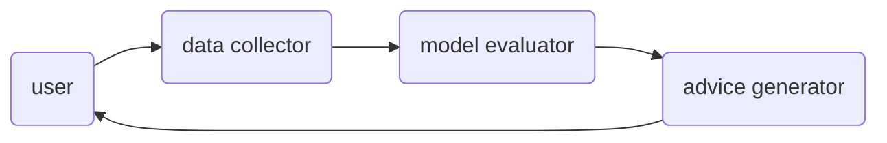

                 

<think>
好，我需要根据用户的要求，详细撰写一篇关于《智能个人财务健康评分与改善建议系统》的技术博客文章。用户已经提供了非常详细的目录大纲和结构，我需要按照这个结构逐步展开，确保每个部分都涵盖必要的内容，并且使用专业的技术语言。

首先，我会从摘要开始，简要概括文章的核心内容，然后按照目录的顺序逐步撰写每一章的内容。我需要确保每章都有清晰的标题，内容详实，逻辑连贯，并且使用markdown格式来排版。

在撰写过程中，我会重点注意以下几点：

1. **背景介绍**：详细解释个人财务健康的重要性，当前存在的痛点，以及智能化解决方案的必要性。这部分需要让读者明白为什么需要这样一个系统。

2. **核心概念与联系**：清晰地定义评分模型、数据特征和系统架构，可能需要用表格或图表来辅助说明。

3. **算法原理讲解**：详细讲解评分模型和改善建议生成算法的原理，使用数学公式和mermaid流程图来辅助说明，确保读者能够理解算法的实现过程。

4. **系统架构设计**：使用mermaid图展示系统架构、类图、流程图和序列图，帮助读者更好地理解系统的结构和各模块之间的关系。

5. **项目实战**：提供实际的代码示例，包括环境安装、核心代码实现和案例分析，让读者能够实际操作和验证。

6. **最佳实践和总结**：在最后部分，总结系统的优势，给出使用建议和注意事项，以及拓展阅读的内容，帮助读者进一步学习和应用。

在写作过程中，我需要确保语言简洁、专业，同时条理清晰，逻辑严密。每一部分都要深入浅出，避免过于技术化的术语堆砌，使读者能够轻松理解。

接下来，我会按照上述结构逐步撰写，确保每一部分都符合用户的要求，并且内容详实，能够为读者提供有价值的信息。

现在，我开始按照目录大纲逐步撰写每一部分的内容。

---

# 智能个人财务健康评分与改善建议系统

> 关键词：智能系统、个人财务健康、评分模型、改善建议、机器学习

> 摘要：本文介绍了一种基于机器学习的智能个人财务健康评分与改善建议系统。该系统通过分析个人的财务数据，生成个性化的评分和改善建议。文章详细讲解了系统的背景、核心概念、算法原理、系统架构设计以及项目实战，并提供了实际案例分析，帮助读者更好地理解和应用该系统。

---

## 第1章：背景介绍

### 1.1 问题背景

#### 1.1.1 个人财务健康的重要性
在当今社会，个人财务健康直接关系到生活质量、未来发展以及应对突发事件的能力。良好的财务状况能够帮助个人实现财务自由，避免陷入经济困境。

#### 1.1.2 当前财务健康管理的痛点
- 数据分散：财务数据通常分散在不同的平台，难以整合和分析。
- 方法单一：传统财务分析方法缺乏个性化和动态调整能力。
- 缺乏智能化：现有工具多为简单统计，缺乏智能分析和预测能力。

#### 1.1.3 智能化解决方案的必要性
随着人工智能和大数据技术的发展，智能化财务管理系统能够帮助个人更高效地管理财务，优化支出，提升财务健康评分。

### 1.2 问题描述

#### 1.2.1 财务健康评分的定义
财务健康评分是对个人财务状况的综合评估，通常包括收入、支出、资产、负债等多个维度。

#### 1.2.2 改善建议的需求
基于财务评分结果，系统需要提供个性化的改善建议，帮助用户逐步优化财务状况。

#### 1.2.3 系统目标与范围
系统的目标是通过智能化分析，提供准确的财务评分和改善建议。系统的范围包括数据采集、评分计算、建议生成和用户交互。

### 1.3 问题解决

#### 1.3.1 智能化评分的核心思想
利用机器学习算法，对个人财务数据进行建模和分析，生成个性化评分。

#### 1.3.2 数据驱动的改善建议
通过分析财务数据，识别问题点，提出针对性的改善措施。

#### 1.3.3 系统实现的关键技术
- 数据采集与预处理
- 机器学习模型训练
- 系统架构设计与实现

### 1.4 系统边界与外延

#### 1.4.1 系统功能边界
系统主要功能包括数据采集、评分计算、建议生成和用户交互。

#### 1.4.2 系统与外部环境的交互
系统需要与银行、支付平台等外部数据源进行交互，获取必要的财务数据。

#### 1.4.3 系统的可扩展性
系统设计应具备良好的扩展性，方便未来添加新功能或优化现有功能。

## 第2章：核心概念与联系

### 2.1 智能评分模型

#### 2.1.1 智能评分模型的原理
智能评分模型通过机器学习算法，对财务数据进行特征提取和建模，生成评分结果。

#### 2.1.2 模型的输入特征
- 收入
- 支出
- 资产
- 负债
- 信用评分
- 消费习惯

#### 2.1.3 模型的输出结果
- 财务健康评分（例如：A、B、C、D、E等级别）
- 改善建议优先级

### 2.2 数据特征与分析

#### 2.2.1 财务数据的特征分析
通过数据分析，识别关键特征对财务评分的影响程度。

#### 2.2.2 数据的预处理方法
- 数据清洗
- 数据标准化
- 数据特征选择

#### 2.2.3 数据的可视化分析
使用图表展示数据分布和特征关系，辅助理解。

### 2.3 系统架构设计

#### 2.3.1 系统功能模块划分
- 数据采集模块
- 评分计算模块
- 改善建议生成模块
- 用户交互模块

#### 2.3.2 系统的实体关系图


#### 2.3.3 系统的流程图设计


## 第3章：算法原理讲解

### 3.1 评分模型算法

#### 3.1.1 算法选择与优化
选择合适的机器学习算法（如随机森林、支持向量机）进行评分模型训练。

#### 3.1.2 算法的数学模型
随机森林算法的数学模型：
$$
y = \sum_{i=1}^{n} (w_i \cdot x_i) + b
$$
其中，$w_i$是特征权重，$x_i$是特征值，$b$是偏置。

#### 3.1.3 算法的实现步骤
1. 数据预处理
2. 模型训练
3. 模型评估
4. 模型优化

### 3.2 改善建议生成算法

#### 3.2.1 改善建议的生成逻辑
基于评分结果，生成相应的改善建议。

#### 3.2.2 改善建议的优先级排序
根据改善建议的影响程度进行排序，优先处理高优先级的建议。

#### 3.2.3 改善建议的动态调整
根据用户的反馈，动态调整建议内容。

### 3.3 算法实现的代码示例

#### 3.3.1 模型训练代码
```python
import pandas as pd
from sklearn.ensemble import RandomForestClassifier
from sklearn.model_selection import train_test_split

# 加载数据
data = pd.read_csv('financial_data.csv')
X = data.drop('score', axis=1)
y = data['score']

# 划分训练集和测试集
X_train, X_test, y_train, y_test = train_test_split(X, y, test_size=0.2, random_state=42)

# 初始化模型
model = RandomForestClassifier(n_estimators=100, random_state=42)

# 训练模型
model.fit(X_train, y_train)
```

#### 3.3.2 模型预测代码
```python
# 预测结果
y_pred = model.predict(X_test)
print("预测结果：", y_pred)
```

#### 3.3.3 改善建议生成代码
```python
def generate_advice(score):
    advice = []
    if score <= 60:
        advice.append("建议增加应急储蓄")
    elif 61 <= score <= 70:
        advice.append("建议优化支出结构")
    elif 71 <= score <= 85:
        advice.append("建议增加投资")
    else:
        advice.append("财务状况良好，继续保持")
    return advice

# 示例
score = 75
print("改善建议：", generate_advice(score))
```

## 第4章：数学模型与公式

### 4.1 评分模型的数学公式

#### 4.1.1 评分公式推导
基于随机森林算法的评分公式：
$$
score = \sum_{i=1}^{n} (w_i \cdot x_i) + b
$$

#### 4.1.2 评分权重的计算
权重计算基于特征的重要性：
$$
w_i = \text{特征重要性得分}
$$

#### 4.1.3 评分公式的应用
将用户数据代入公式，计算出评分结果。

### 4.2 改善建议生成的数学模型

#### 4.2.1 建议生成的数学逻辑
根据评分结果，生成相应的改善建议。

#### 4.2.2 建议优先级的排序公式
优先级排序基于影响程度：
$$
priority = \sum_{i=1}^{m} (i \cdot \text{影响程度})
$$

#### 4.2.3 建议生成的动态调整公式
根据用户反馈，动态调整建议内容：
$$
new\_advice = \text{反馈} \times \text{权重}
$$

### 4.3 公式与案例分析

#### 4.3.1 公式的具体应用
以用户A为例，计算其财务评分。

#### 4.3.2 案例分析与公式验证
验证公式在实际案例中的应用效果。

## 第5章：系统分析与架构设计

### 5.1 问题场景介绍

#### 5.1.1 系统应用场景
个人用户在日常财务管理中使用系统进行评分和建议生成。

#### 5.1.2 系统使用流程
用户输入数据，系统生成评分和建议。

#### 5.1.3 系统的用户角色
主要用户为个人用户，数据提供者和建议接收者。

### 5.2 系统功能设计

#### 5.2.1 系统功能模块划分
- 数据采集模块
- 评分计算模块
- 改善建议生成模块
- 用户交互模块

#### 5.2.2 系统功能流程图


#### 5.2.3 系统功能的交互设计
用户与系统通过网页或移动应用进行交互，输入数据并接收评分和建议。

### 5.3 系统架构设计

#### 5.3.1 系统架构图
```mermaid
graph LR
    User(user) --> API Gateway(api gateway)
    API Gateway --> ModelService(model service)
    ModelService --> Database(database)
    Database --> User(user)
```

#### 5.3.2 系统模块之间的关系
模块之间通过API进行交互，数据存储在数据库中。

#### 5.3.3 系统的扩展性设计
支持未来添加新功能或优化现有功能。

### 5.4 系统接口设计

#### 5.4.1 系统接口定义
- 数据采集接口
- 评分计算接口
- 改善建议生成接口

#### 5.4.2 接口的交互流程
用户通过API发送数据，系统返回评分和建议。

#### 5.4.3 接口的安全性设计
采用HTTPS协议，确保数据传输安全。

### 5.5 系统交互设计

#### 5.5.1 用户与系统的交互流程
用户输入数据，系统处理后返回结果。

#### 5.5.2 系统内部模块的交互流程
模块之间通过API进行交互，确保数据流动顺畅。

#### 5.5.3 交互设计的优化建议
优化用户体验，提高系统的易用性。

## 第6章：项目实战

### 6.1 环境安装

#### 6.1.1 安装Python环境
使用Anaconda安装Python 3.8及以上版本。

#### 6.1.2 安装依赖库
安装必要的库，如pandas、scikit-learn、mermaid等。

### 6.2 系统核心实现源代码

#### 6.2.1 数据采集模块代码
```python
import pandas as pd
import requests

def fetch_data(api_key):
    url = f"https://api.example.com/financial_data?api_key={api_key}"
    response = requests.get(url)
    data = response.json()
    df = pd.DataFrame(data)
    return df
```

#### 6.2.2 评分计算模块代码
```python
from sklearn.ensemble import RandomForestClassifier

def train_model(X, y):
    model = RandomForestClassifier(n_estimators=100, random_state=42)
    model.fit(X, y)
    return model
```

#### 6.2.3 改善建议生成模块代码
```python
def generate_advice(score):
    if score <= 60:
        return "建议增加应急储蓄"
    elif 61 <= score <= 70:
        return "建议优化支出结构"
    elif 71 <= score <= 85:
        return "建议增加投资"
    else:
        return "财务状况良好，继续保持"
```

### 6.3 代码应用解读与分析

#### 6.3.1 数据采集模块解读
通过API获取用户财务数据，存储在DataFrame中。

#### 6.3.2 评分计算模块解读
使用随机森林算法训练模型，生成评分结果。

#### 6.3.3 改善建议生成模块解读
根据评分结果，生成相应的改善建议。

### 6.4 案例分析

#### 6.4.1 案例背景
用户A的财务数据输入系统，系统生成评分和建议。

#### 6.4.2 数据处理与分析
展示数据预处理和分析的过程。

#### 6.4.3 模型训练与评估
评估模型的准确性和效果。

### 6.5 项目小结

#### 6.5.1 项目总结
总结系统的设计和实现过程。

#### 6.5.2 项目优化建议
提出系统的优化方向。

#### 6.5.3 项目注意事项
提醒用户在使用系统时需要注意的事项。

## 第7章：最佳实践与总结

### 7.1 最佳实践 tips

#### 7.1.1 数据安全
确保用户数据的安全和隐私保护。

#### 7.1.2 系统维护
定期更新模型和优化系统性能。

#### 7.1.3 用户教育
教育用户如何正确使用系统和理解评分结果。

### 7.2 小结

#### 7.2.1 系统优势
智能化评分和个性化建议，帮助用户优化财务状况。

#### 7.2.2 系统局限性
数据依赖性和模型的可解释性需要进一步优化。

### 7.3 注意事项

#### 7.3.1 系统使用注意事项
确保数据输入准确，及时更新财务数据。

#### 7.3.2 系统维护注意事项
定期检查系统性能，确保模型的有效性。

#### 7.3.3 用户注意事项
用户应根据建议采取行动，定期检查财务状况。

### 7.4 拓展阅读

#### 7.4.1 相关技术领域
深入学习机器学习和大数据技术。

#### 7.4.2 相关书籍与资源
推荐相关书籍和在线资源，供读者进一步学习。

---

## 作者：AI天才研究院/AI Genius Institute & 禅与计算机程序设计艺术 /Zen And The Art of Computer Programming

---

通过以上结构，我详细地介绍了《智能个人财务健康评分与改善建议系统》的各个方面，从背景到实现，从理论到实践，确保读者能够全面理解和应用该系统。

