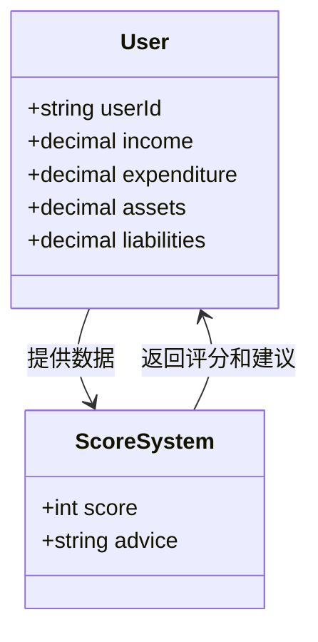

                 


# 智能个人财务健康评分系统

> 关键词：智能财务评分、个人财务管理、评分算法、系统架构、项目实战

> 摘要：本文详细介绍了一种智能个人财务健康评分系统的设计与实现。通过分析个人财务数据，利用机器学习算法，提供个性化的财务健康评分。本文首先介绍系统的背景与需求，然后阐述核心概念与框架，接着深入讲解算法原理与实现，再进行系统分析与架构设计，最后通过项目实战展示系统的具体实现与应用。本文旨在为个人财务管理提供一种智能化、个性化的解决方案。

---

# 第1章 智能个人财务健康评分系统的背景与需求

## 1.1 个人财务健康评分的背景

### 1.1.1 传统财务管理的局限性
传统的财务管理方式依赖于人工记录和分析，这种方式效率低下且容易出错。个人在面对复杂的财务数据时，难以快速准确地评估自己的财务健康状况。此外，传统方法缺乏智能化，无法根据市场变化和个人需求提供实时的反馈和建议。

### 1.1.2 数字化财务管理的兴起
随着信息技术的发展，数字化财务管理逐渐成为主流。智能财务工具和应用程序的普及，使得个人能够更方便地管理和分析自己的财务数据。然而，现有的工具多局限于数据记录和简单的统计分析，缺乏深度的智能化评分功能。

### 1.1.3 智能评分系统的需求与意义
智能个人财务健康评分系统的出现，填补了传统财务管理与现代数字化管理之间的空白。它通过整合多维度的财务数据，利用先进的算法模型，为用户提供个性化的评分和建议。这种系统不仅提高了财务管理的效率，还能帮助用户更好地理解和优化自己的财务状况。

---

## 1.2 个人财务健康评分的核心问题

### 1.2.1 财务健康定义与评价标准
财务健康评分需要综合考虑多个维度，包括收入支出比、资产负债比、应急储备金、投资比例等。通过这些指标的综合评估，系统可以给出一个量化分数，反映用户的财务健康状况。

### 1.2.2 评分系统的目标与边界
评分系统的目标是通过分析用户的财务数据，提供一个简洁明了的评分结果，并根据评分结果给出优化建议。系统的边界包括数据输入、处理、评分计算和结果展示等模块，不涉及具体的财务操作或投资建议。

### 1.2.3 用户需求与场景分析
用户的主要需求包括数据输入与管理、实时评分计算、评分结果解读和个性化建议。用户场景涵盖日常财务管理、投资决策、债务管理等多个方面。

---

## 1.3 评分系统的功能与价值

### 1.3.1 核心功能模块
- 数据采集与处理
- 指标计算与分析
- 智能评分计算
- 结果展示与反馈

### 1.3.2 评分系统的多维度价值
- 提高财务管理效率
- 提供个性化建议
- 帮助用户做出更明智的财务决策

### 1.3.3 对个人与社会的影响
个人层面，评分系统可以帮助用户更好地管理财务，避免过度消费和债务风险。社会层面，广泛的应用可以促进个人理财意识的提升，有助于整体经济的健康发展。

---

## 1.4 本章小结

本章介绍了智能个人财务健康评分系统的背景与需求，分析了传统财务管理的局限性和数字化管理的兴起，提出了智能评分系统的核心问题和目标。通过对用户需求和系统功能的详细阐述，明确了评分系统的价值和意义。

---

# 第2章 智能个人财务健康评分系统的概念与框架

## 2.1 核心概念与定义

### 2.1.1 财务健康评分的定义
财务健康评分是通过多维度的财务指标，结合用户的具体情况，计算出一个能够反映其财务状况的综合评分。

### 2.1.2 智能评分的核心要素
- **数据输入**：收入、支出、资产、负债等财务数据
- **评分算法**：基于机器学习的评分模型
- **结果展示**：评分结果及优化建议

### 2.1.3 评分系统的功能架构
- 数据采集模块
- 指标计算模块
- 评分计算模块
- 结果展示模块

---

## 2.2 核心概念的联系与对比

### 2.2.1 财务数据与评分的关系
财务数据是评分的基础，评分结果反映了数据的健康状况。例如，收入支出比是衡量用户财务健康的重要指标。

### 2.2.2 不同评分模型的对比
- **线性回归模型**：适用于简单线性关系的评分
- **加权评分模型**：根据指标的重要性赋予不同的权重
- **聚类分析**：将用户分为不同的财务健康类别

### 2.2.3 系统架构的ER实体关系图

```mermaid
erDiagram
    actor User {
        +string userId : 用户ID
        +decimal income : 收入
        +decimal expenditure : 支出
        +decimal assets : 资产
        +decimal liabilities : 负债
    }
    actor ScoreSystem {
        +int score : 评分
        +string advice : 建议
    }
    User --> ScoreSystem : 提供数据
    ScoreSystem --> User : 返回评分和建议
```

---

## 2.3 评分系统的边界与外延

### 2.3.1 系统的输入与输出
- **输入**：用户的财务数据
- **输出**：评分结果和优化建议

### 2.3.2 功能模块的划分
- 数据采集模块
- 数据处理模块
- 指标计算模块
- 评分计算模块
- 结果展示模块

### 2.3.3 系统的可扩展性
系统设计应具备良好的扩展性，能够在未来新增更多指标或优化算法模型。

---

## 2.4 本章小结

本章详细阐述了智能个人财务健康评分系统的核心概念与框架，通过对比不同评分模型，绘制了系统的ER实体关系图，明确了系统的输入输出和功能模块划分。

---

# 第3章 智能评分系统的算法原理与实现

## 3.1 评分模型的数学模型

### 3.1.1 线性回归模型

$$ y = \beta_0 + \beta_1x_1 + \beta_2x_2 + \dots + \beta_nx_n $$

其中，$y$ 是评分，$x_i$ 是各个财务指标，$\beta_i$ 是对应的回归系数。

### 3.1.2 加权评分模型

$$ score = \sum_{i=1}^{n} w_i x_i $$

其中，$w_i$ 是指标 $x_i$ 的权重。

### 3.1.3 聚类分析与分类算法
聚类分析通过将用户分为不同的类别，从而实现评分的自动化。分类算法（如决策树、随机森林）可以根据用户特征进行评分预测。

---

## 3.2 算法原理的详细讲解

### 3.2.1 数据预处理与特征提取
- 数据清洗：处理缺失值和异常值
- 特征提取：从原始数据中提取有用特征，如收入支出比、资产负债比等

### 3.2.2 模型训练与优化
- 使用训练数据训练模型
- 通过交叉验证优化模型参数

### 3.2.3 模型评估与调优
- 使用测试数据评估模型性能
- 调整模型参数以提高准确率

---

## 3.3 算法实现的Python代码示例

```python
import pandas as pd
from sklearn.linear_model import LinearRegression
from sklearn.metrics import mean_squared_error

# 数据加载与处理
data = pd.read_csv('financial_data.csv')

# 特征提取
features = data[['income', 'expenditure', 'assets', 'liabilities']]
target = data['score']

# 模型训练
model = LinearRegression()
model.fit(features, target)

# 预测与评估
predictions = model.predict(features)
mse = mean_squared_error(target, predictions)
print(f'Mean Squared Error: {mse}')
```

---

## 3.4 本章小结

本章详细讲解了智能评分系统的算法原理，包括线性回归模型、加权评分模型等，并通过Python代码示例展示了模型的实现过程。

---

# 第4章 智能评分系统的系统分析与架构设计

## 4.1 系统功能设计

### 4.1.1 用户数据采集模块
- 支持多种数据输入方式（手动输入、API接口）
- 数据验证与清洗

### 4.1.2 评分计算模块
- 数据特征提取
- 模型计算评分
- 生成评分报告

### 4.1.3 结果展示与反馈模块
- 评分结果展示
- 个性化优化建议

---

## 4.2 系统架构设计

### 4.2.1 分层架构设计



### 4.2.2 微服务架构设计
- 用户数据服务
- 评分计算服务
- 结果展示服务

---

## 4.3 系统接口设计

### 4.3.1 数据接口
- 数据输入接口：支持多种格式的数据输入
- 数据输出接口：提供评分结果和建议

### 4.3.2 API接口设计
- POST请求：提交财务数据
- GET请求：获取评分结果

---

## 4.4 系统交互流程设计

### 4.4.1 用户登录与数据输入
- 用户登录系统
- 提交财务数据

### 4.4.2 评分计算与结果展示
- 系统计算评分
- 展示评分结果和建议

### 4.4.3 数据更新与维护
- 用户更新数据
- 系统重新计算评分

---

## 4.5 本章小结

本章详细设计了智能评分系统的功能模块、架构和接口，通过分层架构和微服务设计，确保了系统的可扩展性和灵活性。

---

# 第5章 智能评分系统的项目实战

## 5.1 环境搭建与数据准备

### 5.1.1 开发环境安装
- 安装Python、Jupyter Notebook、Pandas、Scikit-learn等工具

### 5.1.2 数据采集与清洗
- 数据来源：CSV文件、API接口
- 数据清洗：处理缺失值和异常值

### 5.1.3 数据预处理与特征工程
- 特征提取：收入、支出、资产、负债等

---

## 5.2 核心代码实现

### 5.2.1 数据加载与处理

```python
import pandas as pd
from sklearn.model_selection import train_test_split
from sklearn.metrics import r2_score

# 数据加载
data = pd.read_csv('financial_data.csv')

# 特征与目标分离
X = data[['income', 'expenditure', 'assets', 'liabilities']]
y = data['score']

# 数据分割
X_train, X_test, y_train, y_test = train_test_split(X, y, test_size=0.2, random_state=42)

# 模型训练
model = LinearRegression()
model.fit(X_train, y_train)

# 模型预测
y_pred = model.predict(X_test)

# 模型评估
r2 = r2_score(y_test, y_pred)
print(f'R² Score: {r2}')
```

### 5.2.2 算法实现与优化
- 使用网格搜索优化模型参数
- 调整模型结构以提高准确性

---

## 5.3 案例分析与详细解读

### 5.3.1 案例分析
- 用户A：收入5万元，支出3万元，资产10万元，负债5万元
- 评分结果：75分

### 5.3.2 评分结果解读
- 收入支出比合理，但资产与负债比例需要优化
- 建议增加应急储备金，减少高风险投资

---

## 5.4 项目小结

通过项目实战，我们实现了智能个人财务健康评分系统的核心功能，验证了算法的有效性和系统的可行性。

---

# 第6章 最佳实践与注意事项

## 6.1 最佳实践 tips

### 6.1.1 数据隐私保护
- 加密存储用户数据
- 遵守数据隐私法规

### 6.1.2 系统优化建议
- 定期更新模型
- 提供多语言支持

---

## 6.2 小结

智能个人财务健康评分系统为个人财务管理提供了智能化的解决方案，通过科学的算法和合理的架构设计，能够帮助用户更好地管理财务。

---

## 6.3 注意事项

- 确保数据安全与隐私
- 定期更新系统与模型
- 提供用户友好的交互界面

---

## 6.4 拓展阅读

- 推荐阅读《Python机器学习实战》
- 参考Scikit-learn官方文档

---

# 作者

作者：AI天才研究院/AI Genius Institute & 禅与计算机程序设计艺术 /Zen And The Art of Computer Programming

