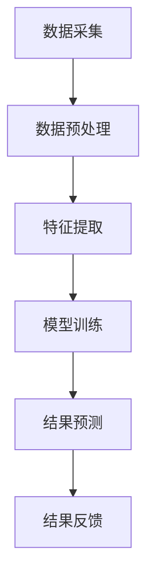
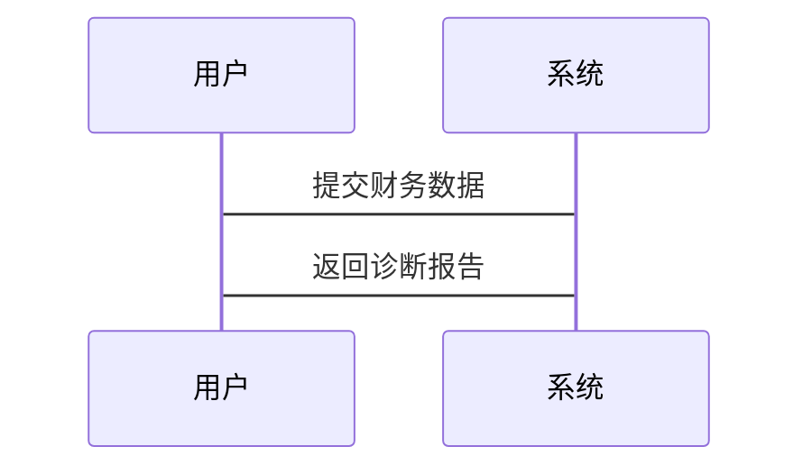

                 


# 智能个人财务健康诊断系统

> 关键词：智能诊断系统，个人财务管理，机器学习，系统架构，Python实现

> 摘要：本文介绍了一种基于人工智能的智能个人财务健康诊断系统，该系统通过分析个人的财务数据，提供健康评估和优化建议。文章详细讲解了系统的背景、核心概念、算法原理、系统架构设计、项目实战和最佳实践。

---

## 第一部分: 智能个人财务健康诊断系统概述

### 第1章: 智能个人财务健康诊断系统背景介绍

#### 1.1 问题背景
##### 1.1.1 个人财务管理的痛点与挑战
在现代社会中，个人财务管理变得越来越复杂。随着收入来源多样化、支出项目增多以及金融产品的种类增加，个人难以有效管理和分析自己的财务状况。传统的财务管理方式依赖于手动记录和简单的统计分析，无法满足复杂多变的财务需求。

##### 1.1.2 传统财务管理的局限性
- 数据分散：财务数据可能分布在不同的账户和平台中，难以整合。
- 分析效率低：手动分析财务数据耗时且容易出错。
- 缺乏预测能力：传统方法难以提供未来的财务趋势和风险预警。

##### 1.1.3 智能化财务管理的需求与趋势
随着人工智能和大数据技术的发展，智能化财务管理成为可能。智能系统可以实时分析财务数据，提供个性化的建议，帮助用户优化财务结构、降低风险。

#### 1.2 问题描述
##### 1.2.1 财务健康诊断的核心问题
财务健康诊断的核心问题是如何通过数据分析，评估个人的财务状况，并提出改进建议。这包括收入与支出的平衡、资产配置的合理性、负债情况、投资回报率等方面。

##### 1.2.2 智能诊断系统的定义与目标
智能个人财务健康诊断系统是一种基于人工智能技术的系统，旨在通过收集和分析个人的财务数据，提供个性化的财务健康评估和优化建议。

##### 1.2.3 系统边界与外延
系统的边界包括数据采集、数据处理、模型训练和结果反馈。外延则涉及与银行、投资平台等外部系统的数据对接。

#### 1.3 问题解决
##### 1.3.1 智能诊断系统的技术解决方案
通过机器学习算法对财务数据进行分析，生成健康诊断报告。

##### 1.3.2 系统实现的核心要素与组成
- 数据采集模块：收集用户财务数据。
- 数据预处理模块：清洗和整理数据。
- 模型训练模块：训练机器学习模型。
- 结果反馈模块：生成诊断报告和优化建议。

##### 1.3.3 系统与传统财务管理的区别与联系
区别在于智能化和自动化，联系在于两者的目标都是帮助用户优化财务状况。

#### 1.4 核心概念与联系
##### 1.4.1 智能诊断系统的核心概念
- 数据采集：通过API或其他方式获取用户的财务数据。
- 数据分析：使用机器学习算法对数据进行分析。
- 结果反馈：生成诊断报告和优化建议。

##### 1.4.2 核心概念的属性特征对比表
| 概念 | 属性 | 特征 |
|------|------|------|
| 数据采集 | 数据来源 | 银行账户、信用卡、投资平台 |
| 数据分析 | 算法 | 机器学习、深度学习 |
| 结果反馈 | 输出形式 | 文本报告、可视化图表 |

##### 1.4.3 ER实体关系图
```mermaid
erDiagram
    user {
        id : int
        name : string
        email : string
        phone : string
    }
    account {
        id : int
        user_id : int
        balance : float
        transaction_history : string
    }
    diagnosis_result {
        id : int
        user_id : int
        result : string
        timestamp : datetime
    }
    user --> account : "拥有"
    account --> diagnosis_result : "对应"
```

---

## 第二部分: 智能诊断系统的算法原理

### 第2章: 算法原理概述

#### 2.1 机器学习与深度学习的基本概念
- 机器学习：通过数据训练模型，使其能够做出预测或决策。
- 深度学习：一种机器学习技术，通过多层神经网络提取数据特征。

#### 2.2 算法选择与优化策略
- 算法选择：根据数据类型和任务选择合适的算法，如线性回归、决策树、随机森林等。
- 优化策略：使用交叉验证、超参数调优等方法提升模型性能。

#### 2.3 算法流程图


#### 2.4 代码实现与数学模型
##### 2.4.1 线性回归算法
- 数学模型：$y = \beta_0 + \beta_1x + \epsilon$
- 代码示例：
  ```python
  import numpy as np
  from sklearn.linear_model import LinearRegression

  X = np.array([i for i in range(10)]).reshape(-1, 1)
  y = np.array([2*i + 1 for i in range(10)])

  model = LinearRegression()
  model.fit(X, y)
  print(model.coef_)
  ```

##### 2.4.2 决策树算法
- 数学模型：基于特征的分裂构建决策树。
- 代码示例：
  ```python
  from sklearn.tree import DecisionTreeClassifier

  X = np.array([[1, 2], [3, 4], [5, 6], [7, 8]])
  y = np.array([0, 1, 1, 0])

  model = DecisionTreeClassifier()
  model.fit(X, y)
  print(model.predict([[9, 10]]))
  ```

---

## 第三部分: 系统架构设计

### 第3章: 系统架构设计

#### 3.1 问题场景介绍
系统需要处理大量的财务数据，提供实时的健康诊断和优化建议。

#### 3.2 系统功能设计
- 数据采集：通过API获取银行账户、信用卡等数据。
- 数据分析：使用机器学习模型进行分析。
- 结果反馈：生成诊断报告和优化建议。

#### 3.3 系统架构设计


#### 3.4 系统接口设计
- 数据采集接口：通过API获取数据。
- 结果反馈接口：返回诊断报告。

#### 3.5 系统交互流程图


---

## 第四部分: 项目实战

### 第4章: 项目实战

#### 4.1 环境安装
- 安装Python和相关库：`pip install numpy pandas scikit-learn`

#### 4.2 核心代码实现
- 数据采集：
  ```python
  import requests

  def fetch_data(api_key):
      response = requests.get(f'https://api.example.com/financial_data?api_key={api_key}')
      return response.json()
  ```

- 数据分析：
  ```python
  from sklearn.ensemble import RandomForestClassifier

  def train_model(X, y):
      model = RandomForestClassifier()
      model.fit(X, y)
      return model
  ```

#### 4.3 代码解读与分析
- 数据采集模块：通过API获取数据。
- 数据分析模块：使用随机森林模型进行分类。

#### 4.4 实际案例分析
- 案例：用户A的财务数据分析，生成诊断报告和优化建议。

#### 4.5 项目小结
通过实际案例，验证系统的可行性和有效性。

---

## 第五部分: 最佳实践

### 第5章: 最佳实践

#### 5.1 小结
智能个人财务健康诊断系统通过人工智能技术，帮助用户优化财务管理。

#### 5.2 注意事项
- 数据隐私保护：确保用户数据的安全性。
- 系统可扩展性：支持更多的数据源和功能扩展。

#### 5.3 拓展阅读
- 推荐书籍：《机器学习实战》、《深入浅出Python》
- 推荐博客：AI Genius Institute 官方博客

---

作者：AI天才研究院/AI Genius Institute & 禅与计算机程序设计艺术 /Zen And The Art of Computer Programming

--- 

感谢您的阅读！希望这篇文章能为您提供有价值的见解和启发！

