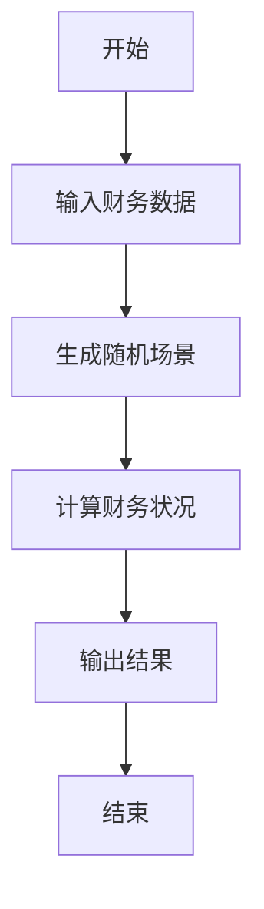

                 


# 智能个人财务压力测试工具

## 关键词
智能财务压力测试、机器学习、算法设计、系统架构、个人财务管理

## 摘要
《智能个人财务压力测试工具》通过详细分析和设计，介绍了一款基于机器学习和算法优化的智能工具，用于个人财务管理中的压力测试。文章从背景、核心概念、算法原理、系统架构到项目实战，全面阐述了工具的设计与实现，展示了其在提高财务压力测试准确性、实时性和便捷性方面的优势。

---

# 目录大纲

## 第一部分: 背景介绍

### 第1章: 问题背景
#### 1.1 个人财务压力测试的重要性
- 财务安全与个人生活的关联
- 传统压力测试的局限性

#### 1.2 智能工具的引入
- 机器学习在财务分析中的应用
- 智能工具的核心优势

### 第2章: 问题描述与解决
#### 2.1 财务压力测试的核心问题
- 收入、支出、资产和负债的综合分析
- 不同压力场景下的财务表现评估

#### 2.2 智能工具的解决路径
- 数据采集与分析
- 模型构建与优化
- 结果展示与建议

## 第二部分: 核心概念与联系

### 第3章: 核心概念原理
#### 3.1 压力测试的基本原理
- 什么是压力测试
- 财务压力测试的指标与方法

#### 3.2 智能工具的核心算法
- 简单介绍几种常用的算法，如蒙特卡洛模拟、线性回归等

## 第三部分: 算法原理讲解

### 第4章: 算法原理
#### 4.1 蒙特卡洛模拟流程


#### 4.2 线性回归模型
$$ y = \beta_0 + \beta_1x + \epsilon $$
```python
import numpy as np
from sklearn.linear_model import LinearRegression

# 示例数据
X = np.array([[1], [2], [3], [4]])
y = np.array([2, 4, 5, 6])

# 模型训练
model = LinearRegression()
model.fit(X, y)

# 预测
print(model.predict([[5]]))
```

## 第四部分: 系统分析与架构设计

### 第5章: 系统分析
#### 5.1 问题场景介绍
- 用户需求分析
- 系统功能需求
- 非功能需求

#### 5.2 系统架构设计
- 组件划分与交互
- 系统架构图

### 第6章: 系统架构
#### 6.1 系统架构图
```mermaid
pie
```

---

## 第五部分: 项目实战

### 第7章: 项目实战
#### 7.1 环境安装
- 安装Python和相关库

#### 7.2 核心代码实现
- 财务数据输入与处理
- 模型训练与预测
- 结果展示与解释

#### 7.3 实际案例分析
- 案例背景
- 数据输入
- 模型运行
- 结果解读与优化建议

## 第六部分: 总结与展望

### 第8章: 总结与最佳实践
#### 8.1 工具使用的注意事项
- 数据隐私保护
- 模型更新与维护
- 使用环境与限制

#### 8.2 未来展望
- 新算法与技术的应用
- 功能扩展与优化
- 智能财务工具的发展趋势

---

## 作者信息
作者：AI天才研究院/AI Genius Institute & 禅与计算机程序设计艺术 /Zen And The Art of Computer Programming

