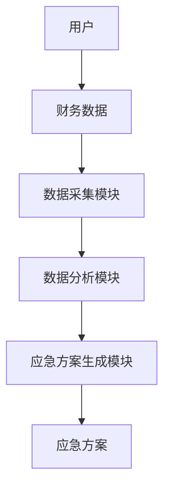
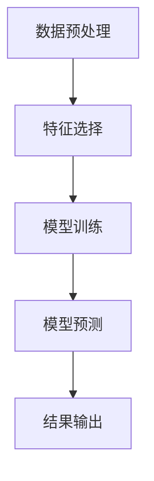
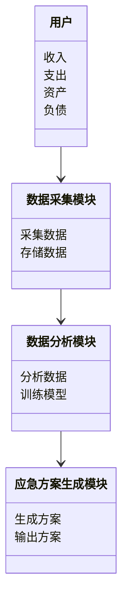
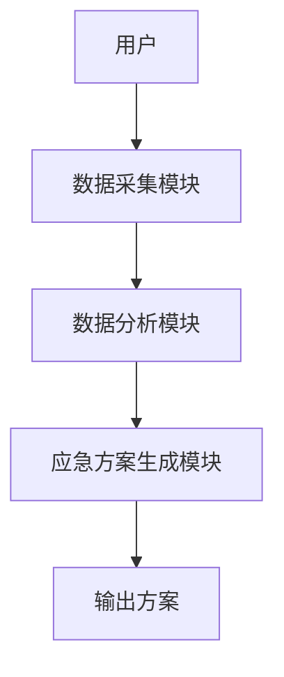
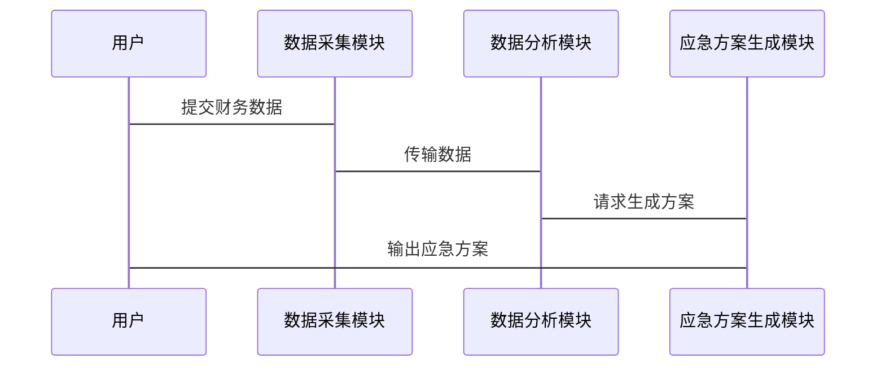

                 


# 智能个人财务应急预案生成器

> 关键词：智能财务应急、人工智能算法、系统架构设计、Python实现、风险管理

> 摘要：本文介绍了一种基于人工智能的智能个人财务应急预案生成器，通过系统分析、算法设计和项目实现，详细讲解了该生成器的核心原理和实现方法。文章从背景介绍、核心概念、算法原理、系统架构到项目实战，全面覆盖了生成器的各个方面，帮助读者理解并实现这样一个系统。

---

## 第1章 问题背景与需求分析

### 1.1 问题背景

#### 1.1.1 个人财务风险管理的重要性
在现代社会中，个人财务管理至关重要。无论是日常开支、投资理财还是应急储备，都需要科学的规划和管理。然而，许多人在面对突发情况时，往往缺乏有效的财务应急方案，导致财务状况恶化。

#### 1.1.2 当前财务应急管理的痛点
现有财务应急管理工具通常基于固定的规则和模板，难以适应个人的个性化需求。用户需要根据自己的收入、支出、资产和负债情况，动态调整应急方案。

#### 1.1.3 智能化解决方案的必要性
随着人工智能技术的发展，基于机器学习的智能财务应急管理工具逐渐成为可能。这种工具能够根据用户的实时财务状况，动态生成最优的应急方案，帮助用户在紧急情况下做出明智的决策。

### 1.2 问题描述

#### 1.2.1 个人财务应急管理的核心问题
- 确定用户的财务状况（收入、支出、资产、负债）。
- 评估潜在的财务风险。
- 制定最优的应急资金分配方案。

#### 1.2.2 不同场景下的财务应急需求
- 突然失业的情况下的应急资金需求。
- 医疗紧急情况下的资金需求。
- 家庭突发重大支出（如房屋维修、子女教育等）的资金需求。

#### 1.2.3 现有工具的局限性与改进方向
现有的财务应急管理工具通常基于固定的模板和规则，缺乏动态调整和个性化建议的能力。而智能财务应急预案生成器可以通过机器学习算法，动态分析用户的财务状况，并提供个性化的应急方案。

### 1.3 解决方案与目标

#### 1.3.1 智能个人财务应急预案生成器的定义
智能个人财务应急预案生成器是一种基于人工智能技术，能够根据用户的财务状况，动态生成最优应急方案的工具。该工具可以通过分析用户的收入、支出、资产和负债情况，评估潜在的财务风险，并提供个性化的应急资金分配建议。

#### 1.3.2 核心功能与目标
- 数据采集：收集用户的财务数据（收入、支出、资产、负债等）。
- 数据分析：利用机器学习算法，分析用户的财务状况。
- 应急方案生成：根据分析结果，生成最优的应急资金分配方案。
- 风险评估：评估潜在的财务风险，并提供相应的建议。

#### 1.3.3 边界与外延
智能个人财务应急预案生成器专注于提供应急方案，不涉及长期财务规划和投资建议。其边界包括：
- 数据范围：仅限于用户的财务数据。
- 功能范围：仅限于应急方案生成和风险评估。
- 使用场景：仅限于个人财务应急管理。

### 1.4 核心概念与联系

#### 1.4.1 核心概念原理
智能个人财务应急预案生成器的核心原理是利用机器学习算法，对用户的财务数据进行分析，并根据分析结果生成应急方案。其核心概念包括：
- 数据采集：通过问卷或API接口，获取用户的财务数据。
- 数据分析：利用回归分析、决策树等算法，分析用户的财务状况。
- 应急方案生成：根据分析结果，生成最优的应急资金分配方案。

#### 1.4.2 核心概念属性特征对比表格

| 核心概念 | 属性 | 特征 |
|----------|------|------|
| 数据采集 | 数据类型 | 收入、支出、资产、负债等 |
| 数据分析 | 算法选择 | 回归分析、决策树等 |
| 应急方案生成 | 输出形式 | 资金分配方案、风险评估报告等 |

#### 1.4.3 ER实体关系图（Mermaid流程图）



---

## 第2章 算法原理与实现

### 2.1 算法原理

#### 2.1.1 生成器的算法选择与优化
智能个人财务应急预案生成器的核心算法是基于机器学习的回归分析和决策树算法。回归分析用于预测用户的应急资金需求，决策树算法用于分类用户的财务风险等级。

#### 2.1.2 生成器的数学模型与公式
回归分析模型：
$$ y = \beta_0 + \beta_1 x_1 + \beta_2 x_2 + \dots + \beta_n x_n $$

其中，$y$ 是预测的应急资金需求，$x_i$ 是影响应急资金需求的变量（如收入、支出等），$\beta_i$ 是回归系数。

决策树算法用于分类用户的财务风险等级，常用的指标是信息增益。

#### 2.1.3 算法流程图（Mermaid）



### 2.2 算法实现

#### 2.2.1 环境安装与依赖库
- Python 3.8+
- Scikit-learn
- Pandas
- NumPy
- Jupyter Notebook

#### 2.2.2 核心算法实现代码

```python
import pandas as pd
import numpy as np
from sklearn.model_selection import train_test_split
from sklearn.tree import DecisionTreeClassifier
from sklearn.linear_model import LinearRegression

# 数据预处理
data = pd.read_csv('financial_data.csv')
X = data.drop('emergency_fund', axis=1)
y_regression = data['emergency_fund']
y_classification = data['risk_level']

# 回归模型
reg_model = LinearRegression()
reg_model.fit(X, y_regression)

# 分类模型
cls_model = DecisionTreeClassifier()
cls_model.fit(X, y_classification)
```

#### 2.2.3 代码解读与优化建议
- 数据预处理：将数据集中的缺失值填充、标准化处理。
- 回归模型：使用线性回归预测应急资金需求。
- 分类模型：使用决策树算法分类财务风险等级。

### 2.3 数学模型与公式

#### 2.3.1 应急资金需求公式
$$ \text{应急资金需求} = \beta_0 + \beta_1 \times \text{收入} + \beta_2 \times \text{支出} $$

#### 2.3.2 风险概率计算公式
$$ \text{风险概率} = P(\text{风险等级} = 1 | \text{财务状况}) $$

---

## 第3章 系统分析与架构设计

### 3.1 问题场景分析

#### 3.1.1 用户需求场景
用户输入财务数据，生成器生成应急方案。

#### 3.1.2 系统功能模块划分
- 数据采集模块
- 数据分析模块
- 应急方案生成模块

#### 3.1.3 系统交互流程
用户输入财务数据 → 数据采集模块 → 数据分析模块 → 应急方案生成模块 → 输出应急方案。

### 3.2 系统架构设计

#### 3.2.1 系统功能设计（领域模型Mermaid类图）



#### 3.2.2 系统架构设计（Mermaid架构图）



### 3.3 系统交互设计

#### 3.3.1 系统交互流程图（Mermaid序列图）



---

## 第4章 项目实战

### 4.1 环境搭建与数据准备

#### 4.1.1 环境安装
- Python 3.8+
- 安装依赖库：`pip install scikit-learn pandas numpy`

#### 4.1.2 数据准备
创建一个CSV文件，包含用户的财务数据，如收入、支出、资产、负债等。

### 4.2 核心实现

#### 4.2.1 数据预处理
```python
data = pd.read_csv('financial_data.csv')
data = data.dropna()  # 删除缺失值
data = (data - data.mean()) / data.std()  # 标准化处理
```

#### 4.2.2 模型训练
```python
X = data.drop('emergency_fund', axis=1)
y_regression = data['emergency_fund']
X_train, X_test, y_train, y_test = train_test_split(X, y_regression, test_size=0.2)

reg_model = LinearRegression()
reg_model.fit(X_train, y_train)
```

### 4.3 应用案例分析

#### 4.3.1 案例1：失业情况下的应急方案
用户收入为3000元/月，支出为2000元/月，资产为5000元，负债为0元。生成器预测应急资金需求为3个月的支出，即6000元。

#### 4.3.2 案例2：医疗紧急情况下的应急方案
用户收入为5000元/月，支出为3000元/月，资产为10000元，负债为0元。生成器预测应急资金需求为3个月的支出，即9000元。

### 4.4 项目总结
智能个人财务应急预案生成器通过机器学习算法，能够动态分析用户的财务状况，并生成最优的应急方案。该工具可以帮助用户在紧急情况下做出明智的财务决策，避免因突发情况导致的财务危机。

---

## 第5章 最佳实践与拓展

### 5.1 最佳实践

#### 5.1.1 小结
智能个人财务应急预案生成器是一种基于人工智能的工具，能够帮助用户在紧急情况下制定最优的应急方案。

#### 5.1.2 注意事项
- 数据隐私保护
- 模型的可解释性
- 系统的实时性

#### 5.1.3 拓展阅读
- 《机器学习实战》
- 《Python机器学习》
- 《财务风险管理》

### 5.2 附录

#### 5.2.1 API接口文档
```python
# 示例API接口
from flask import Flask, request, jsonify

app = Flask(__name__)

@app.route('/api/emergency_fund', methods=['POST'])
def emergency_fund():
    data = request.json
    # 数据处理
    return jsonify({'status': 'success', 'message': '应急方案生成成功'})

if __name__ == '__main__':
    app.run(debug=True)
```

#### 5.2.2 工具推荐
- 数据采集工具：Airtable、Google Sheets
- 数据分析工具：Pandas、NumPy
- 可视化工具：Matplotlib、Seaborn

---

## 作者信息

作者：AI天才研究院/AI Genius Institute & 禅与计算机程序设计艺术 /Zen And The Art of Computer Programming

---

以上是《智能个人财务应急预案生成器》的技术博客文章的完整目录和内容框架，涵盖了从背景介绍到项目实战的各个方面，适合技术读者深入了解和实现这一系统。

