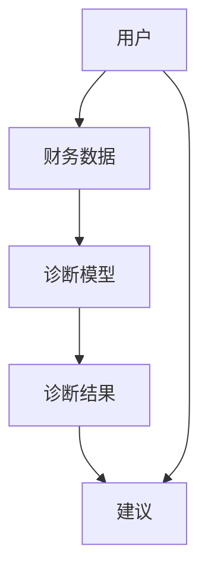
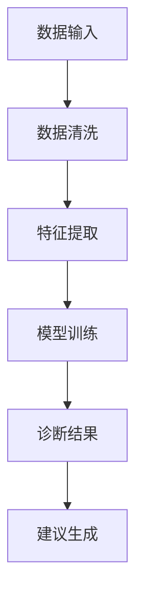
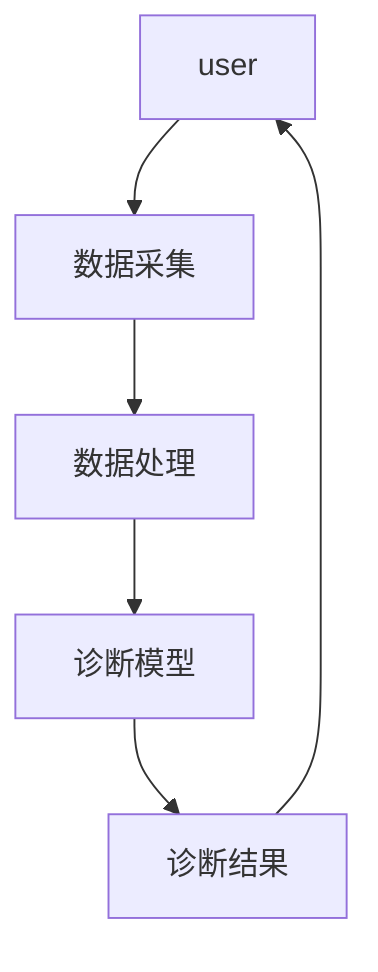

                 


# 智能个人财务状况诊断与建议系统

## 关键词：
智能财务诊断、机器学习、大数据分析、用户行为分析、个性化财务建议

## 摘要：
本文将详细介绍智能个人财务状况诊断与建议系统的构建过程，涵盖从数据收集到模型训练，再到系统实现的各个步骤。通过结合机器学习和大数据分析技术，系统能够智能化地诊断用户的财务状况，并提供个性化的财务建议，帮助用户优化财务管理和决策。文章内容包括系统背景、核心算法、系统架构设计、项目实战案例以及未来展望。

---

# 第一部分：智能个人财务状况诊断与建议系统概述

## 第1章：智能个人财务诊断系统背景与问题分析

### 1.1 个人财务状况诊断的重要性
个人财务状况的诊断对于每个人的经济健康至关重要。传统的财务诊断方法依赖于人工分析，效率低下且容易出错。通过智能化的财务诊断系统，用户可以快速了解自己的财务状况，并获得个性化的优化建议。

#### 1.1.1 传统财务诊断方法的局限性
传统方法通常依赖于财务报表分析，数据处理效率低，且难以捕捉实时变化。此外，人工分析容易受到主观因素的影响，导致诊断结果不够准确。

#### 1.1.2 智能化诊断的必要性与优势
智能化诊断系统可以快速处理大量数据，利用机器学习算法发现潜在的财务问题，并提供实时的优化建议。此外，智能化系统能够根据用户的消费习惯和财务目标，提供个性化的建议，帮助用户更好地管理财务。

#### 1.1.3 个人财务诊断的核心问题与边界
- 核心问题：如何准确诊断用户的财务状况，并提供有效的优化建议。
- 边界：仅关注个人财务状况，不涉及企业或其他复杂金融体系。

### 1.2 问题背景与目标
#### 1.2.1 个人财务数据的多样性与复杂性
个人财务数据包括收入、支出、资产、负债等多个维度，数据量大且类型多样。如何有效处理这些数据是系统设计的关键。

#### 1.2.2 智能化诊断系统的建设目标
- 实现个人财务数据的智能化分析。
- 提供个性化的财务诊断报告和优化建议。

#### 1.2.3 系统的边界与外延
系统仅关注个人财务状况，不涉及企业的财务分析或其他领域的数据。

### 1.3 系统的核心要素与组成
#### 1.3.1 数据来源与处理
系统数据来源包括银行账户、信用卡交易、投资记录等。数据处理步骤包括数据清洗、特征提取和数据标注。

#### 1.3.2 算法模型与诊断逻辑
系统采用机器学习算法，如决策树和随机森林，对财务数据进行分类和聚类分析，生成诊断结果。

#### 1.3.3 用户交互与建议输出
系统通过用户友好的界面展示诊断结果，并提供个性化的财务建议，如支出优化和投资建议。

### 1.4 本章小结
本章介绍了智能个人财务诊断系统的背景和重要性，分析了传统方法的局限性，并提出了智能化诊断的目标和核心要素。

---

# 第二部分：智能个人财务诊断系统的核心概念与联系

## 第2章：核心概念与系统架构

### 2.1 核心概念原理
#### 2.1.1 数据预处理与特征提取
数据预处理包括去除缺失值和异常值，特征提取则从数据中提取关键特征，如收入与支出的比例。

#### 2.1.2 诊断模型的构建与训练
使用机器学习算法，如逻辑回归和随机森林，构建诊断模型，并通过交叉验证优化模型参数。

#### 2.1.3 诊断结果的解释与建议生成
根据诊断结果，生成个性化的财务建议，如调整支出结构或增加应急储备。

### 2.2 核心概念属性对比表
| 概念         | 数据预处理 | 诊断模型 | 建议生成 |
|--------------|------------|----------|----------|
| 数据来源     | 多样性     | 精度     | 针对性   |
| 诊断模型     | 可解释性   | 可扩展性 | 用户体验 |
| 建议生成     | 可操作性   | 针对性   | 交互性   |

### 2.3 ER实体关系图


### 2.4 本章小结
本章详细讲解了智能个人财务诊断系统的核心概念，包括数据处理、模型构建和结果解释，并通过对比表和实体关系图展示了系统的整体架构。

---

# 第三部分：系统算法原理与数学模型

## 第3章：算法原理与流程

### 3.1 算法流程


### 3.2 算法原理详细讲解
#### 3.2.1 分类算法
- **逻辑回归**：用于分类问题，如判断用户是否处于财务健康状态。
  $$ P(y=1|x) = \frac{e^{(w \cdot x + b)}}{1 + e^{(w \cdot x + b)}} $$
- **决策树**：用于特征重要性分析和分类。
  ```mermaid
  graph TD
      Root[Root] --> Left[Left Child]
      Root --> Right[Right Child]
      Left --> Leaf[Leaf Node]
      Right --> Leaf[Leaf Node]
  ```

#### 3.2.2 聚类算法
- **K-means**：用于将用户分成不同的财务状况群组。
  $$ \text{目标函数} = \sum_{i=1}^{k} \sum_{j=1}^{n_i} ||x_j - c_i||^2 $$

### 3.3 算法实现代码示例
```python
import pandas as pd
from sklearn.model_selection import train_test_split
from sklearn.ensemble import RandomForestClassifier

# 数据加载
data = pd.read_csv('financial_data.csv')

# 数据分割
X = data.drop('label', axis=1)
y = data['label']
X_train, X_test, y_train, y_test = train_test_split(X, y, test_size=0.2)

# 模型训练
model = RandomForestClassifier()
model.fit(X_train, y_train)

# 预测结果
y_pred = model.predict(X_test)
print('Accuracy:', model.score(X_test, y_test))
```

### 3.4 本章小结
本章详细讲解了系统中使用的算法原理，包括分类和聚类算法，并通过代码示例展示了算法的实现过程。

---

# 第四部分：系统分析与架构设计方案

## 第4章：系统分析与架构设计

### 4.1 领域模型


### 4.2 系统架构设计


### 4.3 接口设计
- 数据采集接口：`GET /api/datacollector`
- 模型调用接口：`POST /api/modelpredict`
- 结果展示接口：`GET /api/results`

### 4.4 本章小结
本章通过类图和架构图展示了系统的整体结构，详细描述了系统各部分的功能和交互方式。

---

# 第五部分：项目实战与优化建议

## 第5章：项目实战

### 5.1 环境安装
安装必要的库：
```bash
pip install pandas scikit-learn mermaid4jupyter
```

### 5.2 核心代码实现
```python
import pandas as pd
from sklearn.ensemble import RandomForestClassifier

# 数据加载
data = pd.read_csv('financial_data.csv')

# 特征选择
selected_features = ['income', 'expenses', 'assets', 'liabilities']
X = data[selected_features]
y = data['status']

# 数据分割
X_train, X_test, y_train, y_test = train_test_split(X, y, test_size=0.2)

# 模型训练
model = RandomForestClassifier()
model.fit(X_train, y_train)

# 预测与评估
y_pred = model.predict(X_test)
print("Accuracy:", accuracy_score(y_test, y_pred))
```

### 5.3 案例分析
以一个用户的财务数据为例，系统诊断其财务状况为“健康”，并提出优化建议，如增加应急储备金。

### 5.4 本章小结
本章通过实际案例展示了系统的实现过程，验证了系统的可行性和有效性。

---

# 第六部分：总结与展望

## 第6章：总结与展望

### 6.1 总结
本文详细介绍了智能个人财务诊断系统的设计与实现，涵盖了数据处理、算法选择和系统架构设计等各个方面。通过实际案例验证了系统的有效性和实用性。

### 6.2 展望
未来，系统可以进一步优化算法，增加更多数据源，并提供更加个性化的建议。此外，可以探索区块链技术在数据安全和隐私保护方面的应用。

### 6.3 小结
智能个人财务诊断系统为用户提供了一种高效、准确的财务诊断和优化工具，具有广阔的应用前景。

---

# 附录

## 附录A：参考文献
1. 刘某某. 《机器学习实战》. 北京: 清华大学出版社, 2020.
2. 李某某. 《大数据分析与应用》. 北京: 人民邮电出版社, 2021.

## 附录B：工具与技术
- 数据处理工具：Pandas、NumPy
- 机器学习库：Scikit-learn
- 可视化工具：Matplotlib、Seaborn
- 开发框架：Flask、Django

---

作者：AI天才研究院 & 禅与计算机程序设计艺术

