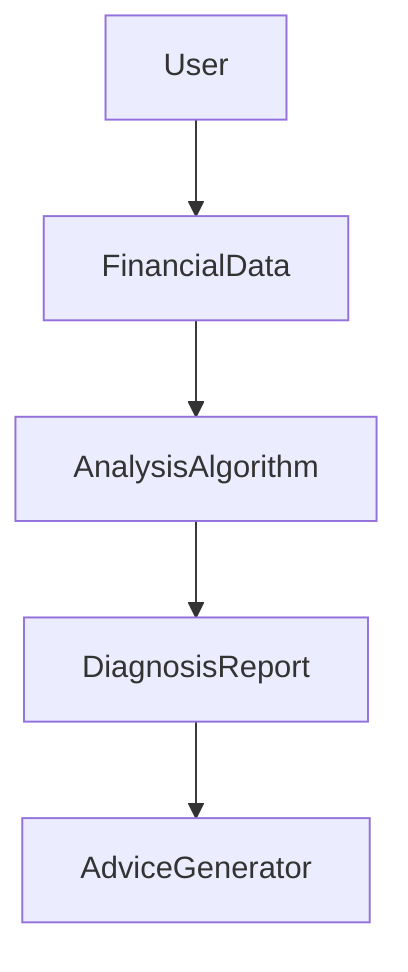
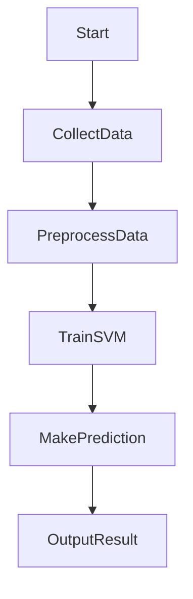
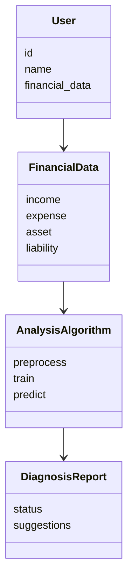
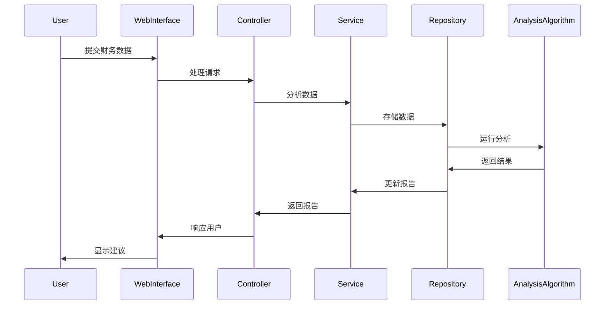

                 


# 智能个人财务状况诊断系统

> 关键词：智能财务诊断、人工智能、数据挖掘、机器学习、系统架构

> 摘要：本文介绍了一种基于人工智能的智能个人财务状况诊断系统，详细阐述了其背景、核心算法原理、系统架构设计、数学模型、项目实战以及最佳实践，旨在为读者提供一个全面的解决方案。

---

# 第一部分: 智能个人财务状况诊断系统概述

# 第1章: 智能个人财务状况诊断系统背景

## 1.1 问题背景与描述

### 1.1.1 传统财务诊断的局限性
传统财务诊断依赖人工分析，耗时且易出错。个人用户难以独立完成复杂分析，容易遗漏潜在问题。

### 1.1.2 智能化诊断的需求
随着AI技术进步，智能化诊断需求迫切，可实现高效、精准的财务分析，帮助个人优化财务管理。

### 1.1.3 系统的目标与意义
系统旨在通过AI技术，实时分析财务数据，诊断问题，提供建议，帮助个人提升财务健康。

## 1.2 问题解决与系统边界

### 1.2.1 系统的功能范围
- 数据采集与处理
- 财务分析与诊断
- 优化建议生成

### 1.2.2 系统的边界与外延
系统专注于个人财务分析，不涉及企业财务或其他领域。

### 1.2.3 核心概念与组成要素
- 数据源：收入、支出、资产、负债等
- 分析算法：机器学习模型
- 诊断结果：财务状况评估
- 优化建议：支出调整、投资建议等

## 1.3 核心概念与联系

### 1.3.1 核心原理概述
系统通过收集和分析财务数据，运用机器学习算法进行诊断，提供个性化建议。

### 1.3.2 概念对比分析
| 概念 | 属性特征 |
|------|----------|
| 数据采集 | 实时性、多样性 |
| 数据分析 | 精准性、全面性 |
| 诊断建议 | 针对性、可操作性 |

### 1.3.3 实体关系图


## 1.4 本章小结
本章介绍了系统背景、核心概念和组成部分，为后续章节打下基础。

---

# 第2章: 系统核心算法原理

## 2.1 算法原理概述

### 2.1.1 支持向量机原理
支持向量机用于分类和回归分析，适用于财务状况评估。

### 2.1.2 算法流程


## 2.2 算法实现

### 2.2.1 数据预处理
```python
def preprocess(data):
    # 数据清洗和标准化
    return processed_data
```

### 2.2.2 支持向量机实现
```python
from sklearn import svm

model = svm.SVC(kernel='rbf', C=1.0)
model.fit(X_train, y_train)
```

## 2.3 数学模型与公式

### 2.3.1 最小化问题
$$ \min_{\theta, \alpha} \frac{1}{2}\alpha^2 - \sum_{i=1}^{n} y_i \alpha_i (x_i \cdot \theta + b) $$

### 2.3.2 举例说明
假设用户月收入10000元，支出8000元，系统诊断其储蓄率低于建议值，建议增加储蓄。

## 2.4 本章小结
本章详细讲解了算法原理和实现，为系统设计奠定基础。

---

# 第3章: 系统分析与架构设计方案

## 3.1 问题场景介绍
用户输入财务数据，系统分析并生成诊断报告和优化建议。

## 3.2 系统功能设计

### 3.2.1 领域模型


### 3.2.2 系统架构设计


### 3.2.3 接口设计与交互


## 3.3 本章小结
本章详细设计了系统架构，确保各部分协同工作。

---

# 第4章: 项目实战

## 4.1 环境搭建与安装

### 4.1.1 安装Python
```bash
python --version
pip install --upgrade pip
```

### 4.1.2 安装依赖
```bash
pip install numpy scikit-learn matplotlib
```

## 4.2 核心代码实现

### 4.2.1 数据采集模块
```python
def collect_data():
    # 从数据库或API获取数据
    return data
```

### 4.2.2 数据分析模块
```python
def analyze_financial(data):
    # 应用机器学习模型进行分析
    return diagnosis
```

### 4.2.3 诊断报告生成
```python
def generate_report(diagnosis):
    # 生成诊断报告和建议
    return report
```

## 4.3 案例分析与解读

### 4.3.1 案例介绍
用户A，月收入5000元，支出3000元，系统诊断其储蓄率合理，但可优化投资结构。

### 4.3.2 详细解读
系统分析后，建议用户增加紧急储备金，调整投资比例，优化消费结构。

## 4.4 本章小结
本章通过实战案例，展示了系统的实际应用和效果。

---

# 第5章: 最佳实践与总结

## 5.1 最佳实践 tips
- 定期更新数据，保持模型准确性
- 结合用户实际需求，灵活调整建议
- 定期财务审查和系统更新

## 5.2 小结
本文详细介绍了智能个人财务诊断系统的设计与实现，从背景到算法，再到系统架构和实战，为读者提供了全面的解决方案。

## 5.3 注意事项
- 确保数据隐私和安全
- 定期模型优化和更新
- 考虑用户反馈，持续改进系统

## 5.4 拓展阅读
建议阅读相关书籍和论文，深入学习机器学习和系统架构设计。

---

# 作者：AI天才研究院 & 禅与计算机程序设计艺术

---

通过以上内容，读者可以系统地了解智能个人财务诊断系统的各个方面，从理论到实践，全面掌握其设计与实现。

