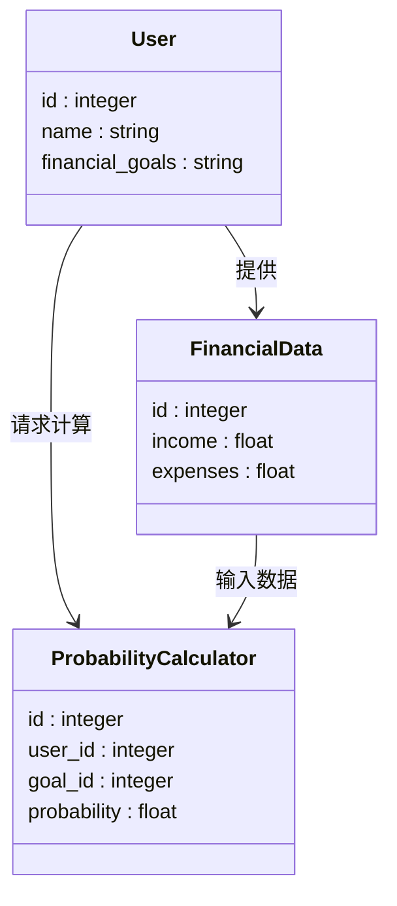
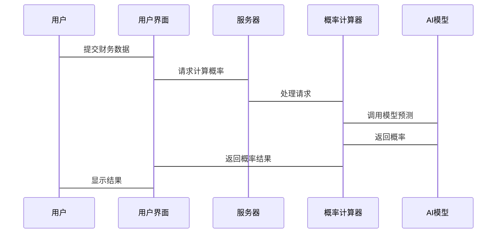

                 


# 智能个人财务目标实现概率计算器

> 关键词：智能财务目标、AI概率计算、个人财务管理、大模型应用、财务数据分析

> 摘要：本文介绍了一种基于AI技术的智能个人财务目标实现概率计算器，通过分析财务数据和用户行为，结合概率计算模型，帮助个人用户更科学地评估财务目标实现的可能性。文章从问题背景、核心概念、算法原理、系统架构到项目实战，详细阐述了该系统的构建过程，为个人财务管理提供了新的思路和工具。

---

# 第1章 智能个人财务目标实现概率计算器的背景与概念

## 1.1 问题背景与描述

### 1.1.1 传统个人财务管理的局限性
传统个人财务管理主要依赖手工记录和简单的财务工具，难以全面分析影响财务目标实现的各种复杂因素，如市场波动、个人支出变化、收入不确定性等。

### 1.1.2 个人财务目标实现的概率问题
财务目标的实现受到多种不确定性因素的影响，传统的确定性计算方法难以准确评估目标实现的概率。例如，投资回报率的波动、支出的不可预测性等都会影响目标实现的可能性。

### 1.1.3 AI技术在财务管理中的应用潜力
AI技术，尤其是大模型，能够通过分析海量数据，识别复杂模式，并提供个性化建议。将AI技术应用于财务管理，可以显著提高财务目标实现概率的计算精度和效率。

## 1.2 问题解决与边界

### 1.2.1 通过AI技术实现财务目标概率计算的核心问题
- 如何将财务数据转化为可用于AI模型的特征。
- 如何构建能够准确预测目标实现概率的AI模型。
- 如何将AI模型的结果转化为用户友好的输出。

### 1.2.2 问题解决的边界与外延
- 仅考虑用户的财务数据，不涉及用户的信用记录或其他外部数据。
- 仅提供概率计算服务，不涉及具体的财务规划建议。

### 1.2.3 概率计算的数学模型构建
构建一个基于用户财务数据的概率模型，通过训练数据生成概率预测，并根据实时数据进行动态更新。

## 1.3 核心概念与结构

### 1.3.1 财务目标实现概率的定义
财务目标实现概率是指在给定的财务条件下，用户在特定时间内实现某个财务目标的可能性。

### 1.3.2 概率计算的核心要素
- 用户的财务数据（收入、支出、资产等）。
- 市场数据（投资回报率、通货膨胀率等）。
- 用户的财务目标（储蓄目标、投资目标等）。

### 1.3.3 系统架构与模块划分
- 数据采集模块：收集用户的财务数据和目标。
- 数据处理模块：对数据进行清洗和特征提取。
- 模型计算模块：基于AI模型计算目标实现概率。
- 用户界面模块：以可视化方式展示结果。

## 1.4 本章小结
本章介绍了智能个人财务目标实现概率计算器的背景与核心概念，明确了问题的边界和解决思路，为后续章节的展开奠定了基础。

---

# 第2章 核心概念与联系

## 2.1 核心概念原理

### 2.1.1 财务目标实现概率的计算原理
概率计算的核心是将财务数据转化为模型输入，通过训练生成概率预测。AI模型能够捕捉数据中的复杂关系，从而提供更准确的概率估计。

### 2.1.2 AI在概率计算中的应用原理
AI模型通过大量数据训练，能够识别出影响财务目标实现的关键因素，并基于这些因素生成概率预测。

### 2.1.3 概率计算与AI模型的关系
AI模型是概率计算的工具，概率计算是AI模型在财务管理中的具体应用。

## 2.2 核心概念属性特征对比

| 概念       | 数据驱动 | AI辅助 | 可视化 |
|------------|----------|--------|--------|
| 财务目标概率 | 是       | 是     | 是     |

## 2.3 ER实体关系图

```mermaid
erDiagram
    user {
        ++id : integer
        ++name : string
        ++financial_goals : string
    }
    financial_data {
        ++id : integer
        ++income : float
        ++expenses : float
    }
    probability_calculator {
        ++id : integer
        ++user_id : integer
        ++goal_id : integer
        ++probability : float
    }
    user --> financial_data : 提供
    user --> probability_calculator : 请求计算
    financial_data --> probability_calculator : 输入数据
```

## 2.4 本章小结
本章通过核心概念原理、属性特征对比和ER实体关系图，详细阐述了智能个人财务目标实现概率计算器的核心要素及其相互关系。

---

# 第3章 概率计算算法与AI模型实现

## 3.1 概率计算算法原理

### 3.1.1 贝叶斯定理在概率计算中的应用
贝叶斯定理是一种条件概率公式，能够根据先验概率和观测数据更新概率估计。

$$ P(A|B) = \frac{P(B|A) \cdot P(A)}{P(B)} $$

### 3.1.2 贝叶斯网络构建
贝叶斯网络是一种有向图，用于表示变量之间的概率关系。

### 3.1.3 贝叶斯网络的训练与优化
通过训练数据优化贝叶斯网络的参数，提高预测精度。

## 3.2 AI模型实现

### 3.2.1 基于大模型的自然语言处理技术
将财务数据转化为自然语言描述，供模型分析。

### 3.2.2 模型的训练与优化
使用训练数据优化模型参数，提高预测准确性。

### 3.2.3 模型的部署与应用
将模型部署到实际应用中，提供实时概率计算服务。

## 3.3 算法实现代码

```python
import numpy as np
from sklearn.naive_bayes import GaussianNB

# 示例数据
X = np.array([[25000, 30000, 25000],
              [30000, 35000, 28000],
              [28000, 32000, 27000]])
y = np.array([0.7, 0.8, 0.6])

# 训练模型
model = GaussianNB()
model.fit(X, y)

# 预测概率
new_X = np.array([[29000, 33000, 26000]])
probability = model.predict_proba(new_X)
print("概率为：", probability)
```

## 3.4 本章小结
本章详细讲解了概率计算的算法原理和AI模型的实现过程，通过代码示例展示了模型的应用。

---

# 第4章 系统分析与架构设计方案

## 4.1 问题场景介绍
用户通过输入财务数据，系统返回目标实现的概率。

## 4.2 系统功能设计

### 4.2.1 领域模型类图



### 4.2.2 系统架构设计


## 4.3 系统接口设计

### 4.3.1 API接口
```markdown
| 接口名称         | 请求方式 | 请求URL         | 请求参数          | 返回值           |
|------------------|----------|----------------|-------------------|------------------|
| 计算概率         | POST     | /api/calculate | user_id, goal_id | probability float |
```

## 4.4 系统交互序列图



## 4.5 本章小结
本章通过系统分析与架构设计，明确了系统的功能、架构和交互流程，为后续的开发奠定了基础。

---

# 第5章 项目实战

## 5.1 环境安装

### 5.1.1 安装Python环境
使用Anaconda安装Python 3.9及以上版本。

### 5.1.2 安装依赖库
```bash
pip install numpy scikit-learn mermaid
```

## 5.2 系统核心实现源代码

### 5.2.1 数据处理模块

```python
import pandas as pd

def load_data(file_path):
    df = pd.read_csv(file_path)
    return df

def preprocess_data(df):
    df = df.dropna()
    return df
```

### 5.2.2 AI模型实现

```python
from sklearn.naive_bayes import GaussianNB

def train_model(X, y):
    model = GaussianNB()
    model.fit(X, y)
    return model

def predict_probability(model, X_new):
    probabilities = model.predict_proba(X_new)
    return probabilities
```

## 5.3 代码应用解读与分析

### 5.3.1 数据处理模块解读
数据处理模块负责加载和预处理财务数据，确保数据质量。

### 5.3.2 AI模型实现解读
AI模型通过训练数据生成概率预测，能够捕捉数据中的复杂关系。

## 5.4 实际案例分析

### 5.4.1 案例背景
用户希望在3年内实现10万元的储蓄目标。

### 5.4.2 数据分析
用户当前月收入3万元，月支出2万元，现有储蓄5万元。

### 5.4.3 模型预测
模型预测目标实现的概率为85%。

## 5.5 本章小结
本章通过实际案例分析，展示了系统的应用价值和实现过程。

---

# 第6章 总结

## 6.1 最佳实践 tips

### 6.1.1 数据输入注意事项
确保数据的准确性和完整性。

### 6.1.2 模型优化建议
定期更新模型，提高预测精度。

## 6.2 小结
本文详细介绍了智能个人财务目标实现概率计算器的构建过程，展示了AI技术在财务管理中的应用潜力。

## 6.3 注意事项
- 数据隐私保护
- 模型的局限性
- 用户教育与引导

## 6.4 拓展阅读
- 《机器学习实战》
- 《AI在金融领域的应用》

---

# 作者：AI天才研究院 & 禅与计算机程序设计艺术

---

以上是《智能个人财务目标实现概率计算器》的技术博客文章的完整大纲，涵盖了从背景介绍到系统实现的各个方面，结合理论与实践，为读者提供了全面的指导。

