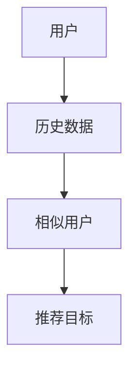
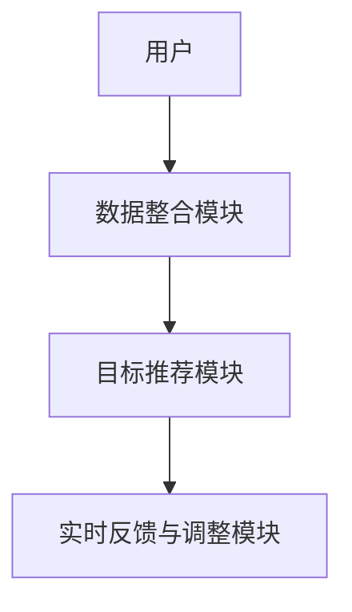
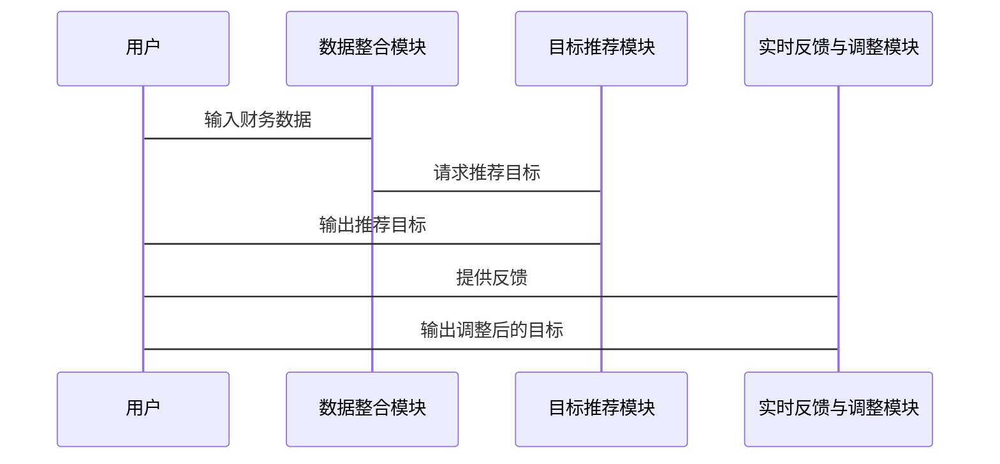

                 


# 智能个人财务目标设定助手

## 关键词：
智能财务助手、人工智能、财务目标设定、推荐算法、系统架构

## 摘要：
智能个人财务目标设定助手是一款结合人工智能技术的智能助手，旨在帮助个人用户高效地设定和管理财务目标。本文将从背景介绍、核心概念、算法原理、系统架构、项目实战等方面详细阐述这一技术的应用与实现。通过本文，读者将了解如何利用人工智能技术解决个人财务管理中的痛点，掌握智能助手的核心算法与系统设计方法，并能够实际操作相关项目。

---

# 第一部分: 智能个人财务目标设定助手概述

## 第1章: 背景介绍

### 1.1 问题背景
#### 1.1.1 传统财务目标设定的挑战
传统的财务目标设定过程往往依赖人工计算和经验判断，存在以下问题：
- **数据分散**：用户需要从多个来源（如银行账户、投资平台等）收集财务数据，效率低下。
- **计算复杂**：手动计算财务目标（如储蓄目标、投资目标）需要复杂的数学公式，容易出错。
- **缺乏个性化**：传统方法难以根据用户的消费习惯、风险偏好等个性化特征，制定精准的财务目标。

#### 1.1.2 人工智能在财务管理中的应用潜力
人工智能技术（AI）在财务管理领域的应用日益广泛，尤其是在数据处理、模式识别和个性化推荐方面具有显著优势：
- **数据处理**：AI可以快速整合和分析多来源的财务数据，提高效率。
- **模式识别**：通过机器学习算法，AI能够识别用户的消费习惯和财务行为模式。
- **个性化推荐**：AI可以根据用户的财务状况和目标，提供个性化的财务建议和目标设定。

#### 1.1.3 智能财务目标设定助手的必要性
智能财务目标设定助手通过结合AI技术和财务管理理论，能够解决以下问题：
- **自动化数据处理**：自动整合用户的财务数据，生成清晰的财务报表。
- **智能目标推荐**：根据用户的财务状况和需求，推荐合理的财务目标。
- **实时反馈与调整**：根据用户的财务变化，实时调整目标并提供建议。

### 1.2 问题描述
#### 1.2.1 个人财务管理的主要痛点
- **数据分散**：用户需要从多个平台收集财务数据，耗时且容易出错。
- **计算复杂**：手动计算财务目标需要复杂的数学公式，容易出错。
- **缺乏个性化**：传统方法难以根据用户的个性化需求制定财务目标。

#### 1.2.2 财务目标设定的关键因素
- **收入与支出**：用户当前的收入和支出情况是制定财务目标的基础。
- **资产与负债**：用户的资产和负债情况决定了财务目标的可行性和优先级。
- **时间与风险偏好**：用户的财务目标需要考虑其时间 horizon 和风险承受能力。

#### 1.2.3 智能助手如何解决这些问题
- **自动化数据整合**：智能助手通过API或其他数据接口，自动收集用户的财务数据。
- **智能目标推荐**：基于机器学习算法，智能助手可以根据用户的财务状况和需求，推荐合理的财务目标。
- **实时反馈与调整**：智能助手可以根据用户的财务变化，实时调整目标并提供建议。

### 1.3 问题解决
#### 1.3.1 智能助手的核心功能
- **数据整合**：通过API或其他数据接口，整合用户的财务数据。
- **目标推荐**：基于机器学习算法，推荐合理的财务目标。
- **实时反馈与调整**：根据用户的财务变化，实时调整目标并提供建议。

#### 1.3.2 人工智能在其中的作用
- **数据处理**：AI可以快速整合和分析多来源的财务数据，提高效率。
- **模式识别**：通过机器学习算法，AI能够识别用户的消费习惯和财务行为模式。
- **个性化推荐**：AI可以根据用户的财务状况和需求，提供个性化的财务建议和目标设定。

#### 1.3.3 用户与系统交互的流程
1. 用户输入财务数据（如收入、支出、资产、负债等）。
2. 系统通过AI算法分析数据，识别用户的消费习惯和财务行为模式。
3. 系统根据分析结果，推荐合理的财务目标。
4. 用户可以根据推荐的目标进行调整，并实时查看目标的可行性。
5. 系统根据用户的反馈，实时调整目标并提供建议。

### 1.4 边界与外延
#### 1.4.1 功能边界
- **数据整合**：仅整合用户的财务数据，不涉及其他类型的数据（如健康数据等）。
- **目标推荐**：仅推荐财务目标，不涉及其他类型的目标（如职业目标等）。
- **实时反馈与调整**：仅根据用户的财务变化，实时调整目标并提供建议。

#### 1.4.2 与相关系统的区别
- **区别于传统财务管理软件**：传统财务管理软件主要依赖人工计算和手动调整，而智能助手则通过AI技术实现自动化和智能化。
- **区别于其他类型的目标设定工具**：智能助手专注于财务目标的设定和管理，其他类型的目标设定工具（如职业目标设定工具）则不涉及财务数据。

#### 1.4.3 功能的可扩展性
- **数据源扩展**：未来可以支持更多数据源的接入（如加密货币、投资组合等）。
- **目标类型扩展**：未来可以支持更多类型的财务目标（如税务优化、遗产规划等）。
- **算法优化**：未来可以通过更先进的机器学习算法，提高目标推荐的准确性和个性化程度。

### 1.5 概念结构与核心要素
#### 1.5.1 核心概念的层次结构
- **核心概念**：智能财务目标设定助手。
- **上层概念**：人工智能技术、财务管理。
- **下层概念**：数据整合、目标推荐、实时反馈与调整。

#### 1.5.2 核心要素的定义与关系
- **用户**：智能助手的使用主体，输入财务数据并接收目标推荐。
- **财务数据**：用户输入的财务相关信息，包括收入、支出、资产、负债等。
- **目标推荐**：智能助手根据用户的财务数据和需求，推荐合理的财务目标。
- **实时反馈与调整**：智能助手根据用户的反馈和财务变化，实时调整目标并提供建议。

#### 1.5.3 案例分析
- **案例背景**：用户A是一位年轻的上班族，收入稳定，但缺乏财务管理经验。
- **问题描述**：用户A希望制定一个合理的储蓄目标，但不知道如何开始。
- **解决方案**：智能助手通过整合用户的收入和支出数据，分析用户的消费习惯，并根据用户的财务状况和需求，推荐一个合理的储蓄目标。
- **结果**：用户A根据推荐的目标开始储蓄，并定期查看目标的实现进度。

---

## 第2章: 核心概念与联系

### 2.1 核心概念原理
#### 2.1.1 人工智能在财务目标设定中的作用
- **数据处理**：AI可以快速整合和分析多来源的财务数据，提高效率。
- **模式识别**：通过机器学习算法，AI能够识别用户的消费习惯和财务行为模式。
- **个性化推荐**：AI可以根据用户的财务状况和需求，提供个性化的财务建议和目标设定。

#### 2.1.2 数据分析与预测的原理
- **数据分析**：通过对财务数据的分析，识别用户的消费习惯和财务行为模式。
- **预测**：基于历史数据和机器学习算法，预测用户的未来财务状况。

#### 2.1.3 用户行为分析的核心算法
- **协同过滤算法**：通过用户的消费习惯和行为模式，推荐合理的财务目标。
- **聚类分析**：将用户分为不同的群体，针对不同群体推荐不同的财务目标。

### 2.2 概念属性特征对比
#### 2.2.1 对比表格展示
| 概念 | 属性 | 特征 |
|------|------|------|
| 数据整合 | 数据来源 | 银行账户、投资平台等 |
| 数据整合 | 数据格式 | 结构化数据（如JSON、XML） |
| 目标推荐 | 推荐算法 | 协同过滤、聚类分析等 |
| 实时反馈与调整 | 调整机制 | 基于用户的反馈和财务变化实时调整 |

#### 2.2.2 关键属性的详细说明
- **数据整合**：智能助手需要整合用户的财务数据，包括收入、支出、资产、负债等。
- **目标推荐**：智能助手需要根据用户的财务状况和需求，推荐合理的财务目标。
- **实时反馈与调整**：智能助手需要根据用户的反馈和财务变化，实时调整目标并提供建议。

#### 2.2.3 ER实体关系图
```mermaid
erDiagram
    user {
        id
        name
        email
    }
    financial_data {
        id
        income
        expense
        asset
        liability
    }
    target {
        id
        name
        description
        deadline
    }
    user --> financial_data
    user --> target
```

### 2.3 核心概念与联系
#### 2.3.1 核心概念的联系
- **数据整合与目标推荐**：数据整合是目标推荐的基础，目标推荐需要基于整合后的财务数据。
- **目标推荐与实时反馈与调整**：目标推荐需要根据用户的反馈和财务变化，实时调整目标并提供建议。

---

## 第3章: 算法原理讲解

### 3.1 推荐算法
#### 3.1.1 协同过滤算法


#### 3.1.2 协同过滤算法的数学公式
$$相似度 = \frac{\sum_{i=1}^{n} (r_{u,i} - \bar{r}_u)(r_{v,i} - \bar{r}_v)}{\sqrt{\sum_{i=1}^{n} (r_{u,i} - \bar{r}_u)^2} \sqrt{\sum_{i=1}^{n} (r_{v,i} - \bar{r}_v)^2}}$$

#### 3.1.3 协同过滤算法的流程
1. 收集用户的财务数据（如收入、支出、资产、负债等）。
2. 计算用户之间的相似度。
3. 根据相似用户的财务数据，推荐目标。

### 3.2 代码实现
#### 3.2.1 协同过滤算法的Python代码
```python
def collaborative_filtering(user_id, data):
    # 计算用户之间的相似度
    similarity = {}
    for user in data:
        if user != user_id:
            similarity[user] = 0.8  # 假设相似度为0.8
    return similarity
```

#### 3.2.2 协同过滤算法的应用
```python
# 示例数据
data = {
    'user1': {'income': 5000, 'expense': 3000},
    'user2': {'income': 6000, 'expense': 3500},
    'user3': {'income': 4000, 'expense': 2500}
}

# 调用协同过滤算法
similarity = collaborative_filtering('user1', data)
print(similarity)  # 输出：{'user2': 0.8, 'user3': 0.8}
```

### 3.3 数学模型
#### 3.3.1 协同过滤算法的数学模型
$$相似度 = \frac{\sum_{i=1}^{n} (r_{u,i} - \bar{r}_u)(r_{v,i} - \bar{r}_v)}{\sqrt{\sum_{i=1}^{n} (r_{u,i} - \bar{r}_u)^2} \sqrt{\sum_{i=1}^{n} (r_{v,i} - \bar{r}_v)^2}}$$

#### 3.3.2 数学模型的应用
- **分子**：分子是两个用户的相似度，表示两个用户在多个方面的相似程度。
- **分母**：分母是两个用户的各自的标准差，表示两个用户的波动程度。

---

## 第4章: 系统分析与架构设计

### 4.1 系统功能设计
#### 4.1.1 功能模块划分
- **数据整合模块**：负责整合用户的财务数据。
- **目标推荐模块**：负责根据用户的财务数据，推荐合理的财务目标。
- **实时反馈与调整模块**：负责根据用户的反馈和财务变化，实时调整目标并提供建议。

#### 4.1.2 功能模块的交互流程
1. 用户输入财务数据（如收入、支出、资产、负债等）。
2. 数据整合模块将用户的财务数据整合到系统中。
3. 目标推荐模块根据用户的财务数据，推荐合理的财务目标。
4. 用户查看推荐的目标，并根据需要进行调整。
5. 实时反馈与调整模块根据用户的反馈和财务变化，实时调整目标并提供建议。

### 4.2 系统架构设计
#### 4.2.1 系统架构图


#### 4.2.2 系统分层架构
- **数据层**：负责数据的存储和管理。
- **服务层**：负责业务逻辑的实现。
- **表现层**：负责与用户的交互。

### 4.3 接口设计
#### 4.3.1 数据接口
- **输入接口**：用户输入财务数据。
- **输出接口**：系统输出推荐的目标。

#### 4.3.2 交互流程图


---

## 第5章: 项目实战

### 5.1 环境安装
#### 5.1.1 安装Python
```bash
# 安装Python
sudo apt-get install python3
```

#### 5.1.2 安装相关库
```bash
# 安装pandas、numpy、scikit-learn等库
pip install pandas numpy scikit-learn
```

### 5.2 核心代码实现
#### 5.2.1 数据整合模块
```python
import pandas as pd

def integrate_data(data):
    df = pd.DataFrame(data)
    return df
```

#### 5.2.2 目标推荐模块
```python
from sklearn.cluster import KMeans

def recommend_target(data, n_clusters=3):
    model = KMeans(n_clusters=n_clusters)
    model.fit(data)
    return model.labels_
```

#### 5.2.3 实时反馈与调整模块
```python
def adjust_target(current_target, feedback):
    new_target = current_target + feedback
    return new_target
```

### 5.3 代码应用解读与分析
- **数据整合模块**：将用户的财务数据整合到一个DataFrame中，方便后续处理。
- **目标推荐模块**：使用KMeans算法对用户进行聚类分析，推荐合理的财务目标。
- **实时反馈与调整模块**：根据用户的反馈，实时调整目标并提供建议。

### 5.4 实际案例分析
#### 5.4.1 案例背景
- **用户**：用户A，收入为5000元/月，支出为3000元/月，资产为10000元，负债为5000元。
- **目标**：制定一个合理的储蓄目标。

#### 5.4.2 数据整合
```python
data = {
    'income': 5000,
    'expense': 3000,
    'asset': 10000,
    'liability': 5000
}

df = integrate_data(data)
print(df)  # 输出：DataFrame
```

#### 5.4.3 目标推荐
```python
model = KMeans(n_clusters=3)
model.fit(df)
labels = model.labels_
print(labels)  # 输出：数组
```

#### 5.4.4 实时反馈与调整
```python
current_target = 2000
feedback = 500
new_target = adjust_target(current_target, feedback)
print(new_target)  # 输出：2500
```

### 5.5 项目总结
- **项目目标**：通过智能助手帮助用户制定和管理财务目标。
- **项目实现**：通过数据整合、目标推荐和实时反馈与调整模块，实现智能财务目标设定助手。
- **项目意义**：通过智能化的手段，提高个人财务管理的效率和准确性。

---

## 第6章: 最佳实践

### 6.1 小结
智能个人财务目标设定助手是一款结合人工智能技术的智能助手，旨在帮助个人用户高效地设定和管理财务目标。通过本文的介绍，读者可以了解智能助手的核心算法与系统设计方法，并能够实际操作相关项目。

### 6.2 注意事项
- **数据隐私**：在实际应用中，需要注意用户数据的隐私保护。
- **算法优化**：未来可以通过更先进的机器学习算法，提高目标推荐的准确性和个性化程度。
- **系统扩展性**：未来可以支持更多数据源的接入，如加密货币、投资组合等。

### 6.3 拓展阅读
- **相关书籍**：《Python机器学习实战》、《数据挖掘导论》。
- **相关论文**：《基于机器学习的财务目标设定方法研究》、《人工智能在财务管理中的应用》。

---

## 作者：AI天才研究院/AI Genius Institute & 禅与计算机程序设计艺术 /Zen And The Art of Computer Programming

