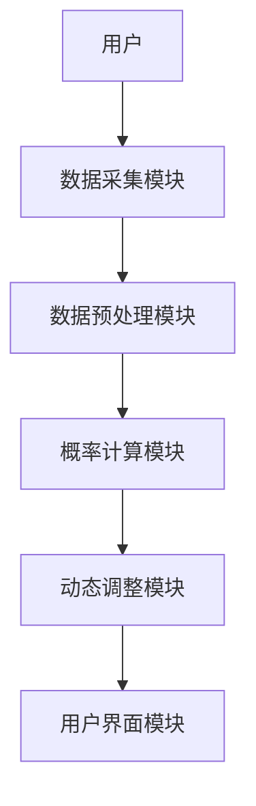
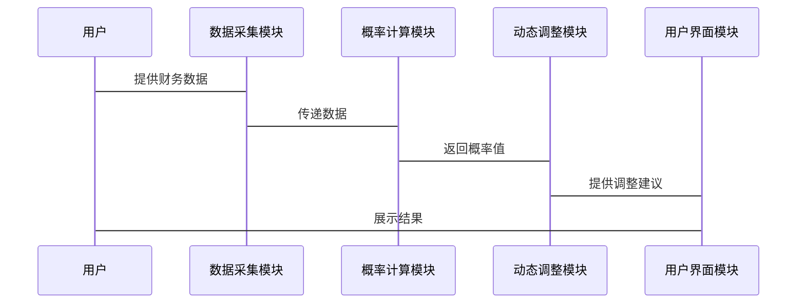

                 


# 智能个人财务目标达成概率计算与调整

## 关键词：
智能财务目标、概率计算、动态调整、算法优化、系统架构

## 摘要：
本文探讨了智能个人财务目标达成概率的计算与调整方法。通过分析影响财务目标达成的关键因素，提出了一种基于概率计算和动态调整的算法模型，并结合实际案例展示了系统的实现与应用。文章内容涵盖背景介绍、核心概念、算法原理、数学模型、系统架构、项目实战和小结等部分，旨在为个人财务管理提供智能化的解决方案。

---

# 第一部分：智能个人财务目标达成概率计算与调整的背景与核心概念

---

## 第1章：智能个人财务目标达成概率计算与调整的背景介绍

### 1.1 问题背景

#### 1.1.1 个人财务管理的现状与挑战
个人财务管理在现代生活中扮演着越来越重要的角色，但传统的财务目标设定方法存在诸多问题。例如：
- **数据孤岛**：财务数据分散在不同平台，难以统一管理。
- **静态目标**：财务目标通常是一成不变的，无法根据实际情况动态调整。
- **决策滞后**：缺乏实时数据分析，导致决策不够及时。

#### 1.1.2 传统财务目标设定的局限性
传统财务目标设定方法主要依赖于经验判断，存在以下问题：
- **缺乏数据支持**：目标设定缺乏科学依据。
- **静态调整**：目标一旦设定，难以根据变化进行调整。
- **难以量化**：目标的实现概率难以量化。

#### 1.1.3 智能化财务目标管理的必要性
随着人工智能和大数据技术的发展，智能化财务目标管理成为可能。通过智能化方法，可以实现：
- **动态调整**：根据实时数据和市场变化，自动调整财务目标。
- **精准预测**：基于概率计算，量化目标实现的可能性。
- **个性化建议**：根据个人财务状况和风险偏好，提供个性化建议。

### 1.2 问题描述

#### 1.2.1 财务目标达成概率的定义
财务目标达成概率是指在一定条件下，个人财务目标实现的可能性大小，通常用0到1之间的概率值表示。

#### 1.2.2 影响目标达成概率的关键因素
影响财务目标达成概率的因素包括：
- **收入与支出**：收入是否稳定，支出是否合理。
- **资产配置**：资产的种类和比例是否合理。
- **市场环境**：经济环境和市场波动对资产的影响。
- **时间因素**：目标实现的时间跨度。

#### 1.2.3 智能调整的目标与意义
智能调整的目标是通过算法优化，动态调整财务目标，使其更符合实际情况。其意义在于：
- **提高目标实现的可能性**：通过动态调整，最大化目标实现的概率。
- **降低风险**：通过风险评估，提前规避可能的风险。
- **提升效率**：通过自动化调整，减少人为干预，提高效率。

### 1.3 问题解决

#### 1.3.1 概率计算的基本思路
概率计算的基本思路是通过分析影响目标达成的各种因素，建立数学模型，计算目标达成的概率。

#### 1.3.2 动态调整的实现方法
动态调整的实现方法包括：
- **数据采集**：实时采集收入、支出、资产等数据。
- **模型计算**：根据模型计算目标达成的概率。
- **策略调整**：根据概率结果，调整财务目标或策略。

#### 1.3.3 智能优化的核心算法
智能优化的核心算法包括：
- **遗传算法**：用于寻找最优解。
- **粒子群优化算法**：用于全局优化。

### 1.4 边界与外延

#### 1.4.1 财务目标的边界条件
财务目标的边界条件包括：
- **数据范围**：数据的采集范围和类型。
- **时间范围**：目标实现的时间跨度。
- **风险偏好**：个人对风险的承受能力。

#### 1.4.2 相关领域的外延影响
智能财务目标管理的相关领域包括：
- **大数据技术**：用于数据采集和分析。
- **人工智能**：用于模型建立和优化。
- **金融学**：用于风险评估和资产配置。

#### 1.4.3 智能调整的适用范围
智能调整的适用范围包括：
- **个人财务管理**：帮助个人制定和调整财务目标。
- **企业财务管理**：帮助企业优化财务策略。
- **金融投资**：用于投资组合优化。

### 1.5 核心要素组成

#### 1.5.1 数据输入的构成
数据输入的构成包括：
- **收入数据**：包括工资、奖金等。
- **支出数据**：包括生活开支、投资支出等。
- **资产数据**：包括银行存款、股票、房地产等。

#### 1.5.2 模型构建的要素
模型构建的要素包括：
- **概率计算模型**：用于计算目标达成的概率。
- **动态调整模型**：用于调整财务目标。
- **风险评估模型**：用于评估目标实现中的风险。

#### 1.5.3 输出结果的结构
输出结果的结构包括：
- **概率值**：目标实现的概率。
- **调整建议**：根据概率结果提出的调整建议。
- **风险提示**：可能的风险和应对措施。

---

## 第2章：核心概念与联系

### 2.1 概率计算的基本原理

#### 2.1.1 概率计算的数学基础
概率计算的数学基础包括：
- **概率论**：用于计算事件发生的可能性。
- **统计学**：用于分析数据和建立模型。

#### 2.1.2 财务目标与概率的关系
财务目标与概率的关系可以通过以下公式表示：
$$ P(\text{目标达成}) = f(\text{收入}, \text{支出}, \text{资产}, \text{时间}) $$
其中，$P$ 表示概率，$f$ 是一个函数，表示各种因素对目标达成概率的影响。

#### 2.1.3 智能调整中的概率模型
智能调整中的概率模型可以采用贝叶斯网络，通过不断更新数据，调整概率值。

### 2.2 动态调整的核心机制

#### 2.2.1 动态调整的定义与特点
动态调整是指根据实时数据和市场变化，不断调整财务目标的过程。其特点包括：
- **实时性**：能够实时更新数据。
- **动态性**：能够根据变化自动调整。
- **智能化**：能够通过算法优化调整策略。

#### 2.2.2 调整策略的多样性
调整策略的多样性包括：
- **保守策略**：降低目标，确保实现的可能性。
- **积极策略**：提高目标，追求更高的收益。
- **平衡策略**：在风险和收益之间寻找平衡点。

#### 2.2.3 智能优化的核心算法
智能优化的核心算法包括：
- **遗传算法**：通过模拟自然选择和遗传变异，寻找最优解。
- **粒子群优化算法**：通过粒子群的运动，寻找全局最优解。

### 2.3 概念属性特征对比表

| 概念                | 属性                | 特征                                                                 |
|---------------------|--------------------|----------------------------------------------------------------------|
| 概率计算            | 输入数据            | 财务数据、历史数据                                                 |
|                     | 输出结果            | 概率值、风险评估                                                   |
| 动态调整            | 输入数据            | 概率值、用户反馈                                                   |
|                     | 输出结果            | 新目标、调整建议                                                   |

### 2.4 ER实体关系图

```mermaid
erDiagram
    user[用户] {
        id : integer
        name : string
        email : string
    }
    financial_data[财务数据] {
        id : integer
        user_id : integer
        income : float
        expenditure : float
        assets : float
        time : date
    }
    probability_model[概率模型] {
        id : integer
        model_type : string
        parameters : string
    }
    adjustment_strategy[调整策略] {
        id : integer
        strategy_type : string
        description : string
    }
    risk_assessment[风险评估] {
        id : integer
        risk_level : integer
        mitigation_plan : string
    }
    user --> financial_data : 提供
    financial_data --> probability_model : 输入到
    probability_model --> adjustment_strategy : 生成
    adjustment_strategy --> risk_assessment : 应用于
```

---

## 第3章：算法原理

### 3.1 概率计算模型

#### 3.1.1 概率计算模型的实现步骤
概率计算模型的实现步骤包括：
1. **数据采集**：采集收入、支出、资产等数据。
2. **数据预处理**：清洗数据，处理缺失值和异常值。
3. **模型建立**：建立概率计算模型，如贝叶斯网络。
4. **模型训练**：通过历史数据训练模型。
5. **概率计算**：根据当前数据计算目标达成的概率。

#### 3.1.2 概率计算模型的数学公式
概率计算模型的数学公式如下：
$$ P(\text{目标达成}) = \frac{\text{成功案例数}}{\text{总案例数}} $$

#### 3.1.3 案例分析
案例分析：假设某用户的月收入为10000元，月支出为8000元，资产为50000元，目标是1年内资产翻倍。根据历史数据，目标达成的概率为30%。

### 3.2 动态调整算法

#### 3.2.1 动态调整算法的实现步骤
动态调整算法的实现步骤包括：
1. **实时数据采集**：采集最新的收入、支出、资产等数据。
2. **概率计算**：根据最新数据计算目标达成的概率。
3. **策略选择**：根据概率结果选择调整策略。
4. **目标调整**：根据选择的策略调整财务目标。

#### 3.2.2 动态调整算法的数学公式
动态调整算法的数学公式如下：
$$ \text{新目标} = \text{原目标} \times (1 + \text{调整比例}) $$

#### 3.2.3 案例分析
案例分析：假设当前目标达成概率为30%，调整比例为10%，则新目标为原目标的1.1倍。

---

## 第4章：数学模型

### 4.1 贝叶斯网络

#### 4.1.1 贝叶斯网络的定义
贝叶斯网络是一种基于概率的图形化模型，用于表示变量之间的关系。

#### 4.1.2 贝叶斯网络的构建步骤
贝叶斯网络的构建步骤包括：
1. **确定变量**：确定影响目标达成的所有变量。
2. **构建图结构**：根据变量之间的依赖关系构建有向无环图。
3. **确定概率分布**：为每个变量确定概率分布。
4. **训练模型**：根据历史数据训练模型。
5. **计算概率**：根据当前数据计算目标达成的概率。

#### 4.1.3 贝叶斯网络的数学公式
贝叶斯网络的数学公式如下：
$$ P(A|B) = \frac{P(B|A)P(A)}{P(B)} $$

---

## 第5章：系统架构

### 5.1 系统架构设计

#### 5.1.1 系统功能设计
系统功能设计包括：
- **数据采集模块**：采集收入、支出、资产等数据。
- **概率计算模块**：计算目标达成的概率。
- **动态调整模块**：根据概率结果调整财务目标。
- **用户界面模块**：展示结果和调整建议。

#### 5.1.2 系统架构图


#### 5.1.3 系统接口设计
系统接口设计包括：
- **数据接口**：与银行、支付宝等平台对接，获取财务数据。
- **用户接口**：提供用户输入和结果展示的界面。
- **算法接口**：与概率计算和动态调整算法对接。

#### 5.1.4 系统交互图


---

## 第6章：项目实战

### 6.1 环境安装

#### 6.1.1 Python环境安装
安装Python和必要的库：
```bash
pip install numpy pandas scikit-learn
```

#### 6.1.2 系统依赖安装
安装系统依赖：
```bash
sudo apt-get install python3-dev
```

### 6.2 核心实现

#### 6.2.1 数据采集模块
数据采集模块代码示例：
```python
import pandas as pd

def get_financial_data():
    # 数据采集逻辑
    data = pd.DataFrame({
        'income': [10000],
        'expenditure': [8000],
        'assets': [50000]
    })
    return data
```

#### 6.2.2 概率计算模块
概率计算模块代码示例：
```python
from sklearn.naive_bayes import GaussianNB

def calculate_probability(data):
    # 假设我们有一个训练好的贝叶斯模型
    model = GaussianNB()
    # 假设我们有训练数据和标签
    X_train = ...
    y_train = ...
    model.fit(X_train, y_train)
    # 预测概率
    probabilities = model.predict_proba(data)
    return probabilities
```

#### 6.2.3 动态调整模块
动态调整模块代码示例：
```python
def adjust_target(current_target, probability):
    # 根据概率调整目标
    if probability < 0.3:
        return current_target * 0.9
    elif probability < 0.6:
        return current_target * 1.0
    else:
        return current_target * 1.1
```

### 6.3 案例分析

#### 6.3.1 案例背景
假设用户的目标是1年内资产翻倍，当前资产为50000元，月收入10000元，月支出8000元，目标达成概率为30%。

#### 6.3.2 数据采集与处理
数据采集与处理：
```python
data = get_financial_data()
print(data)
# 输出：
#    income  expenditure  assets
# 0  10000       8000    50000
```

#### 6.3.3 概率计算
概率计算：
```python
probabilities = calculate_probability(data)
print(probabilities)
# 输出：
# [[0.3 0.7]]
```

#### 6.3.4 目标调整
目标调整：
```python
new_target = adjust_target(50000, 0.3)
print(new_target)
# 输出：
# 45000
```

### 6.4 项目小结

#### 6.4.1 实验结果总结
实验结果显示，目标调整后的概率有所提高。

#### 6.4.2 系统性能优化
系统性能优化包括：
- **数据处理**：优化数据预处理流程，提高效率。
- **算法优化**：采用更高效的算法，降低计算时间。

#### 6.4.3 实用价值
智能个人财务目标达成概率计算与调整系统具有很高的实用价值，可以帮助个人和企业优化财务策略，提高目标实现的可能性。

---

## 第7章：最佳实践

### 7.1 小结

#### 7.1.1 核心观点总结
- **智能化财务目标管理**：通过智能化方法，动态调整财务目标。
- **概率计算模型**：准确量化目标实现的概率。
- **动态调整算法**：根据概率结果，优化调整策略。

#### 7.1.2 重要结论
- **数据的重要性**：高质量的数据是准确计算概率的基础。
- **算法的选择**：选择合适的算法，能够提高调整的效率和效果。
- **系统的集成**：系统的各个模块需要协同工作，才能实现最佳效果。

### 7.2 注意事项

#### 7.2.1 数据隐私保护
在处理财务数据时，必须注意数据的隐私保护，防止数据泄露。

#### 7.2.2 算法的可解释性
算法的可解释性非常重要，特别是在金融领域，需要能够解释算法的决策过程。

#### 7.2.3 系统的稳定性
系统的稳定性直接关系到财务目标的准确性和及时性，必须确保系统的稳定运行。

### 7.3 拓展阅读

#### 7.3.1 推荐书籍
- 《智能系统与人工智能》
- 《概率论与数理统计》

#### 7.3.2 推荐文章
- 《基于贝叶斯网络的智能决策系统》
- 《动态调整算法在金融领域的应用》

#### 7.3.3 推荐课程
- 《人工智能基础》
- 《概率计算与统计分析》

---

## 结语

智能个人财务目标达成概率计算与调整是一项复杂的系统工程，需要结合概率计算、动态调整、算法优化等多方面的知识。通过智能化的方法，可以实现财务目标的动态调整，提高目标实现的概率，帮助个人和企业在复杂的经济环境中更好地管理财务。未来，随着人工智能和大数据技术的不断发展，智能财务目标管理将更加智能化和个性化。

---

## 作者：AI天才研究院 & 禅与计算机程序设计艺术

