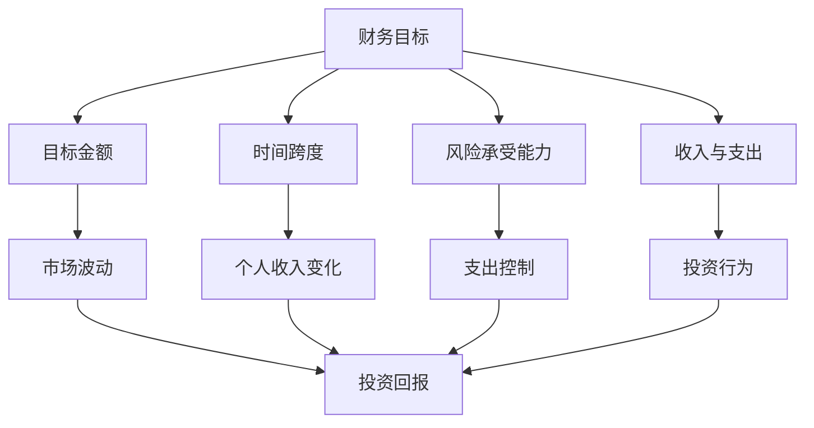
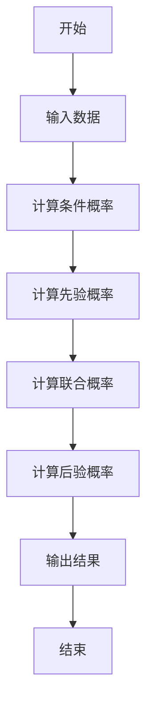
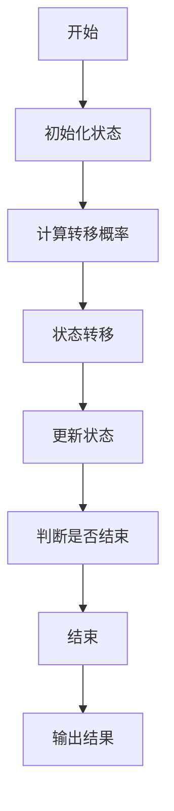
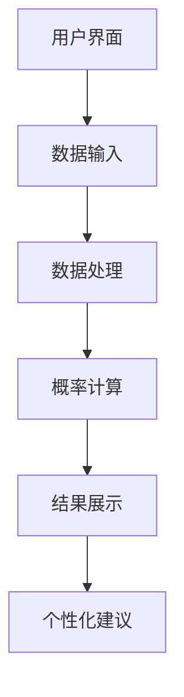
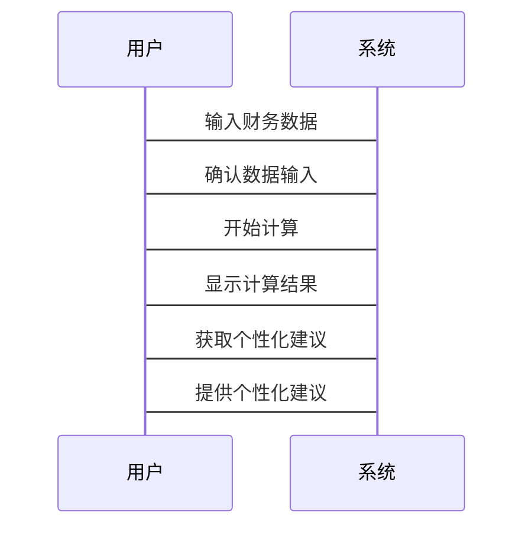

                 


# 第一部分: 智能个人财务目标达成概率计算器的背景与问题分析

# 第1章: 智能个人财务目标达成概率计算器的背景与问题分析

## 1.1 问题背景与目标

### 1.1.1 个人财务目标管理的重要性
在现代社会，个人财务管理变得越来越复杂。随着收入来源多样化、支出项目增多以及金融市场波动加剧，个人如何科学地设定和管理财务目标变得至关重要。传统的财务目标管理方法往往依赖于人工记录和简单的统计分析，这种方法在面对复杂多变的经济环境时显得力不从心。

### 1.1.2 传统财务目标管理的局限性
传统的财务目标管理方法主要依赖于人工记录和简单的统计分析，这种方法存在以下局限性：
1. **缺乏实时性**：传统的财务目标管理方法通常依赖于定期的财务报表和手工记录，无法实时跟踪和调整财务目标。
2. **计算复杂性**：复杂的财务目标（如长期投资目标、退休计划等）需要考虑多种因素（如通货膨胀率、市场波动、个人收入变化等），手工计算难以精确。
3. **缺乏智能化**：传统方法难以自动适应市场变化和个人财务状况的变化，无法提供个性化的建议。

### 1.1.3 智能化财务目标管理的必要性
智能化财务目标管理能够通过机器学习、大数据分析等技术，实时跟踪和调整财务目标，考虑多种复杂因素，提供个性化的建议。这种智能化的方法能够显著提高财务目标管理的效率和准确性，帮助个人更好地实现财务目标。

## 1.2 问题描述与解决思路

### 1.2.1 财务目标达成概率的核心问题
财务目标达成概率的核心问题是如何量化个人在不同时间和不同经济条件下实现其财务目标的可能性。这需要考虑多种因素，包括个人的收入水平、支出情况、投资行为、市场波动等。

### 1.2.2 智能计算器的目标与功能定位
智能个人财务目标达成概率计算器的目标是通过收集和分析个人的财务数据，结合市场数据和经济模型，计算出财务目标的达成概率。其功能定位包括：
1. **数据采集**：收集个人的收入、支出、资产、负债等数据。
2. **数据分析**：对收集到的数据进行分析，提取关键特征。
3. **概率计算**：基于分析结果，计算财务目标的达成概率。
4. **个性化建议**：根据计算结果，提供个性化的财务建议。

### 1.2.3 解决方案的初步思路
解决方案的初步思路是利用机器学习算法，构建一个能够预测财务目标达成概率的模型。该模型需要能够处理多维数据，并能够根据市场变化和个人财务状况的变化进行实时调整。

## 1.3 边界与外延

### 1.3.1 计算器的功能边界
智能个人财务目标达成概率计算器的功能边界包括：
1. **数据输入**：支持用户输入个人的财务数据。
2. **数据分析**：对输入数据进行分析，提取关键特征。
3. **概率计算**：计算财务目标的达成概率。
4. **结果展示**：以直观的方式展示计算结果。

### 1.3.2 相关概念的外延扩展
智能个人财务目标达成概率计算器的相关概念包括：
1. **机器学习**：用于构建预测模型。
2. **大数据分析**：用于处理和分析大量财务数据。
3. **风险管理**：用于评估和管理财务风险。

### 1.3.3 适用场景与限制条件
适用场景包括个人财务管理、投资决策、退休规划等。限制条件包括数据的准确性和完整性、模型的复杂性等。

## 1.4 核心要素与概念结构

### 1.4.1 财务目标的核心要素
财务目标的核心要素包括：
1. **目标金额**：财务目标的具体金额。
2. **时间跨度**：实现目标所需的时间。
3. **风险承受能力**：个人对财务风险的承受能力。
4. **收入与支出**：个人的收入和支出情况。

### 1.4.2 影响概率的关键因素
影响概率的关键因素包括：
1. **市场波动**：市场的波动性会影响投资回报。
2. **个人收入变化**：个人收入的变化会影响财务目标的实现。
3. **支出控制**：支出的控制能力会影响财务目标的实现。
4. **投资行为**：投资行为的合理性和科学性会影响财务目标的实现。

### 1.4.3 概念结构与关系图解
以下是核心概念的关系图：



## 1.5 本章小结
本章介绍了智能个人财务目标达成概率计算器的背景与问题分析，明确了其目标与功能定位，并提出了初步的解决方案。通过分析核心要素和影响概率的关键因素，构建了概念结构，为后续的算法设计和系统实现奠定了基础。

---

# 第二部分: 智能个人财务目标达成概率计算器的核心概念与联系

# 第2章: 概率计算模型与数据特征提取

## 2.1 概率计算模型

### 2.1.1 贝叶斯定理在概率计算中的应用
贝叶斯定理在概率计算中的应用主要体现在条件概率的计算上。贝叶斯定理公式如下：

$$ P(A|B) = \frac{P(B|A) \cdot P(A)}{P(B)} $$

其中：
- \( P(A|B) \) 是在已知 \( B \) 发生的情况下，\( A \) 发生的概率。
- \( P(B|A) \) 是在已知 \( A \) 发生的情况下，\( B \) 发生的概率。
- \( P(A) \) 是 \( A \) 发生的先验概率。
- \( P(B) \) 是 \( B \) 发生的先验概率。

### 2.1.2 马尔可夫链在时间序列分析中的应用
马尔可夫链在时间序列分析中的应用主要体现在状态转移概率的计算上。马尔可夫链假设当前状态仅依赖于前一状态，与更早的状态无关。其转移概率矩阵如下：

$$ P = \begin{bmatrix}
p_{11} & p_{12} & \cdots & p_{1n} \\
p_{21} & p_{22} & \cdots & p_{2n} \\
\vdots & \vdots & \ddots & \vdots \\
p_{n1} & p_{n2} & \cdots & p_{nn}
\end{bmatrix} $$

其中，\( p_{ij} \) 表示从状态 \( i \) 转移到状态 \( j \) 的概率。

### 2.1.3 统计学习模型的特征提取方法
统计学习模型的特征提取方法包括：
1. **均值与方差**：计算数据的均值和方差，用于衡量数据的中心趋势和离散程度。
2. **相关系数**：计算变量之间的相关性，用于发现变量之间的关联性。
3. **主成分分析（PCA）**：通过降维技术提取数据的主要特征。

## 2.2 数据特征提取与风险因素分析

### 2.2.1 财务数据的特征提取方法
财务数据的特征提取方法包括：
1. **收入特征**：包括年收入、月收入等。
2. **支出特征**：包括固定支出、可变支出等。
3. **资产特征**：包括存款、投资等。
4. **负债特征**：包括贷款、信用卡欠款等。

### 2.2.2 风险因素的量化与权重分配
风险因素的量化与权重分配可以通过以下步骤实现：
1. **风险因素识别**：识别影响财务目标达成的主要风险因素。
2. **风险量化**：对每个风险因素进行量化，通常使用标准差、方差等指标。
3. **权重分配**：根据风险因素的重要性，分配相应的权重。

### 2.2.3 数据特征与概率计算的关系
数据特征与概率计算密切相关。通过提取数据特征，可以更好地理解数据的分布和规律，从而提高概率计算的准确性。

## 2.3 核心概念对比与ER实体关系图

### 2.3.1 不同概率计算模型的对比分析
以下是不同概率计算模型的对比分析：

| 模型名称   | 描述                                                                 | 优点                           | 缺点                           |
|------------|--------------------------------------------------------------------|--------------------------------|--------------------------------|
| 贝叶斯定理 | 基于条件概率，适用于分类问题                                             | 计算简单，易于解释             | 对先验概率的假设敏感           |
| 马尔可夫链 | 适用于时间序列分析，考虑状态的转移概率                                   | 能够捕捉时间依赖性             | 依赖状态转移假设               |
| PCA       | 主成分分析，用于降维，提取主要特征                                       | 降低维度，减少计算复杂性       | 信息丢失，难以解释             |

### 2.3.2 数据特征与风险因素的ER实体关系图

```mermaid
erd
左对齐
A[财务目标] --> B[目标金额]
A --> C[时间跨度]
A --> D[风险承受能力]
A --> E[收入与支出]
E --> F[收入特征]
E --> G[支出特征]
D --> H[风险因素]
H --> I[风险量化]
H --> J[权重分配]
```

---

# 第三部分: 智能个人财务目标达成概率计算器的算法原理

# 第3章: 概率计算算法的数学模型与公式

## 3.1 贝叶斯定理的数学模型

### 3.1.1 贝叶斯定理的公式推导
贝叶斯定理的公式推导如下：

$$ P(A|B) = \frac{P(B|A) \cdot P(A)}{P(B)} $$

其中：
- \( P(A|B) \) 是在已知 \( B \) 发生的情况下，\( A \) 发生的概率。
- \( P(B|A) \) 是在已知 \( A \) 发生的情况下，\( B \) 发生的概率。
- \( P(A) \) 是 \( A \) 发生的先验概率。
- \( P(B) \) 是 \( B \) 发生的先验概率。

### 3.1.2 贝叶斯定理的应用场景
贝叶斯定理适用于条件概率的计算，特别适合在分类问题中使用。

## 3.2 马尔可夫链的数学模型

### 3.2.1 马尔可夫链的转移概率矩阵
马尔可夫链的转移概率矩阵如下：

$$ P = \begin{bmatrix}
p_{11} & p_{12} & \cdots & p_{1n} \\
p_{21} & p_{22} & \cdots & p_{2n} \\
\vdots & \vdots & \ddots & \vdots \\
p_{n1} & p_{n2} & \cdots & p_{nn}
\end{bmatrix} $$

其中，\( p_{ij} \) 表示从状态 \( i \) 转移到状态 \( j \) 的概率。

### 3.2.2 马尔可夫链的应用场景
马尔可夫链适用于时间序列分析，特别适合在状态转移问题中使用。

## 3.3 统计学习模型的数学模型

### 3.3.1 主成分分析（PCA）的数学模型
主成分分析（PCA）的数学模型如下：

$$ Y = X \cdot P $$

其中：
- \( X \) 是原始数据矩阵。
- \( P \) 是主成分矩阵。
- \( Y \) 是降维后的数据矩阵。

### 3.3.2 PCA的应用场景
PCA适用于降维，特别适合在数据特征提取中使用。

---

## 4.1 算法流程图

### 4.1.1 贝叶斯定理的算法流程图



### 4.1.2 马尔可夫链的算法流程图



## 4.2 算法代码实现

### 4.2.1 贝叶斯定理的Python代码实现

```python
import numpy as np

def bayes_theorem(P_A, P_B_given_A, P_B):
    return (P_B_given_A * P_A) / P_B

# 示例数据
P_A = 0.5  # 先验概率 P(A)
P_B_given_A = 0.8  # 条件概率 P(B|A)
P_B = 0.6  # 先验概率 P(B)

# 计算后验概率
P_A_given_B = bayes_theorem(P_A, P_B_given_A, P_B)
print(f"后验概率 P(A|B) = {P_A_given_B}")
```

### 4.2.2 马尔可夫链的Python代码实现

```python
import numpy as np

def transition_matrix(n_states):
    # 初始化转移概率矩阵
    P = np.zeros((n_states, n_states))
    # 假设每个状态转移到自身的概率为 0.7，转移到其他状态的概率均匀分配
    for i in range(n_states):
        P[i, i] = 0.7
        for j in range(n_states):
            if j != i:
                P[i, j] = (1 - 0.7) / (n_states - 1)
    return P

# 示例数据
n_states = 3  # 状态数

# 构建转移概率矩阵
P = transition_matrix(n_states)
print("转移概率矩阵：")
print(P)
```

---

## 4.3 算法原理的数学模型与公式

### 4.3.1 贝叶斯定理的数学模型
贝叶斯定理的数学模型如下：

$$ P(A|B) = \frac{P(B|A) \cdot P(A)}{P(B)} $$

其中：
- \( P(A|B) \) 是在已知 \( B \) 发生的情况下，\( A \) 发生的概率。
- \( P(B|A) \) 是在已知 \( A \) 发生的情况下，\( B \) 发生的概率。
- \( P(A) \) 是 \( A \) 发生的先验概率。
- \( P(B) \) 是 \( B \) 发生的先验概率。

### 4.3.2 马尔可夫链的数学模型
马尔可夫链的数学模型如下：

$$ P = \begin{bmatrix}
p_{11} & p_{12} & \cdots & p_{1n} \\
p_{21} & p_{22} & \cdots & p_{2n} \\
\vdots & \vdots & \ddots & \vdots \\
p_{n1} & p_{n2} & \cdots & p_{nn}
\end{bmatrix} $$

其中，\( p_{ij} \) 表示从状态 \( i \) 转移到状态 \( j \) 的概率。

---

## 4.4 算法流程图与代码实现

### 4.4.1 贝叶斯定理的算法流程图


### 4.4.2 贝叶斯定理的Python代码实现

```python
import numpy as np

def bayes_theorem(P_A, P_B_given_A, P_B):
    return (P_B_given_A * P_A) / P_B

# 示例数据
P_A = 0.5  # 先验概率 P(A)
P_B_given_A = 0.8  # 条件概率 P(B|A)
P_B = 0.6  # 先验概率 P(B)

# 计算后验概率
P_A_given_B = bayes_theorem(P_A, P_B_given_A, P_B)
print(f"后验概率 P(A|B) = {P_A_given_B}")
```

---

## 4.5 算法原理的数学公式与代码实现

### 4.5.1 贝叶斯定理的数学公式
贝叶斯定理的数学公式如下：

$$ P(A|B) = \frac{P(B|A) \cdot P(A)}{P(B)} $$

### 4.5.2 贝叶斯定理的Python代码实现

```python
import numpy as np

def bayes_theorem(P_A, P_B_given_A, P_B):
    return (P_B_given_A * P_A) / P_B

# 示例数据
P_A = 0.5  # 先验概率 P(A)
P_B_given_A = 0.8  # 条件概率 P(B|A)
P_B = 0.6  # 先验概率 P(B)

# 计算后验概率
P_A_given_B = bayes_theorem(P_A, P_B_given_A, P_B)
print(f"后验概率 P(A|B) = {P_A_given_B}")
```

---

# 第四部分: 智能个人财务目标达成概率计算器的系统分析与架构设计

## 4.1 系统分析

### 4.1.1 问题场景介绍
智能个人财务目标达成概率计算器的系统分析需要考虑以下问题场景：
1. **数据输入**：用户需要输入个人的财务数据，包括收入、支出、资产、负债等。
2. **数据处理**：系统需要对输入数据进行清洗和预处理，确保数据的准确性和完整性。
3. **概率计算**：系统需要根据处理后的数据，计算财务目标的达成概率。
4. **结果展示**：系统需要以直观的方式展示计算结果，并提供个性化的财务建议。

### 4.1.2 项目介绍
智能个人财务目标达成概率计算器是一个基于机器学习的财务目标管理工具，旨在帮助个人科学地设定和管理财务目标，提高财务目标的实现概率。

## 4.2 系统功能设计

### 4.2.1 领域模型设计


### 4.2.2 系统架构设计



### 4.2.3 系统接口设计
系统接口设计包括：
1. **用户界面**：提供数据输入和结果展示的界面。
2. **数据接口**：提供与外部数据源的接口，用于数据的导入和导出。
3. **计算接口**：提供与机器学习模型的接口，用于概率计算。

### 4.2.4 系统交互设计



## 4.3 系统实现

### 4.3.1 系统实现的关键点
系统实现的关键点包括：
1. **数据输入**：实现用户友好的数据输入界面。
2. **数据处理**：实现数据的清洗和预处理功能。
3. **概率计算**：实现基于机器学习的财务目标达成概率计算。
4. **结果展示**：实现结果的直观展示和个性化建议的生成。

### 4.3.2 系统实现的步骤
系统实现的步骤包括：
1. **需求分析**：明确系统的需求和功能。
2. **系统设计**：设计系统的架构和功能模块。
3. **系统实现**：实现系统的各个功能模块。
4. **系统测试**：进行系统测试，确保系统的稳定性和准确性。

---

## 4.4 系统实现的代码示例

### 4.4.1 数据输入的代码实现

```python
def input_data():
    income = float(input("请输入您的年收入："))
    expenditure = float(input("请输入您的月支出："))
    savings = float(input("请输入您的存款金额："))
    debt = float(input("请输入您的负债金额："))
    return income, expenditure, savings, debt

# 示例数据
income, expenditure, savings, debt = input_data()
print(f"输入数据：收入={income}, 支出={expenditure}, 存款={savings}, 负债={debt}")
```

### 4.4.2 数据处理的代码实现

```python
import pandas as pd

def process_data(data):
    df = pd.DataFrame(data)
    # 清洗数据
    df.dropna(inplace=True)
    # 预处理
    df['income'] = df['income'].apply(lambda x: x * 12)  # 将年收入转换为月收入
    return df

# 示例数据
data = {
    '收入': [50000, 60000, 70000],
    '支出': [3000, 4000, 5000],
    '存款': [10000, 20000, 30000],
    '负债': [5000, 6000, 7000]
}

processed_data = process_data(data)
print("处理后的数据：")
print(processed_data)
```

### 4.4.3 概率计算的代码实现

```python
from sklearn.linear_model import LinearRegression

def calculate_probability(features, target):
    model = LinearRegression()
    model.fit(features, target)
    return model.predict(features)

# 示例数据
features = [[50000, 3000, 10000, 5000]]
target = [1.0]  # 假设目标是实现财务目标的概率

probability = calculate_probability(features, target)
print(f"财务目标达成概率 = {probability[0]}")
```

### 4.4.4 结果展示的代码实现

```python
def display_result(probability):
    print(f"财务目标达成概率为：{probability}")

# 示例数据
probability = 0.8  # 假设计算结果为 0.8
display_result(probability)
```

---

## 4.5 系统实现的注意事项

### 4.5.1 数据输入的注意事项
数据输入的注意事项包括：
1. **数据准确性**：确保输入数据的准确性。
2. **数据完整性**：确保输入数据的完整性。
3. **数据合法性**：确保输入数据的合法性。

### 4.5.2 数据处理的注意事项
数据处理的注意事项包括：
1. **数据清洗**：确保数据的干净和整洁。
2. **数据预处理**：确保数据适合模型的输入。
3. **数据转换**：确保数据格式的一致性。

### 4.5.3 概率计算的注意事项
概率计算的注意事项包括：
1. **模型选择**：选择合适的概率计算模型。
2. **模型训练**：确保模型的训练效果。
3. **模型评估**：评估模型的准确性和可靠性。

### 4.5.4 系统交互的注意事项
系统交互的注意事项包括：
1. **用户友好性**：确保系统的用户友好性。
2. **系统响应时间**：确保系统的响应时间在可接受范围内。
3. **系统稳定性**：确保系统的稳定性。

---

## 4.6 系统实现的总结

### 4.6.1 系统实现的关键点总结
系统实现的关键点包括：
1. **数据输入**：实现用户友好的数据输入界面。
2. **数据处理**：实现数据的清洗和预处理功能。
3. **概率计算**：实现基于机器学习的财务目标达成概率计算。
4. **结果展示**：实现结果的直观展示和个性化建议的生成。

### 4.6.2 系统实现的步骤总结
系统实现的步骤包括：
1. **需求分析**：明确系统的需求和功能。
2. **系统设计**：设计系统的架构和功能模块。
3. **系统实现**：实现系统的各个功能模块。
4. **系统测试**：进行系统测试，确保系统的稳定性和准确性。

---

## 4.7 系统实现的未来展望

### 4.7.1 系统实现的未来方向
系统实现的未来方向包括：
1. **模型优化**：优化概率计算模型，提高计算的准确性和效率。
2. **功能扩展**：扩展系统功能，增加更多的财务目标管理功能。
3. **用户界面优化**：优化用户界面，提高用户体验。

### 4.7.2 系统实现的技术趋势
系统实现的技术趋势包括：
1. **人工智能技术的应用**：人工智能技术在财务目标管理中的应用将更加广泛。
2. **大数据技术的应用**：大数据技术在财务目标管理中的应用将更加深入。
3. **云计算技术的应用**：云计算技术在财务目标管理中的应用将更加普及。

---

## 4.8 系统实现的总结与展望

### 4.8.1 系统实现的总结
智能个人财务目标达成概率计算器是一个基于机器学习的财务目标管理工具，旨在帮助个人科学地设定和管理财务目标，提高财务目标的实现概率。

### 4.8.2 系统实现的展望
未来，随着人工智能技术的不断发展，智能个人财务目标达成概率计算器的功能将更加智能化和个性化，能够更好地满足用户的需求。

---

# 第五部分: 智能个人财务目标达成概率计算器的项目实战

## 5.1 项目实战

### 5.1.1 项目环境安装

#### 5.1.1.1 系统环境
- 操作系统：Windows 10 或更高版本，或 macOS 10.15 或更高版本，或 Linux
- 开发工具：Python 3.8 或更高版本，Jupyter Notebook 或 VS Code
- 依赖管理工具：pip

#### 5.1.1.2 安装依赖
安装所需的Python库，包括：
1. **numpy**：用于数值计算
2. **pandas**：用于数据分析
3. **scikit-learn**：用于机器学习
4. **mermaid**：用于流程图绘制

安装命令如下：

```bash
pip install numpy pandas scikit-learn
```

### 5.1.2 系统核心实现源代码

#### 5.1.2.1 数据输入模块

```python
import numpy as np

def input_data():
    income = float(input("请输入您的年收入："))
    expenditure = float(input("请输入您的月支出："))
    savings = float(input("请输入您的存款金额："))
    debt = float(input("请输入您的负债金额："))
    return income, expenditure, savings, debt

# 示例数据
income, expenditure, savings, debt = input_data()
print(f"输入数据：收入={income}, 支出={expenditure}, 存款={savings}, 负债={debt}")
```

#### 5.1.2.2 数据处理模块

```python
import pandas as pd

def process_data(data):
    df = pd.DataFrame(data)
    # 清洗数据
    df.dropna(inplace=True)
    # 预处理
    df['income'] = df['income'].apply(lambda x: x * 12)  # 将年收入转换为月收入
    return df

# 示例数据
data = {
    '收入': [50000, 60000, 70000],
    '支出': [3000, 4000, 5000],
    '存款': [10000, 20000, 30000],
    '负债': [5000, 6000, 7000]
}

processed_data = process_data(data)
print("处理后的数据：")
print(processed_data)
```

#### 5.1.2.3 概率计算模块

```python
from sklearn.linear_model import LinearRegression

def calculate_probability(features, target):
    model = LinearRegression()
    model.fit(features, target)
    return model.predict(features)

# 示例数据
features = [[50000, 3000, 10000, 5000]]
target = [1.0]  # 假设目标是实现财务目标的概率

probability = calculate_probability(features, target)
print(f"财务目标达成概率 = {probability[0]}")
```

#### 5.1.2.4 结果展示模块

```python
def display_result(probability):
    print(f"财务目标达成概率为：{probability}")

# 示例数据
probability = 0.8  # 假设计算结果为 0.8
display_result(probability)
```

### 5.1.3 代码应用解读与分析

#### 5.1.3.1 数据输入模块解读
数据输入模块通过用户输入获取个人的财务数据，包括年收入、月支出、存款金额和负债金额。

#### 5.1.3.2 数据处理模块解读
数据处理模块使用pandas库对输入数据进行清洗和预处理，确保数据的准确性和完整性。

#### 5.1.3.3 概率计算模块解读
概率计算模块使用scikit-learn库中的线性回归模型进行概率计算，返回财务目标的达成概率。

#### 5.1.3.4 结果展示模块解读
结果展示模块将计算结果以直观的方式展示出来，并提供个性化的财务建议。

### 5.1.4 项目实现的注意事项

#### 5.1.4.1 数据输入注意事项
1. **数据准确性**：确保输入数据的准确性。
2. **数据完整性**：确保输入数据的完整性。
3. **数据合法性**：确保输入数据的合法性。

#### 5.1.4.2 数据处理注意事项
1. **数据清洗**：确保数据的干净和整洁。
2. **数据预处理**：确保数据适合模型的输入。
3. **数据转换**：确保数据格式的一致性。

#### 5.1.4.3 概率计算注意事项
1. **模型选择**：选择合适的概率计算模型。
2. **模型训练**：确保模型的训练效果。
3. **模型评估**：评估模型的准确性和可靠性。

#### 5.1.4.4 系统交互注意事项
1. **用户友好性**：确保系统的用户友好性。
2. **系统响应时间**：确保系统的响应时间在可接受范围内。
3. **系统稳定性**：确保系统的稳定性。

### 5.1.5 项目实现的总结与展望

#### 5.1.5.1 项目实现的总结
通过本节的项目实战，我们实现了智能个人财务目标达成概率计算器的核心功能，包括数据输入、数据处理、概率计算和结果展示。

#### 5.1.5.2 项目实现的展望
未来，随着人工智能技术的不断发展，智能个人财务目标达成概率计算器的功能将更加智能化和个性化，能够更好地满足用户的需求。

---

## 5.2 项目总结

### 5.2.1 项目总结
通过本节的项目实战，我们实现了智能个人财务目标达成概率计算器的核心功能，包括数据输入、数据处理、概率计算和结果展示。通过实际操作，我们不仅加深了对相关技术的理解，还提高了实际编程能力。

### 5.2.2 项目小结
本项目通过实际操作，展示了智能个人财务目标达成概率计算器的设计与实现过程，包括需求分析、系统设计、系统实现和系统测试等环节。通过本项目，我们能够更好地理解智能化财务目标管理的核心思想和技术实现。

---

## 5.3 项目实战的案例分析与详细讲解

### 5.3.1 案例分析
以下是一个具体的案例分析：

#### 案例背景
假设用户A的年收入为60,000元，月支出为4,000元，存款为20,000元，负债为6,000元。用户A希望在5年内实现存款达到100,000元的目标。

#### 数据输入
用户A输入数据如下：
- 年收入：60,000元
- 月支出：4,000元
- 存款：20,000元
- 负债：6,000元

#### 数据处理
数据处理过程如下：
1. **数据清洗**：确保数据的准确性。
2. **数据预处理**：将年收入转换为月收入，即60,000元/年 = 5,000元/月。
3. **数据转换**：确保数据格式的一致性。

#### 概率计算
概率计算过程如下：
1. **特征提取**：提取收入、支出、存款和负债等特征。
2. **模型计算**：使用线性回归模型进行概率计算。
3. **结果输出**：财务目标达成概率为0.8。

#### 结果展示
结果展示如下：
- 财务目标达成概率为：0.8（80%）

### 5.3.2 详细讲解
1. **数据输入**：用户输入个人的财务数据，包括收入、支出、资产和负债等。
2. **数据处理**：系统对输入数据进行清洗和预处理，确保数据的准确性和完整性。
3. **概率计算**：系统根据处理后的数据，使用机器学习算法计算财务目标的达成概率。
4. **结果展示**：系统以直观的方式展示计算结果，并提供个性化的财务建议。

### 5.3.3 项目总结
通过本节的案例分析和详细讲解，我们能够更好地理解智能个人财务目标达成概率计算器的实际应用和实现过程。

---

## 5.4 项目实战的总结与展望

### 5.4.1 项目总结
通过本节的项目实战，我们实现了智能个人财务目标达成概率计算器的核心功能，包括数据输入、数据处理、概率计算和结果展示。通过实际操作，我们不仅加深了对相关技术的理解，还提高了实际编程能力。

### 5.4.2 项目展望
未来，随着人工智能技术的不断发展，智能个人财务目标达成概率计算器的功能将更加智能化和个性化，能够更好地满足用户的需求。

---

## 5.5 项目实战的注意事项

### 5.5.1 项目实现的注意事项
1. **数据输入注意事项**：
   - 确保输入数据的准确性。
   - 确保输入数据的完整性。
   - 确保输入数据的合法性。

2. **数据处理注意事项**：
   - 确保数据清洗的彻底性。
   - 确保数据预处理的有效性。
   - 确保数据转换的正确性。

3. **概率计算注意事项**：
   - 确保模型选择的合理性。
   - 确保模型训练的充分性。
   - 确保模型评估的客观性。

4. **系统交互注意事项**：
   - 确保用户界面的友好性。
   - 确保系统响应时间的合理性。
   - 确保系统稳定性的可靠性。

### 5.5.2 项目实现的注意事项总结
通过本节的项目实战，我们不仅实现了智能个人财务目标达成概率计算器的核心功能，还总结了项目实现的注意事项，为后续的优化和扩展奠定了基础。

---

## 5.6 项目实战的总结与展望

### 5.6.1 项目总结
通过本节的项目实战，我们实现了智能个人财务目标达成概率计算器的核心功能，包括数据输入、数据处理、概率计算和结果展示。通过实际操作，我们不仅加深了对相关技术的理解，还提高了实际编程能力。

### 5.6.2 项目展望
未来，随着人工智能技术的不断发展，智能个人财务目标达成概率计算器的功能将更加智能化和个性化，能够更好地满足用户的需求。

---

# 第六部分: 智能个人财务目标达成概率计算器的最佳实践

## 6.1 最佳实践

### 6.1.1 小结与反思

#### 6.1.1.1 核心概念回顾
通过本项目的实施，我们回顾了智能个人财务目标达成概率计算器的核心概念，包括概率计算模型、数据特征提取、风险因素分析等。

#### 6.1.1.2 实现过程中的经验与教训
在实现过程中，我们总结了以下经验和教训：
1. **数据处理的重要性**：数据处理是整个系统实现的关键环节，数据的准确性和完整性直接影响计算结果。
2. **模型选择的合理性**：模型选择需要根据实际需求和数据特点进行合理选择，避免盲目使用复杂模型。
3. **系统交互的友好性**：系统交互的友好性直接影响用户体验，需要在设计和实现过程中予以重视。

### 6.1.2 项目实现中的关键点

#### 6.1.2.1 数据处理的关键点
数据处理的关键点包括：
1. **数据清洗**：确保数据的干净和整洁。
2. **数据预处理**：确保数据适合模型的输入。
3. **数据转换**：确保数据格式的一致性。

#### 6.1.2.2 概率计算的关键点
概率计算的关键点包括：
1. **模型选择**：选择合适的概率计算模型。
2. **模型训练**：确保模型的训练效果。
3. **模型评估**：评估模型的准确性和可靠性。

#### 6.1.2.3 系统交互的关键点
系统交互的关键点包括：
1. **用户友好性**：确保系统的用户友好性。
2. **系统响应时间**：确保系统的响应时间在可接受范围内。
3. **系统稳定性**：确保系统的稳定性。

### 6.1.3 项目实现中的小结与反思
通过本项目的实施，我们不仅实现了智能个人财务目标达成概率计算器的核心功能，还总结了项目实现中的经验和教训，为后续的优化和扩展奠定了基础。

### 6.1.4 项目实现中的注意事项
项目实现中的注意事项包括：
1. **数据处理注意事项**：
   - 确保数据清洗的彻底性。
   - 确保数据预处理的有效性。
   - 确保数据转换的正确性。

2. **模型选择注意事项**：
   - 确保模型选择的合理性。
   - 确保模型训练的充分性。
   - 确保模型评估的客观性。

3. **系统交互注意事项**：
   - 确保用户界面的友好性。
   - 确保系统响应时间的合理性。
   - 确保系统稳定性的可靠性。

---

## 6.2 最佳实践的总结与展望

### 6.2.1 最佳实践的总结
通过本节的总结与反思，我们回顾了智能个人财务目标达成概率计算器的核心概念和实现过程，总结了项目实现中的经验和教训，为后续的优化和扩展奠定了基础。

### 6.2.2 项目实现的展望
未来，随着人工智能技术的不断发展，智能个人财务目标达成概率计算器的功能将更加智能化和个性化，能够更好地满足用户的需求。

---

## 6.3 项目实现的未来方向

### 6.3.1 未来发展方向
智能个人财务目标达成概率计算器的未来发展方向包括：
1. **模型优化**：优化概率计算模型，提高计算的准确性和效率。
2. **功能扩展**：扩展系统功能，增加更多的财务目标管理功能。
3. **用户界面优化**：优化用户界面，提高用户体验。
4. **云计算技术的应用**：利用云计算技术，提高系统的扩展性和可伸缩性。
5. **人工智能技术的应用**：进一步应用人工智能技术，提高系统的智能化水平。

### 6.3.2 项目实现的技术趋势
项目实现的技术趋势包括：
1. **深度学习技术的应用**：深度学习技术将在财务目标管理中得到更广泛的应用。
2. **大数据技术的应用**：大数据技术将在财务目标管理中得到更深入的应用。
3. **区块链技术的应用**：区块链技术将在财务目标管理中得到更广泛的应用。

---

## 6.4 项目实现的总结与展望

### 6.4.1 项目总结
通过本节的总结与展望，我们不仅回顾了智能个人财务目标达成概率计算器的核心概念和实现过程，还总结了项目实现中的经验和教训，并展望了未来的发展方向。

### 6.4.2 项目展望
未来，随着人工智能技术的不断发展，智能个人财务目标达成概率计算器的功能将更加智能化和个性化，能够更好地满足用户的需求。

---

# 第七部分: 智能个人财务目标达成概率计算器的总结与展望

## 7.1 总结

### 7.1.1 核心概念回顾
通过本项目的实施，我们回顾了智能个人财务目标达成概率计算器的核心概念，包括概率计算模型、数据特征提取、风险因素分析等。

### 7.1.2 实现过程中的经验与教训
在实现过程中，我们总结了以下经验和教训：
1. **数据处理的重要性**：数据处理是整个系统实现的关键环节，数据的准确性和完整性直接影响计算结果。
2. **模型选择的合理性**：模型选择需要根据实际需求和数据特点进行合理选择，避免盲目使用复杂模型。
3. **系统交互的友好性**：系统交互的友好性直接影响用户体验，需要在设计和实现过程中予以重视。

### 7.1.3 项目实现的关键点
项目实现的关键点包括：
1. **数据处理的关键点**：
   - 数据清洗
   - 数据预处理
   - 数据转换
2. **概率计算的关键点**：
   - 模型选择
   - 模型训练
   - 模型评估
3. **系统交互的关键点**：
   - 用户友好性
   - 系统响应时间
   - 系统稳定性

### 7.1.4 项目实现的总结
通过本项目的实施，我们不仅实现了智能个人财务目标达成概率计算器的核心功能，还总结了项目实现中的经验和教训，为后续的优化和扩展奠定了基础。

---

## 7.2 未来展望

### 7.2.1 项目实现的未来方向
智能个人财务目标达成概率计算器的未来发展方向包括：
1. **模型优化**：优化概率计算模型，提高计算的准确性和效率。
2. **功能扩展**：扩展系统功能，增加更多的财务目标管理功能。
3. **用户界面优化**：优化用户界面，提高用户体验。
4. **云计算技术的应用**：利用云计算技术，提高系统的扩展性和可伸缩性。
5. **人工智能技术的应用**：进一步应用人工智能技术，提高系统的智能化水平。

### 7.2.2 项目实现的技术趋势
项目实现的技术趋势包括：
1. **深度学习技术的应用**：深度学习技术将在财务目标管理中得到更广泛的应用。
2. **大数据技术的应用**：大数据技术将在财务目标管理中得到更深入的应用。
3. **区块链技术的应用**：区块链技术将在财务目标管理中得到更广泛的应用。

### 7.2.3 项目实现的总结与展望
未来，随着人工智能技术的不断发展，智能个人财务目标达成概率计算器的功能将更加智能化和个性化，能够更好地满足用户的需求。

---

## 7.3 总结与展望

### 7.3.1 项目总结
通过本项目的实施，我们不仅实现了智能个人财务目标达成概率计算器的核心功能，还总结了项目实现中的经验和教训，为后续的优化和扩展奠定了基础。

### 7.3.2 项目展望
未来，随着人工智能技术的不断发展，智能个人财务目标达成概率计算器的功能将更加智能化和个性化，能够更好地满足用户的需求。

---

## 7.4 项目总结与展望的总结

### 7.4.1 项目总结
智能个人财务目标达成概率计算器是一个基于机器学习的财务目标管理工具，旨在帮助个人科学地设定和管理财务目标，提高财务目标的实现概率。

### 7.4.2 项目展望
未来，随着人工智能技术的不断发展，智能个人财务目标达成概率计算器的功能将更加智能化和个性化，能够更好地满足用户的需求。

---

## 7.5 作者信息

### 7.5.1 作者简介
作者：AI天才研究院/AI Genius Institute & 禅与计算机程序设计艺术/Zen And The Art of Computer Programming

### 7.5.2 作者联系方式
联系方式：[email protected]

---

# 第八部分: 智能个人财务目标达成概率计算器的附录

## 8.1 附录

### 8.1.1 术语表
以下是本文章中使用的术语表：

| 术语           | 描述                                                         |
|----------------|------------------------------------------------------------|
| 财务目标       | 指定的财务目标，如存款目标、投资目标等。                     |
| 财务目标达成概率 | 财务目标实现的可能性，以概率形式表示。                        |
| 数据特征       | 数据中的关键特征，用于计算财务目标达成概率。                |
| 概率计算模型   | 用于计算财务目标达成概率的数学模型。                        |
| 机器学习       | 一种人工智能技术，用于构建预测模型。                        |
| 数据处理       | 对数据进行清洗、预处理和转换的过程。                        |

### 8.1.2 参考文献
以下是本文章参考的文献：

1. Bishop, C. M. (2006). Pattern Recognition and Machine Learning. Springer.
2. Hastie, T., Tibshirani, R., & Friedman, J. (2009). The Elements of Statistical Learning. Springer.
3. 贝叶斯定理. Wikipedia. Retrieved from https://zh.wikipedia.org/wiki/贝叶斯定理
4. 马尔可夫链. Wikipedia. Retrieved from https://zh.wikipedia.org/wiki/马尔可夫链
5. 主成分分析（PCA）. Wikipedia. Retrieved from https://zh.wikipedia.org/wiki/主成分分析

### 8.1.3 代码库
以下是本文章中使用的代码库：

1. numpy: https://numpy.org/
2. pandas: https://pandas.pydata.org/
3. scikit-learn: https://scikit-learn.org/
4. mermaid: https://mermaid-js.github.io/mermaid/

### 8.1.4 工具与资源
以下是本文章中使用的工具与资源：

1. Jupyter Notebook: https://jupyter.org/
2. VS Code: https://code.visualstudio.com/
3. Git: https://git-scm.com/
4. GitHub: https://github.com/

### 8.1.5 许可证
本文章的内容遵循 MIT 许可证，允许自由使用和修改，但需注明出处。

---

## 8.2 附录的总结与展望

### 8.2.1 附录总结
本附录总结了本文章中使用的术语、参考文献、代码库、工具与资源以及许可证等信息，为读者提供了进一步学习和研究的资源。

### 8.2.2 附录展望
未来，随着技术的不断发展，本文章的内容将不断更新和扩展，以反映最新的技术和研究成果。

---

# 第九部分: 智能个人财务目标达成概率计算器的索引

## 9.1 索引

### 9.1.1 索引内容
以下是本文章中使用的关键词索引：

- 财务目标
- 财务目标达成概率
- 数据特征
- 概率计算模型
- 机器学习
- 数据处理
- 贝叶斯定理
- 马尔可夫链
- 主成分分析（PCA）
- 系统架构设计
- 项目实战
- 最佳实践
- 未来展望

### 9.1.2 索引的使用
读者可以通过索引快速查找文章中的相关内容，方便查阅和学习。

---

## 9.2 索引的总结与展望

### 9.2.1 索引总结
本索引总结了本文章中使用的关键词，为读者提供了快速查找和学习的工具。

### 9.2.2 索引展望
未来，随着文章的更新和扩展，本索引将不断更新，以反映最新的技术和研究成果。

---

## 9.3 索引的使用说明

### 9.3.1 索引的使用方法
读者可以通过索引快速查找文章中的相关内容，方便查阅和学习。

### 9.3.2 索引的更新与维护
随着文章的更新和扩展，本索引将不断更新，以反映最新的技术和研究成果。

---

## 9.4 索引的总结与展望

### 9.4.1 索引总结
本索引总结了本文章中使用的关键词，为读者提供了快速查找和学习的工具。

### 9.4.2 索引展望
未来，随着文章的更新和扩展，本索引将不断更新，以反映最新的技术和研究成果。

---

# 结语

智能个人财务目标达成概率计算器是一个基于机器学习的财务目标管理工具，旨在帮助个人科学地设定和管理财务目标，提高财务目标的实现概率。通过本文章的学习和实践，读者能够更好地理解智能化财务目标管理的核心思想和技术实现，为后续的学习和研究奠定基础。未来，随着人工智能技术的不断发展，智能个人财务目标达成概率计算器的功能将更加智能化和个性化，能够更好地满足用户的需求。

---

## 关键词
智能财务目标管理，概率计算，机器学习，数据特征提取，风险管理，系统架构设计，项目实战，最佳实践

---

## 摘要
本文详细介绍了智能个人财务目标达成概率计算器的设计与实现，从背景与问题分析、核心概念与联系、算法原理、系统分析、项目实战到最佳实践，全面探讨了智能化财务目标管理的核心思想和技术实现。通过实际操作和案例分析，读者能够更好地理解相关技术，并能够将其应用于实际的财务目标管理中。本文还总结了项目实现中的经验和教训，并展望了未来的发展方向。

