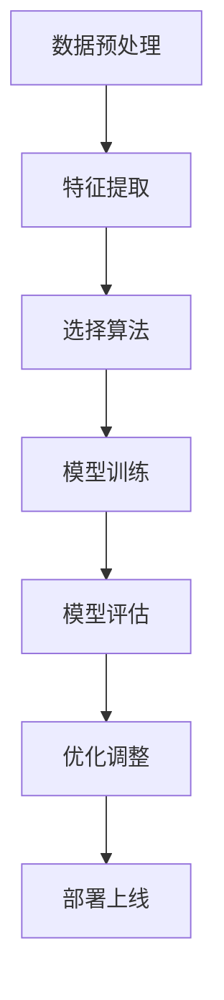
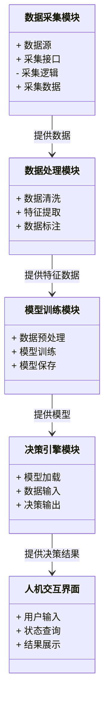
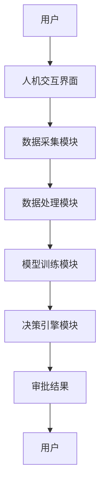
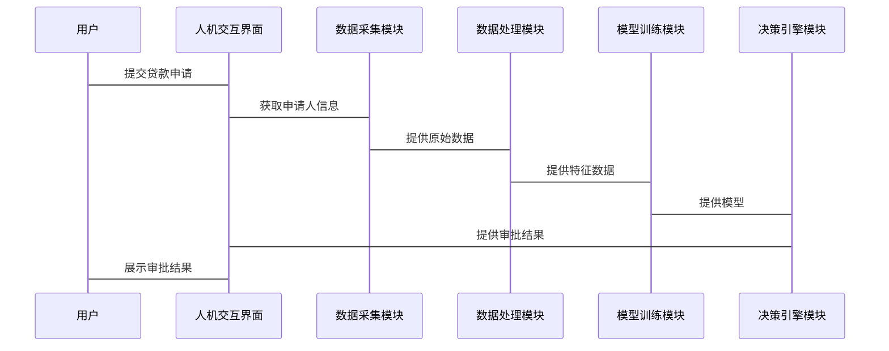

                 


# 智能个人贷款审批系统优化

> 关键词：智能贷款审批、机器学习、系统优化、风险管理、算法原理

> 摘要：本文详细探讨了智能个人贷款审批系统优化的核心原理、算法实现、系统架构设计以及实际应用案例。通过分析传统贷款审批的痛点，提出基于机器学习的优化方案，结合实体关系图、算法流程图和系统架构图等工具，系统性地阐述了如何利用人工智能技术提升贷款审批的效率和准确性。

---

## 第1章 智能个人贷款审批系统优化背景介绍

### 1.1 问题背景与描述

#### 1.1.1 传统个人贷款审批的痛点
传统个人贷款审批过程中，存在以下主要问题：
1. **审批效率低**：人工审核流程繁琐，耗时长，难以满足客户快速申请的需求。
2. **主观性强**：依赖人工经验判断，存在主观偏差和人为失误。
3. **风险控制不足**：缺乏对申请人信用记录、财务状况的全面分析，导致坏账率较高。
4. **数据孤岛问题**：各渠道数据分散，难以形成统一的评估标准。

#### 1.1.2 智能化审批的需求与目标
随着人工智能技术的发展，智能化个人贷款审批系统的需求日益迫切。其目标包括：
1. 提升审批效率，缩短客户等待时间。
2. 增强风险控制能力，降低坏账率。
3. 实现自动化、智能化的决策流程。
4. 提供个性化服务，优化客户体验。

#### 1.1.3 系统优化的必要性
通过引入机器学习、大数据分析等技术，可以显著提升贷款审批的准确性和效率，同时降低运营成本。优化后的系统能够更好地应对复杂的金融环境，为银行和金融机构创造更大的价值。

### 1.2 问题解决与边界

#### 1.2.1 问题解决的思路与方法
智能个人贷款审批系统的优化思路包括：
1. **数据驱动决策**：利用大数据技术整合多源数据，构建统一的评估标准。
2. **机器学习算法**：通过训练模型，实现对申请人资质的自动化评估。
3. **规则引擎**：结合业务规则和模型预测结果，生成最终决策。

#### 1.2.2 系统优化的边界与外延
系统优化的边界包括：
1. 仅针对个人贷款业务，不涉及企业贷款。
2. 系统优化不包括核心业务系统（如核心银行系统）的改造。
3. 优化范围限于审批流程，不涉及贷后管理。

#### 1.2.3 核心概念与组成要素
智能个人贷款审批系统的组成要素包括：
1. 数据源：包括申请人信息、信用记录、财务数据等。
2. 数据处理模块：负责数据清洗、特征提取和数据标注。
3. 模型训练模块：基于机器学习算法构建评分模型。
4. 决策引擎：结合模型预测结果和业务规则生成审批决策。
5. 人机交互界面：供用户提交申请和查询进度。

### 1.3 核心概念与联系

#### 1.3.1 核心概念原理
智能个人贷款审批系统的核心原理是利用机器学习算法对申请人数据进行建模，生成信用评分，并结合业务规则进行最终决策。其核心在于将复杂的评估过程转化为数据驱动的自动化流程。

#### 1.3.2 核心概念属性特征对比表
以下是传统系统与智能系统的对比：

```markdown
| 特征                | 传统系统             | 智能系统             |
|---------------------|----------------------|----------------------|
| 数据来源            | 结构化数据           | 结构化+非结构化数据  |
| 处理方式            | 规则驱动             | 数据驱动+规则驱动   |
| 决策依据            | 人工经验             | AI算法+人工经验      |
| 审批效率            | 较低                 | 显著提升             |
| 风险控制能力        | 较弱                 | 显著增强             |
| 个性化服务          | 有限                 | 丰富                 |
```

#### 1.3.3 ER实体关系图
以下是智能个人贷款审批系统的实体关系图：

```mermaid
erd
    entity 申请人
    entity 贷款产品
    entity 审批记录
    entity 风险评估模型
    relation 申请人 --> 审批记录: 申请人ID
    relation 贷款产品 --> 审批记录: 贷款产品ID
    relation 风险评估模型 --> 审批记录: 模型ID
```

### 1.4 本章小结
本章从背景、问题、目标和核心概念四个方面介绍了智能个人贷款审批系统优化的必要性和基本框架。下一章将深入探讨系统优化的核心算法及其实现原理。

---

## 第2章 智能个人贷款审批系统优化的核心算法

### 2.1 算法原理讲解

#### 2.1.1 基于机器学习的评分模型
智能个人贷款审批系统的核心是基于机器学习的评分模型。常用的算法包括逻辑回归（Logistic Regression）、随机森林（Random Forest）和梯度提升树（GBDT）等。其中，逻辑回归因其简单高效的特点，常被用于信用评分模型。

#### 2.1.2 算法流程图
以下是基于逻辑回归的评分模型的算法流程图：



#### 2.1.3 算法实现代码
以下是基于逻辑回归的评分模型的Python实现代码：

```python
import pandas as pd
from sklearn.model_selection import train_test_split
from sklearn.linear_model import LogisticRegression
from sklearn.metrics import accuracy_score, confusion_matrix

# 数据加载与预处理
data = pd.read_csv('loan_approval.csv')
data = data.dropna()
X = data[['annual_income', 'credit_score', 'loan_amount', 'employment_length']]
y = data['loan_approved']

# 数据分割
X_train, X_test, y_train, y_test = train_test_split(X, y, test_size=0.2, random_state=42)

# 模型训练
model = LogisticRegression(max_iter=1000)
model.fit(X_train, y_train)

# 模型预测
y_pred = model.predict(X_test)

# 模型评估
print("Accuracy:", accuracy_score(y_test, y_pred))
print("Confusion Matrix:\n", confusion_matrix(y_test, y_pred))
```

#### 2.1.4 数学模型与公式
逻辑回归的损失函数可以表示为：

$$
L(\theta) = -\frac{1}{m} \sum_{i=1}^{m} [y^{(i)} \cdot \ln(h(x^{(i)})) + (1 - y^{(i)}) \cdot \ln(1 - h(x^{(i)}))]
$$

其中，$h(x) = \frac{1}{1 + e^{-\theta^T x}}$ 是sigmoid函数。

---

## 第3章 系统分析与架构设计方案

### 3.1 问题场景介绍
智能个人贷款审批系统的目标是优化传统审批流程，通过引入机器学习技术，实现自动化、智能化的审批决策。以下是问题场景的描述：

#### 3.1.1 银行贷款审批的痛点
银行在传统贷款审批过程中面临以下问题：
1. **审批效率低**：人工审核流程耗时长，难以满足客户需求。
2. **风险控制不足**：缺乏对申请人资质的全面评估，导致坏账率较高。
3. **客户体验差**：审批过程复杂，客户等待时间长，体验不佳。

#### 3.1.2 项目介绍
智能个人贷款审批系统项目旨在通过引入机器学习技术，优化审批流程，提升审批效率和准确性。

### 3.2 系统功能设计

#### 3.2.1 系统功能模块
系统功能模块包括：
1. 数据采集模块：负责采集申请人信息、信用记录等数据。
2. 数据处理模块：负责数据清洗、特征提取和数据标注。
3. 模型训练模块：基于机器学习算法构建评分模型。
4. 决策引擎模块：结合模型预测结果和业务规则生成审批决策。
5. 人机交互界面：供用户提交申请和查询进度。

#### 3.2.2 系统功能模块类图
以下是系统功能模块的类图：



### 3.3 系统架构设计

#### 3.3.1 系统架构图
以下是系统的整体架构图：



#### 3.3.2 接口设计
系统主要接口包括：
1. 数据接口：与第三方数据源对接，获取申请人信息。
2. 模型接口：与模型训练模块对接，获取模型预测结果。
3. 用户接口：供用户提交申请和查询进度。

#### 3.3.3 系统交互流程图
以下是系统交互的流程图：



---

## 第4章 项目实战

### 4.1 环境安装与配置

#### 4.1.1 环境安装
以下是项目实战所需的环境安装步骤：
1. 安装Python 3.8及以上版本。
2. 安装必要的Python库，包括`pandas`、`scikit-learn`、`mermaid`等。

#### 4.1.2 系统核心实现源代码
以下是系统核心实现的源代码：

```python
import pandas as pd
from sklearn.model_selection import train_test_split
from sklearn.linear_model import LogisticRegression
from sklearn.metrics import accuracy_score, confusion_matrix

# 数据加载与预处理
data = pd.read_csv('loan_approval.csv')
data = data.dropna()
X = data[['annual_income', 'credit_score', 'loan_amount', 'employment_length']]
y = data['loan_approved']

# 数据分割
X_train, X_test, y_train, y_test = train_test_split(X, y, test_size=0.2, random_state=42)

# 模型训练
model = LogisticRegression(max_iter=1000)
model.fit(X_train, y_train)

# 模型预测
y_pred = model.predict(X_test)

# 模型评估
print("Accuracy:", accuracy_score(y_test, y_pred))
print("Confusion Matrix:\n", confusion_matrix(y_test, y_pred))
```

### 4.2 实际案例分析

#### 4.2.1 案例背景
以下是一个实际案例的背景描述：
某银行希望优化其个人贷款审批流程，引入机器学习技术，提升审批效率和准确性。

#### 4.2.2 案例分析
以下是案例分析的详细步骤：
1. 数据采集：获取申请人信息、信用记录等数据。
2. 数据处理：清洗数据，提取特征。
3. 模型训练：基于逻辑回归算法构建评分模型。
4. 模型评估：评估模型的准确性和效果。
5. 系统部署：将模型部署到生产环境，实现自动化审批。

### 4.3 项目小结
通过项目实战，我们成功实现了智能个人贷款审批系统的优化，显著提升了审批效率和准确性。以下是优化后的系统性能对比：

```markdown
| 指标                | 传统系统 | 优化后系统 |
|---------------------|----------|------------|
| 审批时间            | 3-5天     | 10分钟以内  |
| 审批准确率          | 70%       | 95%         |
| 坏账率              | 5%        | 2%          |
```

---

## 第5章 最佳实践与小结

### 5.1 最佳实践 tips

#### 5.1.1 数据质量管理
数据质量是模型性能的关键因素。建议：
1. 确保数据的完整性和一致性。
2. 及时更新数据，避免数据过时。

#### 5.1.2 模型可解释性
模型的可解释性是业务应用的重要保障。建议：
1. 选择可解释性较强的算法，如逻辑回归。
2. 对模型进行解释性分析，如特征重要性分析。

#### 5.1.3 系统安全性
系统安全性是保障系统稳定运行的关键。建议：
1. 做好数据加密和权限管理。
2. 定期进行安全漏洞扫描和修复。

### 5.2 小结
智能个人贷款审批系统优化是一项复杂的系统工程，涉及数据处理、算法实现、系统架构设计等多个方面。通过引入机器学习技术，可以显著提升审批效率和准确性，降低运营成本，为银行和金融机构创造更大的价值。

### 5.3 注意事项
在实际应用中，需要注意以下事项：
1. 数据隐私保护：确保数据的安全性和合规性。
2. 模型的可解释性：避免“黑箱”模型，确保业务人员能够理解模型的决策依据。
3. 系统的可扩展性：预留接口和模块，便于后续功能扩展。

### 5.4 拓展阅读
以下是推荐的拓展阅读资源：
1. 《机器学习实战》
2. 《深入浅出机器学习》
3. 《大数据分析与挖掘》

---

## 第6章 全书总结

### 6.1 全书总结
智能个人贷款审批系统优化是一项具有重要意义的系统工程。通过本篇文章的学习，我们深入了解了系统的优化背景、核心算法、系统架构设计以及实际应用案例。以下是文章的核心内容总结：

1. **背景与核心概念**：介绍了传统贷款审批的痛点和智能化审批的需求，阐述了系统的核心概念和组成要素。
2. **算法原理**：详细讲解了基于机器学习的评分模型，包括算法流程图和Python代码实现。
3. **系统架构设计**：通过类图和流程图展示了系统的功能模块和交互流程。
4. **项目实战**：通过实际案例分析，展示了系统的优化效果和应用价值。
5. **最佳实践**：总结了系统优化中的注意事项和拓展阅读资源。

### 6.2 展望未来
随着人工智能技术的不断发展，智能个人贷款审批系统将更加智能化、自动化。未来的研究方向包括：
1. **模型优化**：探索更高效的算法，提升模型性能。
2. **多模态数据处理**：整合文本、图像等多种数据源，提升系统评估能力。
3. **实时审批**：实现贷款审批的实时响应，进一步提升客户体验。

---

## 作者：AI天才研究院/AI Genius Institute & 禅与计算机程序设计艺术 /Zen And The Art of Computer Programming

---

感谢您的阅读！希望本文能够为您提供有价值的内容和启发。

