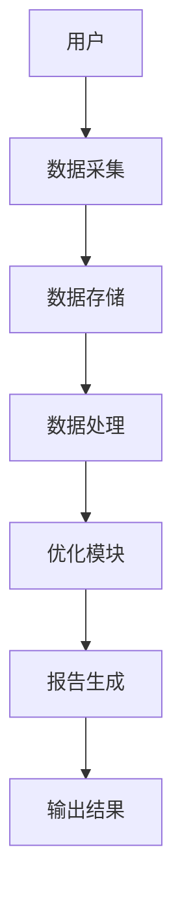
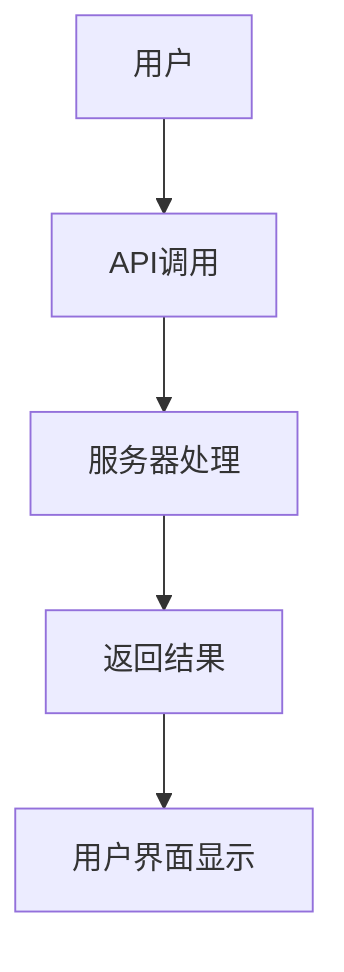

                 


# 智能个人资产负债结构优化与财富管理

> 关键词：智能资产负债优化，财富管理，优化算法，系统架构，风险管理

> 摘要：随着人工智能和大数据技术的快速发展，智能个人资产负债结构优化与财富管理已成为现代财务管理的重要方向。本文从背景、数学基础、算法原理、系统架构到项目实战，全面探讨智能资产负债优化的核心概念、实现方法及应用案例，为读者提供从理论到实践的系统性指导。

---

## 第一部分: 智能个人资产负债结构优化的背景与意义

### 第1章: 智能个人资产负债优化的背景与意义

#### 1.1 个人资产负债管理的现状与挑战

##### 1.1.1 传统个人资产负债管理的局限性
传统的个人资产负债管理主要依赖人工计算和经验判断，存在以下问题：
- 数据处理效率低，难以应对海量金融数据。
- 缺乏动态调整能力，难以实时跟踪市场变化。
- 风险评估不够精准，难以量化潜在风险。

##### 1.1.2 智能化技术在财务管理中的应用前景
人工智能、大数据和区块链等技术为财务管理带来了新的可能性：
- 自动化数据处理与分析，提升管理效率。
- 实时监控与动态调整，增强风险控制能力。
- 个性化财富管理方案，满足不同用户需求。

##### 1.1.3 资产负债结构优化的核心价值
通过智能优化，个人可以在以下方面受益：
- 提高资产配置效率，实现收益最大化。
- 降低债务风险，优化负债结构。
- 实现财富保值与增值的平衡。

#### 1.2 智能个人资产负债优化的定义与目标

##### 1.2.1 智能个人资产负债优化的定义
智能个人资产负债优化是一种基于人工智能技术的财务管理系统，通过数据分析和优化算法，帮助个人实现资产与负债的最优配置。

##### 1.2.2 优化目标与关键指标
主要目标包括：
- 最大化资产收益。
- 最小化负债风险。
- 实现资产与负债的动态平衡。

关键指标包括：
- 资产回报率（ROI）。
- 负债成本率（COE）。
- 风险承受能力。

##### 1.2.3 与传统财务管理的区别与联系
区别：
- **数据处理能力**：智能优化依赖大数据分析，传统财务管理依赖人工经验。
- **决策效率**：智能优化实时调整，传统财务管理滞后性强。

联系：
- 都以实现财富最大化为目标。
- 都需要考虑市场环境和个体风险偏好。

#### 1.3 本书的核心内容与结构

##### 1.3.1 核心问题的提出
如何通过智能技术实现个人资产与负债的最优配置？

##### 1.3.2 目录结构与内容概览
本书将从数学基础、算法原理、系统架构到项目实战，全面解析智能资产负债优化。

##### 1.3.3 学习本书的方法与建议
建议读者先掌握基础的数学知识，再逐步深入学习算法和系统实现。

---

## 第二部分: 智能个人资产负债结构优化的数学基础

### 第2章: 数学基础与优化模型

#### 2.1 线性代数与优化理论

##### 2.1.1 向量与矩阵的基本概念
- **向量**：表示多维数据的有序数组。
- **矩阵**：二维数组，用于表示线性变换或方程组。

##### 2.1.2 线性方程组的求解方法
- **高斯消元法**：通过消元化简方程组，求解变量。
- **矩阵求逆法**：通过求逆矩阵，解线性方程组。

##### 2.1.3 优化问题的数学表示
优化问题通常表示为：
$$
\min_{x} f(x) \quad \text{subject to} \quad g(x) \leq 0
$$
其中，$f(x)$ 是目标函数，$g(x)$ 是约束条件。

#### 2.2 资产负债优化的数学模型

##### 2.2.1 资产负债结构的数学表达
假设个人资产包括股票、债券、存款等，负债包括贷款、信用卡欠款等。优化目标是：
$$
\max_{w} \text{收益}(w) - \text{风险}(w)
$$
其中，$w$ 是资产配置权重。

##### 2.2.2 目标函数与约束条件
目标函数：
$$
\text{收益} = \sum_{i=1}^{n} w_i r_i
$$
风险：
$$
\text{风险} = \sum_{i=1}^{n} \sum_{j=1}^{n} w_i w_j \sigma_{ij}
$$

约束条件：
$$
\sum_{i=1}^{n} w_i = 1
$$
$$
w_i \geq 0 \quad \forall i
$$

##### 2.2.3 常见的优化算法简介
- **线性规划**：处理线性目标函数和约束条件。
- **非线性规划**：处理非线性目标函数或约束条件。
- **整数规划**：处理变量为整数的优化问题。

#### 2.3 概率统计与风险评估

##### 2.3.1 概率分布的基本概念
- **均值**：数据的中心位置。
- **方差**：数据的离散程度。
- **协方差**：两个变量的相关性。

##### 2.3.2 风险评估的数学模型
VaR（Value at Risk）模型：
$$
\text{VaR}(\alpha) = \min\{x | P(X \leq x) \geq \alpha\}
$$

##### 2.3.3 资产负债中的风险与收益平衡
通过马科维茨投资组合理论，实现风险与收益的最优平衡：
$$
\min_{w} \sigma^2(w) \quad \text{subject to} \quad \mu^T w = \mu_{target}
$$

---

## 第三部分: 资产负债结构优化算法原理

### 第3章: 常见优化算法及其应用

#### 3.1 线性规划与非线性规划

##### 3.1.1 线性规划的原理与应用
线性规划的步骤：
1. 确定目标函数和约束条件。
2. 构建可行域。
3. 寻找最优解。

##### 3.1.2 非线性规划的挑战与解决方案
非线性规划的难点在于全局最优的寻找，常用方法包括梯度下降和牛顿法。

#### 3.2 遗传算法与模拟退火

##### 3.2.1 遗传算法的基本原理
1. 初始化种群。
2. 计算适应度。
3. 选择、交叉和变异。
4. 重复迭代。

##### 3.2.2 模拟退火算法的实现步骤
1. 初始化温度。
2. 计算能量差。
3. 接受或拒绝新状态。
4. 降温迭代。

##### 3.2.3 两种算法在资产负债优化中的应用对比
- 遗传算法适合大规模优化。
- 模拟退火适合解决复杂问题。

#### 3.3 机器学习算法在优化中的应用

##### 3.3.1 基于回归的优化模型
回归模型用于预测目标函数的值。

##### 3.3.2 基于聚类的优化策略
聚类算法用于划分资产类别。

##### 3.3.3 神经网络在复杂优化问题中的应用
深度学习模型可以捕捉非线性关系。

---

## 第四部分: 智能财富管理系统架构与实现

### 第4章: 系统架构与功能设计

#### 4.1 系统架构设计

##### 4.1.1 系统模块划分
- 数据采集模块：获取金融市场数据。
- 数据处理模块：清洗和转换数据。
- 优化模块：执行资产配置优化。
- 报告生成模块：输出优化结果。

##### 4.1.2 系统架构的Mermaid图示


#### 4.2 功能需求分析

##### 4.2.1 用户需求分析
- 个性化资产配置。
- 风险评估与预警。
- 实时市场监控。

##### 4.2.2 功能模块的详细描述
- 数据采集：实时获取股票、债券等数据。
- 数据处理：清洗、转换和标准化。
- 优化模块：执行资产配置优化。
- 报告生成：生成优化报告和风险预警。

#### 4.3 系统接口设计

##### 4.3.1 API接口的设计与实现
- RESTful API。
- 接口文档。

##### 4.3.2 接口调用的流程图


---

## 第五部分: 项目实战与案例分析

### 第5章: 项目实战与实现

#### 5.1 环境搭建与工具安装

##### 5.1.1 开发环境的选择与配置
- Python 3.8+。
- Jupyter Notebook。

##### 5.1.2 必要工具的安装与使用
- 安装`numpy`、`pandas`、`scipy`等库。

#### 5.2 核心代码实现

##### 5.2.1 数据预处理与特征提取
```python
import pandas as pd
import numpy as np

# 数据加载
df = pd.read_csv('financial_data.csv')

# 数据清洗
df.dropna(inplace=True)

# 特征提取
features = df[['stock', 'bond', 'cash']]
```

##### 5.2.2 优化算法实现
```python
from scipy.optimize import minimize

# 定义目标函数
def objective(weights):
    return -np.mean(weights * returns) + np.std(weights * returns)

# 约束条件
cons = ({'type': 'eq', 'fun': lambda w: np.sum(w) - 1})

# 调用优化器
result = minimize(objective, initial_weights, constraints=cons)
```

##### 5.2.3 结果分析与可视化
```python
import matplotlib.pyplot as plt

plt.plot(result['x'], label='Optimal Weights')
plt.xlabel('Asset Class')
plt.ylabel('Weight')
plt.legend()
plt.show()
```

#### 5.3 项目小结

##### 5.3.1 项目总结
通过本项目，我们实现了基于优化算法的资产配置系统。

##### 5.3.2 经验与教训
- 数据质量直接影响结果。
- 优化算法的选择需根据问题性质。

##### 5.3.3 未来改进方向
- 引入实时数据流。
- 增加用户交互功能。

---

## 第六部分: 最佳实践与注意事项

### 6.1 最佳实践 tips

#### 6.1.1 数据处理
- 确保数据的完整性和准确性。
- 处理缺失值和异常值。

#### 6.1.2 模型选择
- 根据问题选择合适的算法。
- 验证模型的鲁棒性。

### 6.2 小结

#### 6.2.1 内容回顾
从数学基础到系统实现，全面解析智能资产负债优化。

#### 6.2.2 重要性总结
智能优化是现代财务管理的核心工具。

### 6.3 注意事项

#### 6.3.1 风险提示
- 市场波动可能导致结果偏差。
- 算法选择需谨慎。

#### 6.3.2 操作建议
- 定期更新数据。
- 监控系统运行状态。

### 6.4 拓展阅读

#### 6.4.1 推荐书籍
- 《投资学》（《Investments》）。
- 《机器学习实战》（《Hands-On Machine Learning with Scikit-Learn and TensorFlow》）。

#### 6.4.2 在线资源
- [量化投资论坛](https://quant.stackexchange.com/)
- [GitHub优化算法仓库](https://github.com/optimization-algorithms)

---

## 结语

智能个人资产负债结构优化与财富管理是一个复杂但充满潜力的领域。通过本文的系统讲解，读者可以掌握从理论到实践的全过程。希望本文能为读者在智能财务管理领域的探索提供有价值的指导。

---

## 作者：AI天才研究院/AI Genius Institute & 禅与计算机程序设计艺术 /Zen And The Art of Computer Programming

