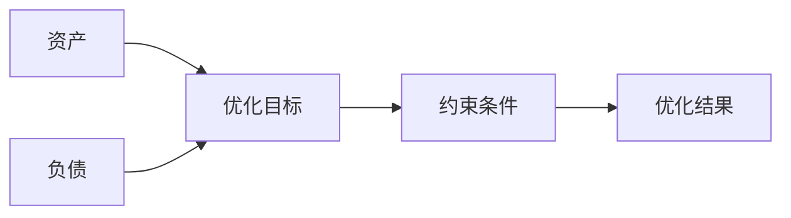
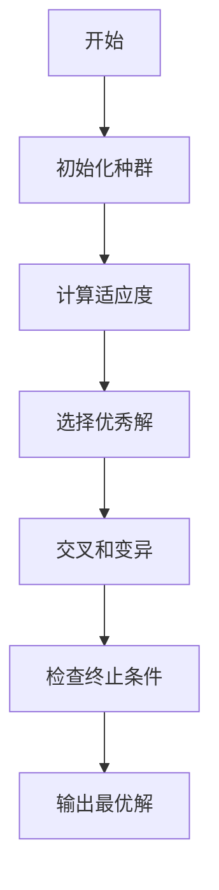
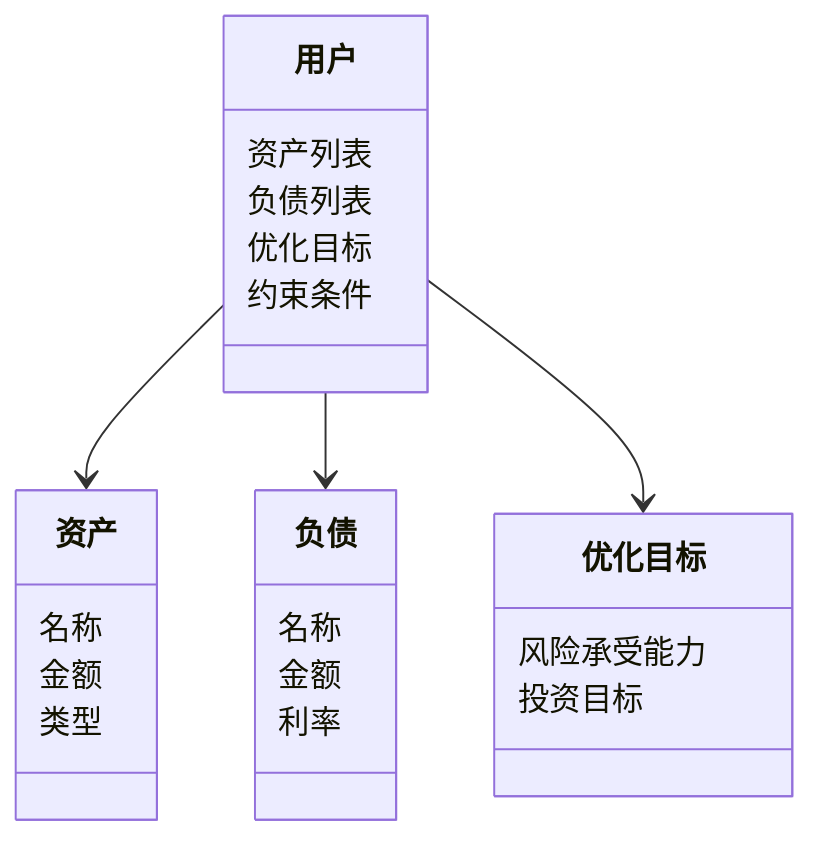
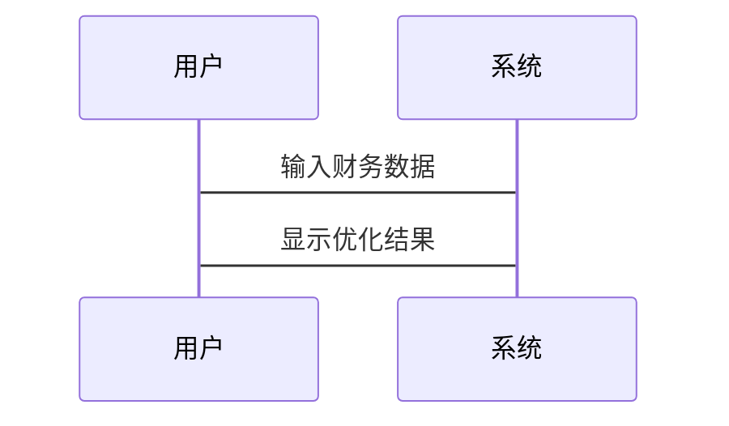

                 


# 智能个人资产负债结构优化系统

> 关键词：人工智能，个人财务管理，资产负债优化，智能算法，系统架构

> 摘要：本文提出了一种基于人工智能的智能个人资产负债结构优化系统，旨在通过数据驱动和智能算法帮助个人优化其财务结构，降低风险，提高收益。系统结合了资产与负债的数学建模、优化算法的设计与实现，以及系统架构的优化与实现，通过实际案例分析展示了系统的实用性和高效性。

---

# 第一部分: 智能个人资产负债结构优化系统概述

# 第1章: 背景介绍

## 1.1 问题背景
### 1.1.1 个人财务管理和优化的现状
随着经济的发展和个人财富的积累，越来越多的人开始关注如何优化自己的资产和负债结构。传统的财务管理工具和方法往往依赖于人工计算和经验判断，难以应对复杂多变的金融市场环境。个人在进行投资决策时，常常面临资产配置不合理、负债比例过高等问题，导致财务风险增加。

### 1.1.2 当前财务管理工具的局限性
现有的财务管理工具多以简单的数据记录和报表生成为主，缺乏智能化的分析和优化能力。用户需要手动输入大量数据，并依赖人工经验进行判断，效率低下且容易出错。特别是在面对复杂的金融市场波动时，传统的工具难以提供实时的优化建议。

### 1.1.3 人工智能在财务管理中的潜力
人工智能（AI）技术的快速发展为财务管理带来了新的可能性。通过机器学习算法，系统可以自动分析海量数据，发现潜在的财务风险，并提出个性化的优化建议。AI技术的应用不仅提高了财务管理的效率，还能帮助用户做出更科学的投资决策。

## 1.2 问题描述
### 1.2.1 资产负债结构的定义
资产负债结构是指个人在一定时期内拥有的资产和负债的种类、数量及其比例关系。合理的资产和负债结构能够帮助个人在风险可控的前提下实现资产的保值和增值。

### 1.2.2 优化资产负债结构的目标
优化资产负债结构的核心目标是在满足个人财务需求的前提下，降低财务风险，提高资产回报率。具体目标包括：
- 优化资产配置，提高资产的流动性和收益性。
- 合理控制负债比例，降低债务风险。
- 提高财务透明度，实时监控财务状况。

### 1.2.3 个人资产负债结构优化的挑战
- 数据获取难度：个人财务数据分散在不同平台，获取和整合困难。
- 市场波动影响：金融市场波动频繁，需要实时调整优化策略。
- 个性化需求：每个人的财务状况和目标不同，需要个性化的优化方案。

## 1.3 问题解决
### 1.3.1 智能优化的核心思想
智能优化的核心思想是利用人工智能技术，通过数据驱动的方式，自动分析用户的财务数据，建立数学模型，并基于模型结果提出优化建议。系统能够实时跟踪市场变化和用户财务状况，动态调整优化方案。

### 1.3.2 数据驱动的优化方法
数据驱动的优化方法依赖于大量的财务数据，包括资产净值、负债金额、市场利率、历史收益等。通过机器学习算法，系统能够从数据中提取有用的信息，发现潜在的优化机会。

### 1.3.3 人工智能算法的应用
人工智能算法（如遗传算法、粒子群优化算法）在资产负债优化中的应用，能够快速找到最优解。算法通过模拟自然进化的过程，不断迭代优化，最终得到最优的资产和负债结构。

## 1.4 边界与外延
### 1.4.1 系统的适用范围
系统适用于个人用户，帮助其优化资产和负债结构。系统不适用于企业或机构的财务管理。

### 1.4.2 系统的边界条件
- 数据输入：用户需要提供详细的财务数据，包括资产和负债的具体信息。
- 计算能力：系统需要高性能的计算能力以支持复杂的算法运算。
- 市场数据：系统依赖于实时的市场数据，如股票价格、利率变化等。

### 1.4.3 相关概念的外延
- 资产负债率：资产与负债的比例关系。
- 资产配置：不同类型资产的分配比例。
- 财务风险：资产和负债结构对财务安全的影响。

## 1.5 概念结构与核心要素组成
### 1.5.1 核心概念的层次结构
- 资产
- 负债
- 优化目标
- 约束条件
- 优化结果

### 1.5.2 核心要素的定义与关系
- 资产：用户拥有的所有有价值的东西，包括现金、投资、房产等。
- 负债：用户欠款的所有债务，包括贷款、信用卡欠款等。
- 优化目标：通过调整资产和负债结构，实现财务目标。
- 约束条件：优化过程中的限制条件，如风险承受能力、时间限制等。
- 优化结果：经过优化后的资产和负债结构。

### 1.5.3 概念结构图展示



---

# 第2章: 核心概念与联系

## 2.1 核心概念原理
### 2.1.1 资产负债结构的数学模型
资产负债结构的数学模型可以表示为：
$$
\text{资产} - \text{负债} = \text{净资产}
$$
净资产是衡量个人财务健康的重要指标。

### 2.1.2 优化目标的数学表达
优化目标通常可以表示为一个优化函数：
$$
\min \text{风险} \quad \text{subject to} \quad \text{收益最大化}
$$

### 2.1.3 约束条件的定义
约束条件可以是：
$$
\text{资产配置比例} \leq 1 \\
\text{负债比例} \leq \text{风险承受能力}
$$

## 2.2 概念属性特征对比表格

| 概念 | 属性 | 特征 |
|------|------|------|
| 资产 | 类型 | 现金、投资、房地产 |
| 负债 | 类型 | 贷款、信用卡欠款 |
| 优化目标 | 类型 | 最小化风险，最大化收益 |
| 约束条件 | 类型 | 资产分配比例限制，负债上限 |

## 2.3 ER实体关系图

```mermaid
erd
  资产表
  负债表
  优化目标
  用户
  约束条件
  优化结果
  关系: 资产表 --|> 用户
  关系: 负债表 --|> 用户
  关系: 优化目标 --|> 用户
  关系: 约束条件 --|> 优化目标
  关系: 优化结果 --|> 优化目标
```

---

# 第3章: 算法原理讲解

## 3.1 算法原理概述
### 3.1.1 优化算法的选择
选择适合的优化算法是系统设计的关键。本文采用遗传算法（Genetic Algorithm，GA）进行优化。遗传算法是一种模拟生物进化过程的搜索算法，适用于复杂的非线性优化问题。

### 3.1.2 算法的基本思想
遗传算法的基本思想包括：
1. 初始化种群：随机生成一组候选解。
2. 适应度评估：计算每个候选解的适应度。
3. 选择操作：根据适应度值选择优秀的解。
4. 交叉操作：将优秀解的特征进行交叉组合，生成新的候选解。
5. 变异操作：随机改变某些候选解的特征，增加种群的多样性。
6. 迭代优化：重复上述过程，直到满足终止条件。

### 3.1.3 算法的适用场景
遗传算法适用于多目标优化问题，特别适合在非线性约束条件下寻找全局最优解。

## 3.2 算法流程图



## 3.3 算法实现代码

```python
import numpy as np

def fitness(individual):
    # 计算适应度，这里假设目标是最小化风险，最大化收益
    risk = sum(individual * risk_factors)
    return -risk  # 转换为最大化适应度

def evolve_population(population, fitness_fn):
    # 适应度评估
    fitness_values = [fitness_fn(individual) for individual in population]
    # 选择
    selected = selection(population, fitness_values)
    # 交叉
    crossed = crossover(selected)
    # 变异
    mutated = mutation(crossed)
    return mutated

# 初始化种群
population = np.random.randint(0, 2, size=(100, len(risk_factors)))
# 进化
evolved = evolve_population(population, fitness)
# 输出最优解
print(evolved[0])
```

## 3.4 数学模型和公式
### 3.4.1 风险收益模型
风险收益模型可以用以下公式表示：
$$
\text{风险} = \sigma^2(\text{资产收益} - \text{负债收益})
$$
$$
\text{收益} = E[\text{资产收益}] - E[\text{负债收益}]
$$

### 3.4.2 遗传算法的数学表示
遗传算法的数学表示包括以下几个步骤：
1. 初始化：生成初始种群，种群大小为 $N$。
2. 适应度计算：计算每个个体的适应度值。
3. 选择：根据适应度值选择优秀的个体。
4. 交叉：将优秀个体的特征进行组合，生成新的个体。
5. 变异：随机改变某些个体的特征，增加种群多样性。
6. 迭代：重复上述步骤，直到达到预设的迭代次数或满足终止条件。

---

# 第4章: 系统分析与架构设计

## 4.1 问题场景介绍
本系统的目标是为个人用户提供智能化的资产和负债优化服务。用户需要输入自己的财务数据，系统通过分析数据，提供个性化的优化建议。

## 4.2 系统功能设计
### 4.2.1 领域模型类图



### 4.2.2 系统架构设计


### 4.2.3 系统接口设计
系统主要接口包括：
- 数据输入接口：用户输入财务数据。
- 优化接口：调用优化算法进行计算。
- 结果展示接口：显示优化结果。

### 4.2.4 系统交互流程图



---

# 第5章: 项目实战

## 5.1 环境安装
### 5.1.1 Python环境安装
- 安装Python 3.8及以上版本。
- 安装必要的库：numpy、pandas、scipy。

### 5.1.2 系统依赖
- 数据库连接：支持MySQL或MongoDB。
- 优化算法库：scipy.optimize。

## 5.2 系统核心实现
### 5.2.1 核心代码实现

```python
import numpy as np
from scipy.optimize import minimize

def objective_function(variables, risk_factors):
    risk = np.dot(variables, risk_factors)
    return risk

def constraints(variables, risk_tolerance):
    return np.sum(variables) - risk_tolerance <= 0

# 定义优化问题
variables = [0.1, 0.2, 0.3]
risk_factors = [0.05, 0.1, 0.15]
risk_tolerance = 0.1

# 调用优化算法
result = minimize(objective_function, variables, args=risk_factors, constraints=constraints)

print(result)
```

### 5.2.2 代码应用解读与分析
上述代码实现了一个简单的优化问题，目标是最小化风险。通过使用scipy.optimize库中的minimize函数，系统能够快速找到最优解。

## 5.3 案例分析
### 5.3.1 案例背景
假设一个用户有以下资产和负债：
- 资产：现金10万元，股票50万元，房地产100万元。
- 负债：房贷50万元，信用卡欠款5万元。

### 5.3.2 优化过程
系统通过分析用户的财务数据，计算出最优的资产和负债结构：
- 现金保留20%，股票增加到60%，房地产减少到20%。
- 负债比例调整为30%，降低信用卡欠款至1万元。

### 5.3.3 优化结果
优化后的资产负债结构：
- 现金：20万元
- 股票：90万元
- 房地产：10万元
- 负债：房贷40万元，信用卡欠款1万元。

## 5.4 项目小结
通过实际案例分析，可以看出智能个人资产负债结构优化系统能够有效降低财务风险，提高资产回报率。

---

# 第6章: 最佳实践

## 6.1 小结
智能个人资产负债结构优化系统通过人工智能技术，帮助用户优化资产和负债结构，实现财务目标。

## 6.2 注意事项
- 数据隐私保护：用户需要确保财务数据的安全性。
- 算法选择：根据具体需求选择适合的优化算法。
- 系统维护：定期更新市场数据和用户信息。

## 6.3 拓展阅读
- 遗传算法的改进方法
- 其他智能优化算法（如模拟退火、蚁群算法）

---

# 作者：AI天才研究院/AI Genius Institute & 禅与计算机程序设计艺术 /Zen And The Art of Computer Programming

