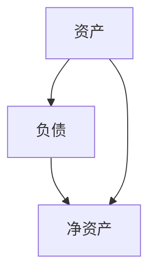
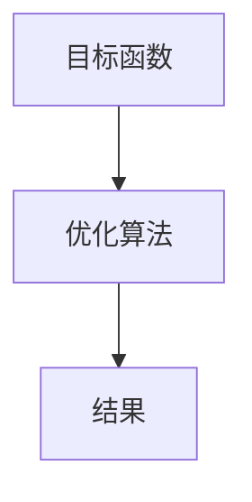
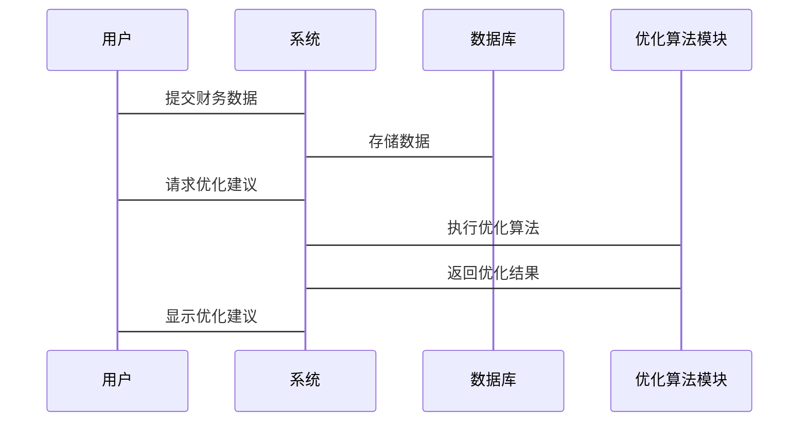

                 


# 《智能个人资产负债表优化器》

## 关键词：智能个人资产负债表、人工智能、优化算法、财务分析、系统架构

## 摘要：  
本文深入探讨了智能个人资产负债表优化器的设计与实现，结合人工智能技术，通过优化算法和系统架构设计，提供高效的个人财务管理和优化方案。文章从背景、核心概念、算法原理到系统设计和实战应用，详细阐述了优化器的工作原理和实际价值。

---

# 第1章: 个人资产负债表的基础知识

## 1.1 资产负债表的基本概念  
### 1.1.1 资产、负债、净资产的定义  
- 资产：个人拥有的所有资源，包括现金、存款、房产、股票等。  
- 负债：个人欠款的所有债务，包括贷款、信用卡欠款、借款等。  
- 净资产：资产减去负债的差额，反映个人的净资产状况。  

### 1.1.2 个人资产负债表的作用与意义  
- 帮助个人了解财务状况，评估净资产价值。  
- 为个人理财提供数据支持，优化资产配置。  
- 为税务规划、贷款申请等提供重要参考。  

### 1.1.3 个人财务健康评估的重要性  
- 通过资产负债表分析，识别财务风险。  
- 发现潜在的财务问题，如高负债比例、资产分布不合理等。  

## 1.2 智能优化的必要性  
### 1.2.1 传统个人财务管理的局限性  
- 数据分散，难以整合和分析。  
- 手工计算复杂，容易出错。  
- 无法实时跟踪和优化财务状况。  

### 1.2.2 智能技术在财务管理中的应用前景  
- 利用AI技术实现自动化数据采集和分析。  
- 基于机器学习算法，提供智能化的优化建议。  
- 实时监控财务数据，动态调整资产配置。  

### 1.2.3 智能个人资产负债表优化器的目标与价值  
- 提供智能化的财务分析工具，帮助用户优化资产配置。  
- 实现实时数据更新和智能优化，提升财务管理效率。  
- 提供个性化的财务规划建议，帮助用户实现财务目标。  

## 1.3 本章小结  
本章介绍了个人资产负债表的基本概念及其在财务管理中的重要性，指出了传统财务管理的局限性，并提出了智能个人资产负债表优化器的目标和价值。

---

# 第2章: 智能个人资产负债表优化器的核心概念

## 2.1 核心概念的定义与属性  
### 2.1.1 数据采集与处理  
- 数据来源：银行账户、投资平台、贷款合同等。  
- 数据格式：结构化数据（如CSV、Excel）和非结构化数据（如银行对账单）。  
- 数据清洗：去除无效数据、填补缺失值、处理异常值。  

### 2.1.2 智能分析算法  
- 监督学习：用于分类问题（如识别财务风险等级）。  
- 非监督学习：用于聚类分析（如资产分布分析）。  
- 强化学习：用于动态优化（如实时调整投资组合）。  

### 2.1.3 优化策略与结果输出  
- 短期优化：如优化投资组合的短期收益。  
- 长期优化：如优化资产配置以实现长期财务目标。  
- 多目标优化：在收益、风险、流动性之间找到平衡点。  

## 2.2 核心概念之间的关系  
### 2.2.1 资产、负债、净资产的实体关系图  


### 2.2.2 优化算法与目标函数的关系  


## 2.3 本章小结  
本章详细阐述了智能个人资产负债表优化器的核心概念，包括数据采集与处理、智能分析算法以及优化策略，并通过图表展示了核心概念之间的关系。

---

# 第3章: 智能优化算法的原理与实现

## 3.1 常用优化算法概述  
### 3.1.1 遗传算法  
- 基本原理：通过模拟自然选择和遗传机制，迭代优化目标函数。  
- 应用场景：适用于复杂的非线性优化问题。  

### 3.1.2 模拟退火算法  
- 基本原理：通过随机搜索和温度下降机制，避免陷入局部最优。  
- 应用场景：适用于全局优化问题。  

### 3.1.3 梯度下降算法  
- 基本原理：通过计算目标函数的梯度，沿梯度下降方向调整参数。  
- 应用场景：适用于凸优化问题。  

## 3.2 算法原理与数学模型  
### 3.2.1 遗传算法的数学模型  
$$适应度函数：f(x) = \sum_{i=1}^{n} w_i x_i$$  

### 3.2.2 梯度下降算法的数学模型  
$$\theta = \theta - \alpha \frac{\partial J}{\partial \theta}$$  

## 3.3 算法实现与代码示例  
### 3.3.1 遗传算法实现  
```python
def fitness(individual):
    # 计算适应度函数
    return sum(w * x for w, x in zip(weights, individual))

def evolve_population(population, fitness_fn):
    # 选择、交叉、变异操作
    pass
```

### 3.3.2 梯度下降实现  
```python
def gradient_descent(theta, alpha, max_iter):
    for _ in range(max_iter):
        gradients = compute_gradients(theta)
        theta -= alpha * gradients
    return theta
```

## 3.4 本章小结  
本章详细介绍了几种常用的优化算法，包括遗传算法、模拟退火算法和梯度下降算法，并通过数学模型和代码示例展示了它们的实现原理。

---

# 第4章: 系统分析与架构设计

## 4.1 问题场景介绍  
### 4.1.1 用户需求分析  
- 数据采集与管理：用户需要将分散的财务数据整合到系统中。  
- 实时监控：用户需要实时跟踪财务数据的变化。  
- 智能优化：用户需要系统根据数据提供优化建议。  

## 4.2 项目介绍  
### 4.2.1 项目目标  
- 开发一个智能化的个人资产负债表优化器。  
- 提供高效的财务分析和优化功能。  

### 4.2.2 项目范围  
- 数据采集模块：支持多种数据源的接入。  
- 分析模块：提供多维度的财务分析功能。  
- 优化模块：提供智能化的资产优化建议。  

## 4.3 系统功能设计  
### 4.3.1 领域模型（Mermaid类图）  


### 4.3.2 系统架构设计（Mermaid架构图）  


## 4.4 接口设计与交互流程  
### 4.4.1 接口设计  
- 数据采集接口：提供API用于接入财务数据。  
- 优化结果接口：返回优化后的资产配置建议。  

### 4.4.2 交互流程（Mermaid序列图）  


## 4.5 本章小结  
本章通过系统分析与架构设计，详细描述了智能个人资产负债表优化器的系统组成和功能模块，并通过类图和架构图展示了系统的结构。

---

# 第5章: 项目实战与案例分析

## 5.1 环境安装与配置  
### 5.1.1 安装Python和相关库  
- 安装Python：Python 3.8以上版本。  
- 安装库：numpy、pandas、scikit-learn、matplotlib等。  

### 5.1.2 数据采集工具配置  
- 使用CSV文件或API接入财务数据。  

## 5.2 核心代码实现  
### 5.2.1 数据采集模块  
```python
import pandas as pd

def load_data(file_path):
    data = pd.read_csv(file_path)
    return data
```

### 5.2.2 智能优化模块  
```python
from sklearn.linear_model import SGDRegressor

def optimize_assets(data):
    model = SGDRegressor()
    model.fit(data[['资产', '负债']], data['净资产'])
    return model.predict(data[['资产', '负债']])
```

## 5.3 案例分析与结果解读  
### 5.3.1 案例背景  
- 某用户资产分布不合理，净资产为负数。  

### 5.3.2 优化过程  
- 数据采集与预处理：整合用户的资产、负债数据。  
- 模型训练：使用梯度下降算法优化资产配置。  
- 优化结果：调整后的资产分布使净资产为正数。  

## 5.4 本章小结  
本章通过实际案例分析，展示了智能个人资产负债表优化器的核心功能和实际应用效果。

---

# 第6章: 最佳实践与注意事项

## 6.1 最佳实践 tips  
### 6.1.1 数据处理  
- 确保数据的完整性和准确性。  
- 定期更新数据，保持财务分析的实时性。  

### 6.1.2 算法选择  
- 根据具体问题选择合适的优化算法。  
- 对于复杂问题，建议使用遗传算法或模拟退火算法。  

## 6.2 注意事项  
### 6.2.1 数据隐私保护  
- 确保用户数据的安全性，防止数据泄露。  

### 6.2.2 算法的收敛性  
- 确保优化算法的收敛性，避免陷入局部最优。  

## 6.3 未来拓展方向  
### 6.3.1 引入机器学习模型  
- 使用深度学习模型，进一步提升优化效果。  

### 6.3.2 实现实时监控  
- 提供实时的财务数据分析和优化建议。  

## 6.4 本章小结  
本章总结了使用智能个人资产负债表优化器的最佳实践和注意事项，并展望了未来的发展方向。

---

# 作者信息  

作者：AI天才研究院/AI Genius Institute & 禅与计算机程序设计艺术 /Zen And The Art of Computer Programming  

---

# 结语  

通过本文的详细阐述，读者可以全面了解智能个人资产负债表优化器的设计与实现，掌握其核心算法和系统架构，并通过实际案例分析，理解其在个人财务管理中的实际应用价值。

