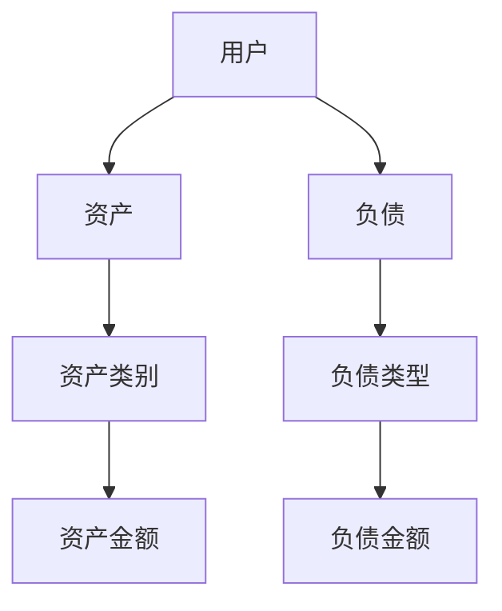
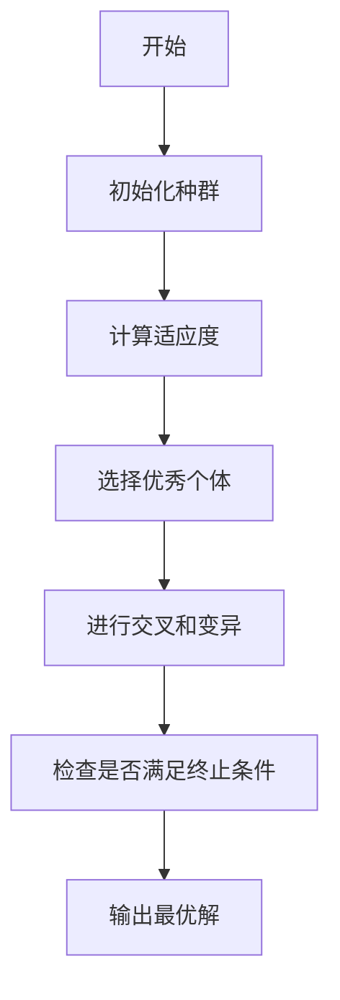
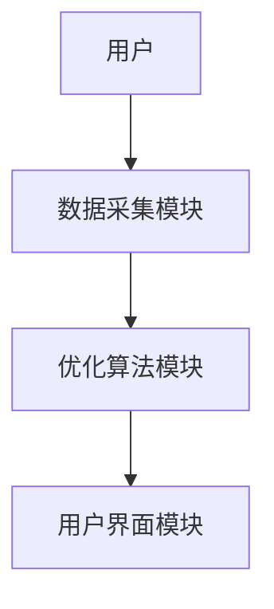
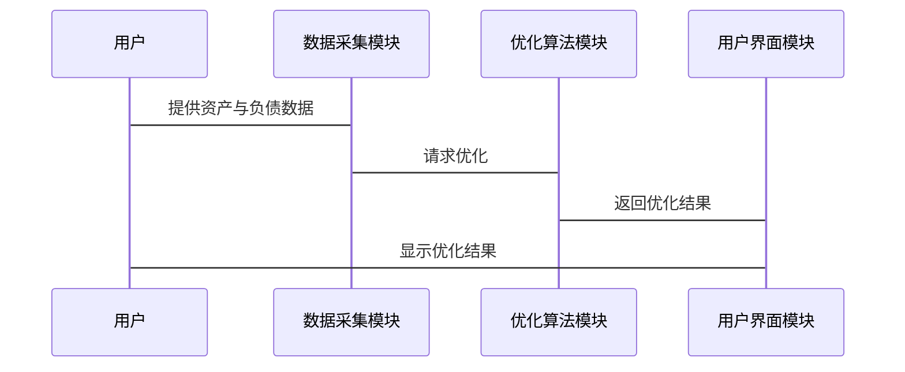

                 


# 智能个人资产负债表优化系统

> 关键词：智能个人资产负债表、人工智能、财务管理、优化算法、系统架构

> 摘要：本文详细探讨了智能个人资产负债表优化系统的构建与实现。通过分析传统资产负债表的局限性，引入人工智能技术，提出了基于机器学习的优化算法，并结合系统架构设计，展示了如何通过智能技术实现个人资产与负债的动态平衡优化。文章从背景介绍、核心概念、算法原理、系统架构、项目实战到总结，全面解析了智能个人资产负债表优化系统的实现过程与实际应用。

---

# 第一部分: 智能个人资产负债表优化系统背景介绍

## 第1章: 问题背景与定义

### 1.1 问题背景

#### 1.1.1 个人财务管理的重要性
在现代社会中，个人财务管理变得越来越复杂。随着经济环境的变化和个人资产规模的增加，如何科学地管理资产与负债，实现资产的保值与增值，成为每个个人面临的重大挑战。传统的财务管理方式往往依赖人工计算和经验判断，效率低下且难以应对复杂多变的经济环境。

#### 1.1.2 资产负债表的传统定义与作用
资产负债表是反映个人在某一特定时点资产、负债和净资产情况的报表，是个人财务管理的核心工具之一。传统的资产负债表主要记录静态的资产与负债信息，难以动态调整和优化。

#### 1.1.3 传统资产负债表的局限性
传统的资产负债表存在以下主要问题：
1. **静态性**：无法实时反映资产与负债的变化。
2. **缺乏优化建议**：无法根据市场变化和个人财务目标提供优化建议。
3. **计算复杂性**：人工计算容易出错，且效率低下。

### 1.2 智能个人资产负债表优化系统的定义

#### 1.2.1 系统的核心目标
智能个人资产负债表优化系统的目的是通过人工智能技术，实现对个人资产与负债的动态优化配置，提高资产回报率，降低负债风险，实现资产与负债的动态平衡。

#### 1.2.2 系统的边界与外延
该系统主要针对个人用户，优化范围包括但不限于：
- 资产配置：股票、债券、房地产等。
- 负债管理：贷款、信用卡债务等。
- 资金流动性管理。

#### 1.2.3 系统的核心要素组成
1. **用户输入**：资产与负债数据、财务目标、风险偏好。
2. **优化算法**：基于机器学习的优化模型。
3. **输出结果**：优化后的资产负债表、投资建议、风险预警。

## 第2章: 系统目标与技术基础

### 2.1 系统优化目标

#### 2.1.1 提高资产配置效率
通过智能算法，实现资产的最优配置，提高投资回报率。

#### 2.1.2 降低负债风险
通过优化负债结构，降低违约风险。

#### 2.1.3 实现资产与负债的动态平衡
根据市场变化和个人财务目标，实时调整资产与负债的比例。

### 2.2 技术基础

#### 2.2.1 人工智能在财务管理中的应用
人工智能技术（如机器学习、自然语言处理）在个人财务管理中的应用，能够实现自动化数据处理、智能决策支持。

#### 2.2.2 大数据技术在个人资产分析中的作用
大数据技术能够高效处理海量数据，为资产优化提供数据支持。

#### 2.2.3 机器学习算法在资产负债优化中的应用
机器学习算法（如遗传算法、模拟退火算法）能够帮助找到最优的资产与负债配置方案。

### 2.3 系统实现的技术现状

#### 2.3.1 当前主流的优化算法
- **遗传算法**：通过模拟生物进化过程，逐步优化解。
- **模拟退火算法**：通过随机化搜索，避免陷入局部最优。
- **粒子群优化算法**：通过群体智能，寻找最优解。

#### 2.3.2 系统实现的关键技术
- 数据采集与预处理。
- 优化模型构建。
- 系统界面设计与用户交互。

#### 2.3.3 系统实现的难点与解决方案
- **数据隐私问题**：采用加密技术，确保用户数据安全。
- **算法效率问题**：通过并行计算优化算法性能。

---

# 第二部分: 智能个人资产负债表优化系统的核心概念与联系

## 第3章: 核心概念原理

### 3.1 系统优化原理

#### 3.1.1 资产负债表的构成要素
- 资产：包括现金、存款、投资、房地产等。
- 负债：包括贷款、信用卡债务、其他负债。
- 净资产：资产减去负债。

#### 3.1.2 资产与负债的动态关系
资产与负债之间存在动态平衡关系，优化系统需要实时调整两者比例，以适应市场变化和个人财务目标。

#### 3.1.3 优化目标的数学表达
优化目标可以用数学公式表示为：
$$
\text{最大化} \quad f(x) = \text{资产回报率} - \text{负债成本率}
$$
$$
\text{约束条件} \quad g(x) = \text{资产与负债比例} \leq 1
$$

### 3.2 核心概念属性特征对比

#### 3.2.1 传统资产负债表与智能资产负债表的对比

| 特性                | 传统资产负债表                | 智能资产负债表                |
|---------------------|-----------------------------|-----------------------------|
| 数据处理方式        | 静态记录                     | 动态优化                     |
| 优化能力            | 无优化能力                   | 具备智能优化能力             |
| 适用场景            | 适用于简单财务分析           | 适用于复杂动态财务优化       |

### 3.3 ER实体关系图



---

# 第三部分: 算法原理讲解

## 第4章: 优化算法设计与实现

### 4.1 算法原理

#### 4.1.1 遗传算法
遗传算法是一种基于生物进化原理的优化算法，包括以下步骤：
1. 初始化种群。
2. 计算适应度。
3. 选择优秀个体。
4. 进行交叉和变异操作。
5. 重复迭代，直到满足终止条件。

#### 4.1.2 模拟退火算法
模拟退火算法是一种全局优化算法，模拟物质冷却的过程，包括：
1. 初始化温度。
2. 计算当前状态的能量。
3. 随机选择下一个状态。
4. 根据能量变化决定是否接受新状态。
5. 降低温度，重复迭代。

### 4.2 算法实现

#### 4.2.1 算法流程图



#### 4.2.2 Python核心代码实现

```python
import random

def fitness(individual):
    # 计算适应度，即优化目标的函数值
    return sum(individual) * 0.5

def evolve_population(population, fitness_func, mutation_rate=0.1):
    # 选择优秀个体
    population.sort(key=lambda x: -fitness_func(x))
    selected = population[:int(len(population)*0.2)]
    
    # 交叉操作
    new_population = []
    for _ in range(len(population)):
        parent1 = random.choice(selected)
        parent2 = random.choice(selected)
        child = [p if random.random() > 0.5 else (1-p) for p in parent1]
        # 变异操作
        for i in range(len(child)):
            if random.random() < mutation_rate:
                child[i] = 1 - child[i]
        new_population.append(child)
    return new_population

# 初始化种群
population = [[random.random() for _ in range(10)] for _ in range(100)]
# 进化算法
for _ in range(100):
    population = evolve_population(population, fitness)
# 输出最优解
print(max(fitness(individual) for individual in population))
```

#### 4.2.3 算法数学模型

优化问题可以用以下数学模型表示：
$$
\max \quad f(x) = \sum_{i=1}^{n} w_i x_i
$$
$$
\text{约束} \quad \sum_{i=1}^{n} x_i \leq 1
$$
其中，$w_i$ 是资产 $i$ 的权重，$x_i$ 是配置比例。

---

# 第四部分: 系统分析与架构设计

## 第5章: 系统架构设计

### 5.1 问题场景介绍
系统需要处理以下问题：
- 数据采集：从多个数据源获取用户的资产与负债信息。
- 数据分析：基于机器学习算法优化资产负债表。
- 用户交互：提供友好的用户界面，展示优化结果。

### 5.2 项目介绍

#### 5.2.1 系统功能设计

##### 5.2.1.1 领域模型设计


##### 5.2.1.2 系统架构设计


##### 5.2.1.3 系统交互设计


### 5.3 系统实现的关键技术

#### 5.3.1 系统实现的关键技术
1. 数据采集与预处理。
2. 优化算法实现。
3. 用户界面设计。

#### 5.3.2 系统实现的难点与解决方案
1. **数据隐私**：采用加密技术，确保用户数据安全。
2. **算法效率**：通过并行计算优化算法性能。

---

# 第五部分: 项目实战

## 第6章: 项目实战与案例分析

### 6.1 环境安装与配置

#### 6.1.1 安装Python环境
安装Python 3.8或更高版本，并安装必要的库：
```bash
pip install numpy pandas scikit-learn matplotlib
```

### 6.2 核心代码实现

#### 6.2.1 数据采集模块
```python
import pandas as pd

def load_data(file_path):
    data = pd.read_csv(file_path)
    return data
```

#### 6.2.2 优化算法模块
```python
from sklearn import linear_model

def optimize.Asset_Allocation(data):
    model = linear_model.LinearRegression()
    model.fit(data[['资产', '负债']], data['净资产'])
    return model.predict(data[['资产', '负债']])
```

#### 6.2.3 用户界面模块
```python
import tkinter as tk

def create_ui():
    root = tk.Tk()
    root.title("智能个人资产负债表优化系统")
    # GUI实现
    root.mainloop()

create_ui()
```

### 6.3 案例分析

#### 6.3.1 案例分析
假设用户资产为50万元，负债为30万元，优化目标为提高资产回报率。系统通过优化算法，调整资产配置比例，最终实现净资产的最大化。

---

# 第六部分: 总结与展望

## 第7章: 总结与注意事项

### 7.1 小结
智能个人资产负债表优化系统通过人工智能技术，实现了个人资产与负债的动态优化配置，提高了财务管理效率和效果。

### 7.2 注意事项
1. 数据隐私保护。
2. 算法的实时性和高效性。
3. 系统的可扩展性。

### 7.3 拓展阅读
建议进一步学习相关领域的知识，如：
- 机器学习在金融领域的应用。
- 遗传算法的深入研究。

---

# 作者

作者：AI天才研究院/AI Genius Institute & 禅与计算机程序设计艺术 /Zen And The Art of Computer Programming

