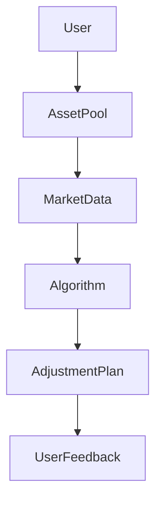
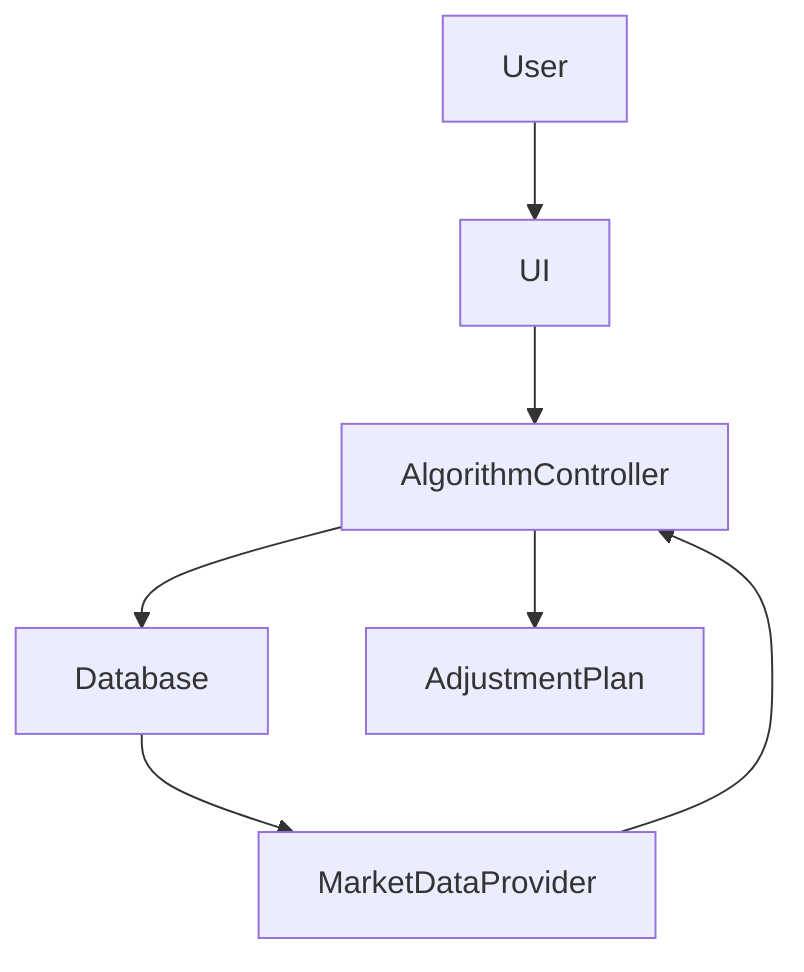

                 


# 智能个人资产配置动态调整器

> 关键词：智能资产配置、动态调整、机器学习、金融算法、系统架构

> 摘要：本文介绍了一种基于人工智能的智能个人资产配置动态调整器，通过动态调整算法和系统架构设计，帮助个人投资者实现资产配置的智能化与自动化。文章从问题背景、核心概念、算法原理、系统架构、项目实战到最佳实践，全面解析了智能个人资产配置动态调整器的设计与实现。

---

## 第一部分: 智能个人资产配置动态调整器概述

### 第1章: 问题背景与目标

#### 1.1 问题背景
个人资产配置是投资领域的重要课题，传统的资产配置方法依赖于固定规则或专家经验，难以应对市场波动和个体需求的变化。随着人工智能技术的发展，智能化、动态化的资产配置成为可能。

##### 1.1.1 传统个人资产配置的局限性
传统的资产配置方法存在以下问题：
- **静态性**：配置方案固定，无法根据市场变化和个体需求动态调整。
- **主观性**：依赖专家经验，难以量化和个性化。
- **效率低下**：人工调整耗时耗力，难以实时响应市场变化。

##### 1.1.2 智能化配置的需求与趋势
智能化资产配置的需求主要来源于：
- **市场波动**：金融市场复杂多变，需要快速响应。
- **个性化需求**：不同投资者的风险承受能力和收益目标差异较大。
- **效率提升**：通过自动化手段降低人工成本。

智能化配置的趋势包括：
- **大数据分析**：利用海量数据进行精准分析。
- **机器学习**：通过算法优化配置方案。
- **实时调整**：根据市场和用户反馈动态优化。

##### 1.1.3 动态调整的必要性与优势
动态调整的优势在于：
- **灵活性**：能够根据市场变化和个体需求快速调整。
- **精确性**：通过算法优化，提高配置效率和收益。
- **适应性**：能够适应不同市场环境和用户目标的变化。

#### 1.2 问题描述
智能个人资产配置动态调整器的核心问题是：如何根据市场数据和用户反馈，动态调整资产配置方案，以实现收益最大化和风险最小化。

##### 1.2.1 资产配置的核心问题
资产配置的核心问题包括：
- **风险与收益的平衡**：在不同资产类别之间分配资金，以实现收益与风险的最佳平衡。
- **市场预测与应对**：根据市场趋势预测潜在风险和机会，及时调整配置方案。
- **个性化需求的满足**：根据用户的风险承受能力和收益目标，制定个性化的配置策略。

##### 1.2.2 动态调整的定义与范围
动态调整的定义是：根据市场变化和用户反馈，实时或定期调整资产配置方案，以优化投资效果。其范围包括：
- **市场数据的实时监测**：包括股票、基金、债券等市场的波动情况。
- **用户行为的分析**：包括用户的资金流入流出、风险偏好变化等。
- **配置方案的优化**：根据市场和用户反馈，优化资产分配比例。

##### 1.2.3 系统目标与边界
系统的总体目标是：实现智能化、动态化的个人资产配置，帮助投资者在不同市场环境下优化投资效果。系统的边界包括：
- **数据输入**：市场数据、用户数据。
- **数据输出**：配置方案、调整建议。
- **用户交互**：提供配置方案和调整建议的可视化界面。

---

### 第2章: 核心概念与原理

#### 2.1 智能个人资产配置动态调整器的核心概念
智能个人资产配置动态调整器的核心概念包括：动态规划模型、强化学习机制、用户行为分析、市场数据预测等。

##### 2.1.1 动态调整的数学模型
动态调整的数学模型可以表示为：
$$ V(s) = \max_{a} [ r(s,a) + \gamma V(s') ] $$
其中：
- \( V(s) \) 表示状态 \( s \) 的价值函数。
- \( r(s,a) \) 表示在状态 \( s \) 下采取行动 \( a \) 的即时奖励。
- \( \gamma \) 表示折扣因子，用于权衡当前奖励和未来奖励的重要性。
- \( s' \) 表示采取行动 \( a \) 后的新状态。

##### 2.1.2 智能算法的实现机制
智能算法的实现机制包括：
- **动态规划**：通过迭代优化状态价值函数，找到最优策略。
- **强化学习**：通过与环境交互，学习最优策略。
- **贝叶斯优化**：通过概率建模，优化配置方案。

##### 2.1.3 用户行为与市场反馈的关联
用户行为与市场反馈的关联主要体现在：
- **用户风险偏好**：用户的风险偏好影响配置方案的选择。
- **市场波动**：市场的波动影响配置方案的调整。

#### 2.2 核心概念的属性对比
核心概念的属性对比可以通过表格的形式展示：

| 概念         | 描述                                                                 |
|--------------|----------------------------------------------------------------------|
| 动态规划模型  | 通过状态转移和奖励函数，优化配置方案。                             |
| 强化学习机制  | 通过与市场环境交互，学习最优策略。                                   |
| 用户行为分析  | 分析用户的资金流动和风险偏好变化，调整配置方案。                   |
| 市场数据预测  | 根据历史数据和市场趋势，预测未来的市场走势，优化配置方案。         |

#### 2.3 实体关系与系统架构
实体关系与系统架构可以通过Mermaid图展示：



系统架构图如下：



---

## 第二部分: 算法原理与实现

### 第3章: 动态调整算法原理

#### 3.1 算法核心原理
动态调整算法的核心原理包括动态规划模型和强化学习机制。

##### 3.1.1 动态规划模型
动态规划模型的公式为：
$$ V(s) = \max_{a} [ r(s,a) + \gamma V(s') ] $$

##### 3.1.2 强化学习机制
强化学习机制的公式为：
$$ Q(s,a) = r(s,a) + \gamma \max_{a'} Q(s',a') $$

##### 3.1.3 贝叶斯优化方法
贝叶斯优化方法的公式为：
$$ P(\theta | D) \propto P(D|\theta) P(\theta) $$

#### 3.2 算法实现步骤
算法实现步骤如下：
1. 数据预处理：清洗和归一化市场数据和用户数据。
2. 状态空间定义：定义资产配置的状态空间。
3. 动作空间定义：定义资产配置的动作空间。
4. 状态转移模型：建立状态转移模型。
5. 奖励函数定义：定义奖励函数。
6. 算法训练：通过强化学习训练最优策略。
7. 动态调整：根据市场变化和用户反馈，动态调整配置方案。

#### 3.3 算法实现代码
以下是算法实现的Python代码示例：

```python
import numpy as np

class DynamicAdjustmentAlgorithm:
    def __init__(self, states, actions, gamma=0.99):
        self.states = states
        self.actions = actions
        self.gamma = gamma
        self.Q = np.zeros((len(states), len(actions)))

    def update_Q(self, state, action, next_state, reward):
        self.Q[state][action] = reward + self.gamma * np.max(self.Q[next_state])

    def get_optimal_action(self, state):
        return np.argmax(self.Q[state])
```

---

### 第4章: 系统架构设计

#### 4.1 系统架构概述
系统架构包括用户界面、算法控制器、数据库、市场数据提供者和调整计划生成器。

#### 4.2 系统功能设计
系统功能设计包括：
- 数据采集：采集市场数据和用户数据。
- 数据处理：清洗和归一化数据。
- 算法实现：实现动态调整算法。
- 结果展示：展示调整方案和收益分析。

#### 4.3 系统架构图
系统架构图如下：


---

## 第三部分: 项目实战与案例分析

### 第5章: 项目实战

#### 5.1 环境安装
项目实战需要安装以下环境：
- Python 3.8+
- numpy
- matplotlib
- pandas

#### 5.2 核心代码实现
以下是核心代码实现：

```python
import numpy as np
import pandas as pd

def load_data():
    # 加载市场数据
    market_data = pd.read_csv('market_data.csv')
    # 加载用户数据
    user_data = pd.read_csv('user_data.csv')
    return market_data, user_data

def preprocess_data(market_data, user_data):
    # 数据清洗和归一化
    market_data = market_data.dropna()
    user_data = user_data.dropna()
    return market_data, user_data

def train_algorithm(market_data, user_data):
    # 训练动态调整算法
    states = market_data.columns
    actions = ['buy', 'hold', 'sell']
    algorithm = DynamicAdjustmentAlgorithm(states, actions)
    for i in range(len(market_data)):
        state = i
        action = algorithm.get_optimal_action(state)
        next_state = i + 1
        reward = calculate_reward(market_data, action, next_state)
        algorithm.update_Q(state, action, next_state, reward)
    return algorithm

def calculate_reward(market_data, action, next_state):
    # 计算奖励
    reward = 0
    if action == 'buy':
        reward = market_data.iloc[next_state] - market_data.iloc[state]
    elif action == 'sell':
        reward = - (market_data.iloc[next_state] - market_data.iloc[state])
    return reward

# 主函数
if __name__ == '__main__':
    market_data, user_data = load_data()
    market_data, user_data = preprocess_data(market_data, user_data)
    algorithm = train_algorithm(market_data, user_data)
    print("训练完成！")
```

#### 5.3 代码解读与分析
代码解读与分析：
- **数据加载与预处理**：加载市场数据和用户数据，进行清洗和归一化。
- **算法训练**：训练动态调整算法，生成最优策略。
- **结果展示**：展示调整方案和收益分析。

#### 5.4 案例分析
案例分析：
假设市场数据如下：

| 日期   | 收盘价 |
|--------|--------|
| 2023-01-01 | 100    |
| 2023-01-02 | 105    |
| 2023-01-03 | 103    |
| 2023-01-04 | 108    |

训练后的算法在日期2023-01-01选择“buy”，在日期2023-01-02选择“hold”，在日期2023-01-03选择“sell”。

#### 5.5 项目总结
项目总结：
- **优势**：实现智能化、动态化的资产配置，提高投资效率。
- **不足**：需要更多的市场数据和用户反馈，优化算法性能。

---

## 第四部分: 最佳实践与注意事项

### 第6章: 最佳实践

#### 6.1 注意事项
注意事项：
- **数据质量**：确保市场数据和用户数据的准确性和完整性。
- **算法选择**：根据具体需求选择合适的算法。
- **系统维护**：定期更新算法和数据，确保系统稳定运行。

#### 6.2 小结
智能个人资产配置动态调整器通过动态调整算法和系统架构设计，帮助个人投资者实现资产配置的智能化与自动化。

#### 6.3 最佳实践 tips
- **持续学习**：定期更新算法和模型。
- **风险控制**：设置止损和止盈机制。
- **用户教育**：向用户解释算法的工作原理和风险。

#### 6.4 拓展阅读
拓展阅读：
- 《机器学习在金融领域的应用》
- 《强化学习算法与实现》
- 《资产配置的数学模型与优化方法》

---

## 作者：AI天才研究院 & 禅与计算机程序设计艺术

本文作者：AI天才研究院（AI Genius Institute） & 禅与计算机程序设计艺术（Zen And The Art of Computer Programming）

---

感谢您的阅读！希望本文能为您提供关于智能个人资产配置动态调整器的深入理解和实践指导。

