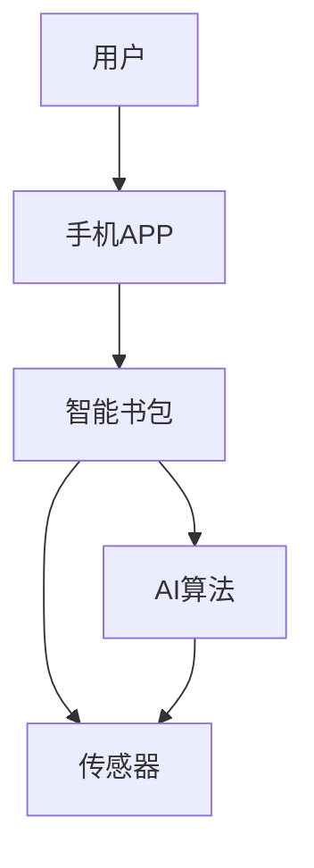

                 


# 《智能书包：AI Agent的学习用品管理助手》

## 关键词：智能书包, AI Agent, 学习用品管理, 物品识别, 状态监测, 任务提醒

## 摘要：
智能书包是一种结合人工智能技术的学习用品管理助手，通过AI Agent实现对学习用品的智能识别、状态监测和任务提醒。本文从背景、原理、算法、系统架构、项目实战到最佳实践，全面解析智能书包的设计与实现，探讨其在现代教育中的应用价值。

---

# 第1章: 智能书包的背景与核心概念

## 1.1 传统学习用品管理的痛点
### 1.1.1 传统学习用品管理的低效性
传统学习用品管理依赖手工记录，容易出错且效率低下。学生和家长常常面临丢失、忘记携带等问题，增加了管理的复杂性和时间成本。

### 1.1.2 现代学生的需求变化
随着科技的发展，学生对学习工具的需求日益多样化。他们需要高效、智能的管理工具，以帮助他们更好地组织和追踪学习用品。

### 1.1.3 传统与现代需求的冲突
传统管理方式无法满足现代学生的需求，特别是在信息快速变化的今天，传统的手动管理方式显得过于笨拙和低效。

## 1.2 智能书包的概念与问题描述
### 1.2.1 智能书包的定义
智能书包是一种结合AI技术的学习用品管理助手，通过传感器和AI算法，实时监测学习用品的状态，并通过提醒和建议帮助用户更好地管理学习用品。

### 1.2.2 学习用品管理的核心问题
- 物品丢失或遗忘
- 状态难以实时监测
- 管理效率低下

### 1.2.3 智能书包的目标与应用场景
智能书包的目标是通过智能化手段解决上述问题，其应用场景包括学生日常学习、学校管理、家庭使用等。

## 1.3 智能书包的边界与外延
### 1.3.1 智能书包的功能边界
- 物品识别与追踪
- 状态监测
- 任务提醒

### 1.3.2 与传统书包的区别
| 特性 | 传统书包 | 智能书包 |
|------|-----------|-----------|
| 功能 | 纯粹存储 | 存储+智能管理 |
| 技术 | 无智能技术 | 结合AI技术 |
| 用户体验 | 无 | 高效便捷 |

### 1.3.3 概念结构与核心要素
- **硬件**：传感器、摄像头、通信模块
- **AI算法**：物品识别、状态监测、行为决策
- **用户界面**：手机APP、书包显示屏

---

# 第2章: 智能书包的核心概念与联系

## 2.1 AI Agent的基本原理
AI Agent通过传感器获取环境信息，结合预设的算法模型，进行行为决策并执行操作。例如，通过摄像头识别书包内的物品，并通过算法判断其状态。

## 2.2 智能书包的核心功能模块
### 2.2.1 物品识别模块
- 使用图像识别技术（如OpenCV）识别书包内的物品。
- 通过训练好的模型分类物品类型。

### 2.2.2 状态监测模块
- 监测物品的放置位置、是否遗漏等。
- 通过传感器（如RFID）实时追踪物品状态。

### 2.2.3 任务提醒模块
- 根据用户的日程安排，提醒携带所需物品。
- 提供学习建议，如推荐相关学习资料。

---

# 第3章: 智能书包的算法原理

## 3.1 物品识别算法
### 3.1.1 算法流程
1. 摄像头采集书包内物品图像。
2. 图像预处理（如灰度化、边缘检测）。
3. 使用卷积神经网络（CNN）进行物品分类。

### 3.1.2 代码实现
```python
import tensorflow as tf
from tensorflow.keras import layers

model = tf.keras.Sequential([
    layers.Conv2D(32, (3,3), activation='relu', input_shape=(64,64,3)),
    layers.MaxPooling2D((2,2)),
    layers.Conv2D(64, (3,3), activation='relu'),
    layers.MaxPooling2D((2,2)),
    layers.Flatten(),
    layers.Dense(128, activation='relu'),
    layers.Dense(10, activation='softmax')
])
```

### 3.1.3 数学模型
- 使用CNN模型进行图像分类，目标函数为交叉熵损失函数：
  $$ L = -\sum_{i=1}^{n} y_i \log(p_i) $$
  其中，\( y_i \) 是真实标签，\( p_i \) 是预测概率。

## 3.2 状态监测与行为决策
### 3.2.1 算法流程
1. 传感器采集物品状态数据。
2. AI Agent分析数据，判断是否需要提醒用户。
3. 执行相应操作（如发送提醒通知）。

### 3.2.2 代码实现
```python
def monitor_items():
    while True:
        status = sensor.read_state()
        if status['missing']:
            notify_user("物品丢失，请检查！")
        time.sleep(60)
```

---

# 第4章: 智能书包的系统架构设计

## 4.1 系统功能设计
- **物品识别**：通过摄像头和AI算法识别书包内的物品。
- **状态监测**：实时监测物品的状态，如位置、是否遗漏等。
- **任务提醒**：根据用户的日程安排，提醒携带所需物品。

## 4.2 系统架构图


## 4.3 系统接口设计
- **用户接口**：手机APP或书包显示屏。
- **传感器接口**：与传感器模块通信，获取状态数据。
- **AI服务接口**：调用AI算法进行物品识别和状态分析。

---

# 第5章: 智能书包的项目实战

## 5.1 开发环境搭建
- **工具安装**：安装Python、TensorFlow、OpenCV等。
- **环境配置**：配置摄像头、传感器等硬件设备。

## 5.2 核心代码实现
### 5.2.1 物品识别模块
```python
import cv2

def recognize_item(image):
    # 图像预处理
    gray = cv2.cvtColor(image, cv2.COLOR_BGR2GRAY)
    edges = cv2.Canny(gray, 50, 150)
    return model.predict(edges)
```

### 5.2.2 状态监测模块
```python
import time

def monitor():
    while True:
        status = sensor.get_status()
        if status['battery'] < 20:
            print("电量不足，请充电！")
        time.sleep(60)
```

## 5.3 实际案例分析
- **案例一**：学生忘记带课本，系统发送提醒。
- **案例二**：书包内物品丢失，系统通知家长或老师。

---

# 第6章: 智能书包的最佳实践

## 6.1 开发中的注意事项
- **数据隐私**：确保学生数据的安全性。
- **用户体验**：设计简洁直观的用户界面。
- **系统稳定性**：确保算法的准确性和系统的稳定性。

## 6.2 总结与展望
智能书包通过AI技术解决了传统学习用品管理的痛点，未来可以通过引入更多智能设备，进一步提升管理效率。

## 6.3 拓展阅读
- 推荐阅读《人工智能: 一种现代方法》和《深入浅出计算机视觉》。

---

作者：AI天才研究院/AI Genius Institute & 禅与计算机程序设计艺术 /Zen And The Art of Computer Programming

