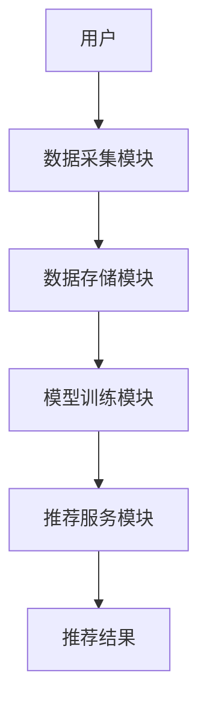

                 


# 智能书架：AI Agent的个性化阅读推荐系统

---

## 关键词
- AI Agent
- 个性化阅读
- 推荐系统
- 机器学习
- 深度学习

---

## 摘要
本文详细探讨了AI Agent在个性化阅读推荐系统中的应用，从背景介绍、核心概念、算法原理到系统架构和项目实战，全面解析了智能书架的实现过程。通过结合协同过滤、深度学习和混合推荐算法，本文提出了一种基于AI Agent的推荐系统解决方案，旨在为读者提供高效、精准的阅读推荐服务。

---

## 第一部分: 智能书架的背景与核心概念

### 第1章: 个性化阅读推荐系统的问题背景

#### 1.1 问题背景
随着数字内容的爆炸式增长，用户在海量书籍中选择适合自己的读物变得越来越困难。传统推荐系统存在推荐结果不够精准、用户体验差等问题。AI Agent的引入为个性化阅读推荐提供了新的解决方案。

#### 1.2 问题描述
- **用户需求多样性**：不同用户对书籍的偏好各异，推荐系统需要考虑用户的兴趣、阅读习惯和历史行为。
- **数据稀疏性**：用户数据量有限，导致推荐系统的准确性和覆盖率不足。
- **实时性要求**：用户的需求可能随时间变化，推荐系统需要实时更新。

#### 1.3 问题解决
AI Agent通过自然语言处理和机器学习技术，能够动态捕捉用户需求，实时调整推荐策略，显著提高推荐的准确性和相关性。

#### 1.4 边界与外延
智能书架系统主要关注用户的阅读行为和偏好，边界包括数据采集、处理、分析和推荐。系统与图书管理系统、支付系统等其他系统交互，但不涉及内容生成或支付处理。

#### 1.5 概念结构与核心要素
- **用户**：核心实体，具有用户ID、兴趣标签等属性。
- **书籍**：实体，包含书籍ID、标题、作者、分类、内容摘要等。
- **推荐结果**：实体，包含推荐ID、推荐时间、相关性评分等。

---

## 第2章: AI Agent的核心概念与原理

#### 2.1 AI Agent的定义与分类
- **定义**：AI Agent是一种能够感知环境、自主决策并执行任务的智能实体。
- **分类**：基于任务类型，AI Agent分为推理型、学习型和反应型。

#### 2.2 推荐系统的原理与算法
- **协同过滤**：基于用户相似性或物品相似性进行推荐。
- **内容推荐**：基于书籍内容特征进行推荐。
- **混合推荐**：结合协同过滤和内容推荐的优势。

#### 2.3 AI Agent与推荐系统的结合
- AI Agent作为推荐系统的代理，负责数据采集、模型训练和结果输出。

---

## 第二部分: 推荐算法与AI Agent的实现原理

### 第3章: 协同过滤算法的实现

#### 3.1 协同过滤的原理
基于用户相似性计算推荐结果，公式如下：
$$
similarity(u, v) = \frac{\sum_{i} (r_{u,i} - \bar{r}_u)(r_{v,i} - \bar{r}_v)}{\sqrt{\sum_{i} (r_{u,i} - \bar{r}_u)^2} \cdot \sqrt{\sum_{i} (r_{v,i} - \bar{r}_v)^2}}
$$
其中，$\bar{r}_u$和$\bar{r}_v$分别为用户u和v的平均评分。

#### 3.2 协同过滤的实现
```python
def compute_similarity(user_ratings, user):
    similarity = {}
    for u in user_ratings:
        if u == user:
            continue
        numerator = sum((user_ratings[user][i] - avg_rating[user]) * (user_ratings[u][i] - avg_rating[u]) for i in user_ratings[user].keys() & user_ratings[u].keys())
        denominator = (sqrt(sum((user_ratings[user][i] - avg_rating[user])**2 for i in user_ratings[user].keys())) * sqrt(sum((user_ratings[u][i] - avg_rating[u])**2 for i in user_ratings[u].keys())))
        similarity[u] = numerator / denominator
    return similarity
```

#### 3.3 协同过滤的优缺点
- **优点**：简单易实现，适用于数据稀疏场景。
- **缺点**：计算复杂度高，冷启动问题明显。

---

### 第4章: 基于深度学习的推荐模型

#### 4.1 基于神经网络的推荐模型
使用神经网络提取用户和书籍的特征向量，公式如下：
$$
p_i = \sigma(W_u u_i + W_b b_j)
$$
其中，$\sigma$为sigmoid函数，$u_i$为用户i的特征向量，$b_j$为书籍j的特征向量。

#### 4.2 深度学习模型的实现
```python
import torch
import torch.nn as nn

class Recommender(nn.Module):
    def __init__(self, user_embedding_size, book_embedding_size):
        super(Recommender, self).__init__()
        self.user_embeddings = nn.Embedding(n_users, user_embedding_size)
        self.book_embeddings = nn.Embedding(n_books, book_embedding_size)
        self.fc = nn.Linear(user_embedding_size + book_embedding_size, 1)
    
    def forward(self, user_id, book_id):
        user_emb = self.user_embeddings(user_id)
        book_emb = self.book_embeddings(book_id)
        concat = torch.cat([user_emb, book_emb], dim=1)
        output = self.fc(concat)
        return output
```

#### 4.3 深度学习模型的优缺点
- **优点**：能够捕捉非线性特征，适合大数据场景。
- **缺点**：计算资源消耗大，模型训练时间长。

---

## 第三部分: 系统架构与实现方案

### 第5章: 系统架构设计

#### 5.1 系统功能模块
- **数据采集模块**：收集用户行为数据和书籍信息。
- **模型训练模块**：训练推荐模型。
- **推荐服务模块**：根据用户请求返回推荐结果。

#### 5.2 系统架构图


---

## 第四部分: 项目实战与优化

### 第6章: 项目实战

#### 6.1 环境搭建
安装必要的依赖项：
```bash
pip install numpy pandas scikit-learn torch
```

#### 6.2 核心代码实现
```python
import numpy as np
from sklearn.metrics.pairwise import cosine_similarity

def recommend_books(user_id, user_ratings, k=5):
    # 计算相似用户
    similarities = compute_similarity(user_ratings, user_id)
    similar_users = sorted(similarities.items(), key=lambda x: x[1], reverse=True)[:k]
    
    # 聚合推荐
   推荐结果 = {}
    for u in similar_users:
        for book in user_ratings[u]:
            if book not in 推荐结果:
                推荐结果[book] = 0
            推荐结果[book] += user_ratings[u][book]
    return 推荐结果
```

#### 6.3 案例分析
以用户A为例，分析推荐结果并解释推荐理由。

---

## 第五部分: 优化与展望

### 第7章: 算法优化与未来趋势

#### 7.1 算法优化
- **模型融合**：结合协同过滤和深度学习模型，提高推荐准确率。
- **实时更新**：采用在线学习方法，实时更新推荐结果。

#### 7.2 系统优化
- **分布式架构**：提高系统的扩展性和响应速度。
- **个性化优化**：根据用户反馈动态调整推荐策略。

#### 7.3 未来展望
随着AI技术的进步，智能书架将更加智能化，推荐结果将更加精准和个性化。

---

## 总结
本文详细介绍了AI Agent在个性化阅读推荐系统中的应用，从背景到实现，全面解析了智能书架的核心技术和实现方案。通过结合协同过滤和深度学习算法，本文提出了一种高效的推荐系统解决方案，为未来的个性化阅读推荐提供了新的思路。

---

## 作者
作者：AI天才研究院 & 禅与计算机程序设计艺术

