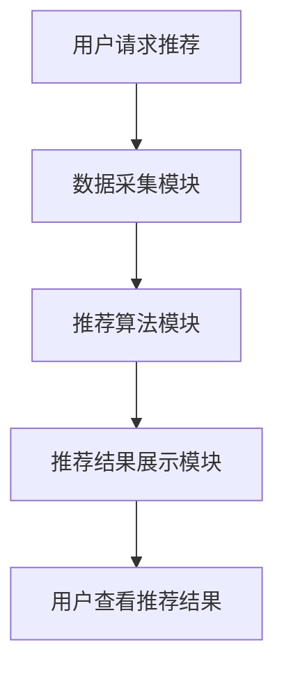
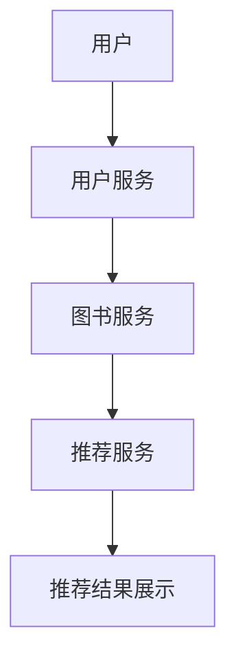
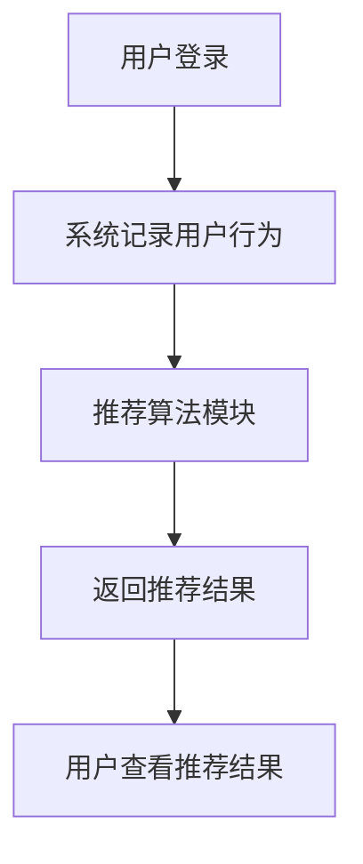

                 


# 智能书架：AI Agent的图书推荐系统

> 关键词：智能书架，AI Agent，图书推荐，推荐系统，算法原理，系统架构，项目实战

> 摘要：本文详细介绍了基于AI Agent的智能书架系统，从背景、核心概念、算法原理到系统架构、项目实战，全面解析了如何利用AI技术实现智能图书推荐。文章通过详细的技术分析和实际案例，展示了如何构建一个高效、精准的图书推荐系统。

---

## 第一部分: 智能书架的背景与核心概念

### 第1章: 智能书架概述

#### 1.1 AI Agent与图书推荐系统

- **1.1.1 AI Agent的基本概念**
  - AI Agent是一种智能体，能够感知环境并执行任务。
  - 在图书推荐中，AI Agent用于分析用户需求和图书信息，提供个性化推荐。

- **1.1.2 图书推荐系统的定义与特点**
  - 图书推荐系统通过分析用户行为和图书属性，提供个性化的推荐结果。
  - 特点：个性化、实时性、高效性。

- **1.1.3 智能书架的核心目标与应用场景**
  - 核心目标：提升用户体验，提高推荐准确率。
  - 应用场景：在线书店、图书馆、阅读app等。

#### 1.2 智能书架的背景与意义

- **1.2.1 传统图书推荐系统的局限性**
  - 数据稀疏性问题：用户数据不足导致推荐精度低。
  - 单一推荐方式：仅依赖协同过滤或内容推荐，无法覆盖复杂需求。

- **1.2.2 AI Agent在图书推荐中的优势**
  - 多模态数据处理：结合文本、用户行为等多种数据源。
  - 实时反馈：根据用户实时行为动态调整推荐结果。

- **1.2.3 智能书架的市场价值与社会影响**
  - 提高用户满意度，增加销售转化率。
  - 促进知识传播，帮助用户发现感兴趣的内容。

#### 1.3 本章小结

- 本章介绍了智能书架的核心概念和背景，强调了AI Agent在推荐系统中的重要性。

---

## 第二部分: AI Agent与推荐系统的核心原理

### 第2章: AI Agent的基本原理

#### 2.1 自然语言处理技术

- **2.1.1 NLP的核心技术与应用**
  - 分词、实体识别、情感分析等技术在图书推荐中的应用。
  - 例如，通过NLP分析图书摘要和用户评论，提取关键词和主题。

- **2.1.2 Transformer模型与文本理解**
  - Transformer模型在NLP任务中的优势。
  - 在图书推荐中，用于理解和生成文本描述。

- **2.1.3 预训练语言模型在图书推荐中的应用**
  - 使用如BERT、GPT等模型进行文本特征提取。
  - 示例：利用BERT提取图书的语义向量，用于相似性计算。

#### 2.2 知识图谱与关联推理

- **2.2.1 知识图谱的构建与表示**
  - 知识图谱的构建方法：从结构化数据和非结构化数据中提取实体和关系。
  - 图书知识图谱的表示：使用节点和边表示图书及其属性。

- **2.2.2 图书之间的关联推理**
  - 基于知识图谱的相似性计算：通过共享节点或边进行推理。
  - 示例：通过知识图谱推理出同一作者的其他书籍推荐。

- **2.2.3 用户行为与图书属性的关联分析**
  - 分析用户行为数据（点击、收藏、购买）与图书属性（分类、主题）的关联。
  - 示例：根据用户的购买历史推荐相关书籍。

#### 2.3 本章小结

- 本章介绍了AI Agent中NLP和知识图谱的核心技术及其在图书推荐中的应用。

### 第3章: 推荐系统的算法原理

#### 3.1 协同过滤算法

- **3.1.1 基于用户的协同过滤**
  - 计算用户之间的相似度，推荐相似用户的高评分书籍。
  - 示例：使用余弦相似度计算用户相似度。

- **3.1.2 基于物品的协同过滤**
  - 计算图书之间的相似度，推荐用户已评分的相似书籍。
  - 示例：使用余弦相似度计算图书相似度。

- **3.1.3 混合推荐模型的优缺点**
  - 混合模型结合了基于用户的和基于物品的推荐方法。
  - 优点：平衡了准确性和多样性；缺点：计算复杂度高。

#### 3.2 基于内容的推荐算法

- **3.2.1 文本特征提取与相似度计算**
  - 使用TF-IDF或Word2Vec提取文本特征。
  - 示例：提取图书摘要的特征向量，计算相似度。

- **3.2.2 基于向量空间模型的推荐**
  - 将图书表示为向量空间中的点，计算用户查询与图书向量的相似度。
  - 示例：使用cosine相似度计算推荐结果。

- **3.2.3 基于深度学习的内容推荐**
  - 使用神经网络模型（如CNN、RNN）进行内容特征提取。
  - 示例：使用BERT模型提取图书内容的语义向量。

#### 3.3 基于深度学习的推荐算法

- **3.3.1 神经网络在推荐系统中的应用**
  - 使用神经网络对用户行为和图书属性进行建模。
  - 示例：使用多层感知机（MLP）进行推荐。

- **3.3.2 注意力机制在推荐系统中的实现**
  - 使用注意力机制捕捉重要特征。
  - 示例：在序列推荐中，注意力机制用于捕捉用户最近行为的重要性。

- **3.3.3 图神经网络在图书推荐中的应用**
  - 使用图神经网络处理图书知识图谱。
  - 示例：通过GAT模型进行图数据的节点分类。

#### 3.4 本章小结

- 本章详细介绍了协同过滤、基于内容的推荐和深度学习推荐算法的原理及其在图书推荐中的应用。

---

## 第三部分: 智能书架的系统架构设计

### 第4章: 智能书架的系统架构设计

#### 4.1 系统功能设计

- **4.1.1 用户需求分析**
  - 用户需求：个性化推荐、实时反馈、多样化的推荐结果。
  - 示例：用户希望根据阅读历史推荐类似书籍。

- **4.1.2 系统功能模块划分**
  - 数据采集模块：收集用户行为和图书数据。
  - 推荐算法模块：实现多种推荐算法。
  - 推荐结果展示模块：将推荐结果呈现给用户。

- **4.1.3 系统功能流程图**
  - 使用Mermaid绘制系统功能流程图。



#### 4.2 系统架构设计

- **4.2.1 分层架构设计**
  - 分层架构：展示层、业务逻辑层、数据访问层。
  - 示例：前端展示推荐结果，后端处理推荐算法，数据库存储数据。

- **4.2.2 微服务架构设计**
  - 微服务架构：用户服务、图书服务、推荐服务。
  - 示例：用户服务处理用户认证，图书服务管理图书信息，推荐服务执行推荐算法。

- **4.2.3 系统组件之间的交互关系**
  - 使用Mermaid绘制系统架构图。



#### 4.3 数据库设计

- **4.3.1 用户数据库设计**
  - 用户表：存储用户ID、用户名、密码等信息。
  - 示例：`CREATE TABLE users (id INT PRIMARY KEY, username VARCHAR(255), password VARCHAR(255));`

- **4.3.2 图书数据库设计**
  - 图书表：存储图书ID、书名、作者、分类等信息。
  - 示例：`CREATE TABLE books (id INT PRIMARY KEY, title VARCHAR(255), author VARCHAR(255), category VARCHAR(255));`

- **4.3.3 推荐结果数据库设计**
  - 推荐记录表：存储推荐结果和时间。
  - 示例：`CREATE TABLE recommendations (user_id INT, book_id INT, recommendation_time DATETIME, PRIMARY KEY (user_id, book_id));`

#### 4.4 接口设计与交互设计

- **4.4.1 系统接口定义**
  - RESTful API：`GET /recommendations/{userId}`。
  - 示例：用户请求推荐结果，系统返回推荐书籍列表。

- **4.4.2 用户交互流程设计**
  - 用户登录系统，系统记录用户行为。
  - 系统根据用户行为调用推荐算法，返回推荐结果。
  - 使用Mermaid绘制交互流程图。



- **4.4.3 系统日志与监控设计**
  - 记录推荐系统的运行状态和错误日志。
  - 示例：`log.error("推荐算法执行失败");`

#### 4.5 本章小结

- 本章详细介绍了智能书架的系统架构设计，包括功能设计、架构设计、数据库设计和接口设计。

---

## 第四部分: 智能书架的算法实现

### 第5章: 智能书架的算法实现

#### 5.1 环境搭建

- **5.1.1 安装Python和相关库**
  - 安装Python 3.8及以上版本。
  - 安装库：`pip install numpy pandas scikit-learn transformers`。

#### 5.2 核心代码实现

- **5.2.1 数据预处理**
  - 加载数据：`import pandas as pd; data = pd.read_csv('books.csv')`。
  - 数据清洗：`data.dropna()`。

- **5.2.2 推荐算法实现**
  - 协同过滤算法实现：
    ```python
    from sklearn.metrics.pairwise import cosine_similarity

    user_similarity = cosine_similarity(user_features)
    ```

  - 基于内容的推荐实现：
    ```python
    from sklearn.feature_extraction.text import TfidfVectorizer

    vectorizer = TfidfVectorizer()
    book_vectors = vectorizer.fit_transform(books.description)
    ```

  - 深度学习推荐实现：
    ```python
    from transformers import AutoTokenizer, AutoModel

    tokenizer = AutoTokenizer.from_pretrained('bert-base-uncased')
    model = AutoModel.from_pretrained('bert-base-uncased')
    ```

- **5.2.3 推荐结果展示**
  - 展示推荐结果：`print("推荐的书籍为：", recommended_books)`。

#### 5.3 项目实战

- **5.3.1 数据集选择**
  - 使用公开数据集：MovieLens扩展到图书推荐。

- **5.3.2 实际案例分析**
  - 示例：基于用户的协同过滤推荐。

- **5.3.3 代码实现与解读**
  - 详细解读代码实现，包括数据加载、特征提取、模型训练和结果展示。

#### 5.4 本章小结

- 本章通过实际案例展示了智能书架的算法实现过程，包括环境搭建、数据预处理、算法实现和结果展示。

---

## 第五部分: 智能书架的最佳实践与小结

### 第6章: 最佳实践与小结

#### 6.1 最佳实践

- **6.1.1 系统优化建议**
  - 使用分布式架构提高性能。
  - 优化推荐算法，如结合多种推荐方法提高推荐准确率。

- **6.1.2 代码规范与文档管理**
  - 遵循代码规范，如PEP 8。
  - 维护详细的文档，方便后续开发和维护。

- **6.1.3 测试与部署**
  - 编写单元测试，确保代码质量。
  - 使用容器化技术（如Docker）部署系统。

#### 6.2 小结

- 本章总结了智能书架开发中的最佳实践，包括系统优化、代码规范和测试部署。

---

## 作者信息

作者：AI天才研究院/AI Genius Institute & 禅与计算机程序设计艺术 /Zen And The Art of Computer Programming

---

通过以上结构，文章详细介绍了智能书架的设计与实现，从背景到算法，从系统架构到项目实战，全面解析了AI Agent在图书推荐中的应用。希望对您有所帮助！

