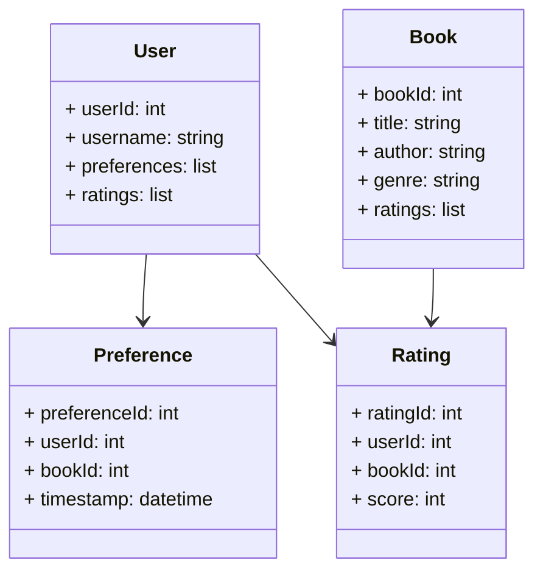
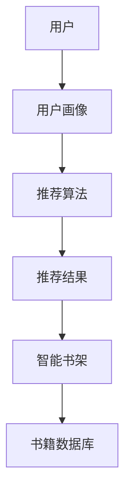
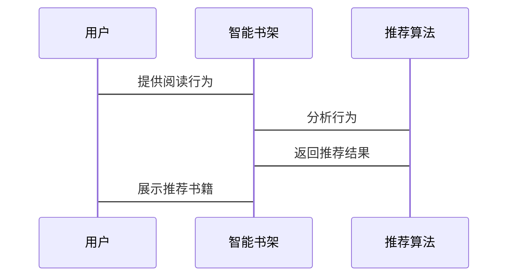

                 


# 智能书架：AI Agent的阅读习惯分析

> 关键词：智能书架，AI Agent，阅读习惯分析，推荐算法，协同过滤，内容过滤

> 摘要：本文详细探讨了智能书架中AI Agent的阅读习惯分析方法，从背景介绍、核心概念、算法原理、系统架构设计到项目实战，系统地分析了如何利用AI技术优化用户的阅读体验。通过协同过滤、内容过滤和混合推荐算法的深入讲解，结合实际案例分析，本文为读者提供了全面的技术视角和实践指导。

---

## 第一部分：背景介绍

### 第1章：智能书架与AI Agent概述

#### 1.1 问题背景
随着数字化阅读的普及，用户每天接触的信息量急剧增加，如何高效管理阅读习惯并推荐合适的内容成为一个重要课题。AI Agent作为一种智能助手，能够通过学习用户的阅读行为，提供个性化的阅读建议，从而优化用户的阅读体验。然而，现有的阅读习惯分析方法普遍存在推荐精准度不高、实时性差等问题。

#### 1.2 定义与范围
- **AI Agent**：一种能够自主学习和执行任务的智能体，能够根据用户行为和反馈不断优化推荐策略。
- **阅读习惯分析**：通过对用户的阅读行为、偏好和反馈进行建模，挖掘用户的阅读模式和兴趣点。
- **智能书架**：结合AI Agent的阅读习惯分析能力，提供智能化的内容推荐和管理功能。

#### 1.3 当前挑战
- 数据量大：用户的阅读行为数据复杂且多样化，如何高效处理这些数据是关键。
- 精准推荐：现有推荐算法在冷启动和长尾用户问题上表现不佳。
- 实时性：实时分析用户的阅读行为并动态调整推荐策略需要高效的计算能力。

#### 1.4 目标与意义
通过AI Agent对用户的阅读习惯进行深入分析，构建一个智能化的书架系统，实现精准的内容推荐和个性化管理，提升用户的阅读效率和体验。

---

## 第二部分：核心概念与联系

### 第2章：AI Agent与阅读习惯分析的核心概念

#### 2.1 核心概念原理
- **AI Agent**：基于机器学习和自然语言处理技术，能够理解用户需求并提供个性化服务。
- **阅读习惯分析**：通过分析用户的阅读行为、偏好和反馈，构建用户画像并预测未来的阅读需求。
- **智能书架**：结合AI Agent的分析结果，提供智能化的内容推荐和管理功能。

#### 2.2 概念对比与ER图
以下是AI Agent和传统推荐系统的对比分析：

| **特性**       | **AI Agent推荐**                  | **传统推荐系统**                |
|----------------|-----------------------------------|-------------------------------|
| 数据来源       | 用户行为、偏好、反馈            | 用户行为、评分、点击数据        |
| 个性化程度     | 高，基于实时行为动态调整        | 中，基于历史数据静态调整        |
| 实时性         | 高，能够实时分析和调整推荐       | 低，通常需要离线处理            |
| 智能性         | 高，能够主动学习和优化推荐策略   | 低，依赖预定义的规则和模型      |

以下是智能书架的ER实体关系图：

```mermaid
er
actor: 用户
act: 参与
book: 书籍
preference: 偏好
rating: 评分

actor -[参与]-> preference
preference -[评分]-> rating
actor -[参与]-> book
book -[评分]-> rating
```

---

## 第三部分：算法原理

### 第3章：阅读习惯分析的算法实现

#### 3.1 协同过滤算法
协同过滤是一种基于用户行为相似性的推荐算法，分为基于用户的协同过滤和基于物品的协同过滤。

##### 3.1.1 用户-用户协同过滤
- **原理**：找到与目标用户行为相似的其他用户，推荐这些用户喜欢的内容。
- **步骤**：
  1. 计算用户之间的相似度（如余弦相似度）。
  2. 找到与目标用户相似度高的用户。
  3. 推荐这些用户喜欢的书籍。

##### 3.1.2 物品-物品协同过滤
- **原理**：找到与目标用户已阅读书籍相似的其他书籍，推荐这些书籍。
- **步骤**：
  1. 计算书籍之间的相似度。
  2. 找到目标用户已阅读的书籍。
  3. 推荐与这些书籍相似的其他书籍。

##### 3.1.3 余弦相似度公式
$$ \text{相似度} = \frac{\sum x_i y_i}{\sqrt{\sum x_i^2} \cdot \sqrt{\sum y_i^2}} $$

#### 3.2 内容过滤算法
内容过滤算法基于书籍的内容特征进行推荐，常见的方法包括TF-IDF和主题模型。

##### 3.2.1 TF-IDF
- **原理**：计算书籍中关键词的权重，用于表示书籍的内容特征。
- **步骤**：
  1. 提取书籍内容的关键词。
  2. 计算每个关键词的TF-IDF值。
  3. 基于内容相似度推荐书籍。

##### 3.2.2 主题模型
- **原理**：使用主题模型（如LDA）提取书籍的主题，基于主题相似度进行推荐。
- **步骤**：
  1. 对书籍进行主题建模，提取主题分布。
  2. 计算目标书籍与主题分布相似的书籍。

#### 3.3 混合推荐算法
混合推荐算法结合协同过滤和内容过滤的优点，通过加权融合两种算法的推荐结果，提升推荐的准确性和多样性。

---

## 第四部分：系统分析与架构设计

### 第4章：智能书架的系统架构

#### 4.1 系统功能设计
以下是智能书架的领域模型类图：



#### 4.2 系统架构设计
以下是智能书架的系统架构图：



#### 4.3 接口设计
- **输入接口**：用户行为数据（点击、评分、反馈）。
- **输出接口**：推荐书籍列表、阅读建议。

#### 4.4 交互流程
以下是用户与智能书架的交互流程：



---

## 第五部分：项目实战

### 第5章：智能书架的实现

#### 5.1 环境安装
需要安装以下工具和库：
- Python 3.8+
- Jupyter Notebook
- Pandas、Scikit-learn、Numpy、NLTK

#### 5.2 核心代码实现
以下是协同过滤算法的实现代码：

```python
import numpy as np
from sklearn.metrics.pairwise import cosine_similarity

class CollaborativeFiltering:
    def __init__(self):
        self.user_items = {}

    def add_user(self, user_id, items):
        self.user_items[user_id] = items

    def get_similar_users(self, target_user, k=3):
        user_ids = list(self.user_items.keys())
        target_items = self.user_items[target_user]
        similarities = []
        for user in user_ids:
            if user == target_user:
                continue
            user_items = self.user_items[user]
            common = [item for item in target_items if item in user_items]
            if len(common) == 0:
                similarity = 0
            else:
                target_vector = np.array([1 if item in user_items else 0 for item in common])
                user_vector = np.array([1 if item in target_items else 0 for item in common])
                similarity = cosine_similarity(target_vector.reshape(1, -1), user_vector.reshape(1, -1))[0][0]
            similarities.append((user, similarity))
        similarities.sort(key=lambda x: x[1], reverse=True)
        return similarities[:k]

    def recommend_items(self, target_user, k=3):
        similar_users = self.get_similar_users(target_user, k)
        recommended_items = {}
        for user, similarity in similar_users:
            for item in self.user_items[user]:
                if item not in self.user_items[target_user]:
                    if item in recommended_items:
                        recommended_items[item] += similarity
                    else:
                        recommended_items[item] = similarity
        sorted_recommendations = sorted(recommended_items.items(), key=lambda x: x[1], reverse=True)
        return sorted_recommendations
```

#### 5.3 代码解读与优化
- **数据预处理**：对用户行为数据进行清洗和特征提取。
- **模型训练**：使用协同过滤算法训练推荐模型。
- **结果评估**：通过准确率、召回率和F1值评估推荐效果。

#### 5.4 实际案例分析
通过实际案例分析协同过滤算法在智能书架中的应用效果，展示如何优化推荐策略和提升推荐精准度。

---

## 第六部分：最佳实践与总结

### 第6章：总结与展望

#### 6.1 最佳实践
- 数据质量：确保数据的完整性和准确性。
- 模型优化：结合多种推荐算法提升推荐效果。
- 实时性：优化算法和架构设计，提升推荐的实时性。

#### 6.2 小结
本文详细探讨了智能书架中AI Agent的阅读习惯分析方法，从算法原理到系统架构设计，再到实际项目实战，为读者提供了全面的技术视角和实践指导。

#### 6.3 注意事项
- 数据隐私：保护用户的阅读数据不被滥用。
- 算法选择：根据具体需求选择合适的推荐算法。
- 系统性能：优化算法和架构设计，提升系统性能。

#### 6.4 拓展阅读
推荐进一步阅读以下内容：
- 《推荐系统实战》
- 《机器学习：实战》
- 《自然语言处理入门》

---

作者：AI天才研究院/AI Genius Institute & 禅与计算机程序设计艺术 /Zen And The Art of Computer Programming

