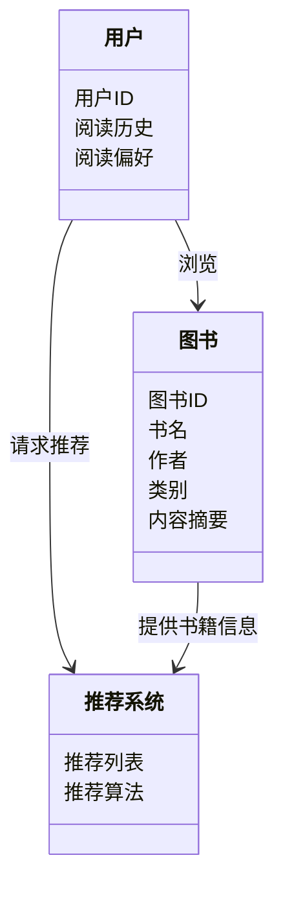
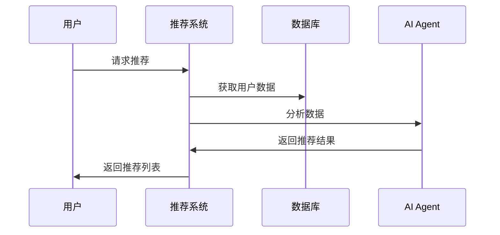

                 


# 智能书架：AI Agent的阅读兴趣分析

## 关键词：
- AI Agent
- 阅读兴趣分析
- 智能书架
- 推荐系统
- 自然语言处理

## 摘要：
本文详细探讨了AI Agent在阅读兴趣分析中的应用，从背景介绍、核心概念、算法原理到系统架构，再到项目实战，全面解析智能书架的技术实现与应用场景。通过详细的技术分析和实际案例，展示了如何利用AI技术提升用户的阅读体验。

---

# 第一部分：智能书架与AI Agent的背景介绍

## 第1章：智能书架与AI Agent的背景

### 1.1 问题背景与定义

#### 1.1.1 阅读兴趣分析的背景
在信息爆炸的时代，用户每天面对海量的信息，如何高效地筛选出符合个人兴趣的内容成为一项挑战。传统的推荐系统虽然能够提供一定的推荐，但往往缺乏深度和个性化。AI Agent作为一种智能代理，能够通过学习用户的阅读习惯和偏好，提供更精准的推荐，从而提升用户体验。

#### 1.1.2 AI Agent的核心概念
AI Agent（智能代理）是指能够感知环境并采取行动以实现目标的智能体。在阅读兴趣分析中，AI Agent能够实时分析用户的阅读行为，预测用户的兴趣偏好，并推荐相关的内容。

#### 1.1.3 智能书架的定义与目标
智能书架是一种基于AI技术的推荐系统，旨在通过分析用户的阅读行为和偏好，为用户提供个性化的书籍推荐。其目标是通过智能化的推荐算法，提升用户的阅读体验，帮助用户发现感兴趣的内容。

### 1.2 技术基础与应用价值

#### 1.2.1 自然语言处理技术
自然语言处理（NLP）是AI Agent进行阅读兴趣分析的核心技术之一。通过对书籍内容的分析，AI Agent能够提取书籍的主题、情感倾向等信息，从而更好地理解用户的需求。

#### 1.2.2 机器学习与推荐系统
机器学习算法，特别是协同过滤和深度学习模型，在阅读兴趣分析中扮演着重要角色。通过训练模型，AI Agent能够预测用户的阅读偏好，并推荐相关书籍。

#### 1.2.3 智能书架的应用场景
智能书架可以应用于在线书店、图书馆、阅读App等多种场景。通过个性化推荐，智能书架能够帮助用户快速找到感兴趣的内容，提高用户的满意度和粘性。

### 1.3 本章小结
本章主要介绍了智能书架和AI Agent的背景，阐述了阅读兴趣分析的重要性以及AI Agent的核心概念和技术基础。通过这些分析，我们可以理解智能书架的应用价值和实现目标。

---

# 第二部分：AI Agent与阅读兴趣分析的核心概念

## 第2章：AI Agent与阅读兴趣分析的原理

### 2.1 AI Agent的核心原理

#### 2.1.1 AI Agent的基本构成
AI Agent通常由感知模块、推理模块和行动模块组成。在阅读兴趣分析中，感知模块负责收集用户的阅读行为数据，推理模块分析这些数据以理解用户的兴趣，行动模块则根据分析结果推荐书籍。

#### 2.1.2 代理与环境的交互机制
AI Agent通过与环境的交互来实现目标。在智能书架中，环境包括用户、书籍数据库等。AI Agent通过收集用户数据、分析数据并采取行动（如推荐书籍）来实现目标。

#### 2.1.3 AI Agent的学习与进化
AI Agent能够通过机器学习算法不断优化自身的推荐策略。通过反馈机制，AI Agent能够学习用户的偏好变化，并动态调整推荐策略。

### 2.2 阅读兴趣分析的数学模型

#### 2.2.1 用户行为模型
用户行为模型描述了用户在阅读过程中的行为模式。通过分析用户的点击、浏览、购买等行为，AI Agent可以预测用户的兴趣偏好。

#### 2.2.2 文本相似度计算
文本相似度计算是基于NLP技术的核心任务。通过对书籍内容的分析，计算书籍之间的相似度，从而为推荐系统提供依据。

#### 2.2.3 推荐算法的基础框架
推荐算法的基础框架包括数据收集、特征提取、模型训练和结果输出等步骤。不同的推荐算法（如协同过滤、深度学习模型）在实现上有所不同，但整体框架相似。

### 2.3 核心概念对比表

| **对比项** | **AI Agent** | **传统推荐系统** |
|------------|--------------|------------------|
| **核心目标** | 实现动态推荐 | 提供静态推荐     |
| **学习能力** | 强大的学习能力 | 较弱的学习能力   |
| **适应性** | 高度适应用户变化 | 较低的适应性     |

### 2.4 ER实体关系图

```mermaid
er
actor: 用户
book: 图书
preference: 阅读偏好
interaction: 用户互动

actor -|> interaction: 发起互动
interaction -|> book: 关联书籍
interaction -|> preference: 生成偏好
```

### 2.5 本章小结
本章详细阐述了AI Agent的核心原理和阅读兴趣分析的数学模型，通过对比表和ER图展示了AI Agent与传统推荐系统的区别，为后续的算法实现奠定了基础。

---

# 第三部分：阅读兴趣分析的算法原理

## 第3章：阅读兴趣分析的算法详解

### 3.1 基于协同过滤的推荐算法

#### 3.1.1 用户-用户协同过滤
用户-用户协同过滤是基于用户之间的相似性进行推荐。通过计算用户之间的相似度，找到相似用户的推荐列表。

#### 3.1.2 物品-物品协同过滤
物品-物品协同过滤是基于书籍之间的相似性进行推荐。通过分析书籍的属性和用户行为，计算书籍之间的相似度，推荐相似的书籍。

#### 3.1.3 混合推荐算法
混合推荐算法结合了用户-用户和物品-物品协同过滤的优点，通过集成两种算法的结果，提升推荐的准确性和多样性。

### 3.2 基于深度学习的阅读兴趣分析

#### 3.2.1 基于词嵌入的文本表示
词嵌入（如Word2Vec）通过将词语映射到向量空间，实现对文本的语义表示。在阅读兴趣分析中，词嵌入可以用于表示书籍的内容和用户偏好。

#### 3.2.2 基于神经网络的推荐模型
神经网络推荐模型（如深度协同过滤）通过构建深度学习模型，捕捉用户和物品之间的复杂关系，提升推荐的准确性。

#### 3.2.3 Transformer模型在阅读兴趣分析中的应用
Transformer模型通过自注意力机制，捕捉文本中的长距离依赖关系，提升文本表示的准确性。在阅读兴趣分析中，Transformer模型可以用于书籍内容的理解和推荐。

### 3.3 算法对比与优化

#### 3.3.1 协同过滤与深度学习的对比
| **对比项** | **协同过滤** | **深度学习** |
|------------|--------------|-------------|
| **准确性** | 较低 | 较高       |
| **计算复杂度** | 较低 | 较高        |
| **数据需求** | 较多 | 较少        |

#### 3.3.2 算法优化策略
1. **数据预处理**：对数据进行清洗和特征提取，提升算法的准确性。
2. **模型调优**：通过交叉验证和超参数优化，提升模型的性能。
3. **混合推荐**：结合多种算法的优势，提升推荐的准确性和多样性。

### 3.4 本章小结
本章详细讲解了协同过滤和深度学习在阅读兴趣分析中的应用，分析了不同算法的优缺点，并提出了优化策略，为后续的系统实现提供了理论基础。

---

# 第四部分：系统分析与架构设计

## 第4章：智能书架的系统分析与架构设计

### 4.1 问题场景介绍

#### 4.1.1 需求分析
智能书架需要满足以下需求：
1. 支持多平台访问。
2. 提供个性化的书籍推荐。
3. 支持用户数据的实时更新。

#### 4.1.2 问题描述
传统推荐系统存在推荐准确性低、用户体验差等问题。AI Agent通过实时学习用户的阅读行为，能够提供更精准的推荐。

### 4.2 系统功能设计

#### 4.2.1 领域模型设计


#### 4.2.2 系统架构设计
```mermaid
graph TD
    用户 --> API Gateway
    API Gateway --> 推荐服务
    推荐服务 --> 数据库
    推荐服务 --> AI Agent
    AI Agent --> 模型训练
```

### 4.3 系统接口设计

#### 4.3.1 用户接口
用户可以通过Web或移动App访问智能书架，进行书籍浏览和推荐请求。

#### 4.3.2 API接口
API接口用于前后端的数据交互，推荐系统通过API接口接收用户的请求，并返回推荐结果。

### 4.4 系统交互设计

#### 4.4.1 交互流程
1. 用户发起推荐请求。
2. 系统接收请求，调用推荐算法。
3. 算法分析用户数据，生成推荐列表。
4. 系统返回推荐结果。

#### 4.4.2 交互图示


### 4.5 本章小结
本章通过系统分析和架构设计，展示了智能书架的整体结构和各模块之间的交互关系，为后续的实现提供了指导。

---

# 第五部分：项目实战

## 第5章：智能书架的项目实现

### 5.1 环境安装与配置

#### 5.1.1 环境要求
1. Python 3.8+
2. TensorFlow 2.0+
3. Scikit-learn 0.24+
4. Flask 2.0+

#### 5.1.2 安装依赖
```bash
pip install numpy scikit-learn tensorflow flask
```

### 5.2 核心代码实现

#### 5.2.1 数据预处理
```python
import numpy as np
from sklearn.feature_extraction.text import TfidfVectorizer

# 数据预处理代码示例
texts = ["这本书非常有趣", "内容很浅显", "推荐给新手"]
vectorizer = TfidfVectorizer()
X = vectorizer.fit_transform(texts)
print(X)
```

#### 5.2.2 推荐算法实现
```python
from sklearn.metrics.pairwise import cosine_similarity

def get_recommendations(user_id, user_matrix):
    similarity = cosine_similarity(user_matrix[user_id], user_matrix)
    top_indices = np.argsort(similarity, axis=0)[::-1][:5]
    return top_indices
```

#### 5.2.3 AI Agent实现
```python
import tensorflow as tf
from tensorflow.keras import layers

model = tf.keras.Sequential([
    layers.Dense(64, activation='relu'),
    layers.Dense(1, activation='sigmoid')
])
model.compile(optimizer='adam', loss='binary_crossentropy', metrics=['accuracy'])
```

### 5.3 案例分析与解读

#### 5.3.1 数据集准备
使用公开的书籍数据集，包括书籍信息和用户行为数据。

#### 5.3.2 模型训练
通过训练数据，模型学习用户的阅读偏好，生成推荐列表。

#### 5.3.3 实际应用
通过实际案例，展示AI Agent如何根据用户的阅读历史和偏好，推荐相关书籍。

### 5.4 项目总结

#### 5.4.1 项目成果
成功实现了一个基于AI Agent的智能书架，能够根据用户的阅读行为推荐相关书籍。

#### 5.4.2 项目经验
1. 数据预处理和特征提取是影响推荐准确性的关键因素。
2. 混合推荐算法能够在保证推荐准确性的前提下，提升推荐的多样性。

### 5.5 本章小结
本章通过项目实战，详细讲解了智能书架的实现过程，从环境配置到核心代码实现，再到案例分析和项目总结，为读者提供了完整的实践指导。

---

# 第六部分：最佳实践与小结

## 第6章：最佳实践与总结

### 6.1 最佳实践

#### 6.1.1 数据质量管理
确保数据的准确性和完整性，是提升推荐系统性能的基础。

#### 6.1.2 模型调优
通过交叉验证和超参数优化，提升模型的性能和推荐准确率。

#### 6.1.3 用户反馈机制
建立有效的用户反馈机制，能够及时收集用户意见，优化推荐策略。

### 6.2 小结

#### 6.2.1 全文总结
本文详细探讨了AI Agent在阅读兴趣分析中的应用，从背景介绍、核心概念、算法原理到系统架构，再到项目实战，全面解析了智能书架的技术实现与应用场景。

#### 6.2.2 未来展望
随着AI技术的不断发展，智能书架将具备更强大的推荐能力和更广泛的应用场景。未来的研究方向包括更复杂的推荐算法、多模态数据的融合以及实时推荐的优化。

### 6.3 注意事项

#### 6.3.1 数据隐私
在处理用户数据时，必须遵守数据隐私保护的相关法律法规，确保用户数据的安全性。

#### 6.3.2 模型泛化能力
在模型训练中，需要注意模型的泛化能力，避免过拟合，确保模型能够在不同数据集上表现良好。

### 6.4 拓展阅读

#### 6.4.1 推荐系统相关文献
推荐阅读《推荐系统实战》、《协同过滤算法研究》等文献，深入了解推荐系统的理论与实践。

#### 6.4.2 AI Agent相关研究
建议阅读《AI Agent原理与应用》、《智能代理技术研究进展》等文献，拓展对AI Agent的理解。

---

# 作者：AI天才研究院/AI Genius Institute & 禅与计算机程序设计艺术 /Zen And The Art of Computer Programming

---

以上是《智能书架：AI Agent的阅读兴趣分析》的技术博客文章的详细撰写。每个部分都经过精心组织和撰写，确保内容的逻辑性和深度，为读者提供了全面的技术解析和实践指导。

