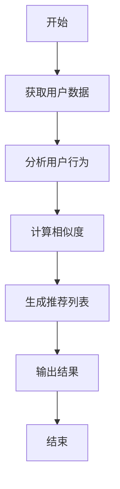
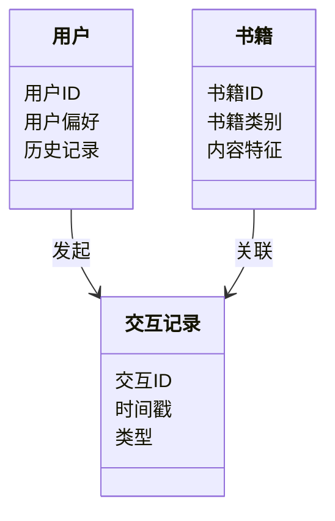

                 


## 目录大纲：《智能书架：AI Agent的阅读兴趣拓展系统》

### 文章标题：智能书架：AI Agent的阅读兴趣拓展系统

#### 关键词：
- AI Agent
- 阅读兴趣
- 推荐系统
- 用户行为分析
- 机器学习

#### 摘要：
本文详细探讨了AI Agent在阅读兴趣拓展系统中的应用，结合背景介绍、核心概念、算法原理、系统架构及项目实战，全面解析了智能书架的设计与实现。通过分析用户行为和阅读兴趣，结合机器学习算法，构建高效、个性化的阅读推荐系统，提升用户体验。

---

# 智能书架：AI Agent的阅读兴趣拓展系统

## 第一部分：背景介绍

### 第1章：智能书架与AI Agent概述

#### 1.1 问题背景
阅读兴趣的动态变化和个性化需求使得传统推荐系统难以满足用户需求。AI Agent的引入为实时交互和精准推荐提供了可能。

#### 1.2 问题描述
- 用户阅读兴趣的变化性
- 现有推荐系统的局限性
- AI Agent在阅读推荐中的优势

#### 1.3 问题解决
- AI Agent提升推荐精准度的方法
- 动态调整推荐策略的实现
- 用户反馈机制的作用

#### 1.4 边界与外延
- 适用场景与限制
- 系统与其他推荐系统的区别
- 可扩展性分析

## 第二部分：核心概念与联系

### 第2章：AI Agent与阅读兴趣分析

#### 2.1 核心概念原理
- AI Agent的定义与功能
- 阅读兴趣分析的定义与方法

#### 2.2 属性特征对比
| 属性 | AI Agent | 阅读兴趣分析 |
|------|----------|-------------|
| 输入 | 用户数据 | 阅读记录     |
| 输出 | 推荐结果 | 兴趣模型     |
| 目标 | 个性化推荐 | 深度分析     |

#### 2.3 ER实体关系图
```mermaid
erDiagram
    user {
        用户ID
        用户偏好
    }
    book {
        书籍ID
        书籍类别
    }
    interaction {
        交互记录
        时间戳
    }
    user --> interaction : 发起交互
    book --> interaction : 关联书籍
```

## 第三部分：算法原理讲解

### 第3章：阅读兴趣推荐算法

#### 3.1 算法流程图


#### 3.2 协同过滤算法
- 基于用户的协同过滤：
  $$ sim(i,j) = \frac{\sum_{k} (r_{ik} - \bar{r}_i)(r_{jk} - \bar{r}_j)}{\sqrt{\sum_{k}(r_{ik} - \bar{r}_i)^2} \sqrt{\sum_{k}(r_{jk} - \bar{r}_j)^2}} $$
- 基于物品的协同过滤：
  $$ sim(i,j) = \frac{\sum_{u} (r_{ui} - \bar{r}_u)(r_{uj} - \bar{r}_u)}{\sqrt{\sum_{u}(r_{ui} - \bar{r}_u)^2} \sqrt{\sum_{u}(r_{uj} - \bar{r}_u)^2}} $$

#### 3.3 内容推荐算法
- TF-IDF计算：
  $$ TF = \frac{f}{N} $$
  $$ IDF = \log\left(\frac{N}{f}\right) $$
  $$ TF-IDF = TF \times IDF $$

#### 3.4 Python代码示例
```python
def collaborative_filtering(user_data, user_id, book_id):
    # 计算用户间相似度
    similarities = {}
    for u in user_data:
        if u != user_id:
            similarities[u] = similarity_score(user_data[user_id], user_data[u])
    # 推荐书籍
    recommendations = []
    for book in user_data[user_id]['rated_books']:
        recommendations.append((book, similarities[user_id]))
    return recommendations
```

## 第四部分：系统分析与架构设计

### 第4章：系统架构设计

#### 4.1 领域模型


#### 4.2 系统架构


## 第五部分：项目实战

### 第5章：智能书架实战

#### 5.1 环境安装
- 安装Python、机器学习库、可视化工具

#### 5.2 核心功能实现
- 用户数据处理
- 兴趣分析模块
- 推荐算法实现

#### 5.3 案例分析
- 数据分析案例
- 算法优化案例
- 系统测试案例

## 第六部分：总结与展望

### 第6章：总结与展望

#### 6.1 最佳实践
- 数据预处理的重要性
- 算法选择的策略
- 系统优化技巧

#### 6.2 小结
- 系统实现的关键点
- 项目中的经验总结

#### 6.3 注意事项
- 数据隐私保护
- 系统性能优化
- 用户反馈的处理

#### 6.4 拓展阅读
- 推荐系统相关书籍
- AI Agent领域研究论文
- 机器学习算法进阶

---

## 作者：
AI天才研究院/AI Genius Institute & 禅与计算机程序设计艺术/Zen And The Art of Computer Programming

---

通过以上详细的大纲，您可以开始撰写文章，确保每一部分都详细展开，涵盖所有必要的内容和细节。

