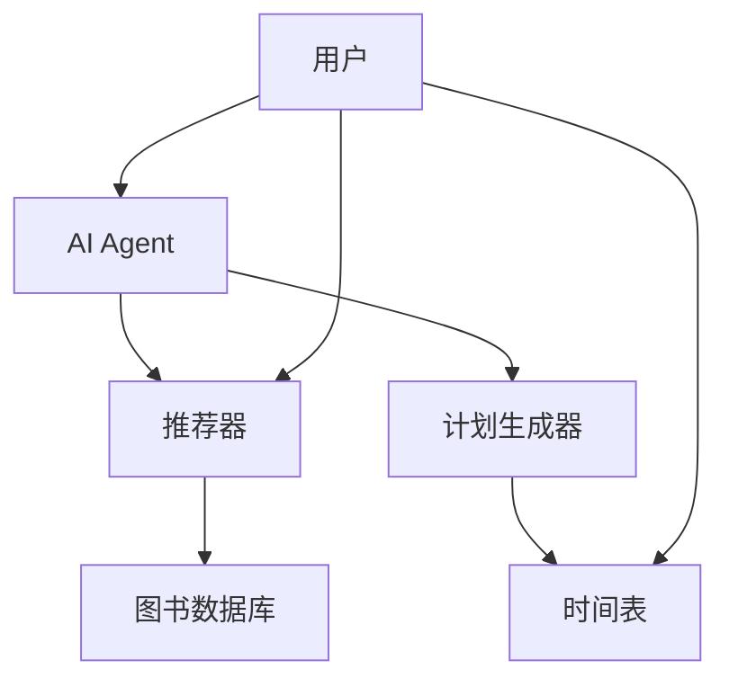

                 


# 智能书架：AI Agent的阅读计划制定助手

## 关键词：智能书架, AI Agent, 阅读计划, 个性化推荐, 算法原理, 系统架构, 项目实战

## 摘要：智能书架是一个结合AI代理技术的阅读计划制定助手，它通过分析用户的阅读习惯和偏好，利用强化学习和监督学习算法，为用户推荐合适的阅读材料，并制定个性化的阅读计划。本文详细探讨了智能书架的核心概念、算法原理、系统架构设计，以及项目实战中的实现细节。

---

## 第一部分：引言

### 第1章：智能书架与AI Agent的背景介绍

#### 1.1 问题背景与描述

现代人面临海量信息，如何高效管理阅读计划成为一大挑战。传统的阅读管理工具缺乏智能化，难以根据用户的偏好和习惯提供个性化的建议。AI Agent（人工智能代理）的出现，为解决这一问题提供了新的可能性。AI Agent能够通过学习用户的阅读行为和反馈，自动优化推荐策略，帮助用户制定科学的阅读计划。

**1.1.1 当前阅读管理的痛点**

- **信息过载**：用户每天面对海量书籍和文章，难以筛选出真正有价值的内容。
- **时间管理**：用户需要在有限的时间内高效完成阅读目标。
- **缺乏个性化**：传统阅读工具难以根据用户的兴趣和习惯提供精准推荐。

**1.1.2 AI Agent在阅读计划中的作用**

- **智能推荐**：AI Agent能够分析用户的阅读历史、偏好和目标，推荐相关书籍和文章。
- **个性化计划**：根据用户的阅读速度和时间安排，制定个性化的阅读计划。
- **动态调整**：根据用户的反馈和阅读进度，动态调整推荐内容和计划。

**1.1.3 智能书架的核心目标与意义**

智能书架的目标是通过AI代理技术，帮助用户高效管理阅读计划，提升阅读效率和体验。其意义在于结合人工智能技术，为用户提供更智能化、个性化的阅读服务。

**1.2 问题解决与边界**

智能书架通过AI Agent解决传统阅读管理工具的痛点，其边界包括：

- **输入**：用户的阅读历史、偏好、目标和反馈。
- **输出**：个性化推荐内容和阅读计划。
- **限制**：不涉及书籍内容的具体分析，仅基于用户行为和偏好进行推荐。

---

### 第2章：AI Agent的核心概念与联系

#### 2.1 核心概念原理

**2.1.1 AI Agent的基本定义**

AI Agent是一种能够感知环境并采取行动以实现目标的智能实体。在智能书架中，AI Agent通过分析用户的阅读行为和反馈，提供个性化推荐和计划。

**2.1.2 智能书架中的AI Agent特性**

- **自适应性**：能够根据用户反馈动态调整推荐策略。
- **学习能力**：通过机器学习算法不断优化推荐模型。
- **交互性**：支持用户与AI Agent的实时互动，提供即时反馈。

**2.1.3 阅读计划制定的逻辑流程**

1. **需求分析**：收集用户的阅读目标、时间安排和偏好。
2. **推荐生成**：基于用户需求，生成推荐列表。
3. **计划制定**：根据推荐内容，制定个性化阅读计划。
4. **反馈优化**：根据用户反馈，优化推荐策略和计划。

#### 2.2 核心概念对比表格

| 对比项                | AI Agent（智能书架）                     | 传统阅读计划工具                 |
|-----------------------|------------------------------------------|----------------------------------|
| 推荐依据              | 用户行为、偏好、反馈                   | 固定规则、分类标签             |
| 个性化程度          | 高度个性化                              | 较低                            |
| 动态调整能力          | 支持动态调整                            | 不支持或部分支持                |
| 技术基础              | 强化学习、监督学习                      | 简单规则引擎                    |

#### 2.3 ER实体关系图

```mermaid
er
  actor: 用户
  agent: AI Agent
  book: 图书
  plan: 阅读计划
  preference: 用户偏好
  interaction: 交互记录
  actor -|创建| plan
  actor -|修改| plan
  agent -|生成| plan
  actor -|查询| book
  actor -|反馈| interaction
  agent -|更新| preference
```

---

## 第二部分：算法原理与数学模型

### 第3章：阅读计划制定的算法原理

#### 3.1 强化学习算法的实现

**3.1.1 算法流程**

1. **状态定义**：用户的阅读需求、偏好、时间安排。
2. **动作选择**：基于当前状态，选择推荐书籍或调整计划。
3. **奖励机制**：用户反馈（如完成阅读、点赞、分享）。
4. **策略优化**：根据奖励调整推荐策略。

**3.1.2 代码实现**

```python
class AIAgent:
    def __init__(self):
        self.preferences = {}  # 用户偏好
        self.planner = Planner()  # 计划生成器
        self.recommender = Recommender()  # 推荐器

    def update_preferences(self, user_input):
        self.preferences = update_preferences(self.preferences, user_input)

    def generate_plan(self, target, deadline):
        return self.planner.plan(self.preferences, target, deadline)

    def recommend_books(self, genre, level):
        return self.recommender.recommend(genre, level)
```

#### 3.2 监督学习算法的实现

**3.2.1 算法流程**

1. **数据收集**：用户阅读历史、偏好、反馈。
2. **特征提取**：提取用户特征（如阅读速度、兴趣领域）。
3. **模型训练**：基于历史数据训练推荐模型。
4. **预测推荐**：根据当前输入，生成推荐列表。

**3.2.2 数学模型**

推荐模型可以基于协同过滤算法，例如：

$$
\text{推荐评分} = \sum_{i=1}^{n} w_i \times r_i
$$

其中，$w_i$ 是用户i的权重，$r_i$ 是用户i对书籍的评分。

---

### 第4章：系统架构设计

#### 4.1 功能模块设计

1. **用户交互模块**：收集用户输入、显示推荐内容。
2. **推荐模块**：基于用户偏好生成推荐列表。
3. **计划模块**：根据推荐内容生成阅读计划。
4. **反馈模块**：收集用户反馈，优化推荐策略。

#### 4.2 系统架构图



---

## 第三部分：项目实战

### 第5章：项目实战

#### 5.1 环境搭建

安装Python和相关库（如scikit-learn、numpy）。

#### 5.2 核心功能实现

1. **推荐系统实现**

```python
from sklearn.neighbors import NearestNeighbors

class Recommender:
    def __init__(self):
        self.model = NearestNeighbors(n_neighbors=5)

    def train(self, data):
        self.model.fit(data)

    def recommend(self, user_input):
        _, neighbors = self.model.kneighbors(user_input)
        return neighbors
```

2. **计划生成器实现**

```python
class Planner:
    def generate_plan(self, preferences, target, deadline):
        # 简单实现：按优先级排序
        plan = sorted(preferences, key=lambda x: x['priority'])
        return plan
```

#### 5.3 案例分析

假设用户目标是阅读技术类书籍，优先级为：

1. 《Python编程：从入门到精通》
2. 《机器学习实战》
3. 《深度学习导论》

---

## 第四部分：总结与展望

### 第6章：总结与展望

智能书架通过AI Agent技术，为用户提供个性化的阅读计划和推荐服务。本文详细探讨了其核心概念、算法原理和系统架构，并通过项目实战展示了其实现过程。未来，可以进一步优化推荐算法，引入多模态数据（如视频、音频）进行推荐。

---

## 作者：AI天才研究院/AI Genius Institute & 禅与计算机程序设计艺术 /Zen And The Art of Computer Programming

---

这篇文章详细介绍了智能书架的设计与实现，通过结合AI代理技术，为用户提供了高效的阅读管理工具。希望对读者在阅读计划制定和AI技术应用方面有所启发。

