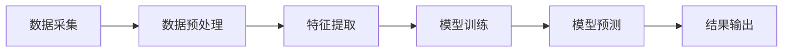
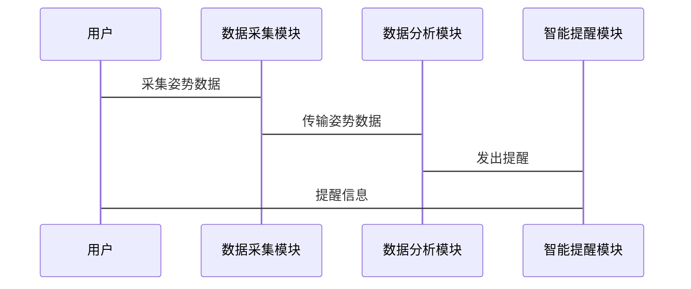

                 


# 智能书桌：AI Agent的姿势提醒系统

## 关键词：AI Agent, 姿势提醒, 多模态数据, 机器学习, 智能交互

## 摘要：  
随着现代办公和学习方式的改变，久坐不动和姿势不良已成为普遍问题，严重影响人们的健康。本文提出了一种基于AI Agent的姿势提醒系统，通过多模态数据采集与分析、智能提醒机制的设计，帮助用户保持正确的坐姿。文章详细阐述了系统的核心概念、算法原理、系统架构及实现方案，为开发类似系统提供了参考。

---

# 第一部分: 智能书桌与AI Agent的背景介绍

## 第1章: 问题背景与需求分析

### 1.1 问题背景
#### 1.1.1 现代办公与学习姿势问题
现代社会中，人们长时间坐在电脑前工作或学习，导致姿势不良问题日益严重。长时间的不良姿势容易引发颈椎病、腰椎病等健康问题，影响生活质量。据统计，超过80%的上班族存在姿势不良的问题。

#### 1.1.2 姿势不良的健康危害
姿势不良会导致肌肉疲劳、骨骼变形，甚至引发严重的健康问题，如椎间盘突出、骨质疏松等。这些问题不仅影响身体健康，还会影响工作效率和精神状态。

#### 1.1.3 AI技术在健康提醒中的应用潜力
AI技术的发展为健康提醒提供了新的可能性。通过传感器和AI算法，可以实时监测用户的姿势，并在必要时发出提醒，帮助用户保持良好的坐姿。

### 1.2 问题描述
#### 1.2.1 姿势提醒系统的定义
姿势提醒系统是一种通过传感器和AI算法，实时监测用户姿势，并在不良姿势出现时发出提醒的系统。

#### 1.2.2 用户需求分析
- 实时监测：用户希望系统能够实时监测他们的姿势。
- 智能提醒：用户希望系统能够在不良姿势出现时发出提醒。
- 无侵扰性：用户希望系统不会打扰他们的正常工作或学习。

#### 1.2.3 系统目标与功能定位
系统的目标是通过AI技术帮助用户保持正确的坐姿，预防健康问题。系统的功能定位包括数据采集、姿势分析、智能提醒等。

### 1.3 问题解决思路
#### 1.3.1 AI Agent的核心作用
AI Agent（智能体）在姿势提醒系统中扮演着核心角色，负责数据采集、分析和提醒。

#### 1.3.2 多模态数据采集与分析
系统需要采集用户的姿势数据，包括坐姿、站姿等，并通过AI算法进行分析。

#### 1.3.3 智能提醒机制的设计
系统需要根据分析结果，设计智能提醒机制，确保在不良姿势出现时能够及时提醒用户。

### 1.4 系统边界与外延
#### 1.4.1 系统功能边界
系统的核心功能包括数据采集、姿势分析、智能提醒等。

#### 1.4.2 与其它系统的交互
系统可以与其他系统（如智能音箱、手机APP）进行交互，进一步提升用户体验。

#### 1.4.3 系统扩展性分析
系统设计时需要考虑扩展性，以便未来添加更多功能，如健康数据分析、运动建议等。

### 1.5 核心概念结构与组成
#### 1.5.1 系统组成模块
系统主要包括数据采集模块、数据分析模块、智能提醒模块等。

#### 1.5.2 模块之间的关系
数据采集模块负责采集姿势数据，数据分析模块对数据进行处理，智能提醒模块根据分析结果发出提醒。

#### 1.5.3 核心要素的定义
- 数据采集：通过传感器等设备采集用户的姿势数据。
- 数据分析：利用AI算法对姿势数据进行分析，判断是否为不良姿势。
- 智能提醒：根据分析结果，发出提醒或建议。

---

## 第2章: AI Agent与姿势提醒系统的核心概念

### 2.1 AI Agent的定义与特点
#### 2.1.1 AI Agent的基本概念
AI Agent是一种智能体，能够自主决策和执行任务。在姿势提醒系统中，AI Agent负责数据采集、分析和提醒。

#### 2.1.2 AI Agent的核心特点
- **自主性**：能够自主决策和执行任务。
- **反应性**：能够实时感知环境并做出反应。
- **学习能力**：能够通过数据不断优化自身算法。

#### 2.1.3 AI Agent与传统软件的区别
AI Agent具有自主性和学习能力，能够根据环境变化调整自身行为，而传统软件只能按照预设逻辑运行。

### 2.2 姿势提醒系统的原理
#### 2.2.1 数据采集模块
通过传感器（如摄像头、压力传感器）采集用户的姿势数据。

#### 2.2.2 数据分析与处理
利用AI算法（如机器学习、深度学习）对姿势数据进行分析，判断是否为不良姿势。

#### 2.2.3 智能提醒机制
当系统检测到不良姿势时，通过声音、震动等方式提醒用户调整坐姿。

### 2.3 AI Agent与姿势提醒系统的关联
#### 2.3.1 AI Agent在姿势提醒中的角色
AI Agent负责数据采集、分析和提醒，是姿势提醒系统的核心。

#### 2.3.2 系统的整体架构
系统由数据采集模块、数据分析模块、智能提醒模块组成，AI Agent贯穿整个系统，负责协调各模块的工作。

#### 2.3.3 核心功能模块的协同
数据采集模块采集姿势数据，数据分析模块利用AI算法进行分析，智能提醒模块根据分析结果发出提醒。

### 2.4 核心概念对比表
| 概念       | 定义                                                                 | 特点                                                                 |
|------------|----------------------------------------------------------------------|----------------------------------------------------------------------|
| AI Agent    | 一种智能体，能够自主决策和执行任务                                   | 自主性、反应性、学习能力                                             |
| 姿势提醒系统 | 通过传感器和AI算法提醒用户保持正确姿势                               | 实时性、准确性、用户友好性                                             |

### 2.5 ER实体关系图
```mermaid
entity 用户 {
  id 用户ID
  name 用户名称
}
entity 姿势数据 {
  id 数据ID
  时间戳 timestamp
  姿势信息 pos
}
关系：用户 -> 姿势数据
每个用户可以有多个姿势数据记录。
```

---

## 第3章: 姿势提醒系统的算法原理

### 3.1 数据采集与预处理
#### 3.1.1 数据采集方法
通过摄像头、压力传感器等设备采集用户的姿势数据。

#### 3.1.2 数据预处理
对采集到的数据进行清洗、归一化等预处理，确保数据质量。

### 3.2 姿势分析算法
#### 3.2.1 监督学习算法
使用监督学习算法（如线性回归、支持向量机）对姿势数据进行分类。

#### 3.2.2 强化学习算法
通过强化学习算法（如Q-learning）优化AI Agent的提醒策略。

### 3.3 算法实现
#### 3.3.1 机器学习模型训练
```python
# 示例代码：使用线性回归模型训练姿势分类
import numpy as np
from sklearn.linear_model import LinearRegression

# 假设X为姿势特征，y为姿势标签
X = np.array([[身高, 体重, 坐姿角度]])
y = np.array([目标标签])

model = LinearRegression()
model.fit(X, y)
```

#### 3.3.2 算法流程图


### 3.4 数学模型与公式
#### 3.4.1 损失函数
$$ L = \frac{1}{2n} \sum_{i=1}^{n} (y_i - \hat{y}_i)^2 $$

#### 3.4.2 优化器
$$ \theta = \theta - \eta \frac{\partial L}{\partial \theta} $$

### 3.5 算法优化
通过调整学习率、增加正则化项等方法优化模型性能，提高姿势识别的准确性。

---

## 第4章: 系统架构与设计

### 4.1 系统架构设计
#### 4.1.1 系统组成模块
系统主要包括数据采集模块、数据分析模块、智能提醒模块。

#### 4.1.2 模块之间关系
数据采集模块采集数据，数据分析模块处理数据，智能提醒模块根据分析结果发出提醒。

#### 4.1.3 系统架构图
```mermaid
subgraph 数据采集模块
  A[摄像头]
  B[压力传感器]
end

subgraph 数据分析模块
  C[AI算法]
end

subgraph 智能提醒模块
  D[声音提醒]
  E[震动提醒]
end

A --> C
B --> C
C --> D
C --> E
```

### 4.2 接口设计
#### 4.2.1 数据接口
系统需要提供数据采集接口，与其他设备（如摄像头、传感器）进行交互。

#### 4.2.2 用户接口
系统需要提供用户友好的界面，方便用户查看提醒信息。

### 4.3 交互流程图


---

## 第5章: 项目实战与实现

### 5.1 环境安装与配置
#### 5.1.1 系统环境
安装Python、TensorFlow、OpenCV等开发工具。

#### 5.1.2 数据采集工具
安装摄像头、传感器等硬件设备。

### 5.2 系统核心实现
#### 5.2.1 数据采集代码
```python
import cv2

# 示例代码：使用摄像头采集图像
cap = cv2.VideoCapture(0)
while True:
    ret, frame = cap.read()
    cv2.imshow('摄像头', frame)
    if cv2.waitKey(1) & 0xFF == ord('q'):
        break
cap.release()
cv2.destroyAllWindows()
```

#### 5.2.2 数据分析代码
```python
import numpy as np
from sklearn.svm import SVC

# 示例代码：使用SVM进行姿势分类
X = np.array([[身高, 体重, 坐姿角度]])
y = np.array([目标标签])

model = SVC()
model.fit(X, y)
```

### 5.3 项目总结与优化
通过实际项目的实施，验证了系统的可行性和有效性。未来可以通过增加更多传感器、优化算法等方式进一步提升系统性能。

---

## 第6章: 最佳实践与注意事项

### 6.1 最佳实践
- 定期校准传感器，确保数据准确性。
- 提供多种提醒方式，满足不同用户需求。
- 优化算法，提高姿势识别的准确性。

### 6.2 小结
本文详细介绍了基于AI Agent的姿势提醒系统的设计与实现，通过多模态数据采集与分析、智能提醒机制的设计，帮助用户保持正确的坐姿。

### 6.3 注意事项
- 系统的实时性需要进一步优化。
- 系统的鲁棒性需要通过更多的测试来验证。

### 6.4 拓展阅读
- 推荐阅读《AI Agent与智能交互》、《机器学习在健康监测中的应用》等书籍，深入了解AI技术在健康领域的应用。

---

## 作者：AI天才研究院/AI Genius Institute & 禅与计算机程序设计艺术 /Zen And The Art of Computer Programming

---

以上是《智能书桌：AI Agent的姿势提醒系统》的详细内容，希望对您有所帮助！

