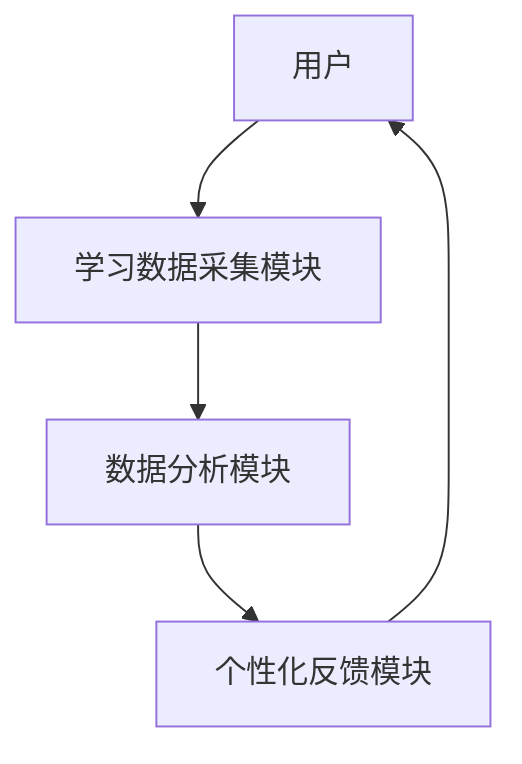

                 


# 智能书桌：AI Agent的学习效率监测

> 关键词：AI Agent，学习效率监测，智能书桌，多模态数据，个性化反馈

> 摘要：本文探讨了AI Agent在学习效率监测中的应用，介绍了智能书桌的概念、核心算法、系统架构及实现方法，旨在为教育科技领域提供创新解决方案。

---

## 第1章: 问题背景与描述

### 1.1 问题背景

#### 1.1.1 当前学习效率监测的痛点
现代学习者面临着信息过载和效率低下的问题。传统学习方式难以实时反馈，导致学习效果不佳。AI技术的应用为解决这一问题提供了新思路。

#### 1.1.2 AI技术在学习效率监测中的潜力
AI能够通过分析多模态数据，实时监控学习者的行为，提供个性化建议。AI Agent的引入使学习效率监测更加智能化。

#### 1.1.3 AI Agent在学习效率监测中的角色
AI Agent作为代理，负责数据采集、分析和反馈生成，帮助学习者优化学习策略。

### 1.2 问题描述

#### 1.2.1 学习效率监测的核心目标
提高学习效率，优化学习策略，实时反馈学习效果。

#### 1.2.2 AI Agent在学习效率监测中的具体任务
数据采集、行为分析、个性化反馈生成。

#### 1.2.3 问题的边界与外延
智能书桌专注于学习效率监测，不涉及娱乐或社交功能。

### 1.3 问题解决思路

#### 1.3.1 AI Agent的学习效率监测框架
设计一个多模态数据采集系统，结合AI算法进行分析和反馈生成。

#### 1.3.2 多模态数据的采集与分析
整合文本、语音、图像等多种数据源，进行实时分析。

#### 1.3.3 个性化学习策略的生成
基于分析结果，提供定制化的学习建议。

---

## 第2章: 核心概念与联系

### 2.1 AI Agent的核心原理

#### 2.1.1 AI Agent的定义与特点
AI Agent是具有自主决策能力的智能体，能够与环境交互并执行任务。

#### 2.1.2 AI Agent的分类与应用场景
分为简单反射型、基于模型的反应型、目标驱动型和效用驱动型。

#### 2.1.3 AI Agent与学习效率监测的结合
AI Agent通过实时数据监测，优化学习者的行为。

### 2.2 学习效率监测的核心要素

#### 2.2.1 学习数据的采集与处理
收集学习者的行为数据，包括时间、注意力分配等。

#### 2.2.2 学习行为的分析与建模
分析学习行为模式，建立数学模型。

#### 2.2.3 学习效果的评估与反馈
评估学习效果，提供反馈。

### 2.3 核心概念的ER实体关系图

```mermaid
er
  actor: 用户
  agent: AI代理
  action: 用户行为
  data: 学习数据
  result: 监测结果
  actor -|> action: 发起行为
  action -|> data: 生成数据
  data -|> result: 分析结果
  result -|> agent: 提供反馈
```

---

## 第3章: 算法原理与实现

### 3.1 数据收集与预处理

#### 3.1.1 多模态数据的采集方法
使用摄像头、麦克风等设备采集行为数据。

#### 3.1.2 数据清洗与特征提取
去除噪声，提取关键特征。

#### 3.1.3 数据标注与格式化
标注数据，确保模型理解。

### 3.2 学习效率分析算法

#### 3.2.1 基于时间序列的分析方法
使用LSTM模型分析学习时间序列数据。

#### 3.2.2 基于深度学习的模型构建
构建深度神经网络模型，进行分类和预测。

#### 3.2.3 基于规则的异常检测
设定规则，检测异常行为。

### 3.3 AI Agent的反馈生成算法

#### 3.3.1 基于强化学习的反馈策略
使用强化学习优化反馈策略。

#### 3.3.2 基于生成模型的个性化建议
生成个性化学习建议。

#### 3.3.3 基于知识图谱的关联分析
分析知识图谱，提供相关建议。

---

## 第4章: 系统分析与架构设计

### 4.1 问题场景介绍

#### 4.1.1 学习环境的复杂性
多设备、多任务的学习场景。

#### 4.1.2 用户行为的多样性
不同学习者的不同行为模式。

### 4.2 系统功能设计

#### 4.2.1 学习数据采集模块
采集学习者的多模态数据。

#### 4.2.2 数据分析模块
分析数据，生成结果。

#### 4.2.3 个性化反馈模块
提供反馈建议。

### 4.3 系统架构设计



---

## 第5章: 项目实战

### 5.1 环境安装

#### 5.1.1 开发工具安装
安装Python、TensorFlow、Keras等工具。

#### 5.1.2 数据集准备
收集并标注学习数据。

### 5.2 核心代码实现

#### 5.2.1 数据预处理代码
```python
import pandas as pd
def preprocess_data(data_path):
    # 读取数据
    df = pd.read_csv(data_path)
    # 删除缺失值
    df.dropna(inplace=True)
    return df
```

#### 5.2.2 模型训练代码
```python
import tensorflow as tf
model = tf.keras.Sequential([
    tf.keras.layers.Dense(64, activation='relu'),
    tf.keras.layers.Dense(1, activation='sigmoid')
])
model.compile(optimizer='adam', loss='binary_crossentropy')
model.fit(X_train, y_train, epochs=10)
```

### 5.3 案例分析与应用解读

#### 5.3.1 案例分析
分析一个学习者的数据，展示AI Agent如何优化其学习策略。

#### 5.3.2 应用解读
解释系统在实际中的应用效果。

### 5.4 项目小结

总结项目实现的关键点和成果。

---

## 第6章: 最佳实践与总结

### 6.1 最佳实践

#### 6.1.1 数据质量管理
确保数据的准确性和完整性。

#### 6.1.2 模型优化
持续优化模型，提高准确性。

### 6.2 小结

总结全文内容，强调AI Agent在学习效率监测中的重要性。

### 6.3 注意事项

提醒读者注意隐私保护和数据安全。

### 6.4 拓展阅读

推荐相关领域的书籍和资源。

---

## 作者

作者：AI天才研究院/AI Genius Institute & 禅与计算机程序设计艺术 /Zen And The Art of Computer Programming

---

通过以上结构，文章详细介绍了智能书桌的设计和实现，帮助读者全面理解AI在学习效率监测中的应用。

