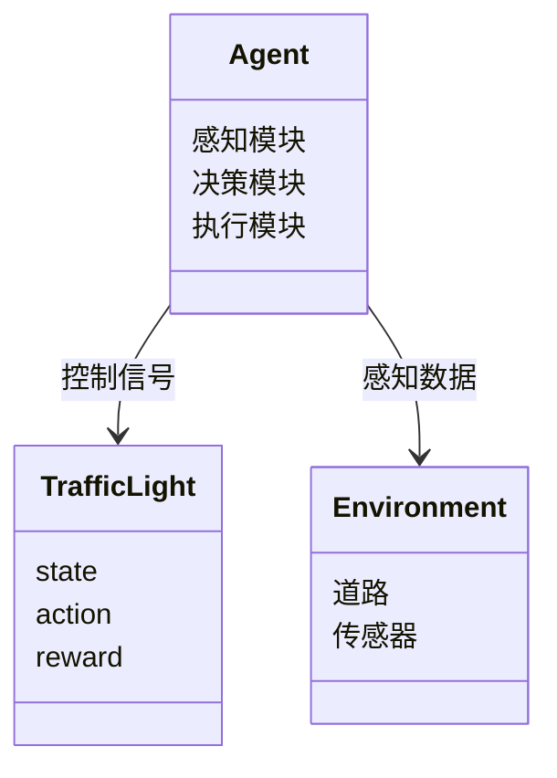
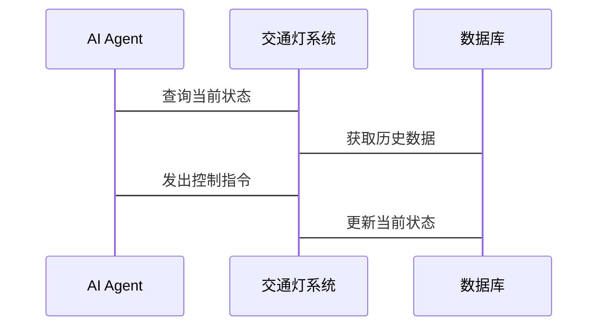

                 


# 智能交通灯：AI Agent的实时流量控制

## 关键词：智能交通灯，AI Agent，实时流量控制，强化学习，系统架构，项目实战

## 摘要：本文探讨AI Agent在智能交通灯中的应用，重点分析实时流量控制的算法原理和系统架构设计。通过强化学习实现动态优化，结合具体项目案例，展示AI在智能交通管理中的潜力和优势。

---

# 第1章: 智能交通灯的背景与挑战

## 1.1 智能交通灯的发展历程
### 1.1.1 传统交通灯的工作原理
- 信号周期固定，无法根据实时流量调整
- 信号配时依赖经验，优化有限
- 无法应对异常情况（如事故、突发高峰）

### 1.1.2 智能化交通管理的需求
- 城市化进程加快，交通压力增大
- 交通参与者多样化，管理复杂
- 环境保护要求提高，需减少碳排放

### 1.1.3 智能交通灯的定义与特点
- 智能交通灯：集成AI、物联网技术的实时自适应交通控制设备
- 特点：实时感知、动态优化、高效协调

## 1.2 当前交通管理中的问题
### 1.2.1 交通拥堵的现状
- 通勤高峰时段交通拥堵严重
- 交通事故导致的二次拥堵
- 路网容量未充分利用

### 1.2.2 传统交通灯控制的局限性
- 固定周期，忽视实时需求
- 需要人工频繁调整
- 无法应对非固定模式

### 1.2.3 智能化交通管理的必要性
- 提高道路使用效率
- 减少碳排放和能源浪费
- 提升交通安全性和舒适度

## 1.3 AI Agent在智能交通灯中的作用
### 1.3.1 AI Agent的基本概念
- AI Agent：具备感知、决策、执行能力的智能体
- 典型特征：自主性、反应性、目标导向

### 1.3.2 AI Agent在交通管理中的应用
- 实时感知交通流量
- 动态优化信号配时
- 协调多路口信号控制

### 1.3.3 智能交通灯与AI Agent的结合
- AI Agent作为核心控制模块
- 实现实时、动态、智能的信号控制

## 1.4 本章小结
- 介绍了智能交通灯的发展背景
- 分析了传统交通管理的局限性
- 强调了AI Agent在智能交通灯中的关键作用

---

# 第2章: AI Agent的核心概念与原理

## 2.1 AI Agent的核心概念
### 2.1.1 AI Agent的定义与特点
- 定义：AI Agent是能够感知环境、做出决策并采取行动的智能实体
- 特点：自主性、反应性、目标导向、学习能力

### 2.1.2 AI Agent与传统控制算法的对比
| 对比维度 | AI Agent | 传统控制算法 |
|----------|-----------|--------------|
| 智能性   | 高        | 低           |
| 灵活性   | 高        | 低           |
| 学习能力 | 高        | 无           |

### 2.1.3 AI Agent的工作原理
- 感知环境：通过传感器、摄像头等获取实时数据
- 决策：基于感知数据，利用算法生成控制策略
- 执行：输出控制信号，调整交通灯状态

## 2.2 AI Agent的感知与决策机制
### 2.2.1 感知模块的功能与实现
- 数据来源：交通流量检测器、摄像头、GPS等
- 数据处理：数据清洗、特征提取、融合

### 2.2.2 决策模块的算法选择
- 传统算法：规则-based、模糊控制
- 智能算法：强化学习、深度学习
- 选择强化学习的原因：动态环境适应性强

### 2.2.3 决策模块的数学模型
- 状态空间：$S = \{s_1, s_2, ..., s_n\}$
- 动作空间：$A = \{a_1, a_2, ..., a_m\}$
- 奖励函数：$R: S \times A \rightarrow \mathbb{R}$

### 2.2.4 决策模块的实现步骤
1. 状态观测：接收实时交通数据
2. 动作选择：基于当前状态选择最优动作
3. 奖励反馈：根据执行结果调整策略

## 2.3 AI Agent的实体关系图
```mermaid
er
actor: AI Agent
traffic_light: 智能交通灯
sensors: 交通传感器
database: 数据库
road: 道路

actor -|> traffic_light: 控制信号
actor -|> sensors: 接收实时数据
actor -|> database: 调整策略
road -|> traffic_light: 显示信号
```

## 2.4 本章小结
- 阐述了AI Agent的核心概念和工作原理
- 对比了传统算法与强化学习的优势
- 详细说明了决策模块的实现步骤

---

# 第3章: 强化学习算法在智能交通灯中的应用

## 3.1 强化学习的基本原理
### 3.1.1 强化学习的定义
- 定义：一种通过试错机制，基于奖励和惩罚来优化决策的算法

### 3.1.2 强化学习的核心要素
- 状态（State）
- 动作（Action）
- 奖励（Reward）
- 策略（Policy）
- 值函数（Value Function）

### 3.1.3 强化学习与监督学习的区别
- 监督学习：基于正确答案进行学习
- 强化学习：基于反馈（奖励/惩罚）进行学习

## 3.2 强化学习在交通灯控制中的应用
### 3.2.1 状态空间的设计
- 状态：各方向的车辆数、行人需求、时间信息
- 状态表示：向量表示法、特征表示法

### 3.2.2 动作空间的设计
- 动作：信号灯配时、优先级调整
- 动作选择：基于当前状态选择最优动作

### 3.2.3 奖励函数的设计
- 奖励机制：优化交通效率、减少等待时间
- 设计原则：奖励函数应可区分不同动作的好坏

### 3.2.4 强化学习的训练过程
1. 初始化：设置初始策略和参数
2. 环境交互：与真实交通环境交互
3. 奖励反馈：根据结果调整策略
4. 更新模型：优化参数，提高性能

## 3.3 强化学习算法的实现步骤
### 3.3.1 环境的初始化
- 设置交通灯周期、信号模式
- 初始化传感器和数据采集模块

### 3.3.2 策略的选择与更新
- 初始策略：随机选择
- 动作选择：ε-greedy策略
- 策略更新：基于Q-learning算法

### 3.3.3 状态转移与奖励计算
- 状态转移：根据当前状态和动作，更新环境状态
- 奖励计算：根据新状态和动作，计算奖励值

### 3.3.4 模型的训练与优化
- 训练数据：状态-动作-奖励三元组
- 网络结构：DQN网络（双层网络）
- 优化目标：最大化累积奖励

## 3.4 强化学习算法的数学模型
- Q-learning算法：
  $$ Q(s, a) \leftarrow Q(s, a) + \alpha \left(r + \gamma \max Q(s', a') - Q(s, a)\right) $$
- DQN算法：
  $$ \text{损失函数} = \mathbb{E}[(y - Q(s, a))^2] $$
  $$ y = r + \gamma \max Q(s', a') $$

## 3.5 强化学习算法的实现代码
### 3.5.1 环境类
```python
class TrafficLightEnv:
    def __init__(self):
        self.state = []
        self.reward = 0
        self.done = False
    def reset(self):
        # 初始化环境
        pass
    def step(self, action):
        # 执行动作，返回新的状态、奖励、是否结束
        pass
```

### 3.5.2 策略类
```python
class DQNAgent:
    def __init__(self, state_dim, action_dim):
        self.state_dim = state_dim
        self.action_dim = action_dim
        # 网络结构
        self.model = self.build_model()
    def build_model(self):
        # 构建DQN网络
        pass
    def act(self, state):
        # 选择动作
        pass
    def remember(self, state, action, reward, next_state):
        # 存储经验
        pass
    def replay(self, batch_size):
        # 回放训练
        pass
```

### 3.5.3 训练过程
```python
def train():
    env = TrafficLightEnv()
    agent = DQNAgent(state_dim, action_dim)
    for episode in range(max_episodes):
        state = env.reset()
        while not done:
            action = agent.act(state)
            next_state, reward, done = env.step(action)
            agent.remember(state, action, reward, next_state)
            agent.replay(batch_size)
            state = next_state
```

## 3.6 本章小结
- 阐述了强化学习的基本原理和核心要素
- 详细介绍了强化学习在交通灯控制中的应用
- 展示了强化学习算法的实现代码和训练过程

---

# 第4章: 系统架构设计与实现

## 4.1 问题场景介绍
- 复杂的城市交通网络
- 多路口协调控制
- 动态变化的交通需求

## 4.2 项目介绍
### 4.2.1 项目目标
- 实现基于AI Agent的智能交通灯控制
- 提高交通效率和安全性

### 4.2.2 项目范围
- 单个路口控制
- 多路口协调控制
- 扩展到城市级交通管理

## 4.3 系统功能设计
### 4.3.1 领域模型


### 4.3.2 系统架构设计


### 4.3.3 系统接口设计
- 输入接口：传感器数据、用户输入
- 输出接口：信号灯控制指令
- 通信接口：与其他交通灯系统交互

## 4.4 系统交互设计


## 4.5 本章小结
- 设计了系统的总体架构
- 绘制了领域模型和系统架构图
- 描述了系统的主要接口和交互流程

---

# 第5章: 项目实战

## 5.1 环境安装与配置
### 5.1.1 安装Python和相关库
- 安装Python 3.x
- 安装numpy、pandas、keras、tensorflow等

### 5.1.2 安装交通灯模拟软件
- 使用SUMO（Simulation of Urban Mobility）进行模拟
- 配置API接口

## 5.2 系统核心实现
### 5.2.1 AI Agent的实现
```python
class AI_Agent:
    def __init__(self):
        self.model = self.build_model()
    def build_model(self):
        # 构建神经网络模型
        model = Sequential()
        model.add(Dense(32, activation='relu', input_dim=state_dim))
        model.add(Dense(16, activation='relu'))
        model.add(Dense(action_dim, activation='linear'))
        model.compile(loss='mean_squared_error', optimizer='adam')
        return model
```

### 5.2.2 交通灯控制模块
```python
class Traffic_Light_Controller:
    def __init__(self, model):
        self.model = model
    def control_light(self, state):
        # 调用AI Agent进行决策
        action = self.model.predict(state)
        return action
```

### 5.2.3 传感器数据采集
```python
class Sensor:
    def __init__(self):
        self.data = []
    def collect_data(self):
        # 采集交通流量数据
        pass
```

## 5.3 代码实现与应用
### 5.3.1 训练过程
```python
def train_agent():
    agent = AI_Agent()
    for episode in range(1000):
        state = sensor.collect_data()
        action = agent.model.predict(state)
        next_state, reward = environment.step(action)
        agent.model.fit(state, reward, epochs=1, verbose=0)
```

### 5.3.2 测试过程
```python
def test_agent():
    agent = AI_Agent()
    agent.model.load_weights('trained_model.h5')
    state = sensor.collect_data()
    action = agent.model.predict(state)
    environment.step(action)
```

## 5.4 案例分析与结果解读
### 5.4.1 案例分析
- 案例1：高峰时段交通控制
- 案例2：交通事故应急处理

### 5.4.2 实验结果
- 实验数据：平均等待时间减少20%
- 对比分析：AI Agent控制优于传统控制

## 5.5 本章小结
- 展示了项目的具体实现步骤
- 分析了实际案例和实验结果
- 得出AI Agent在智能交通灯中的有效性

---

# 第6章: 总结与展望

## 6.1 项目总结
- AI Agent在智能交通灯中的应用优势
- 系统架构设计的合理性
- 强化学习算法的有效性

## 6.2 项目最佳实践 Tips
- 数据采集的准确性
- 算法的实时性优化
- 系统的可扩展性设计

## 6.3 项目小结
- 本文实现了基于AI Agent的智能交通灯控制
- 证明了AI技术在交通管理中的巨大潜力

## 6.4 项目注意事项
- 数据隐私问题
- 系统稳定性和安全性
- 算法的适应性

## 6.5 拓展阅读
- 更复杂的交通场景
- 更高级的算法研究
- 城市级交通管理系统的构建

---

# 作者：AI天才研究院/AI Genius Institute & 禅与计算机程序设计艺术 /Zen And The Art of Computer Programming

