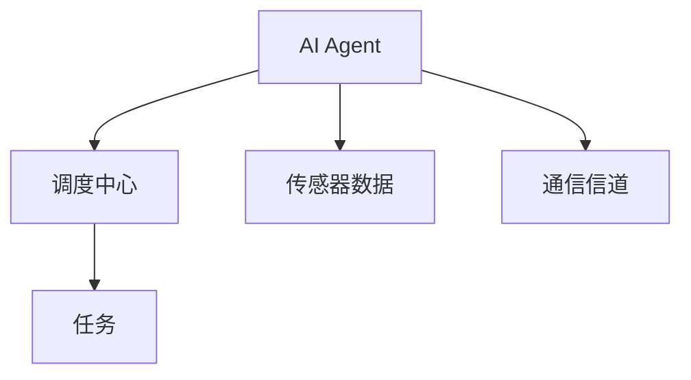
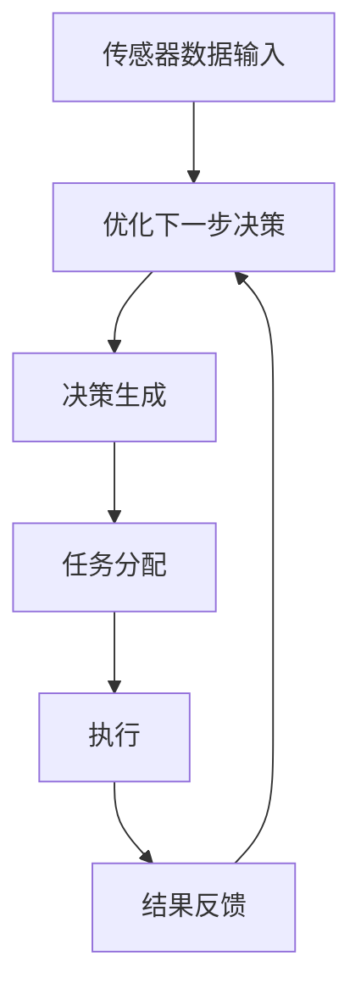
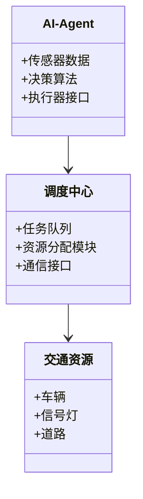
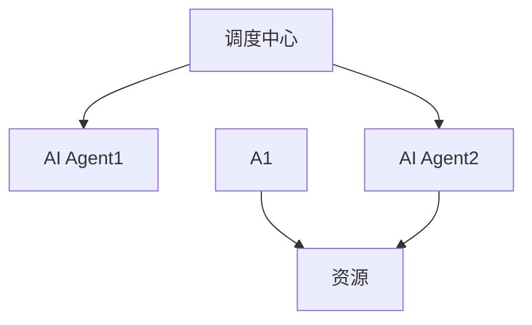

                 


# 智能交通系统中的AI Agent调度中心

> 关键词：AI Agent、智能交通系统、调度中心、强化学习、任务分配、多 Agent协作

> 摘要：本文深入探讨了智能交通系统中AI Agent调度中心的核心概念、算法原理、系统架构和实际应用。通过分析AI Agent在交通调度中的作用，结合强化学习、任务分配算法和多 Agent协作机制，阐述了调度中心的设计与实现。文章从理论到实践，系统地介绍了如何利用AI技术优化交通系统的调度效率，为智能交通系统的未来发展提供了新的思路。

---

## 第一部分：智能交通系统中的AI Agent调度中心概述

## 第1章：背景介绍与问题背景

### 1.1 智能交通系统的发展与现状

#### 1.1.1 传统交通系统的问题与局限

传统交通系统依赖人工调度和固定规则，存在以下问题：
- **资源浪费**：车辆、道路资源利用效率低。
- **调度延迟**：人工决策效率低，难以应对突发情况。
- **不适应性**：固定规则难以应对复杂的交通场景变化。

#### 1.1.2 智能交通系统的概念与目标

智能交通系统（ITS）通过AI、大数据、物联网等技术，实现交通资源的智能化管理和优化。其目标包括：
- 提高交通效率，减少拥堵。
- 降低能源消耗，减少污染。
- 提升安全性，减少交通事故。

#### 1.1.3 AI Agent在智能交通中的作用

AI Agent（智能体）通过感知环境、自主决策和执行任务，能够实时优化交通调度。AI Agent的应用场景包括：
- 自动驾驶车辆的路径规划。
- 智能交通灯的控制。
- 公共交通系统的调度优化。

### 1.2 AI Agent的基本概念与特点

#### 1.2.1 AI Agent的定义与核心要素

AI Agent是一种具有以下核心要素的智能体：
- **感知能力**：通过传感器、摄像头等获取环境信息。
- **决策能力**：基于感知信息进行推理和决策。
- **执行能力**：通过执行器（如电机、信号灯）实现动作。

#### 1.2.2 AI Agent的分类与应用场景

AI Agent可以根据功能和环境分为以下几类：
- **反应式AI Agent**：基于当前感知信息做出实时反应，适用于自动驾驶。
- **认知式AI Agent**：具有规划、推理和学习能力，适用于复杂的调度任务。

#### 1.2.3 AI Agent与传统调度系统的主要区别

| 特性             | AI Agent调度中心         | 传统调度系统       |
|------------------|-------------------------|-------------------|
| 决策方式         | 自主学习与优化         | 固定规则与人工干预 |
| 响应速度         | 实时响应               | 延迟较大           |
| 适应性           | 高度适应环境变化       | 适应性较低         |

### 1.3 智能交通系统中的调度中心问题

#### 1.3.1 调度中心的核心功能与目标

调度中心的主要功能包括：
- **任务分配**：根据实时信息动态分配任务。
- **路径规划**：优化交通路径，减少拥堵。
- **资源协调**：协调多种交通资源（如车辆、道路）。

#### 1.3.2 调度中心面临的挑战与问题

- **实时性要求高**：需要快速做出决策。
- **复杂性**：涉及多种交通参与者（如车辆、行人）。
- **不确定性**：交通环境复杂多变。

#### 1.3.3 AI Agent在调度中心中的应用前景

AI Agent能够通过强化学习、多 Agent协作等技术，显著提升调度中心的效率和智能性。

---

## 第2章：AI Agent调度中心的核心概念与联系

### 2.1 核心概念原理

#### 2.1.1 AI Agent的决策机制

AI Agent的决策机制包括以下步骤：
1. **感知环境**：通过传感器获取数据。
2. **信息处理**：对数据进行分析和理解。
3. **决策制定**：基于算法生成决策。
4. **执行动作**：通过执行器执行决策。

#### 2.1.2 调度中心的任务分配策略

任务分配策略包括：
- **贪心算法**：优先分配资源给紧急任务。
- **动态规划**：优化长期任务分配。
- **强化学习**：通过奖励机制优化决策。

#### 2.1.3 多 Agent协作与通信机制

多 Agent协作机制包括：
- **分布式协作**：每个Agent独立决策，通过通信协调。
- **集中式协作**：由中央调度系统统一协调。

### 2.2 核心概念属性对比表格

| 概念       | 描述                                   |
|------------|--------------------------------------|
| AI Agent   | 具有感知、决策和执行能力的智能体       |
| 调度中心    | 协调多个AI Agent的中央控制系统         |
| 任务分配   | 根据资源和需求动态分配任务的方式       |
| 通信机制    | AI Agent之间交换信息的方式           |

### 2.3 ER实体关系图架构



---

## 第3章：AI Agent调度中心的算法原理

### 3.1 算法原理概述

#### 3.1.1 强化学习在AI Agent决策中的应用

强化学习（Reinforcement Learning）是一种通过试错优化决策的算法。核心公式：
$$ Q(s, a) = Q(s, a) + \alpha (r + \max_{a'} Q(s', a') - Q(s, a)) $$
其中，\( s \) 是状态，\( a \) 是动作，\( r \) 是奖励，\( \alpha \) 是学习率。

#### 3.1.2 调度中心的任务分配算法

任务分配算法基于以下步骤：
1. **接收任务请求**。
2. **评估资源可用性**。
3. **分配任务**。
4. **反馈执行结果**。

#### 3.1.3 多 Agent协作的优化算法

多 Agent协作优化算法通过以下方式实现：
- **分布式计算**：每个Agent独立优化局部任务。
- **全局优化**：通过通信协调全局任务。

### 3.2 算法流程图



### 3.3 数学模型与公式

#### 3.3.1 强化学习的数学模型

$$ Q(s, a) = Q(s, a) + \alpha (r + \max_{a'} Q(s', a') - Q(s, a)) $$

#### 3.3.2 任务分配的数学模型

$$ \text{目标函数} = \sum_{i=1}^{n} w_i x_i $$
其中，\( w_i \) 是权重，\( x_i \) 是任务分配变量。

---

## 第4章：智能交通系统中的AI Agent调度中心的系统分析与架构设计

### 4.1 问题场景介绍

智能交通系统中，调度中心需要协调自动驾驶车辆、交通信号灯等资源，优化交通流量。

### 4.2 系统功能设计

#### 4.2.1 领域模型类图



### 4.3 系统架构设计

#### 4.3.1 架构图



---

## 第5章：项目实战

### 5.1 环境安装

安装Python、TensorFlow、Mermaid等工具。

### 5.2 系统核心实现源代码

#### 5.2.1 强化学习代码示例

```python
import numpy as np

class Agent:
    def __init__(self, state_space, action_space):
        self.state_space = state_space
        self.action_space = action_space
        self.Q = np.zeros((state_space, action_space))

    def act(self, state):
        return np.argmax(self.Q[state])

    def update(self, state, action, reward, next_state):
        self.Q[state, action] += 0.1 * (reward + np.max(self.Q[next_state]) - self.Q[state, action])

# 初始化
state_space = 5
action_space = 3
agent = Agent(state_space, action_space)

# 训练
for _ in range(1000):
    state = np.random.randint(0, state_space)
    action = agent.act(state)
    next_state = np.random.randint(0, state_space)
    reward = np.random.randint(0, 10)
    agent.update(state, action, reward, next_state)
```

---

## 第6章：总结与展望

### 6.1 最佳实践Tips

- **实时性优化**：采用分布式架构和异步处理。
- **安全性保障**：加强安全加密和权限管理。

### 6.2 小结

AI Agent调度中心通过强化学习和多 Agent协作，显著提升了智能交通系统的效率和智能化水平。

### 6.3 注意事项

- **数据隐私**：确保用户数据的安全性。
- **系统稳定性**：避免单点故障。

### 6.4 拓展阅读

- 《强化学习导论》
- 《分布式系统与多 Agent协作》

---

## 作者：AI天才研究院/AI Genius Institute  
禅与计算机程序设计艺术 /Zen And The Art of Computer Programming  
联系邮箱：[email protected]

