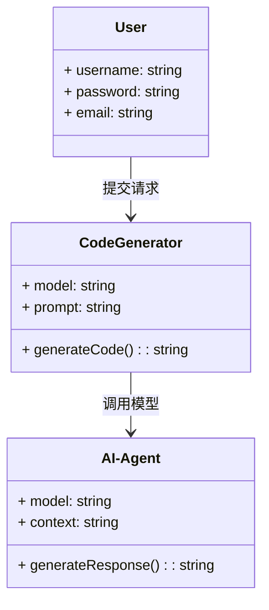
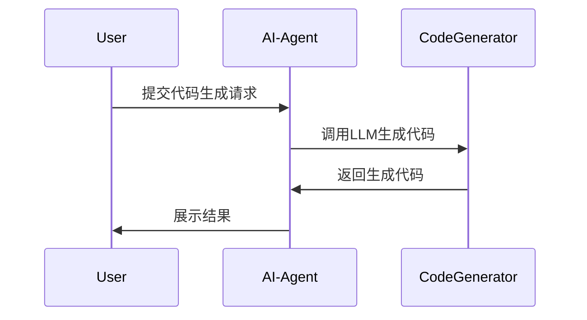

                 


# 智能代码生成 AI Agent：LLM 辅助软件开发

> 关键词：智能代码生成，AI Agent，LLM，软件开发，人工智能，代码生成，AI辅助开发

> 摘要：本文探讨了智能代码生成 AI Agent 的实现与应用，通过分析 LLM 在代码生成中的作用，详细讲解了其技术原理、系统架构设计与实现，结合实际项目案例，展示了如何利用 LLM 辅助软件开发，最后展望了智能代码生成的未来发展方向。

---

# 第一部分: 智能代码生成与AI Agent概述

## 第1章: 智能代码生成与AI Agent的背景介绍

### 1.1 问题背景与问题描述

#### 1.1.1 软件开发中的痛点与挑战
软件开发是一个复杂的过程，涉及需求分析、设计、编码、测试等多个阶段。随着软件项目的规模越来越大，开发效率和代码质量成为关键问题。开发者需要处理复杂的逻辑、API调用、代码规范等问题，容易出错且效率低下。

#### 1.1.2 智能代码生成的提出与目标
智能代码生成的目标是通过AI技术，辅助开发者快速生成高质量的代码。通过自然语言处理和大语言模型（LLM），开发者可以用简单的自然语言描述需求，AI生成相应的代码。

#### 1.1.3 LLM在代码生成中的作用与意义
LLM（Large Language Model）通过海量数据的训练，能够理解和生成自然语言文本。在代码生成中，LLM可以根据需求描述生成代码片段，或者根据上下文提供代码建议。

### 1.2 问题解决与边界外延

#### 1.2.1 智能代码生成的解决方案
智能代码生成AI Agent通过解析用户的需求，调用LLM生成代码，并结合上下文进行优化。解决方案包括需求解析、代码生成、结果验证三个主要步骤。

#### 1.2.2 边界与限制
智能代码生成目前还存在一些限制，例如代码生成的质量依赖于模型的训练数据和调参，部分复杂场景的生成效果可能不理想。此外，生成的代码可能需要人工校验和调整。

#### 1.2.3 外延与扩展
智能代码生成可以扩展到更多场景，例如自动生成单元测试代码、修复代码错误、生成API文档等。

### 1.3 核心概念与组成要素

#### 1.3.1 AI Agent的定义与属性
AI Agent是一种智能体，能够感知环境并采取行动以实现目标。在代码生成中，AI Agent负责解析需求、调用LLM生成代码、优化结果并反馈给用户。

#### 1.3.2 LLM在代码生成中的角色与功能
LLM作为智能代码生成的核心，负责根据输入生成代码。它通过自然语言处理技术，理解用户的需求，并输出符合语法和逻辑的代码。

#### 1.3.3 系统架构与核心模块
智能代码生成系统主要包括用户界面、需求解析模块、LLM调用模块、代码优化模块和结果展示模块。

## 1.4 本章小结

---

# 第二部分: AI Agent与LLM的核心原理

## 第2章: AI Agent的核心原理与算法

### 2.1 AI Agent的基本原理

#### 2.1.1 AI Agent的定义与分类
AI Agent可以分为简单反射式Agent和基于模型的反射式Agent。简单反射式Agent根据当前感知直接行动，而基于模型的反射式Agent则基于对环境的建模进行决策。

#### 2.1.2 AI Agent的核心算法与实现
AI Agent的核心算法包括状态表示、动作选择和策略优化。常用算法有Q-Learning、Deep Q-Network等。

#### 2.1.3 AI Agent的决策机制与流程
AI Agent的决策流程包括感知环境、生成候选动作、评估动作价值、选择最优动作并执行。

### 2.2 LLM的基本原理与数学模型

#### 2.2.1 LLM的定义与特点
LLM是一种基于深度学习的自然语言处理模型，具有上下文理解能力强、生成文本质量高等特点。

#### 2.2.2 LLM的训练目标与损失函数
LLM的训练目标是最小化交叉熵损失函数。损失函数定义为：
$$ L = -\sum_{i=1}^{n} \log P(x_i | x_{i-1}, \dots, x_1) $$

#### 2.2.3 LLM的数学模型与公式
LLM的数学模型主要基于Transformer架构，包括编码器和解码器。解码器生成输出序列，每一步的输出概率通过自注意力机制计算。

### 2.3 智能代码生成的算法流程

#### 2.3.1 输入解析与需求分析
AI Agent首先解析用户的输入需求，提取关键信息。

#### 2.3.2 模型调用与代码生成
AI Agent调用LLM生成代码，LLM根据需求生成代码片段。

#### 2.3.3 输出优化与结果验证
生成的代码需要通过语法检查和逻辑验证，确保代码的正确性。

## 2.4 本章小结

---

# 第三部分: 智能代码生成系统的系统分析与架构设计

## 第3章: 系统分析与架构设计

### 3.1 问题场景介绍

#### 3.1.1 问题背景与目标
本文设计了一个智能代码生成系统，旨在通过AI Agent辅助开发者快速生成代码。

#### 3.1.2 项目介绍与目标
项目目标是实现一个基于LLM的智能代码生成系统，支持多种编程语言和代码风格。

#### 3.1.3 系统功能需求
系统需要实现需求解析、代码生成、代码优化、结果展示等功能。

### 3.2 系统功能设计

#### 3.2.1 领域模型设计


#### 3.2.2 系统架构设计
```mermaid
graph TD
    A[User] --> B[Input Parser]: 输入解析
    B --> C[LLM]: 调用LLM
    C --> D[Code Generator]: 生成代码
    D --> E[Code Optimizer]: 优化代码
    E --> F[Output]: 输出结果
```

#### 3.2.3 系统接口设计
系统提供API接口，供开发者调用代码生成功能。

#### 3.2.4 系统交互设计


### 3.3 本章小结

---

# 第四部分: 智能代码生成系统的实现与应用

## 第4章: 项目实战

### 4.1 环境安装与配置

#### 4.1.1 环境安装
需要安装Python、TensorFlow、Hugging Face库等。

#### 4.1.2 系统核心实现
实现AI Agent和LLM调用的代码，包括输入解析、模型调用、代码生成和优化模块。

### 4.2 系统核心实现

#### 4.2.1 AI Agent实现
```python
class AI-Agent:
    def __init__(self, model_name):
        self.model = model_name
        self.context = ""
    
    def generate_response(self, prompt):
        # 调用LLM生成响应
        pass
```

#### 4.2.2 LLM调用实现
```python
def call_llm(model, prompt):
    # 调用LLM生成代码
    return response
```

#### 4.2.3 代码优化实现
```python
def optimize_code(code):
    # 对生成的代码进行优化
    return optimized_code
```

### 4.3 代码应用与分析

#### 4.3.1 代码实现解读
详细解读上述代码的实现逻辑和功能。

#### 4.3.2 实际案例分析
通过具体案例，展示智能代码生成的实际效果和优化过程。

### 4.4 本章小结

---

# 第五部分: 智能代码生成的未来与发展

## 第5章: 未来趋势与最佳实践

### 5.1 未来发展趋势

#### 5.1.1 技术进步
LLM的模型能力将进一步提升，生成代码的质量和准确性将提高。

#### 5.1.2 应用场景扩展
智能代码生成将扩展到更多领域，例如自动生成测试代码、修复代码错误等。

#### 5.1.3 工具与生态完善
开发工具将更加智能化，生态体系将更加完善。

### 5.2 最佳实践与注意事项

#### 5.2.1 模型选择
根据具体需求选择合适的LLM模型，进行参数调优。

#### 5.2.2 数据质量
确保训练数据的质量和多样性，避免模型偏见。

#### 5.2.3 代码验证
生成的代码需要进行严格的测试和验证，确保正确性。

### 5.3 本章小结

---

# 第六部分: 总结与展望

## 第6章: 总结与展望

### 6.1 本文总结
本文详细介绍了智能代码生成AI Agent的实现与应用，探讨了其技术原理和系统架构设计。

### 6.2 展望未来
未来，智能代码生成将更加智能化和自动化，成为软件开发的重要工具。

---

# 作者：AI天才研究院/AI Genius Institute & 禅与计算机程序设计艺术 /Zen And The Art of Computer Programming

---

以上是《智能代码生成 AI Agent：LLM 辅助软件开发》的技术博客文章的详细目录和内容框架。

