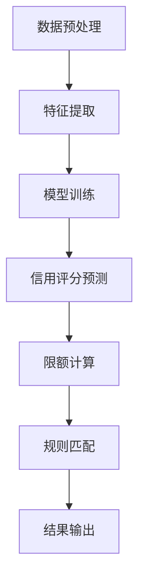
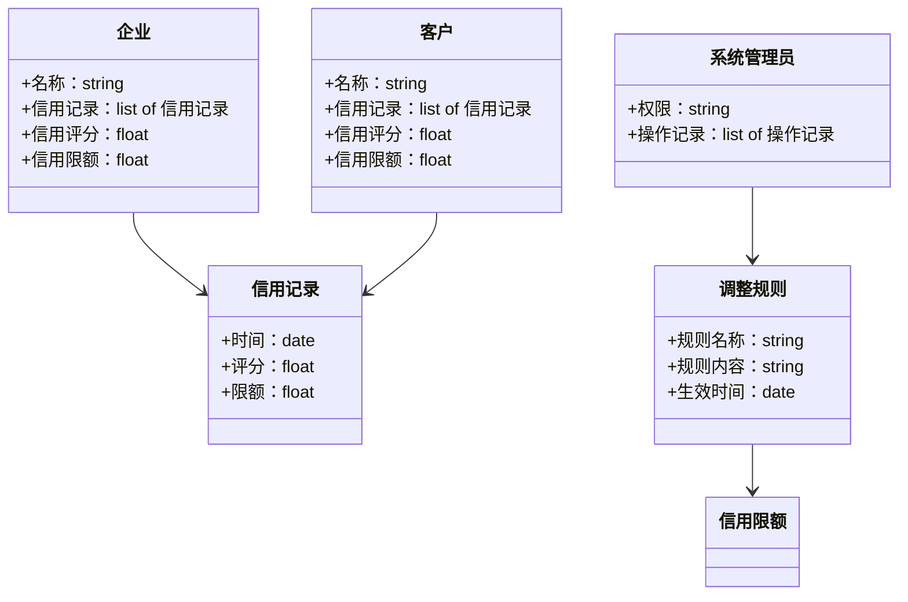
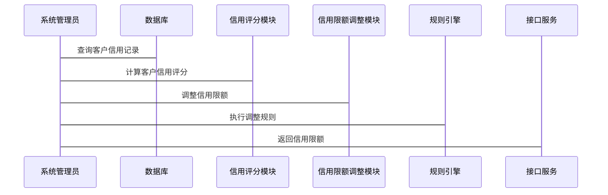

                 


# 智能企业信用限额动态调整系统

> 关键词：智能企业，信用限额，动态调整，人工智能，系统架构，算法实现，项目实战

> 摘要：本文深入探讨了智能企业信用限额动态调整系统的构建与实现，从背景介绍、核心概念、算法原理到系统架构设计、项目实战，再到最佳实践，全面解析了该系统的各个方面。文章通过详细的技术分析和实际案例，展示了如何利用人工智能和大数据技术，实现企业信用限额的智能化动态调整，从而优化企业的风险管理能力。

---

# 第1章: 企业信用限额动态调整的背景与问题

## 1.1 企业信用限额动态调整的重要性

### 1.1.1 信用管理在企业经营中的作用

企业的信用管理是企业经营中至关重要的一环。信用管理的好坏直接影响企业的财务健康、客户关系以及市场竞争力。传统的信用管理方式通常基于静态评估，即在一段时间内保持固定的信用限额，这种方式难以适应市场环境的变化和客户需求的多样性。

### 1.1.2 传统信用限额管理的局限性

传统的信用限额管理存在以下问题：
1. **静态评估**：信用限额一旦设定，难以根据市场变化和客户情况动态调整。
2. **主观性较强**：信用限额的调整往往依赖于人工判断，缺乏数据支持和模型指导。
3. **效率低下**：传统方式难以快速响应市场变化，可能导致企业错失商机或承担过高的风险。

### 1.1.3 动态调整信用限额的必要性

随着市场竞争的加剧和客户需求的多样化，企业需要更加灵活和精准的信用管理策略。动态调整信用限额能够帮助企业：
1. **优化客户体验**：根据客户信用状况的变化，及时调整信用限额，提升客户满意度。
2. **降低风险敞口**：通过动态调整，及时规避高风险客户，降低企业损失。
3. **提升运营效率**：自动化和智能化的信用管理能够显著提高企业运营效率。

## 1.2 智能化信用管理的兴起

### 1.2.1 AI与大数据技术对企业信用管理的推动

人工智能（AI）和大数据技术的快速发展为信用管理带来了新的机遇。通过收集和分析海量数据，AI算法能够帮助企业更准确地评估客户信用状况，从而实现信用限额的动态调整。

### 1.2.2 企业信用限额动态调整的市场需求

随着企业对风险管理的要求越来越高，市场对动态信用限额调整的需求也在不断增加。企业需要一种能够实时监控客户信用状况、快速响应市场变化的信用管理方案。

### 1.2.3 智能化信用管理的核心优势

智能化信用管理的核心优势在于其数据驱动和自动化的特点。通过整合企业内外部数据，利用机器学习算法，企业可以实现信用限额的智能化调整，从而提升信用管理的精准度和效率。

---

## 1.3 本章小结

本章通过分析企业信用限额动态调整的重要性，揭示了传统信用管理的局限性，并介绍了智能化信用管理的兴起及其核心优势。下一章将详细探讨智能企业信用限额动态调整系统的核心概念。

---

# 第2章: 智能企业信用限额动态调整系统的核心概念

## 2.1 系统核心概念的定义

### 2.1.1 信用限额的定义与计算方法

信用限额是指企业在一定时期内能够给予客户的最高信用额度。信用限额的计算通常基于客户的信用评分、历史交易记录、市场环境等因素。

### 2.1.2 动态调整的定义与实现方式

动态调整是指根据客户信用状况的变化，实时或定期调整信用限额的过程。动态调整的实现方式包括基于规则的调整和基于模型的调整。

### 2.1.3 智能化的核心要素

智能化的核心要素包括数据采集、模型构建、实时监控和反馈优化。通过整合这些要素，企业可以实现信用限额的智能化动态调整。

## 2.2 核心概念的属性对比

下表对比了信用评分与信用限额、动态调整与静态评估、智能化与传统化的属性特征：

| 对比维度       | 信用评分       | 信用限额       | 动态调整       | 静态评估       | 智能化       | 传统化       |
|----------------|----------------|----------------|----------------|----------------|---------------|---------------|
| 定义           | 客户信用状况的量化指标 | 企业给予客户的最高信用额度 | 根据客户信用状况变化实时调整信用额度 | 信用额度固定不变 | 利用AI和大数据技术实现动态调整 | 依赖人工判断和静态模型 |
| 优势           | 提高信用评估的准确性 | 优化客户信用管理 | 提高信用管理的灵活性和精准度 | 提高信用管理的稳定性 | 提高信用管理的效率和准确性 | 提高信用管理的主观性和不确定性 |
| 应用场景         | 信用额度审批、信用风险控制 | 信用额度调整、客户信用管理 | 实时信用额度调整、动态风险管理 | 静态信用额度管理 | 动态信用管理、智能化风险控制 | 静态信用管理、传统风险控制 |

### 2.2.3 实体关系分析

以下是系统核心实体关系的ER图：

```mermaid
er
    actor 企业
    actor 客户
    actor 系统管理员
    entity 信用记录
    entity 信用评分
    entity 信用限额
    entity 调整规则
    relationship 企业-信用记录
    relationship 客户-信用记录
    relationship 系统管理员-调整规则
    relationship 调整规则-信用限额
```

---

## 2.3 本章小结

本章通过定义系统的核心概念，分析了信用评分、信用限额、动态调整等关键要素，并通过对比和ER图展示了系统中实体之间的关系。下一章将深入探讨系统的算法原理与实现。

---

# 第3章: 系统算法原理与实现

## 3.1 动态调整信用限额的核心算法

### 3.1.1 基于机器学习的信用评分模型

信用评分模型是动态调整信用限额的核心算法之一。常用的机器学习算法包括逻辑回归、支持向量机（SVM）和随机森林等。

#### 逻辑回归模型

逻辑回归是一种常用的分类算法，适用于二分类问题。在信用评分中，逻辑回归模型可以用来预测客户违约的概率。

$$ P(y=1|x) = \frac{e^{\beta_0 + \beta_1 x}}{1 + e^{\beta_0 + \beta_1 x}} $$

其中，$y$ 是输出变量（违约概率），$x$ 是输入变量（客户特征），$\beta_0$ 和 $\beta_1$ 是模型参数。

### 3.1.2 动态调整的规则引擎

动态调整的规则引擎是基于预定义的规则对信用限额进行调整。规则引擎可以根据客户的信用评分、交易记录等信息，动态调整信用限额。

#### 示例规则

1. 如果客户的信用评分为优秀，则信用限额增加10%。
2. 如果客户的信用评分为一般，则信用限额保持不变。
3. 如果客户的信用评分为较差，则信用限额减少5%。

### 3.1.3 综合评分与限额计算的数学模型

综合评分与限额计算的数学模型可以通过加权平均的方式实现。例如：

$$ \text{综合评分} = w_1 \cdot \text{信用评分} + w_2 \cdot \text{历史交易记录} + w_3 \cdot \text{市场环境} $$

$$ \text{信用限额} = \text{基础信用额度} \cdot \frac{\text{综合评分}}{\text{最大评分}} $$

---

## 3.2 算法实现流程

以下是算法实现的流程图：



---

## 3.3 算法数学模型与公式

### 3.3.1 信用评分模型

信用评分模型可以通过以下公式实现：

$$ P(\text{违约}) = \frac{1}{1 + e^{- (\beta_0 + \beta_1 x_1 + \beta_2 x_2 + \dots + \beta_n x_n)}} $$

其中，$x_1, x_2, \dots, x_n$ 是客户的特征变量，$\beta_0, \beta_1, \dots, \beta_n$ 是模型参数。

---

## 3.4 本章小结

本章详细介绍了动态调整信用限额的核心算法，包括信用评分模型、规则引擎和综合评分与限额计算的数学模型。下一章将探讨系统的架构设计与实现。

---

# 第4章: 系统分析与架构设计

## 4.1 项目背景与目标

### 4.1.1 项目背景

随着市场竞争的加剧，企业需要更加灵活和精准的信用管理策略。传统的信用管理方式难以适应市场环境的变化和客户需求的多样性。

### 4.1.2 项目目标

本项目旨在开发一个智能企业信用限额动态调整系统，利用人工智能和大数据技术，实现信用限额的智能化动态调整，从而优化企业的风险管理能力。

## 4.2 系统功能设计

### 4.2.1 领域模型

以下是系统领域模型的类图：



### 4.2.2 系统架构设计

以下是系统的架构图：


---

## 4.3 系统接口设计

### 4.3.1 API接口

以下是系统的主要API接口：

1. `/api/v1/credit_score`：计算客户信用评分。
2. `/api/v1/credit_limit`：获取客户信用限额。
3. `/api/v1/rules`：管理调整规则。

### 4.3.2 接口交互流程

以下是接口交互流程的序列图：



---

## 4.4 本章小结

本章详细分析了系统的架构设计与接口设计，为系统的实现奠定了基础。下一章将通过项目实战进一步探讨系统的实现细节。

---

# 第5章: 项目实战

## 5.1 环境安装与配置

### 5.1.1 安装Python

```bash
python --version
pip install --upgrade pip
```

### 5.1.2 安装依赖库

```bash
pip install numpy pandas scikit-learn matplotlib
```

## 5.2 系统核心实现

### 5.2.1 数据预处理

```python
import pandas as pd
import numpy as np

data = pd.read_csv('credit_data.csv')
data = data.dropna()
data = pd.get_dummies(data)
```

### 5.2.2 模型训练与预测

```python
from sklearn.linear_model import LogisticRegression
from sklearn.metrics import accuracy_score

model = LogisticRegression()
model.fit(X_train, y_train)
y_pred = model.predict(X_test)
print(accuracy_score(y_test, y_pred))
```

### 5.2.3 信用限额计算

```python
def calculate_credit_limit(credit_score):
    base_limit = 100000
    max_score = 100
    limit = base_limit * (credit_score / max_score)
    return limit
```

## 5.3 代码应用解读与分析

### 5.3.1 数据预处理

数据预处理是机器学习模型训练的基础。通过删除缺失值和独热编码，可以提高模型的准确性。

### 5.3.2 模型训练与预测

逻辑回归模型是一种常用的分类算法，适用于二分类问题。在信用评分中，逻辑回归模型可以用来预测客户违约的概率。

### 5.3.3 信用限额计算

信用限额的计算基于客户的信用评分，通过公式计算得出。信用评分越高，信用限额越大。

---

## 5.4 实际案例分析

### 5.4.1 案例背景

某企业客户A的信用评分为85分，信用限额为10万元。根据动态调整规则，信用评分为85分的客户，信用限额增加10%。

### 5.4.2 调整规则

如果客户的信用评分为优秀（85分以上），则信用限额增加10%。

### 5.4.3 调整结果

调整后的信用限额为：

$$ \text{调整后的限额} = 100000 \times 1.1 = 110000 $$

---

## 5.5 项目小结

本章通过项目实战，详细展示了系统的实现过程，包括环境安装、数据预处理、模型训练与预测、信用限额计算以及实际案例分析。下一章将总结系统的最佳实践。

---

# 第6章: 最佳实践与总结

## 6.1 小结

智能企业信用限额动态调整系统的开发与应用，不仅提高了企业的信用管理能力，还优化了企业的风险管理能力。通过智能化的信用管理，企业可以实现信用限额的动态调整，从而提升客户满意度和企业竞争力。

## 6.2 注意事项

1. 数据隐私与安全：在处理客户数据时，必须遵守相关法律法规，确保数据隐私与安全。
2. 模型的可解释性：信用评分模型的可解释性是企业信用管理的重要因素，必须确保模型的透明性和可解释性。
3. 模型的实时性：动态调整信用限额需要实时监控客户信用状况的变化，确保模型的实时性和准确性。

## 6.3 拓展阅读

1. 《机器学习实战》
2. 《Python机器学习》
3. 《信用评分模型与应用》

---

# 作者

作者：AI天才研究院/AI Genius Institute & 禅与计算机程序设计艺术/Zen And The Art of Computer Programming

