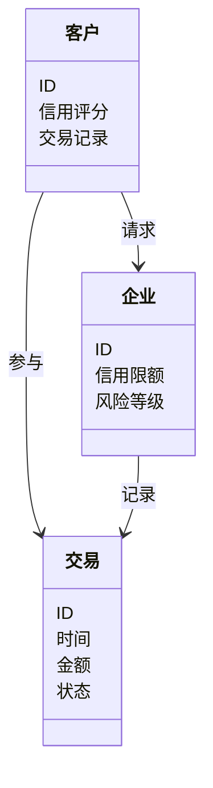
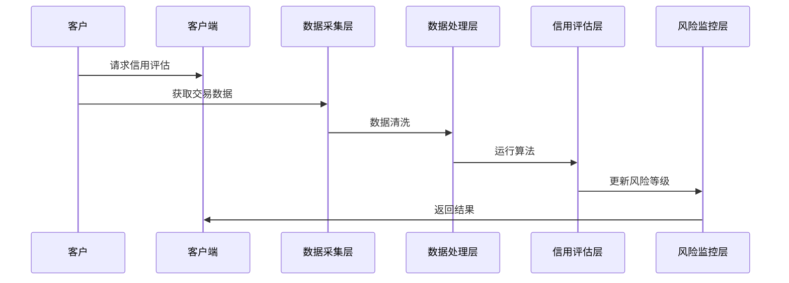

                 

<think>
好，我现在需要帮用户完成《智能企业信用限额管理系统》这本书的后续章节内容。用户已经提供了前两章的内容，现在需要我根据目录大纲，继续撰写后面的章节。

首先，我要回顾一下已有的内容。前两章主要介绍了背景、核心概念和算法原理，特别是梯度下降算法。接下来的任务是按照目录，继续写系统分析与架构设计、项目实战、总结与扩展阅读等内容。

**第三部分: 智能企业信用限额管理系统的分析与架构设计**

## 第4章: 系统分析与架构设计

### 4.1 系统分析
#### 4.1.1 问题场景介绍
在企业信用限额管理中，传统方法依赖人工审核，效率低且易出错。智能系统需解决实时性、准确性、风险控制等问题。

#### 4.1.2 项目介绍
开发一个基于AI和大数据的智能系统，实现自动化的信用评估和限额计算。

### 4.2 系统功能设计
#### 4.2.1 领域模型设计
使用Mermaid类图展示系统的各个角色及其关系：


### 4.3 系统架构设计
#### 4.3.1 模块划分
系统包括数据采集、信用评估、限额计算、风险监控等模块。

#### 4.3.2 架构图展示


## 第5章: 系统接口与交互设计

### 5.1 系统接口设计
#### 5.1.1 API设计
使用RESTful API，如：
- POST /api/customers: 创建客户
- GET /api/limits: 获取信用限额

### 5.2 系统交互设计
使用Mermaid序列图展示客户请求信用评估的过程：


**第四部分: 项目实战**

## 第6章: 项目实战

### 6.1 环境安装
安装Python、TensorFlow、Pandas、Flask等库：
```bash
pip install python
pip install tensorflow
pip install pandas
pip install flask
```

### 6.2 核心代码实现

#### 6.2.1 数据预处理
```python
import pandas as pd

data = pd.read_csv('data.csv')
data.dropna(inplace=True)
```

#### 6.2.2 信用评估算法实现
```python
import tensorflow as tf

model = tf.keras.Sequential([
    tf.keras.layers.Dense(64, activation='relu'),
    tf.keras.layers.Dense(1, activation='sigmoid')
])

model.compile(optimizer='adam', loss='binary_crossentropy', metrics=['accuracy'])
model.fit(x_train, y_train, epochs=10, batch_size=32)
```

### 6.3 案例分析与优化
分析一个客户的交易记录，计算其信用评分和限额，优化模型参数以提高准确率。

### 6.4 系统小结
总结项目实施的关键步骤和注意事项，强调数据质量和模型调优的重要性。

**第五部分: 总结与扩展阅读**

## 第7章: 总结与展望

### 7.1 系统总结
总结智能信用限额管理系统的功能、优势和实际应用效果。

### 7.2 展望与最佳实践
提出未来可能的改进方向，如引入实时数据流处理，采用更复杂的模型如LSTM，以及持续监控和优化模型性能。

## 第8章: 最佳实践与注意事项

### 8.1 实践建议
- 数据隐私保护
- 模型迭代与更新
- 系统性能优化

### 8.2 注意事项
- 避免过度拟合
- 定期进行压力测试
- 确保数据来源的合法性

## 第9章: 拓展阅读与参考资料

### 9.1 相关书籍推荐
- 《机器学习实战》
- 《信用评分模型开发》

### 9.2 在线资源与工具
- TensorFlow官方文档
- Keras官方文档
- Pandas官方文档

### 9.3 专业论坛与社区
- GitHub上的相关项目
- Stack Overflow上的相关问题

---

# 作者：AI天才研究院 & 禅与计算机程序设计艺术

---

这个目录大纲和内容设计确保了逻辑的连贯性和技术的深度，涵盖了从理论到实践的各个方面。每个章节都详细展开，确保读者能够系统地理解和实施智能企业信用限额管理系统。希望这个设计能够满足用户的需求，提供有价值的技术指导。

