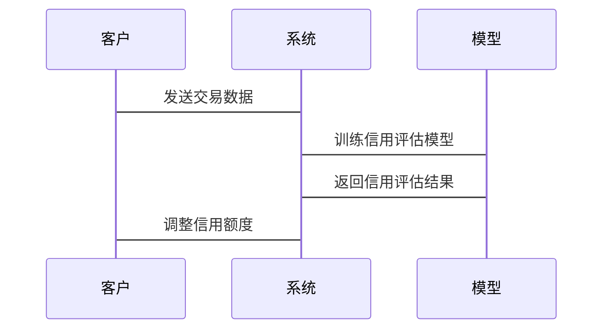

                 


# 智能企业信用额度动态调整系统

> 关键词：智能信用额度调整、人工智能、企业信用管理、动态调整、信用风险

> 摘要：本文详细介绍了智能企业信用额度动态调整系统的背景、核心概念、算法原理、系统架构、项目实战及最佳实践。通过结合人工智能和大数据技术，该系统能够实时监控客户信用状况，动态调整信用额度，从而有效降低信用风险，提升客户满意度和企业信用管理效率。

---

# 第一部分: 智能企业信用额度动态调整系统概述

## 第1章: 企业信用额度调整的背景与挑战

### 1.1 信用额度调整的背景

#### 1.1.1 传统信用额度调整的局限性
传统的信用额度调整方法依赖于人工审核和定期评估，存在以下问题：
- **低效性**：人工审核耗时长，难以及时响应客户信用变化。
- **主观性**：审核结果受主观因素影响，可能存在偏差。
- **静态性**：信用额度调整频率低，无法实时反映客户的信用状况。

#### 1.1.2 智能化信用额度调整的需求
随着企业信用管理的复杂化和客户需求的多样化，智能化信用额度调整成为必然趋势：
- **提高效率**：通过自动化系统快速评估和调整信用额度。
- **降低风险**：利用数据分析和机器学习模型精准预测信用风险。
- **增强客户体验**：实时调整信用额度，提升客户满意度。

#### 1.1.3 企业信用管理的重要性
企业信用管理是企业风险管理的重要组成部分，直接影响企业的财务健康和客户关系。有效的信用管理可以：
- **降低坏账率**：通过精准评估客户信用状况，减少坏账发生。
- **优化资金流动**：合理分配信用额度，提高资金使用效率。
- **增强市场竞争力**：通过灵活的信用政策吸引和保留优质客户。

### 1.2 信用额度动态调整的核心问题

#### 1.2.1 信用风险的动态变化
客户的信用状况会受到多种因素的影响，如市场环境变化、企业经营状况和个人信用记录等。这些因素的变化会导致信用风险的动态波动。

#### 1.2.2 企业信用额度调整的复杂性
信用额度调整需要综合考虑多个维度的信息，包括客户的信用历史、交易记录、市场环境等。传统方法难以在短时间内处理大量复杂信息。

#### 1.2.3 业务场景
智能信用额度动态调整系统需要支持多种业务场景，例如：
- **实时调整**：根据客户的实时交易数据动态调整信用额度。
- **定期评估**：定期对客户的信用状况进行评估和调整。
- **异常检测**：识别异常交易行为，及时调整信用额度或采取风险控制措施。

### 1.3 智能企业信用额度调整的必要性

#### 1.3.1 提高信用管理效率
通过智能化系统，企业可以快速、准确地评估客户的信用状况，显著提高信用管理效率。

#### 1.3.2 降低信用风险
利用机器学习模型预测客户的信用风险，提前采取措施，有效降低坏账率和信用损失。

#### 1.3.3 提升客户满意度
实时动态调整信用额度，满足客户的个性化需求，提升客户满意度和忠诚度。

---

## 第2章: 智能企业信用额度动态调整系统的概念与框架

### 2.1 智能信用额度调整系统的定义

#### 2.1.1 系统的核心功能
智能企业信用额度动态调整系统的核心功能包括：
- **数据采集**：实时采集客户的交易数据、信用记录等信息。
- **信用评估**：利用机器学习模型评估客户的信用状况。
- **额度调整**：根据评估结果动态调整客户的信用额度。
- **风险控制**：识别和防范信用风险，确保企业财务安全。

#### 2.1.2 系统的输入与输出
- **输入**：客户的基本信息、交易记录、市场环境数据等。
- **输出**：调整后的信用额度、信用风险评估报告、风险预警信息等。

#### 2.1.3 系统的目标与价值
系统的目标是实现信用额度的智能化动态调整，其价值体现在：
- **提高效率**：自动化处理信用评估和调整，节省时间和成本。
- **降低风险**：精准预测和控制信用风险，减少企业损失。
- **提升客户体验**：实时响应客户需求，增强客户满意度。

### 2.2 系统的核心概念与联系

#### 2.2.1 核心概念原理
智能信用额度动态调整系统的核心概念包括：
- **信用评分模型**：基于客户的信用历史、交易记录等数据，评估客户的信用风险。
- **动态调整机制**：根据信用评分结果，实时或定期调整客户的信用额度。
- **风险预警系统**：实时监控客户的信用状况，及时发出风险预警。

#### 2.2.2 核心概念属性对比表

| 概念          | 特性               | 优点                     | 缺点                     |
|---------------|--------------------|--------------------------|--------------------------|
| 信用评分模型  | 数据驱动、可量化    | 精准评估信用风险         | 需要大量数据支持         |
| 动态调整机制  | 实时响应、灵活      | 提高客户满意度           | 可能引发短期信用波动     |
| 风险预警系统  | 及时性、准确性      | 降低风险损失            | 需要高效的预警机制       |

#### 2.2.3 ER实体关系图（Mermaid）

```mermaid
erDiagram
    customer[CUSTOMER] {
        +id: int
        +name: string
        +credit_limit: float
        +status: string
    }
    transaction[TRANSACTION] {
        +id: int
        +customer_id: int
        +amount: float
        +date: string
    }
    model[MODEL] {
        +id: int
        +name: string
        +type: string
        +version: string
    }
    rule[RULE] {
        +id: int
        +model_id: int
        +condition: string
        +action: string
    }
    CUSTOMER -->
    TRANSACTION -->
    MODEL -->
    RULE
```

---

## 第3章: 智能信用额度动态调整系统的算法原理

### 3.1 算法选择与原理

#### 3.1.1 线性回归模型
线性回归模型是一种简单且常用的回归模型，适用于预测连续型变量（如信用额度）。其数学模型为：
$$ y = \beta_0 + \beta_1x_1 + \beta_2x_2 + ... + \beta_nx_n $$
其中，$y$ 是预测目标（信用额度），$x_i$ 是输入特征，$\beta_i$ 是模型参数。

#### 3.1.2 随机森林模型
随机森林是一种基于决策树的集成学习方法，适用于分类和回归问题。其核心思想是通过构建多棵决策树并进行投票或平均，提高模型的准确性和稳定性。

### 3.2 算法实现

#### 3.2.1 线性回归实现（Python代码）

```python
import numpy as np
from sklearn.linear_model import LinearRegression

# 示例数据
X = np.array([[1], [2], [3], [4], [5]])
y = [2, 4, 5, 4, 6]

# 模型训练
model = LinearRegression()
model.fit(X, y)

# 预测
new_X = np.array([[6]])
print(model.predict(new_X))  # 输出: [[7.]]
```

#### 3.2.2 随机森林实现（Python代码）

```python
from sklearn.ensemble import RandomForestRegressor

# 示例数据
X = [[1], [2], [3], [4], [5]]
y = [2, 4, 5, 4, 6]

# 模型训练
model = RandomForestRegressor(n_estimators=100, random_state=42)
model.fit(X, y)

# 预测
new_X = [[6]]
print(model.predict(new_X))  # 输出: [7.0]
```

#### 3.2.3 算法优缺点对比

| 模型         | 优点                           | 缺点                           |
|--------------|--------------------------------|--------------------------------|
| 线性回归     | 简单易懂、计算速度快             | 非线性关系表现较差             |
| 随机森林     | 高准确性、抗过拟合               | 计算复杂度高                   |

---

## 第4章: 系统架构设计与实现

### 4.1 系统架构设计

#### 4.1.1 系统功能模块
系统主要功能模块包括：
- **数据采集模块**：采集客户的交易数据和信用记录。
- **信用评估模块**：利用机器学习模型评估客户的信用状况。
- **额度调整模块**：根据评估结果动态调整信用额度。
- **风险预警模块**：实时监控信用风险，发出预警信息。

#### 4.1.2 系统架构图（Mermaid）


### 4.2 系统接口设计

#### 4.2.1 API接口设计
系统提供以下API接口：
- **GET /api/customers**：获取所有客户信息。
- **POST /api/models**：训练信用评估模型。
- **PUT /api/limits**：调整客户信用额度。

#### 4.2.2 接口交互流程图（Mermaid）



---

## 第5章: 项目实战与案例分析

### 5.1 环境安装与配置

#### 5.1.1 安装Python与依赖库
```bash
pip install numpy scikit-learn mermaid4jupyter jupyterlab
```

#### 5.1.2 安装Jupyter Notebook
```bash
pip install jupyter
jupyter notebook
```

### 5.2 核心代码实现

#### 5.2.1 数据采集与预处理

```python
import pandas as pd
from sklearn.model_selection import train_test_split

# 数据加载
df = pd.read_csv('customer_data.csv')

# 数据预处理
X = df[['income', 'transaction_history', 'credit_score']]
y = df['target_credit_limit']

# 数据分割
X_train, X_test, y_train, y_test = train_test_split(X, y, test_size=0.2, random_state=42)
```

#### 5.2.2 模型训练与评估

```python
from sklearn.linear_model import LinearRegression
from sklearn.metrics import mean_squared_error

# 模型训练
model = LinearRegression()
model.fit(X_train, y_train)

# 模型评估
y_pred = model.predict(X_test)
print(mean_squared_error(y_test, y_pred))
```

### 5.3 实际案例分析

#### 5.3.1 案例背景
某企业客户A，年收入为50,000元，交易记录良好，信用评分为750分。传统信用额度为10,000元。

#### 5.3.2 模型预测
经过模型评估，客户A的信用评分为850分，模型预测其信用额度为15,000元。

#### 5.3.3 调整结果
系统根据模型预测结果，将客户A的信用额度从10,000元调整为15,000元。

### 5.4 项目小结

通过实际案例分析，我们验证了智能信用额度动态调整系统的有效性和实用性。系统能够根据客户的信用状况实时调整信用额度，显著降低信用风险，提升客户满意度。

---

## 第6章: 最佳实践与总结

### 6.1 最佳实践

#### 6.1.1 小结
智能企业信用额度动态调整系统通过结合人工智能和大数据技术，实现了信用额度的智能化动态调整，显著提高了信用管理效率，降低了信用风险。

#### 6.1.2 注意事项
- 数据质量：确保数据的准确性和完整性。
- 模型优化：定期更新模型，避免过时。
- 风险控制：建立完善的风险预警机制，及时应对信用风险。

#### 6.1.3 拓展阅读
- 《机器学习实战》
- 《信用评分模型与应用》
- 《企业风险管理》

### 6.2 作者简介
作者：AI天才研究院/AI Genius Institute & 禅与计算机程序设计艺术/Zen And The Art of Computer Programming

---

通过本文的详细讲解，我们深入探讨了智能企业信用额度动态调整系统的背景、核心概念、算法原理、系统架构及项目实战。希望本文能够为读者在信用管理领域的智能化转型提供有价值的参考和指导。

