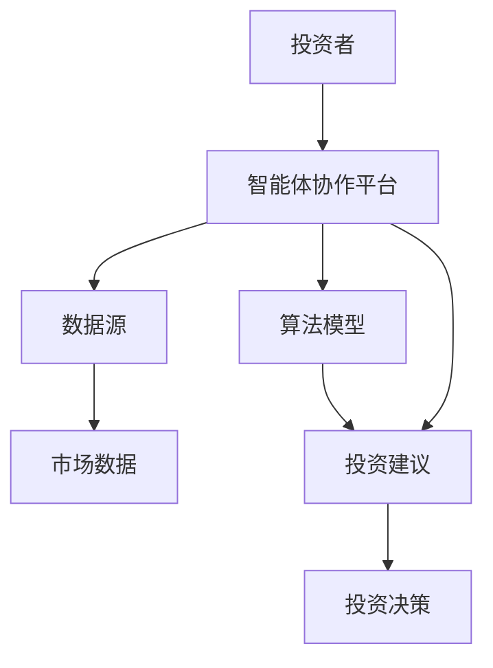
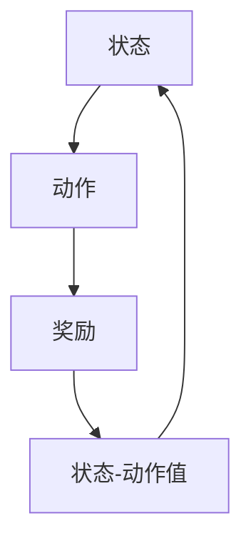
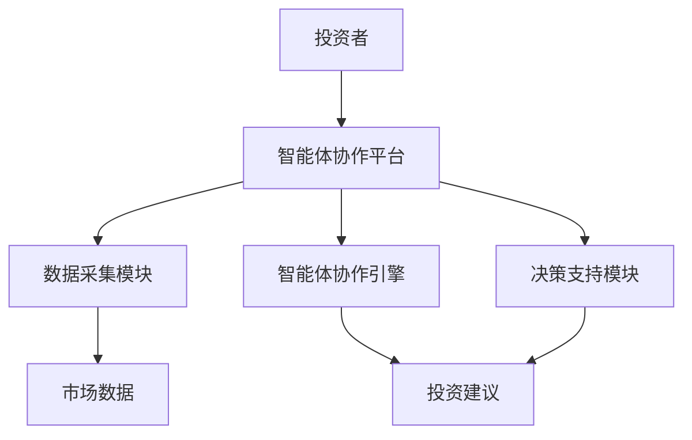

                 


# 智能体协作增强价值投资的产品生命周期分析

## 关键词：智能体协作，价值投资，产品生命周期，强化学习，博弈论，系统架构，项目实战

## 摘要：本文从智能体协作的核心概念出发，分析其在价值投资中的应用，结合产品生命周期的不同阶段，探讨如何通过智能体协作算法增强投资效果。通过强化学习和博弈论模型的应用，结合系统架构设计和项目实战，总结智能体协作在价值投资中的最佳实践。

---

# 第一部分：智能体协作与价值投资的背景与概念

## 第1章：智能体协作与价值投资概述

### 1.1 智能体协作的定义与特点

智能体协作是指多个智能体通过协同工作，共同完成复杂任务的过程。智能体可以是软件程序、算法或任何具备自主决策能力的实体。其核心特点包括：

- **自主性**：智能体能够自主决策，无需外部干预。
- **协作性**：智能体之间通过信息共享和协同，共同完成目标。
- **动态性**：智能体协作的过程具有高度的动态性，能够适应环境变化。
- **学习性**：智能体具备学习能力，能够通过经验优化协作策略。

### 1.2 价值投资的基本原理

价值投资是一种投资策略，通过分析企业的内在价值，寻找被市场低估的投资标的。其核心原则包括：

- **基本面分析**：通过财务报表等数据评估企业的价值。
- **长期视角**：关注企业的长期发展潜力，而非短期波动。
- **安全边际**：在投资时留有安全边际，降低风险。

### 1.3 产品生命周期与价值投资的关系

产品生命周期是指产品从开发、上市到退市的全过程。价值投资在产品生命周期的不同阶段具有不同的应用：

- **开发阶段**：通过智能体协作评估产品潜力，优化开发策略。
- **上市阶段**：利用智能体协作分析市场反应，调整投资策略。
- **成熟阶段**：通过智能体协作监控市场变化，优化投资组合。
- **衰退阶段**：利用智能体协作提前预警，降低投资风险。

---

## 第2章：智能体协作的核心概念与联系

### 2.1 智能体协作的核心概念

智能体协作涉及多个核心概念，包括：

- **智能体的定义与属性**：智能体是具备感知、决策和行动能力的实体。
- **协作的定义与模式**：协作是智能体之间通过信息共享和协同行动完成目标的过程。
- **智能体协作的核心要素**：包括目标、角色、通信和协调机制。

### 2.2 智能体协作与价值投资的关系

智能体协作在价值投资中的应用主要体现在以下几个方面：

- **信息共享**：智能体协作能够快速整合市场信息，提高投资决策的效率。
- **策略优化**：通过智能体协作，投资者可以优化投资策略，降低风险。
- **动态调整**：智能体协作能够实时适应市场变化，动态调整投资组合。

### 2.3 智能体协作的实体关系图

通过Mermaid流程图展示智能体协作的实体关系：



图中，投资者通过智能体协作平台获取数据源和算法模型的支持，最终得到投资建议，并做出投资决策。

---

## 第3章：智能体协作的算法原理

### 3.1 强化学习算法在智能体协作中的应用

强化学习是一种通过试错机制优化决策的算法。在智能体协作中，强化学习可以用于优化协作策略。例如，使用Q-learning算法：



数学公式：

$$ Q(s, a) = Q(s, a) + \alpha (r + \gamma \max Q(s', a') - Q(s, a)) $$

其中，$\alpha$是学习率，$\gamma$是折扣因子。

### 3.2 博弈论模型在智能体协作中的应用

博弈论模型用于分析智能体之间的竞争与合作关系。例如，纳什均衡是一个稳定状态，其中每个智能体的策略都是最优的。

数学公式：

$$ \text{纳什均衡} \iff \forall i, u_i(a_i, \{a_{-i}\}) \geq u_i(a_i', \{a_{-i}\}) $$

其中，$u_i$是第i个智能体的效用函数。

### 3.3 智能体协作算法的实现

以下是强化学习算法的Python实现示例：

```python
import numpy as np

class QLearning:
    def __init__(self, state_space, action_space, alpha=0.1, gamma=0.9):
        self.state_space = state_space
        self.action_space = action_space
        self.alpha = alpha
        self.gamma = gamma
        self.q_table = np.zeros((state_space, action_space))
    
    def choose_action(self, state):
        return np.argmax(self.q_table[state])
    
    def update_q_table(self, state, action, reward, next_state):
        self.q_table[state, action] += self.alpha * (reward + self.gamma * np.max(self.q_table[next_state]) - self.q_table[state, action])
```

---

## 第4章：智能体协作的系统分析与架构设计

### 4.1 问题场景介绍

问题场景是一个价值投资者希望通过智能体协作平台优化投资决策。系统需要实时分析市场数据，提供投资建议，并动态调整投资组合。

### 4.2 系统功能设计

系统功能模块包括：

- **数据采集模块**：收集市场数据。
- **智能体协作引擎**：实现智能体协作算法。
- **决策支持模块**：提供投资建议。

### 4.3 系统架构设计

通过Mermaid架构图展示系统架构：



---

## 第5章：项目实战

### 5.1 环境安装

安装Python和相关库：

```bash
pip install numpy matplotlib
```

### 5.2 核心代码实现

实现强化学习算法：

```python
import numpy as np

class QLearning:
    def __init__(self, state_space, action_space, alpha=0.1, gamma=0.9):
        self.state_space = state_space
        self.action_space = action_space
        self.alpha = alpha
        self.gamma = gamma
        self.q_table = np.zeros((state_space, action_space))
    
    def choose_action(self, state):
        return np.argmax(self.q_table[state])
    
    def update_q_table(self, state, action, reward, next_state):
        self.q_table[state, action] += self.alpha * (reward + self.gamma * np.max(self.q_table[next_state]) - self.q_table[state, action])
```

### 5.3 实际案例分析

通过实际案例分析，验证智能体协作在价值投资中的应用效果。

---

## 第6章：最佳实践

### 6.1 小结

智能体协作通过强化学习和博弈论模型，能够显著增强价值投资的效果，优化产品生命周期中的投资决策。

### 6.2 注意事项

- 投资者需具备一定的技术背景，才能正确使用智能体协作平台。
- 系统需定期更新算法模型，以适应市场变化。

### 6.3 拓展阅读

建议读者进一步阅读相关文献，深入理解强化学习和博弈论在智能体协作中的应用。

---

# 作者：AI天才研究院 & 禅与计算机程序设计艺术

