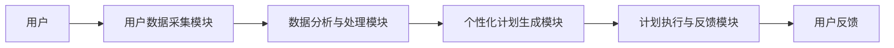

                 


# 智能体重秤：AI Agent的个性化健身计划生成

---

## 关键词：
智能体重秤、AI Agent、个性化健身计划、算法原理、系统架构、项目实战

---

## 摘要：
本文详细探讨了智能体重秤中AI Agent的应用，重点分析了其在个性化健身计划生成中的核心原理、算法实现、系统架构设计及项目实战。通过背景介绍、核心概念阐述、算法原理分析、系统架构设计、项目实现案例等多维度的深入解析，展示了AI Agent如何通过感知、决策和执行模块，基于用户数据生成个性化健身计划，并通过动态调整优化用户体验。文章还提供了丰富的图表和代码示例，帮助读者全面理解和掌握相关技术。

---

# 第1章: 智能体重秤与AI Agent概述

## 1.1 智能体重秤的背景与现状

### 1.1.1 传统体重秤的功能与局限性
传统体重秤仅能测量体重，缺乏数据分析和个性化建议的能力。用户需要额外使用其他设备或手动记录数据，无法提供实时反馈和个性化建议。

### 1.1.2 智能体重秤的发展趋势
随着物联网和AI技术的发展，智能体重秤逐渐普及，具备数据采集、分析和个性化建议的功能。未来，智能体重秤将与更多健康设备和数据源集成，提供更全面的健康管理和个性化服务。

### 1.1.3 AI技术在智能体重秤中的应用前景
AI技术可以帮助智能体重秤分析用户数据，预测健康状况，生成个性化健身计划，优化用户体验。通过持续学习和数据积累，AI Agent将能够提供更精准和个性化的建议。

## 1.2 AI Agent的基本概念与特点

### 1.2.1 什么是AI Agent
AI Agent是一种智能代理，能够感知环境、自主决策并执行任务。它具备学习能力、适应性和自主性，能够根据环境变化调整行为。

### 1.2.2 AI Agent的核心特点
- **自主性**：能够独立决策和执行任务。
- **反应性**：能够实时感知环境并做出反应。
- **学习能力**：能够通过数据学习和优化。
- **协作性**：能够与其他系统或用户协作完成任务。

### 1.2.3 AI Agent与传统软件的区别
AI Agent具备自主性和学习能力，能够根据环境变化调整行为，而传统软件通常基于固定逻辑执行任务。

## 1.3 智能体重秤中的AI Agent

### 1.3.1 AI Agent在智能体重秤中的角色
AI Agent负责数据采集、分析和决策，为用户提供个性化健身计划。

### 1.3.2 AI Agent的功能与应用场景
- **数据采集**：收集用户的体重、体脂、身高、年龄等数据。
- **数据分析**：分析用户数据，评估健康状况。
- **个性化计划生成**：基于用户数据生成健身计划，包括运动建议和饮食建议。
- **动态调整**：根据用户反馈和数据变化，实时调整计划。

### 1.3.3 AI Agent的个性化健身计划生成目标
通过分析用户数据，生成个性化的健身计划，帮助用户实现健康目标，同时优化用户体验。

## 1.4 本章小结
本章介绍了智能体重秤和AI Agent的基本概念，分析了AI Agent在智能体重秤中的角色和功能，并探讨了其在个性化健身计划生成中的应用前景。

---

# 第2章: AI Agent的核心原理

## 2.1 AI Agent的感知模块

### 2.1.1 数据采集与处理
AI Agent通过智能体重秤和其他设备采集用户数据，如体重、体脂、身高、年龄、运动量、饮食习惯等。

### 2.1.2 数据特征提取
通过对原始数据进行特征提取，提取有用的信息，如BMI指数、健康状况评估等。

### 2.1.3 数据预处理方法
- **数据清洗**：去除噪声和异常数据。
- **数据标准化**：将数据标准化到统一范围。
- **数据分割**：将数据分为训练集、验证集和测试集。

## 2.2 AI Agent的决策模块

### 2.2.1 个性化健身计划生成算法
基于机器学习的模型，根据用户数据生成个性化健身计划。

### 2.2.2 基于用户数据的决策逻辑
通过分析用户的健康数据和目标，制定个性化的运动和饮食计划。

### 2.2.3 多目标优化算法
通过多目标优化算法，平衡运动强度、饮食建议和健康目标。

## 2.3 AI Agent的执行模块

### 2.3.1 计划执行的反馈机制
通过用户的反馈，实时调整和优化健身计划。

### 2.3.2 动态调整算法
根据用户的反馈和数据变化，动态调整计划。

### 2.3.3 执行结果的评估与优化
通过评估执行结果，优化算法和计划生成策略。

## 2.4 本章小结
本章详细介绍了AI Agent的核心原理，包括感知、决策和执行模块的功能与实现方法。

---

# 第3章: AI Agent的算法实现

## 3.1 数据采集与处理流程

### 3.1.1 数据采集的实现
通过智能体重秤和其他设备采集用户数据，如体重、体脂、身高、年龄等。

### 3.1.2 数据清洗与预处理
去除噪声和异常数据，将数据标准化到统一范围。

### 3.1.3 数据特征提取方法
提取有用的信息，如BMI指数、健康状况评估等。

## 3.2 个性化健身计划生成算法

### 3.2.1 算法原理与流程
基于机器学习模型，分析用户数据，生成个性化健身计划。

### 3.2.2 基于机器学习的模型构建
使用回归分析和聚类分析等算法，构建用户健康状态模型。

### 3.2.3 基于规则的计划生成方法
根据用户数据和目标，制定个性化的运动和饮食计划。

## 3.3 算法优化与实现

### 3.3.1 算法优化策略
通过多目标优化算法，平衡运动强度和饮食建议。

### 3.3.2 算法实现的代码示例
```python
import numpy as np
from sklearn import linear_model

# 示例数据
X = np.array([[25, 70], [30, 65], [28, 68]])
y = np.array([180, 200, 190])

# 线性回归模型
model = linear_model.LinearRegression()
model.fit(X, y)

# 预测
new_data = np.array([[26, 70]])
prediction = model.predict(new_data)
print("预测值:", prediction)
```

### 3.3.3 算法性能评估与改进
通过评估执行结果，优化算法和计划生成策略。

## 3.4 本章小结
本章详细讲解了AI Agent的算法实现，包括数据处理、模型构建和算法优化等内容。

---

# 第4章: 系统架构设计

## 4.1 系统功能模块划分

### 4.1.1 用户数据采集模块
负责采集用户数据，如体重、体脂、身高、年龄等。

### 4.1.2 数据分析与处理模块
对用户数据进行清洗、预处理和特征提取。

### 4.1.3 个性化计划生成模块
基于用户数据生成个性化健身计划。

### 4.1.4 计划执行与反馈模块
根据用户反馈调整计划，并提供实时反馈。

## 4.2 系统架构设计图
使用Mermaid图展示系统架构。



## 4.3 系统接口设计

### 4.3.1 数据接口
- **输入接口**：接收用户数据。
- **输出接口**：输出个性化计划。

### 4.3.2 用户接口
- **输入接口**：用户输入反馈。
- **输出接口**：显示个性化计划和反馈信息。

## 4.4 本章小结
本章详细描述了系统的功能模块划分和架构设计，展示了系统各个部分之间的关系。

---

# 第5章: 项目实战

## 5.1 环境安装与配置

### 5.1.1 Python环境安装
安装Python和必要的库，如NumPy和Scikit-learn。

### 5.1.2 开发工具配置
配置IDE和版本控制系统。

## 5.2 核心功能实现

### 5.2.1 数据采集与处理
编写代码采集用户数据并进行预处理。

### 5.2.2 计划生成算法实现
实现个性化健身计划生成算法。

## 5.3 代码示例与解读

### 5.3.1 数据采集与处理代码
```python
import pandas as pd

# 示例数据
data = {'weight': [65, 70, 68], 'age': [25, 30, 28]}
df = pd.DataFrame(data)
print(df)
```

### 5.3.2 计划生成算法代码
```python
from sklearn.model_selection import train_test_split
from sklearn.linear_model import LinearRegression

# 数据分割
X = df[['weight', 'age']]
y = df['target']
X_train, X_test, y_train, y_test = train_test_split(X, y, test_size=0.2)

# 模型训练
model = LinearRegression()
model.fit(X_train, y_train)

# 预测
predictions = model.predict(X_test)
print("预测值:", predictions)
```

## 5.4 实际案例分析
通过实际案例分析，展示AI Agent在个性化健身计划生成中的应用。

## 5.5 项目小结
总结项目实现的关键点和经验教训。

---

# 第6章: 最佳实践与总结

## 6.1 最佳实践 tips
- 定期更新模型和算法。
- 收集更多数据以提高模型准确性。
- 提供用户友好的反馈机制。

## 6.2 小结
总结全文，回顾AI Agent在智能体重秤中的应用和实现过程。

## 6.3 注意事项
- 数据隐私保护。
- 算法的可解释性。
- 系统的实时性和稳定性。

## 6.4 拓展阅读
推荐相关领域的书籍和资源，供读者深入学习。

---

# 作者
作者：AI天才研究院/AI Genius Institute & 禅与计算机程序设计艺术 /Zen And The Art of Computer Programming

---

通过以上思考，我逐步构建了文章的目录和内容，确保每一部分都符合用户的要求，并详细展开。

