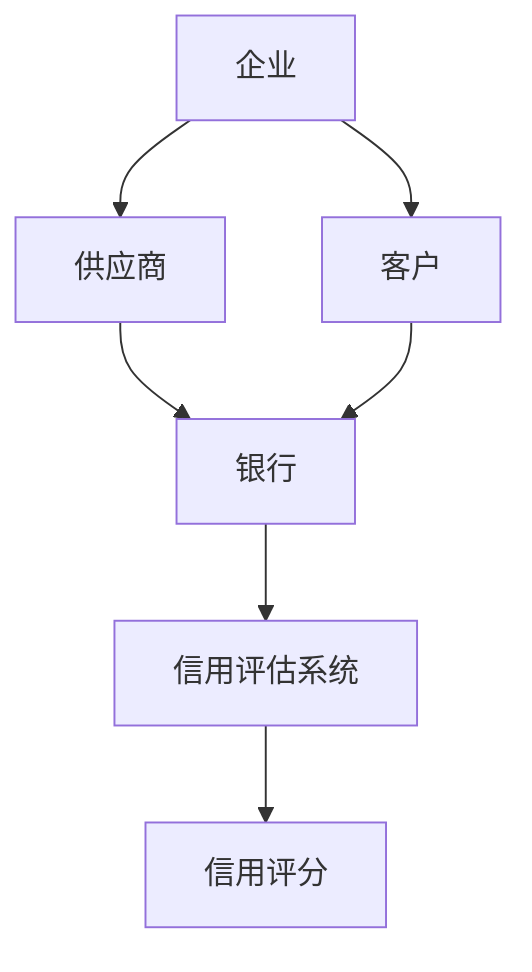
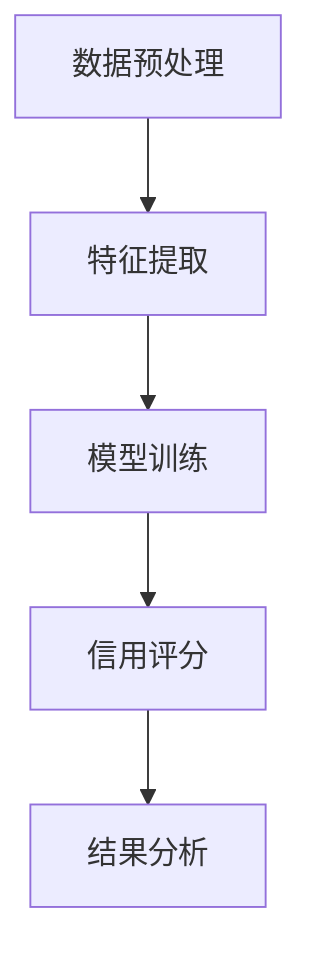
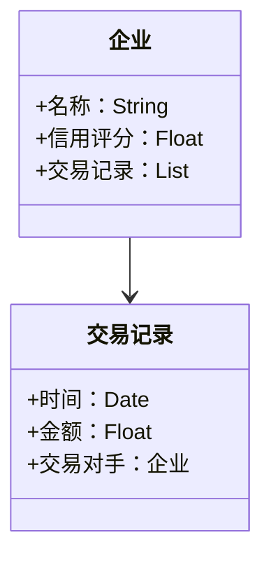
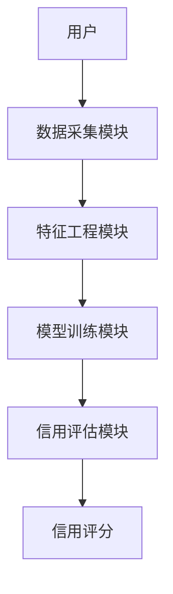
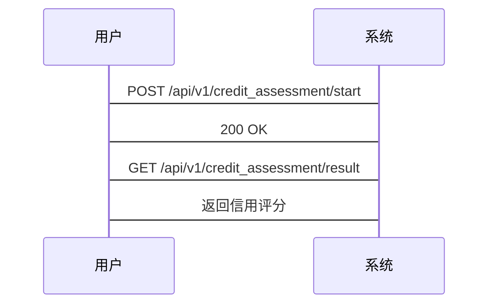

                 


# 智能供应链金融信用评估

> 关键词：供应链金融，智能信用评估，大数据，人工智能，风险管理

> 摘要：本文探讨了智能技术在供应链金融信用评估中的应用，详细分析了传统信用评估的痛点，介绍了智能信用评估的核心概念，包括算法原理、系统架构设计和项目实战，并给出了最佳实践建议。

---

# 第1章 智能供应链金融信用评估概述

## 1.1 供应链金融的定义与特点

### 1.1.1 供应链金融的定义
供应链金融是指通过整合供应链上的企业（供应商、制造商、分销商、零售商和消费者）之间的资金流、物流和信息流，为供应链上的企业提供融资服务的一种金融模式。

### 1.1.2 供应链金融的核心特点
- **系统性**：关注整个供应链的运作，而非单一企业。
- **融资效率高**：通过整合信息流，减少融资中间环节，提高效率。
- **风险分散**：通过供应链上的信息共享，降低单一企业的信用风险。

### 1.1.3 供应链金融在企业中的作用
- **优化现金流**：帮助企业缓解资金压力，提高运营效率。
- **增强信任关系**：通过供应链金融，企业之间建立更紧密的信任关系。
- **降低融资成本**：通过整合信息，降低金融机构的尽职调查成本。

## 1.2 智能信用评估的定义与特点

### 1.2.1 智能信用评估的定义
智能信用评估是利用人工智能、大数据和机器学习等技术，对供应链上的企业信用状况进行智能化评估的过程。

### 1.2.2 智能信用评估的核心技术
- **大数据分析**：通过收集和分析企业经营数据、交易数据等，提取关键特征。
- **机器学习**：利用算法对数据进行训练，建立信用评估模型。
- **自然语言处理（NLP）**：从非结构化数据（如合同、新闻）中提取信息，辅助信用评估。

### 1.2.3 智能信用评估与传统信用评估的对比
| 对比维度         | 传统信用评估                 | 智能信用评估                 |
|------------------|------------------------------|------------------------------|
| 数据来源         | 主要依赖财务报表             | 结构化和非结构化数据         |
| 分析方式         | 人工分析，主观性强           | 智能算法，客观性高           |
| 效率             | 低效，耗时                   | 高效，快速                   |
| 精准度           | 受人为因素影响               | 更精准，基于大数据分析       |

## 1.3 供应链金融信用评估的背景与问题

### 1.3.1 供应链金融信用评估的背景
随着全球贸易的增加，供应链的复杂性也在增加，传统的信用评估方法难以满足现代供应链金融的需求。

### 1.3.2 传统供应链金融信用评估的痛点
- **信息不对称**：金融机构难以全面了解供应链上的企业信息。
- **效率低**：传统信用评估流程繁琐，耗时长。
- **风险高**：由于信息不透明，信用评估可能存在较大误差。

### 1.3.3 智能技术在信用评估中的应用前景
- **提高效率**：通过自动化数据处理和智能算法，显著提高信用评估效率。
- **降低风险**：利用大数据分析和机器学习，更准确地识别潜在风险。
- **优化融资流程**：通过智能化系统，优化供应链上的融资流程，降低企业的融资成本。

## 1.4 本章小结
本章介绍了供应链金融和智能信用评估的基本概念，分析了传统信用评估的痛点，并探讨了智能技术在信用评估中的应用前景。

---

# 第2章 智能供应链金融信用评估的核心概念

## 2.1 核心概念原理

### 2.1.1 供应链金融的核心要素
- **供应商**：提供原材料的企业。
- **制造商**：生产产品的核心企业。
- **分销商**：负责产品分销的企业。
- **零售商**：直接面向消费者的零售企业。
- **消费者**：最终用户。

### 2.1.2 智能信用评估的关键技术
- **大数据分析**：收集和处理海量数据，提取关键特征。
- **机器学习**：训练模型，预测企业信用风险。
- **区块链**：确保数据的安全性和不可篡改性。

## 2.2 核心概念属性特征对比表

| 属性         | 传统信用评估                | 智能信用评估                |
|--------------|-----------------------------|-----------------------------|
| 数据来源     | 财务报表、少量交易数据       | 结构化数据、非结构化数据     |
| 分析方法     | 人工分析，基于财务指标       | 智能算法，基于多种数据源     |
| 风险评估     | 主观性较强，依赖人工经验     | 客观性较高，基于数据驱动     |
| 决策效率     | 较低，耗时                   | 较高，快速                   |

## 2.3 ER实体关系图架构



## 2.4 本章小结
本章详细分析了智能供应链金融信用评估的核心概念，包括核心要素和关键技术，并通过对比表和ER图展示了传统与智能信用评估的差异。

---

# 第3章 智能供应链金融信用评估的算法原理

## 3.1 机器学习算法在信用评估中的应用

### 3.1.1 线性回归模型
线性回归是一种简单但有效的回归模型，适用于预测连续型变量，如企业的信用评分。

$$ y = \beta_0 + \beta_1x_1 + \beta_2x_2 + ... + \beta_nx_n + \epsilon $$

### 3.1.2 支持向量机模型
支持向量机（SVM）是一种监督学习算法，适用于分类和回归问题，常用于信用评估中的二分类问题。

### 3.1.3 随机森林模型
随机森林是一种基于决策树的集成学习算法，具有高准确性和鲁棒性，适合处理高维数据。

## 3.2 图神经网络在供应链信用评估中的应用

### 3.2.1 图神经网络的基本原理
图神经网络（Graph Neural Network, GNN）通过处理图结构数据，捕捉节点之间的关系，适用于供应链中企业之间的关系分析。

### 3.2.2 供应链关系图的构建
通过收集供应链上的企业交易数据，构建企业之间的关系图，节点表示企业，边表示企业之间的交易关系。

### 3.2.3 图神经网络在信用评估中的流程
1. 数据预处理：清洗和标准化数据。
2. 图结构构建：构建企业关系图。
3. 模型训练：训练图神经网络模型。
4. 信用评分：基于模型输出信用评分。

## 3.3 算法流程图



## 3.4 算法数学模型与公式

### 3.4.1 线性回归模型
$$ y = \beta_0 + \beta_1x_1 + \beta_2x_2 + ... + \beta_nx_n + \epsilon $$

### 3.4.2 随机森林模型
$$ y = \sum_{i=1}^{n} \text{预测值}_i / n $$

---

# 第4章 智能供应链金融信用评估的系统架构设计

## 4.1 系统功能设计

### 4.1.1 领域模型


### 4.1.2 系统功能模块
- **数据采集模块**：收集企业数据。
- **特征工程模块**：提取特征。
- **模型训练模块**：训练信用评估模型。
- **信用评估模块**：输出信用评分。

## 4.2 系统架构设计



## 4.3 系统接口设计

### 4.3.1 API接口
- `/api/v1/credit_assessment/start`：开始信用评估。
- `/api/v1/credit_assessment/result`：获取信用评估结果。

### 4.3.2 接口交互流程图


---

# 第5章 智能供应链金融信用评估的项目实战

## 5.1 环境安装

```bash
pip install numpy pandas scikit-learn
```

## 5.2 核心代码实现

```python
from sklearn.ensemble import RandomForestClassifier
import pandas as pd

# 加载数据
data = pd.read_csv('credit_data.csv')

# 特征工程
X = data.drop('credit_score', axis=1)
y = data['credit_score']

# 模型训练
model = RandomForestClassifier()
model.fit(X, y)

# 预测信用评分
new_data = pd.DataFrame({'feature1': [value1], 'feature2': [value2]})
predicted_score = model.predict(new_data)
```

## 5.3 案例分析
假设我们有一家制造企业，其历史交易数据、财务数据和供应链关系数据如下：

| 特征       | 特征值       |
|------------|--------------|
| 营业收入     | 100万        |
| 净利润       | 10万         |
| 应收账款     | 20万         |
| 供应链关系数 | 5            |

通过模型预测，该企业的信用评分为75分，属于中高信用等级。

## 5.4 项目总结
通过本项目，我们展示了如何利用机器学习算法对供应链上的企业进行信用评估，提高了评估效率和准确性。

---

# 第6章 最佳实践与未来展望

## 6.1 最佳实践 tips
1. 数据质量是信用评估的关键，确保数据的完整性和准确性。
2. 定期更新模型，避免模型过时。
3. 结合业务场景，选择合适的算法和模型。

## 6.2 未来展望
随着人工智能和大数据技术的不断发展，智能供应链金融信用评估将更加精准和高效。未来，可以进一步研究如何利用区块链技术确保数据的安全性和不可篡改性。

---

# 作者
作者：AI天才研究院 & 禅与计算机程序设计艺术

---

通过以上内容，本文详细探讨了智能供应链金融信用评估的核心概念、算法原理和系统架构设计，并通过实际案例展示了如何利用智能技术优化供应链金融的信用评估流程。

