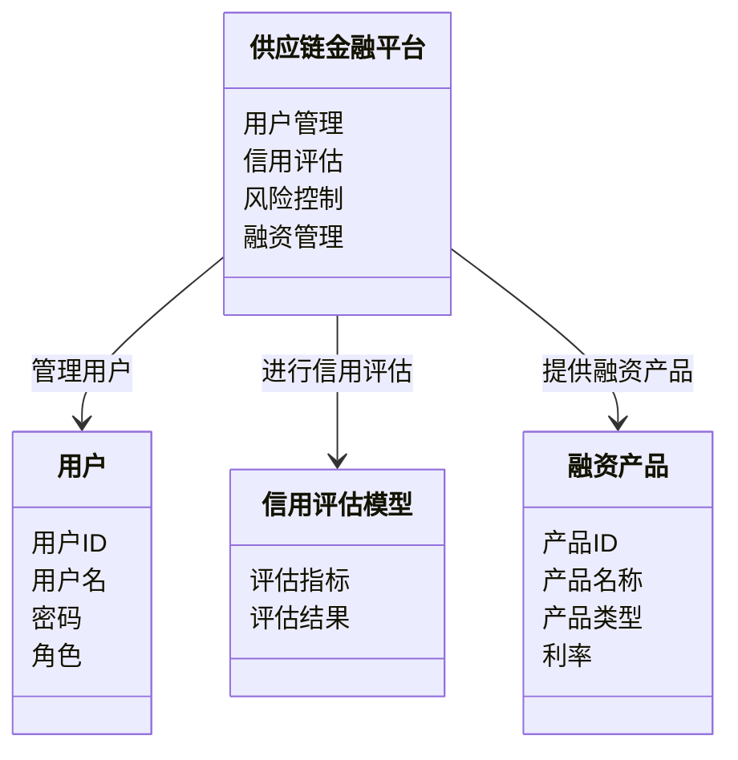
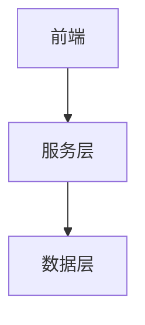

                 


# 智能供应链金融平台设计

> 关键词：智能供应链，供应链金融，人工智能，区块链，大数据

> 摘要：智能供应链金融平台设计是一篇深入探讨如何利用人工智能、大数据和区块链等技术来优化和智能化供应链金融流程的技术博客。本文从背景介绍、核心概念、算法原理、系统架构设计到项目实战，全面分析智能供应链金融平台的构建过程，并提供实际案例和最佳实践。

---

# 第一部分: 智能供应链金融平台的背景与核心概念

## 第1章: 供应链金融的定义与现状

### 1.1 供应链金融的定义

#### 1.1.1 供应链的基本概念
供应链是指围绕核心企业，从供应商到客户之间的所有参与方组成的网络，包括原材料采购、生产、分销和交付等环节。供应链的核心目标是优化资源配置、降低运营成本并提高效率。

#### 1.1.2 供应链金融的定义与特点
供应链金融是通过整合供应链中的信息流、资金流和物流，为供应链上的企业提供融资服务的一种金融模式。其特点包括：
- 以核心企业为中心，覆盖上下游企业。
- 融资基于真实贸易背景，风险可控。
- 资金流与物流高度协同，降低道德风险。

#### 1.1.3 供应链金融的核心参与者
- **核心企业**：供应链中的主导企业，通常是资金需求方。
- **供应商**：为供应链提供原材料或服务的企业。
- **客户**：供应链的终端消费者或分销商。
- **金融机构**：提供融资服务的银行或其他金融机构。
- **第三方平台**：提供供应链管理或金融科技服务的平台。

---

### 1.2 供应链金融的现状与挑战

#### 1.2.1 当前供应链金融的主要模式
- **应收账款融资**：基于核心企业与供应商之间的应收账款进行融资。
- **存货质押融资**：基于供应商或客户的存货进行质押融资。
- **订单融资**：基于预期订单进行融资。

#### 1.2.2 传统供应链金融的痛点
- **信息孤岛**：供应链上的信息分散在不同企业，难以整合。
- **融资效率低**：传统模式下，融资流程复杂，审批时间长。
- **风险控制难**：缺乏实时数据支持，难以全面评估风险。

#### 1.2.3 数字化转型的必要性
随着信息技术的发展，传统供应链金融的痛点日益明显，数字化转型成为必然趋势。通过引入大数据、人工智能和区块链等技术，可以实现供应链信息的实时共享、融资流程的自动化以及风险控制的智能化。

---

### 1.3 智能供应链金融平台的背景

#### 1.3.1 人工智能与大数据在供应链金融中的应用
- **人工智能**：用于信用评估、风险预测和智能推荐。
- **大数据**：通过分析供应链上的海量数据，优化融资决策。

#### 1.3.2 智能供应链金融平台的定义
智能供应链金融平台是以人工智能、大数据和区块链等技术为核心，构建的智能化供应链金融生态系统。它通过整合供应链上的信息流、资金流和物流，为供应链上的企业提供智能化的融资服务。

#### 1.3.3 智能供应链金融平台的意义
- **提升融资效率**：通过自动化流程和智能决策，缩短融资时间。
- **降低融资成本**：通过数据驱动的精准融资，减少人工干预和错误。
- **增强风险管理**：利用实时数据和智能模型，提高风险控制能力。

---

## 第2章: 智能供应链金融的核心概念与联系

### 2.1 智能供应链金融的核心概念

#### 2.1.1 智能供应链金融的定义
智能供应链金融平台是通过整合人工智能、大数据和区块链等技术，构建的智能化供应链金融生态系统。它以核心企业为中心，覆盖供应链上的上下游企业，提供智能化的融资服务。

#### 2.1.2 智能供应链金融的核心要素
- **数据驱动**：基于供应链上的海量数据进行分析和决策。
- **智能算法**：利用机器学习和人工智能技术进行信用评估和风险预测。
- **区块链技术**：确保供应链信息的透明性和不可篡改性。
- **智能合约**：通过智能合约实现融资流程的自动化和智能化。

#### 2.1.3 智能供应链金融的业务流程
1. 数据采集：从供应链上的企业获取相关信息，包括交易数据、信用数据等。
2. 数据分析：利用大数据技术对数据进行清洗、处理和分析。
3. 智能决策：通过机器学习模型进行信用评估和风险预测，生成融资方案。
4. 融资执行：通过智能合约实现融资流程的自动化，完成融资交易。
5. 监测与反馈：实时监测融资效果，调整模型参数，优化融资方案。

---

### 2.2 核心概念的联系与对比

#### 2.2.1 供应链、供应链金融与智能供应链金融的对比

| 比较维度         | 供应链                   | 供应链金融               | 智能供应链金融           |
|------------------|--------------------------|--------------------------|--------------------------|
| 核心目标         | 优化物流效率             | 提供融资服务             | 提供智能化融资服务       |
| 技术依赖         | 物流技术                 | 金融技术                 | 人工智能、大数据、区块链 |
| 信息共享         | 有限                     | 部分实现                 | 实时共享                 |

#### 2.2.2 传统供应链金融与智能供应链金融的对比

| 比较维度         | 传统供应链金融           | 智能供应链金融           |
|------------------|--------------------------|--------------------------|
| 信息共享         | 分散在不同企业           | 实时共享                 |
| 融资效率         | 低，流程复杂             | 高，自动化                |
| 风险控制         | 靠人工审核，风险较高      | 智能化，风险可控          |

#### 2.2.3 智能供应链金融与其他金融科技的联系

智能供应链金融与区块链、人工智能和大数据等金融科技密切相关。区块链技术用于确保信息的透明性和不可篡改性；人工智能技术用于信用评估和风险预测；大数据技术用于数据采集和分析。

---

### 2.3 智能供应链金融的ER实体关系图

```mermaid
er
    actor 供应链核心企业
    actor 金融机构
    actor 供应商
    actor 客户
    actor 第三方平台
    entity 供应链金融平台
    entity 企业信用数据
    entity 供应链交易数据
    entity 金融产品
    entity 风险评估模型
    rel
        供应链核心企业 --> 供应链金融平台: 使用平台进行融资
        供应商 --> 供应链金融平台: 提供交易数据
        客户 --> 供应链金融平台: 提供交易数据
        金融机构 --> 供应链金融平台: 提供融资服务
        第三方平台 --> 供应链金融平台: 提供技术支持
```

---

## 第3章: 智能供应链金融的算法原理

### 3.1 机器学习在智能供应链金融中的应用

#### 3.1.1 机器学习的基本原理
机器学习是一种人工智能技术，通过数据训练模型，使其能够自动识别模式和做出预测。

#### 3.1.2 机器学习在供应链金融中的应用
- **信用评估**：通过机器学习模型对企业的信用状况进行评估。
- **风险预测**：预测企业的违约风险。
- **智能推荐**：根据企业的需求和市场情况，推荐合适的金融产品。

#### 3.1.3 机器学习算法的实现步骤

1. 数据采集：从供应链上的企业获取交易数据和信用数据。
2. 数据预处理：清洗数据，去除异常值和缺失值。
3. 数据分析：通过统计分析和可视化，理解数据的分布和特征。
4. 模型训练：选择合适的算法（如逻辑回归、随机森林）进行训练。
5. 模型评估：通过交叉验证评估模型的性能。
6. 模型部署：将模型部署到供应链金融平台，用于实际的融资决策。

#### 3.1.4 机器学习的数学模型
以下是机器学习中常用的线性回归模型：
$$ y = \beta_0 + \beta_1x + \epsilon $$
其中，$y$ 是目标变量，$x$ 是自变量，$\beta_0$ 是截距，$\beta_1$ 是回归系数，$\epsilon$ 是误差项。

---

### 3.2 区块链在智能供应链金融中的应用

#### 3.2.1 区块链的基本原理
区块链是一种分布式账本技术，通过去中心化和加密技术确保数据的安全性和不可篡改性。

#### 3.2.2 区块链在供应链金融中的应用
- **信息共享**：通过区块链技术实现供应链上的信息实时共享。
- **智能合约**：通过智能合约实现融资流程的自动化和智能化。

#### 3.2.3 区块链的实现步骤

1. 定义业务逻辑：确定智能合约的功能和流程。
2. 智能合约开发：使用Solidity语言编写智能合约代码。
3. 部署区块链网络：搭建区块链节点，部署智能合约。
4. 测试与验证：通过测试用例验证智能合约的功能。

#### 3.2.4 区块链的数学模型
以下是区块链中的哈希函数：
$$ H(x) = \text{hash}(x) $$
其中，$x$ 是输入数据，$H(x)$ 是哈希值。

---

## 第4章: 智能供应链金融系统的架构设计

### 4.1 系统功能设计

#### 4.1.1 领域模型类图



---

### 4.2 系统架构设计

#### 4.2.1 分层架构图



---

### 4.3 系统接口设计

#### 4.3.1 API接口设计

- **API名称**：获取企业信用报告
- **请求方法**：GET
- **请求路径**：/api/credit_report
- **请求参数**：企业ID
- **返回值**：信用报告JSON

---

## 第5章: 智能供应链金融平台的项目实战

### 5.1 环境安装

#### 5.1.1 安装Python
```bash
# 安装Python
sudo apt-get install python3 python3-pip
```

#### 5.1.2 安装机器学习库
```bash
pip install numpy pandas scikit-learn
```

---

### 5.2 核心代码实现

#### 5.2.1 机器学习模型实现

```python
import numpy as np
from sklearn.linear_model import LinearRegression
from sklearn.metrics import mean_squared_error

# 数据准备
X = np.array([[1], [2], [3], [4], [5]])
y = np.array([2, 4, 6, 8, 10])

# 模型训练
model = LinearRegression()
model.fit(X, y)

# 预测
predictions = model.predict(X)
print("预测值：", predictions)
print("均方误差：", mean_squared_error(y, predictions))
```

---

### 5.3 案例分析

#### 5.3.1 案例背景
假设我们有一个供应链上的中小型企业，需要融资支持。通过智能供应链金融平台，我们可以利用机器学习模型对其进行信用评估，并提供相应的融资方案。

#### 5.3.2 实际应用
通过机器学习模型，我们预测该企业的信用评分为0.85，风险预测结果为低风险，因此可以提供低利率的融资产品。

---

## 第6章: 最佳实践与总结

### 6.1 最佳实践

1. **数据质量管理**：确保数据的准确性和完整性。
2. **模型优化**：定期更新模型，提高预测准确性。
3. **风险管理**：建立完善的风险控制机制，确保融资安全。

### 6.2 小结

智能供应链金融平台通过整合人工智能、大数据和区块链等技术，实现了供应链金融的智能化和自动化。本文从背景、核心概念、算法原理到系统架构设计，全面分析了智能供应链金融平台的构建过程，并通过实际案例展示了其应用价值。

### 6.3 注意事项

1. **数据隐私**：在处理企业数据时，需注意数据隐私和合规性。
2. **模型解释性**：确保模型的可解释性，便于调整和优化。
3. **技术选型**：根据实际需求选择合适的技术和工具。

### 6.4 拓展阅读

1. 《区块链技术及应用》
2. 《机器学习实战》
3. 《供应链管理：战略、规划与操作》

---

作者：AI天才研究院/AI Genius Institute & 禅与计算机程序设计艺术/Zen And The Art of Computer Programming

--- 

以上是一个详细的目录大纲，涵盖了智能供应链金融平台设计的各个方面，从理论到实践，从概念到实现，确保内容丰富且逻辑清晰。

