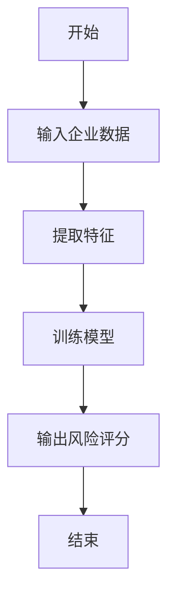
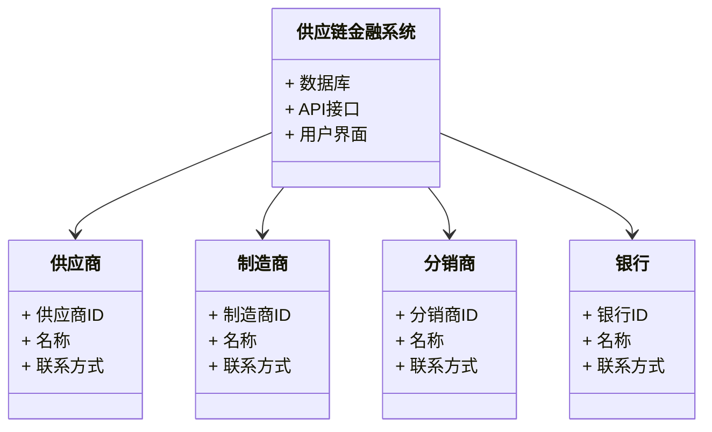
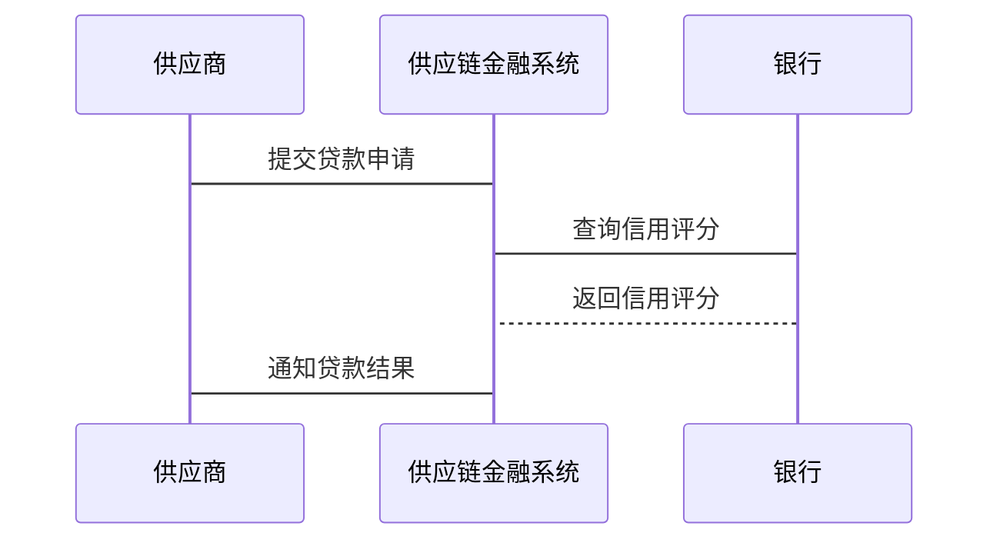

                 


# 智能供应链金融解决方案

> 关键词：智能供应链，供应链金融，区块链，人工智能，风险管理，金融解决方案

> 摘要：本文详细探讨了智能供应链金融解决方案的核心概念、技术实现、系统架构及应用场景。通过分析传统供应链金融的痛点，提出利用人工智能和区块链等技术实现智能化管理的解决方案，为供应链金融行业提供新的思路。

---

## 第1章：智能供应链金融的背景与意义

### 1.1 供应链金融的基本概念

#### 1.1.1 供应链金融的定义
供应链金融是指通过整合供应链上下游企业之间的资金流、信息流和物流，为供应链上的企业提供融资支持的一种金融模式。其核心在于通过核心企业的信用，为上下游企业获得更便捷、低成本的融资服务。

#### 1.1.2 供应链金融的核心要素
- **供应链结构**：供应商、制造商、分销商、零售商等组成的价值链。
- **资金流动**：包括应收账款、预付款、存货等融资方式。
- **风险管理**：通过信用评估、质押等手段控制金融风险。

#### 1.1.3 供应链金融的参与方与角色
- **核心企业**：供应链中的主导企业，提供信用支持。
- **金融机构**：提供融资服务的银行、保险公司等。
- **供应商与客户**：供应链上下游的企业，融资需求方。

### 1.2 智能供应链金融的提出背景

#### 1.2.1 传统供应链金融的痛点
- **信息孤岛**：上下游企业信息分散，难以实现高效协同。
- **融资难**：中小企业信用不足，难以获得融资。
- **效率低**：传统纸质单据处理繁琐，效率低下。

#### 1.2.2 数字化转型的需求
- **技术驱动**：人工智能、区块链、大数据等技术的发展为供应链金融的智能化提供了可能。
- **效率提升**：通过数字化手段，实现信息共享和自动化处理。

#### 1.2.3 智能技术的应用前景
- **智能化风控**：利用AI技术进行信用评估和风险预测。
- **自动化融资**：通过区块链技术实现自动化的融资流程。

### 1.3 智能供应链金融的意义

#### 1.3.1 提高供应链效率
- 通过智能化技术实现信息共享，减少人工干预，提高整体效率。

#### 1.3.2 降低金融风险
- 利用大数据和AI技术进行风险评估和预测，降低融资风险。

#### 1.3.3 促进产融结合
- 智能供应链金融通过技术手段，促进产业与金融的深度融合，实现共赢。

---

## 第2章：智能供应链金融的核心概念与联系

### 2.1 核心概念原理

#### 2.1.1 智能供应链的定义
智能供应链是指通过智能化技术（如AI、大数据、区块链等）实现供应链各环节的智能化管理和协同。

#### 2.1.2 供应链金融的智能化特征
- **数据驱动**：利用大数据进行分析和决策。
- **自动化**：通过智能系统实现自动化融资和支付。
- **实时监控**：实时监控供应链各环节的状态，及时发现和解决问题。

#### 2.1.3 智能供应链金融的系统架构
- **数据采集层**：收集供应链各环节的数据。
- **数据分析层**：利用AI和大数据技术进行分析和预测。
- **业务逻辑层**：根据分析结果，执行相应的业务逻辑。
- **用户交互层**：提供友好的用户界面，供用户进行操作。

### 2.2 核心概念属性对比表

| 核心概念 | 属性 | 描述 |
|----------|------|------|
| 供应链   | 网络结构 | 供应商、制造商、分销商、零售商的协同网络 |
| 金融     | 资金流动 | 贷款、融资、支付等资金流动 |
| 智能技术 | 数据驱动 | 利用AI、大数据等技术实现智能化决策 |

### 2.3 ER实体关系图

```mermaid
erDiagram
    actor 供应商 {
        key 供应商ID
        string 名称
        string 联系方式
    }
    actor 制造商 {
        key 制造商ID
        string 名称
        string 联系方式
    }
    actor 分销商 {
        key 分销商ID
        string 名称
        string 联系方式
    }
    actor 零售商 {
        key 零售商ID
        string 名称
        string 联系方式
    }
    actor 银行 {
        key 银行ID
        string 名称
        string 联系方式
    }
    actor 保险公司 {
        key 保险公司ID
        string 名称
        string 联系方式
    }
    supplier(SupplierID, 名称, 联系方式)
    manufacturer(ManufacturerID, 名称, 联系方式)
    distributor(DistributorID, 名称, 联系方式)
    retailer(RetailerID, 名称, 联系方式)
    bank(BankID, 名称, 联系方式)
    insurer(InsurerID, 名称, 联系方式)
```

---

## 第3章：智能供应链金融的算法原理

### 3.1 风险控制算法

#### 3.1.1 算法流程图



#### 3.1.2 算法实现代码

```python
import pandas as pd
from sklearn.model import DecisionTreeClassifier

# 数据预处理
data = pd.read_csv('data.csv')
X = data.drop('label', axis=1)
y = data['label']

# 训练模型
model = DecisionTreeClassifier()
model.fit(X, y)

# 预测风险评分
def predict_risk(customer_data):
    return model.predict_proba(customer_data)[:, 1]
```

#### 3.1.3 数学模型与公式

$$
\text{风险评分} = \sum_{i=1}^{n} w_i x_i
$$

其中，$w_i$ 是特征 $x_i$ 的权重，$x_i$ 是特征值。

---

## 第4章：智能供应链金融的系统架构设计

### 4.1 问题场景介绍

- **场景描述**：一家制造企业需要为其供应商提供融资服务，希望通过智能化系统实现高效融资。

### 4.2 系统功能设计

#### 4.2.1 领域模型设计



#### 4.2.2 系统架构设计

```mermaid
archiDiagram
    银行 <---> 供应链金融系统
    供应商 <---> 供应链金融系统
    制造商 <---> 供应链金融系统
    分销商 <---> 供应链金融系统
```

#### 4.2.3 系统接口设计

- **API接口**：
  - `/api/apply_loan`：供应商申请贷款
  - `/api/repay_loan`：供应商还款
  - `/api/check_credit`：银行查询信用评分

#### 4.2.4 系统交互设计



---

## 第5章：智能供应链金融的项目实战

### 5.1 环境安装

- **工具安装**：
  - Python 3.8+
  - Jupyter Notebook
  - pip install pandas scikit-learn

### 5.2 核心代码实现

#### 5.2.1 数据预处理

```python
import pandas as pd
from sklearn.model import DecisionTreeClassifier

data = pd.read_csv('data.csv')
X = data.drop('label', axis=1)
y = data['label']

X_train, X_test, y_train, y_test = train_test_split(X, y, test_size=0.2)
model = DecisionTreeClassifier()
model.fit(X_train, y_train)
```

#### 5.2.2 风险评估模型

```python
def predict_risk(customer_data):
    return model.predict_proba(customer_data)[:, 1]
```

### 5.3 案例分析

- **案例背景**：某制造企业为其供应商提供融资服务。
- **数据来源**：供应商的销售数据、财务数据、信用记录。
- **分析结果**：供应商的信用评分为0.85，银行批准贷款申请。

---

## 第6章：智能供应链金融的最佳实践

### 6.1 小结

- 智能供应链金融通过技术手段实现了供应链各环节的智能化管理，提高了融资效率，降低了金融风险。

### 6.2 注意事项

- 数据安全：确保供应链数据的安全性，防止数据泄露。
- 技术选型：选择适合的智能化技术，如区块链、AI等。
- 合规性：遵守相关法律法规，确保融资活动的合法性。

### 6.3 拓展阅读

- 推荐阅读《区块链技术与供应链金融》。
- 参加行业会议，了解最新技术动态。

---

## 作者信息

作者：AI天才研究院/AI Genius Institute  
联系邮箱：contact@aicourse.com  
GitHub：https://github.com/aicourse

---

本文详细探讨了智能供应链金融解决方案的核心概念、技术实现、系统架构及应用场景。通过分析传统供应链金融的痛点，提出利用人工智能和区块链等技术实现智能化管理的解决方案，为供应链金融行业提供新的思路。

