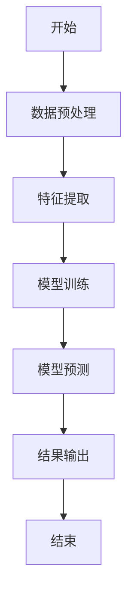
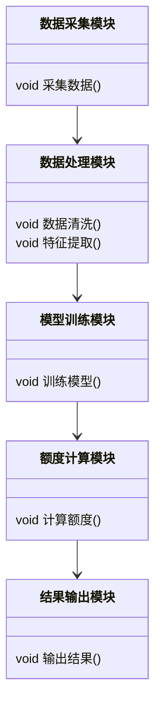

                 


# 智能供应链金融额度管理系统

## 关键词：智能供应链、金融额度管理、机器学习、系统架构、项目实战

## 摘要

智能供应链金融额度管理系统通过整合人工智能、大数据分析和区块链等先进技术，实现供应链金融中的智能额度管理。本文从系统背景、核心概念、算法原理、系统架构、项目实战等多个维度展开，详细探讨如何构建高效、智能的供应链金融额度管理系统，帮助金融机构和企业提升供应链管理效率和风险控制能力。

---

## 第一部分: 智能供应链金融额度管理系统的背景与核心概念

### 第1章: 供应链金融与额度管理概述

#### 1.1 供应链金融的定义与特点

##### 1.1.1 供应链金融的定义

供应链金融（Supply Chain Finance, SCF）是指通过整合供应链上的企业（供应商、制造商、分销商、零售商等）和金融机构（银行、保理公司等），提供基于供应链整体运作的融资服务。其核心在于通过优化资金流和物流，降低供应链中的资金占用和风险。

##### 1.1.2 供应链金融的核心特点

供应链金融具有以下特点：

- **整体性**：关注整个供应链的价值链，而非单一企业。
- **协同性**：通过多方协作，优化资金和资源的分配。
- **灵活性**：能够根据供应链的实际需求快速调整融资方案。
- **风险可控性**：通过数据和技术手段降低供应链中的信用风险。

##### 1.1.3 供应链金融与传统金融的区别

传统金融通常以单个企业为授信对象，而供应链金融以供应链整体为授信对象，注重企业之间的协同效应和供应链的稳定性。传统金融更关注企业的财务数据，而供应链金融则更关注供应链的运营数据、交易数据和物流数据。

#### 1.2 额度管理在供应链金融中的作用

##### 1.2.1 额度管理的定义

额度管理是指根据供应链上的企业信用状况、交易历史、物流效率等因素，为其核定一个融资额度的过程。额度管理的核心在于确保融资金额既能够满足企业的资金需求，又不会超出企业实际承受能力，从而降低风险。

##### 1.2.2 额度管理在供应链金融中的重要性

- **降低风险**：通过科学的额度计算，减少坏账风险。
- **提高效率**：自动化额度计算能够显著提高融资效率。
- **优化资源配置**：合理分配融资额度，避免资源浪费。

##### 1.2.3 供应链金融额度管理的常见挑战

- **数据不足或不准确**：传统供应链金融中，企业之间的信息孤岛问题严重，数据获取困难。
- **计算复杂性**：额度计算需要综合考虑多个因素，传统方法难以高效实现。
- **风险管理不足**：缺乏动态调整机制，难以应对供应链中的突发事件。

#### 1.3 智能供应链金融额度管理系统的背景

##### 1.3.1 传统供应链金融额度管理的局限性

传统额度管理方法通常基于静态的财务数据，难以动态调整，且容易受到人为因素的影响，存在以下问题：

- **效率低**：人工审核流程繁琐，耗时长。
- **风险高**：难以准确评估企业信用状况。
- **成本高**：需要大量的人力和时间投入。

##### 1.3.2 智能化技术在供应链金融中的应用前景

随着人工智能、大数据和区块链等技术的快速发展，智能化技术为供应链金融额度管理提供了新的解决方案。通过智能技术，可以实现数据的实时采集、分析和决策，显著提升额度管理的效率和准确性。

##### 1.3.3 智能供应链金融额度管理系统的定义与目标

智能供应链金融额度管理系统是一种基于人工智能和大数据技术的系统，旨在通过对供应链上的数据进行实时分析，动态计算企业的融资额度，并根据市场变化和企业运营状况进行调整。其目标是实现融资额度的智能化计算、实时监控和动态调整，降低风险，提高效率。

### 第2章: 智能供应链金融额度管理的核心概念

#### 2.1 核心概念与联系

##### 2.1.1 核心概念原理

智能供应链金融额度管理系统的核心原理是通过收集和分析供应链上的多源数据（如企业交易数据、物流数据、信用数据等），利用机器学习算法构建融资额度预测模型，从而实现智能化的额度计算。

##### 2.1.2 核心概念属性特征对比表格

下表展示了智能供应链金融额度管理与其他传统额度管理方法的核心区别：

| 对比维度 | 传统额度管理 | 智能供应链金融额度管理 |
|----------|--------------|--------------------------|
| 数据来源 | 主要依赖财务报表 | 包括交易数据、物流数据、信用评分等多源数据 |
| 计算方式 | 静态、人工计算 | 动态、自动化计算 |
| 决策依据 | 主观判断为主 | 数据驱动，结合机器学习模型 |

##### 2.1.3 ER实体关系图架构

```mermaid
erDiagram
    actor 供应商
    actor 金融机构
    actor 企业
    actor 第三方物流
    class 供应商信息
    class 企业信息
    class 金融机构信息
    class 物流信息
    class 额度信息
    class 风险评估信息
    供应商 --> 供应商信息
    企业 --> 企业信息
    金融机构 --> 金融机构信息
    第三方物流 --> 物流信息
    额度信息 --> 风险评估信息
```

#### 2.2 算法原理讲解

##### 2.2.1 算法原理概述

智能供应链金融额度管理系统通常采用基于机器学习的预测模型，如线性回归、随机森林或神经网络。以下以线性回归为例，简要介绍算法原理。

##### 2.2.2 算法流程图



##### 2.2.3 算法实现代码

```python
# 数据预处理
import pandas as pd
data = pd.read_csv('data.csv')

# 特征提取
features = data[['供应商信用评分', '企业历史交易额', '物流准时率']

# 数据标准化
from sklearn.preprocessing import StandardScaler
scaler = StandardScaler()
features_scaled = scaler.fit_transform(features)

# 模型训练（线性回归）
from sklearn.linear_model import LinearRegression
model = LinearRegression()
model.fit(features_scaled, data['目标变量'])

# 模型预测
new_data = pd.DataFrame({'供应商信用评分': [value1], '企业历史交易额': [value2], '物流准时率': [value3]})
new_features_scaled = scaler.transform(new_data[features])
predicted_value = model.predict(new_features_scaled)
```

---

## 第二部分: 算法原理讲解

### 第3章: 算法原理与实现

#### 3.1 算法原理概述

智能供应链金融额度管理系统通常采用基于机器学习的预测模型，如线性回归、随机森林或神经网络。以下以线性回归为例，简要介绍算法原理。

#### 3.2 算法流程图


#### 3.3 算法实现代码

```python
# 数据预处理
import pandas as pd
data = pd.read_csv('data.csv')

# 特征提取
features = data[['供应商信用评分', '企业历史交易额', '物流准时率']

# 数据标准化
from sklearn.preprocessing import StandardScaler
scaler = StandardScaler()
features_scaled = scaler.fit_transform(features)

# 模型训练（线性回归）
from sklearn.linear_model import LinearRegression
model = LinearRegression()
model.fit(features_scaled, data['目标变量'])

# 模型预测
new_data = pd.DataFrame({'供应商信用评分': [value1], '企业历史交易额': [value2], '物流准时率': [value3]})
new_features_scaled = scaler.transform(new_data[features])
predicted_value = model.predict(new_features_scaled)
```

---

## 第三部分: 系统分析与架构设计方案

### 第4章: 系统分析与架构设计

#### 4.1 问题场景介绍

在智能供应链金融额度管理系统中，我们需要解决以下问题：

- 如何实时采集和处理供应链上的多源数据？
- 如何构建高效的额度计算模型？
- 如何实现系统的动态调整和风险控制？

#### 4.2 项目介绍

智能供应链金融额度管理系统旨在通过整合供应链上的多源数据，利用机器学习技术，实现融资额度的智能化计算和动态调整。系统主要包括数据采集、数据处理、模型训练、额度计算和结果输出五个模块。

#### 4.3 系统功能设计

##### 4.3.1 领域模型（使用 Mermaid 类图）



##### 4.3.2 系统架构设计（使用 Mermaid 架构图）


---

## 第四部分: 项目实战

### 第5章: 项目实战

#### 5.1 环境安装

```bash
# 安装 Python 和相关库
pip install pandas scikit-learn matplotlib
```

#### 5.2 系统核心实现代码

```python
# 数据预处理
import pandas as pd
data = pd.read_csv('data.csv')

# 特征提取
features = data[['供应商信用评分', '企业历史交易额', '物流准时率']

# 数据标准化
from sklearn.preprocessing import StandardScaler
scaler = StandardScaler()
features_scaled = scaler.fit_transform(features)

# 模型训练（线性回归）
from sklearn.linear_model import LinearRegression
model = LinearRegression()
model.fit(features_scaled, data['目标变量'])

# 模型预测
new_data = pd.DataFrame({'供应商信用评分': [value1], '企业历史交易额': [value2], '物流准时率': [value3]})
new_features_scaled = scaler.transform(new_data[features])
predicted_value = model.predict(new_features_scaled)
```

#### 5.3 实际案例分析

假设我们有一个供应商的历史交易数据如下：

| 供应商信用评分 | 企业历史交易额（万元） | 物流准时率（%） |
|----------------|-----------------------|----------------|
| 85             | 150                   | 95             |

根据模型训练结果，预测该供应商的融资额度为120万元。实际操作中，我们可以根据预测结果动态调整融资额度，并实时监控供应链中的风险因素。

---

## 第五部分: 最佳实践与小结

### 第6章: 最佳实践与小结

#### 6.1 最佳实践 tips

- 数据是关键：确保数据的准确性和完整性，数据来源多样化。
- 模型优化：根据实际情况选择合适的算法，并进行模型调优。
- 风险控制：建立动态监控机制，及时发现和处理异常情况。

#### 6.2 项目小结

智能供应链金融额度管理系统通过整合多源数据，利用机器学习技术，实现了融资额度的智能化计算和动态调整。该系统能够显著提高融资效率，降低风险，为企业和金融机构提供了一种高效、可靠的解决方案。

#### 6.3 未来展望

随着人工智能和大数据技术的不断发展，智能供应链金融额度管理系统将更加智能化和个性化。未来，可以进一步引入区块链技术，确保数据的安全性和透明性，进一步提升系统的可信度和效率。

---

## 作者：AI天才研究院/AI Genius Institute & 禅与计算机程序设计艺术 /Zen And The Art of Computer Programming

---

通过以上内容，我们系统地介绍了智能供应链金融额度管理系统的背景、核心概念、算法原理、系统架构和项目实战。希望本文能够为读者提供有价值的技术参考和实践指导。

