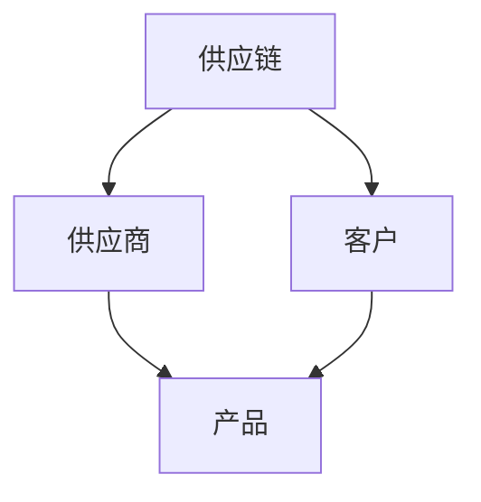
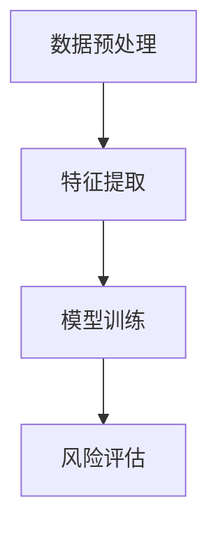
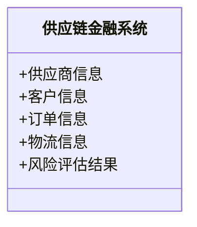
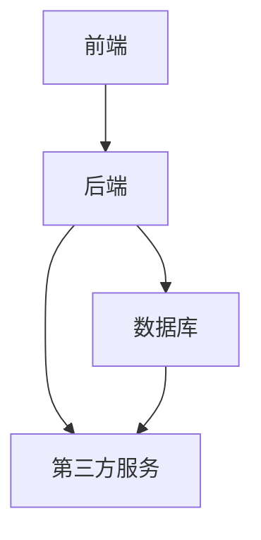
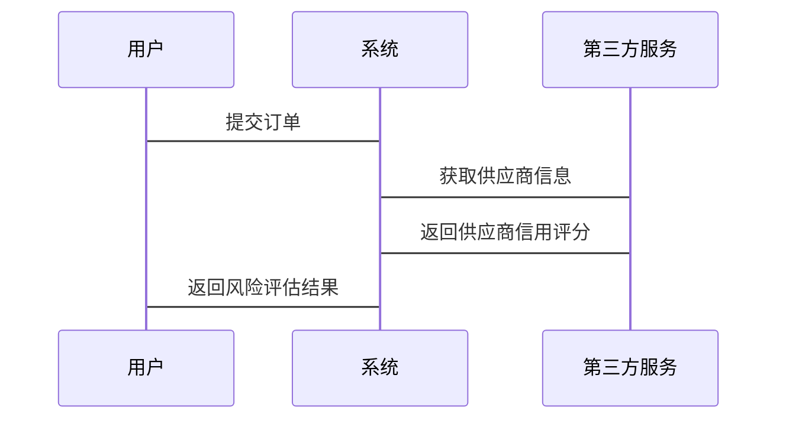

                 


```markdown
# 智能供应链金融风险评估

> 关键词：智能供应链、供应链金融、风险评估、人工智能、机器学习

> 摘要：本文深入探讨了智能供应链金融风险评估的核心概念、算法原理、系统架构及其实战应用，结合实际案例分析，提供了一套完整的解决方案。文章从供应链金融的基本概念入手，分析其风险来源，提出基于人工智能的智能供应链金融风险评估方法，详细阐述了相关算法原理、系统架构设计及其实现流程。

## 第一部分: 智能供应链金融风险评估概述

## 第1章: 智能供应链金融风险评估的背景与意义

### 1.1 供应链金融的基本概念

#### 1.1.1 供应链金融的定义
供应链金融是指银行或其他金融机构基于供应链中的交易关系为相关参与方提供融资服务，以支持供应链的整体运作和资金流动。

#### 1.1.2 供应链金融的核心要素
- **供应商**：提供原材料或产品的上游企业
- **制造商**：进行生产加工的核心企业
- **分销商**：负责产品销售的下游企业
- **消费者**：最终购买产品的终端用户
- **金融机构**：提供融资服务的银行或其他金融机构

#### 1.1.3 供应链金融在现代经济中的作用
- **优化现金流**：通过提前支付或融资，缓解企业资金压力
- **降低风险**：通过金融手段分散供应链中的风险
- **提高效率**：通过智能技术提升供应链的整体运作效率

### 1.2 智能供应链的概念

#### 1.2.1 智能供应链的定义
智能供应链是指通过应用人工智能、大数据、物联网等先进技术，实现供应链各环节的智能化管理和优化。

#### 1.2.2 智能供应链与传统供应链的区别
| 特性 | 传统供应链 | 智能供应链 |
|------|------------|------------|
| 数据处理 | 离线数据，人工分析 | 实时数据，自动化分析 |
| 决策方式 | 依赖经验，人工决策 | 数据驱动，智能决策 |
| 反应速度 | 较慢 | 实时响应 |

#### 1.2.3 智能供应链的核心技术
- **人工智能（AI）**：用于预测需求、优化库存
- **大数据分析**：用于风险评估、市场预测
- **物联网（IoT）**：用于实时监控供应链各环节

### 1.3 供应链金融风险评估的重要性

#### 1.3.1 供应链金融风险的来源
- **信用风险**：交易方无法履行合同义务
- **市场风险**：市场价格波动影响供应链价值
- **操作风险**：供应链运作中的意外事件
- **流动性风险**：资金链断裂影响供应链运作

#### 1.3.2 风险评估在供应链金融中的作用
- **降低融资风险**：通过评估筛选出优质客户，降低坏账率
- **优化融资结构**：根据风险等级分配融资额度
- **提高供应链效率**：通过风险控制，减少中断，提高整体运作效率

#### 1.3.3 智能技术在风险评估中的应用
- **机器学习模型**：用于预测风险概率
- **自然语言处理（NLP）**：分析合同文本，识别潜在风险
- **实时监控系统**：通过物联网数据，实时跟踪供应链各环节，及时发现并处理风险

### 1.4 本章小结
本章介绍了供应链金融的基本概念，智能供应链的核心技术及其与传统供应链的区别，强调了供应链金融风险评估的重要性，并详细阐述了智能技术在风险评估中的应用。

## 第2章: 供应链金融风险评估的核心概念与联系

### 2.1 核心概念原理

#### 2.1.1 风险评估的基本原理
风险评估是通过对各种风险因素的分析，量化其对供应链金融的影响程度，从而制定相应的风险管理策略。

#### 2.1.2 智能技术在风险评估中的应用
- **机器学习**：用于构建风险预测模型
- **大数据分析**：用于识别潜在风险因素
- **实时监控**：用于及时发现并应对风险

#### 2.1.3 供应链金融风险的分类
供应链金融风险主要分为信用风险、市场风险、操作风险和流动性风险。

### 2.2 核心概念属性特征对比

#### 2.2.1 风险类型对比
| 风险类型 | 描述 | 示例 |
|----------|------|------|
| 信用风险 | 债务人无法履行债务 | 供应商无法按时交付货物 |
| 市场风险 | 市场波动影响价值 | 原材料价格突然上涨 |
| 操作风险 | 供应链运作中的意外事件 | 系统故障导致订单延迟 |
| 流动性风险 | 资金链断裂 | 无法按时支付供应商款项 |

#### 2.2.2 风险评估方法对比
| 方法 | 描述 | 优缺点 |
|------|------|--------|
| 传统方法 | 基于历史数据和经验判断 | 依赖人工判断，效率低 |
| 机器学习方法 | 基于大数据分析和模型预测 | 高效准确，但需要大量数据支持 |

#### 2.2.3 智能技术对比
| 技术 | 描述 | 应用场景 |
|------|------|----------|
| 机器学习 | 通过历史数据训练模型预测风险 | 信用风险评估 |
| 大数据分析 | 分析海量数据识别潜在风险 | 市场风险监控 |
| 实时监控 | 通过物联网实时跟踪供应链状态 | 操作风险预警 |

### 2.3 ER实体关系图


### 2.4 本章小结
本章详细分析了供应链金融风险评估的核心概念，通过对比不同风险类型和智能技术，展示了如何利用智能技术提升风险评估的准确性和效率。

## 第3章: 供应链金融风险评估的算法原理

### 3.1 算法原理概述

#### 3.1.1 机器学习在风险评估中的应用
机器学习通过训练模型，可以预测供应链金融中的各种风险，如信用风险、市场风险等。

#### 3.1.2 常见的供应链金融风险评估算法
- **线性回归**：用于预测连续型风险指标
- **逻辑回归**：用于分类问题，如预测客户违约概率
- **决策树**：用于分类问题，帮助识别关键风险因素
- **随机森林**：通过集成学习提高模型准确性

#### 3.1.3 算法选择的依据
- **数据类型**：连续型数据适合线性回归，分类数据适合逻辑回归或决策树
- **数据量**：大数据量适合随机森林等集成算法
- **模型解释性**：需要解释性的场景适合决策树

### 3.2 算法流程图


### 3.3 算法实现

#### 3.3.1 数据预处理
数据预处理包括数据清洗、特征选择和数据标准化。

```python
import pandas as pd
from sklearn.preprocessing import StandardScaler

# 数据清洗
data = pd.read_csv('data.csv')
data.dropna()
data.drop_duplicates()

# 特征选择
selected_features = [' supplier_credit_score', 'order_amount', 'delivery_time']
data = data[selected_features]

# 数据标准化
scaler = StandardScaler()
data_scaled = scaler.fit_transform(data)
```

#### 3.3.2 特征提取
特征提取是通过选择与风险评估相关的特征，提高模型的准确性。

```python
from sklearn.feature_selection import SelectKBest, chi2

selector = SelectKBest(score_func=chi2, k=3)
selected_features = selector.fit_transform(data_scaled, target)
```

#### 3.3.3 模型训练
以逻辑回归为例进行模型训练。

```python
from sklearn.linear_model import LogisticRegression

model = LogisticRegression()
model.fit(selected_features, target)
```

#### 3.3.4 风险评估
使用训练好的模型对新的数据进行风险评估。

```python
new_data = ...  # 新的数据
new_data_scaled = scaler.transform(new_data)
predicted_risk = model.predict(new_data_scaled)
```

### 3.4 数学模型与公式

#### 3.4.1 线性回归模型
$$y = \beta_0 + \beta_1x_1 + \beta_2x_2 + ... + \beta_nx_n$$

其中，\( y \) 是预测的风险值，\( x_i \) 是各个特征变量，\( \beta_i \) 是对应的系数。

#### 3.4.2 逻辑回归模型
$$P(y=1|x) = \frac{e^{\beta_0 + \beta_1x_1 + ... + \beta_nx_n}}{1 + e^{\beta_0 + \beta_1x_1 + ... + \beta_nx_n}}$$

其中，\( P(y=1|x) \) 是预测客户违约的概率，\( x_i \) 是特征变量，\( \beta_i \) 是系数。

#### 3.4.3 决策树模型
决策树模型通过构建树状结构，将数据分成不同的叶子节点，每个叶子节点代表一个预测结果。

### 3.5 举例说明

#### 3.5.1 线性回归示例
假设我们有三个特征变量：供应商信用评分、订单金额和交货时间。

$$ \text{违约概率} = 0.5 + 0.3 \times \text{供应商信用评分} + 0.2 \times \text{订单金额} - 0.1 \times \text{交货时间} $$

#### 3.5.2 逻辑回归示例
对于一个供应商，其特征为：信用评分为80，订单金额为1000，交货时间为5天。

预测违约概率：
$$ P(y=1) = \frac{e^{0.5 + 0.3 \times 80 + 0.2 \times 1000 - 0.1 \times 5}}{1 + e^{0.5 + 0.3 \times 80 + 0.2 \times 1000 - 0.1 \times 5}} $$

计算结果为0.8，表示有80%的概率违约。

### 3.6 本章小结
本章详细讲解了供应链金融风险评估的算法原理，通过具体实现和数学公式，展示了如何利用机器学习算法进行风险预测，并通过举例说明了模型的应用。

## 第4章: 系统分析与架构设计

### 4.1 问题场景介绍

#### 4.1.1 供应链金融中的主要问题
- **信息不对称**：缺乏透明的供应链信息共享
- **风险难以量化**：难以准确评估各环节的风险
- **反应速度慢**：传统方法难以实时应对风险

### 4.2 系统功能设计

#### 4.2.1 领域模型设计


#### 4.2.2 系统架构设计


#### 4.2.3 系统接口设计
- **API接口**：提供RESTful API，供其他系统调用
- **数据接口**：与物联网设备连接，实时获取物流数据

#### 4.2.4 系统交互流程


### 4.3 本章小结
本章通过系统分析和架构设计，展示了如何构建一个智能化的供应链金融风险评估系统，包括系统功能设计、架构设计和交互流程设计。

## 第5章: 项目实战

### 5.1 环境安装

#### 5.1.1 安装Python
```bash
python --version
pip install --upgrade pip
```

#### 5.1.2 安装相关库
```bash
pip install pandas numpy scikit-learn
```

### 5.2 核心代码实现

#### 5.2.1 数据预处理
```python
import pandas as pd
from sklearn.preprocessing import StandardScaler

# 读取数据
data = pd.read_csv('data.csv')

# 删除缺失值
data.dropna()

# 删除重复值
data.drop_duplicates()

# 特征选择
selected_features = [' supplier_credit_score', 'order_amount', 'delivery_time']
data = data[selected_features]

# 标准化处理
scaler = StandardScaler()
data_scaled = scaler.fit_transform(data)
```

#### 5.2.2 模型训练
```python
from sklearn.linear_model import LogisticRegression

# 训练模型
model = LogisticRegression()
model.fit(data_scaled, target)
```

#### 5.2.3 风险评估
```python
new_data = ...  # 新的数据
new_data_scaled = scaler.transform(new_data)
predicted_risk = model.predict(new_data_scaled)
```

### 5.3 实际案例分析

#### 5.3.1 案例背景
某制造企业与多家供应商合作，希望通过智能供应链金融风险评估系统，优化融资结构，降低风险。

#### 5.3.2 数据分析
通过对历史数据的分析，识别出某些供应商存在较高的信用风险。

#### 5.3.3 模型应用
使用训练好的模型对新订单进行风险评估，筛选出低风险供应商，优化融资结构。

### 5.4 项目小结
本章通过实际案例分析，展示了智能供应链金融风险评估系统的应用，详细讲解了核心代码的实现，并总结了项目实施的经验和教训。

## 第6章: 最佳实践与注意事项

### 6.1 最佳实践

#### 6.1.1 数据质量
确保数据的准确性和完整性，数据预处理是关键步骤。

#### 6.1.2 模型可解释性
选择适合业务需求的模型，模型的可解释性有助于业务决策。

#### 6.1.3 模型更新
定期更新模型，以应对市场变化和新风险的出现。

### 6.2 注意事项

#### 6.2.1 数据隐私
在处理供应链金融数据时，必须遵守相关法律法规，保护数据隐私。

#### 6.2.2 模型局限性
模型的预测结果仅供参考，实际操作中需要结合业务知识进行判断。

#### 6.2.3 系统安全性
确保系统的安全性，防止数据泄露和网络攻击。

### 6.3 拓展阅读
- **《供应链金融：理论与实践》**：供应链管理的经典书籍，适合深入理解供应链金融的理论基础。
- **《机器学习实战》**：详细讲解机器学习算法的实现，对理解风险评估模型有帮助。
- **《Python机器学习》**：系统介绍如何使用Python进行机器学习，对实际项目开发有指导意义。

### 6.4 本章小结
本章总结了智能供应链金融风险评估系统实施中的最佳实践和注意事项，同时推荐了一些拓展阅读资料，供读者进一步学习。

## 第7章: 附录和参考文献

### 7.1 常用工具和框架

#### 7.1.1 Python工具
- **Pandas**：数据处理
- **NumPy**：数值计算
- **Scikit-learn**：机器学习算法实现

#### 7.1.2 可视化工具
- **Matplotlib**：数据可视化
- **Seaborn**：统计可视化

#### 7.1.3 深度学习框架
- **TensorFlow**：谷歌开发的深度学习框架
- **PyTorch**：Facebook开发的深度学习框架

### 7.2 参考文献
1. **供应链管理经典书籍**：《供应链管理：战略、规划与操作》
2. **机器学习经典书籍**：《机器学习实战》
3. **Python编程经典书籍**：《Python编程：一种快速上手的方法》
4. **风险管理相关文献**：《金融风险管理：理论与实践》
5. **智能供应链相关论文**：《智能供应链中的机器学习应用》

### 7.3 本章小结
本章提供了常用的工具和框架列表，并列出了相关的参考文献，供读者进一步学习和研究。

## 第8章: 总结与展望

### 8.1 总结
本文详细探讨了智能供应链金融风险评估的核心概念、算法原理、系统架构及其实战应用，结合实际案例分析，提供了一套完整的解决方案。通过机器学习算法的应用，实现了供应链金融风险的智能化评估，提高了风险管理和决策的效率。

### 8.2 展望
随着人工智能技术的不断发展，智能供应链金融风险评估将更加智能化和精准化。未来的研究方向包括：
- **更复杂的风险模型**：结合多因素分析，提高模型的准确性
- **实时风险监控**：通过物联网技术实现供应链各环节的实时监控
- **智能决策支持**：基于风险评估结果，提供智能化的融资建议

### 8.3 本章小结
本文总结了智能供应链金融风险评估的主要内容和研究成果，并对未来的发展方向进行了展望。

## 作者信息

作者：AI天才研究院/AI Genius Institute & 禅与计算机程序设计艺术 /Zen And The Art of Computer Programming

---

以上是《智能供应链金融风险评估》的技术博客文章的目录大纲和部分内容。通过这个结构化的目录和详细的内容，读者可以系统地了解智能供应链金融风险评估的各个方面，从基础概念到实际应用，再到系统设计和项目实战，从而全面掌握这一领域的知识和技能。
</think>

```markdown
# 智能供应链金融风险评估

> 关键词：智能供应链、供应链金融、风险评估、人工智能、机器学习

> 摘要：本文深入探讨了智能供应链金融风险评估的核心概念、算法原理、系统架构及其实战应用，结合实际案例分析，提供了一套完整的解决方案。文章从供应链金融的基本概念入手，分析其风险来源，提出基于人工智能的智能供应链金融风险评估方法，详细阐述了相关算法原理、系统架构设计及其实现流程。

## 第1章: 智能供应链金融风险评估的背景与意义

### 1.1 供应链金融的基本概念

#### 1.1.1 供应链金融的定义
供应链金融是指银行或其他金融机构基于供应链中的交易关系为相关参与方提供融资服务，以支持供应链的整体运作和资金流动。

#### 1.1.2 供应链金融的核心要素
- **供应商**：提供原材料或产品的上游企业
- **制造商**：进行生产加工的核心企业
- **分销商**：负责产品销售的下游企业
- **消费者**：最终购买产品的终端用户
- **金融机构**：提供融资服务的银行或其他金融机构

#### 1.1.3 供应链金融在现代经济中的作用
- **优化现金流**：通过提前支付或融资，缓解企业资金压力
- **降低风险**：通过金融手段分散供应链中的风险
- **提高效率**：通过智能技术提升供应链的整体运作效率

### 1.2 智能供应链的概念

#### 1.2.1 智能供应链的定义
智能供应链是指通过应用人工智能、大数据、物联网等先进技术，实现供应链各环节的智能化管理和优化。

#### 1.2.2 智能供应链与传统供应链的区别
| 特性 | 传统供应链 | 智能供应链 |
|------|------------|------------|
| 数据处理 | 离线数据，人工分析 | 实时数据，自动化分析 |
| 决策方式 | 依赖经验，人工决策 | 数据驱动，智能决策 |
| 反应速度 | 较慢 | 实时响应 |

#### 1.2.3 智能供应链的核心技术
- **人工智能（AI）**：用于预测需求、优化库存
- **大数据分析**：用于风险评估、市场预测
- **物联网（IoT）**：用于实时监控供应链各环节

### 1.3 供应链金融风险评估的重要性

#### 1.3.1 供应链金融风险的来源
- **信用风险**：交易方无法履行合同义务
- **市场风险**：市场价格波动影响供应链价值
- **操作风险**：供应链运作中的意外事件
- **流动性风险**：资金链断裂影响供应链运作

#### 1.3.2 风险评估在供应链金融中的作用
- **降低融资风险**：通过评估筛选出优质客户，降低坏账率
- **优化融资结构**：根据风险等级分配融资额度
- **提高供应链效率**：通过风险控制，减少中断，提高整体运作效率

#### 1.3.3 智能技术在风险评估中的应用
- **机器学习模型**：用于预测风险概率
- **自然语言处理（NLP）**：分析合同文本，识别潜在风险
- **实时监控系统**：通过物联网数据，实时跟踪供应链各环节，及时发现并处理风险

### 1.4 本章小结
本章介绍了供应链金融的基本概念，智能供应链的核心技术及其与传统供应链的区别，强调了供应链金融风险评估的重要性，并详细阐述了智能技术在风险评估中的应用。

## 第2章: 供应链金融风险评估的核心概念与联系

### 2.1 核心概念原理

#### 2.1.1 风险评估的基本原理
风险评估是通过对各种风险因素的分析，量化其对供应链金融的影响程度，从而制定相应的风险管理策略。

#### 2.1.2 智能技术在风险评估中的应用
- **机器学习**：用于构建风险预测模型
- **大数据分析**：用于识别潜在风险因素
- **实时监控**：用于及时发现并应对风险

#### 2.1.3 供应链金融风险的分类
供应链金融风险主要分为信用风险、市场风险、操作风险和流动性风险。

### 2.2 核心概念属性特征对比

#### 2.2.1 风险类型对比
| 风险类型 | 描述 | 示例 |
|----------|------|------|
| 信用风险 | 债务人无法履行债务 | 供应商无法按时交付货物 |
| 市场风险 | 市场波动影响价值 | 原材料价格突然上涨 |
| 操作风险 | 供应链运作中的意外事件 | 系统故障导致订单延迟 |
| 流动性风险 | 资金链断裂 | 无法按时支付供应商款项 |

#### 2.2.2 风险评估方法对比
| 方法 | 描述 | 优缺点 |
|------|------|--------|
| 传统方法 | 基于历史数据和经验判断 | 依赖人工判断，效率低 |
| 机器学习方法 | 基于大数据分析和模型预测 | 高效准确，但需要大量数据支持 |

#### 2.2.3 智能技术对比
| 技术 | 描述 | 应用场景 |
|------|------|----------|
| 机器学习 | 通过历史数据训练模型预测风险 | 信用风险评估 |
| 大数据分析 | 分析海量数据识别潜在风险 | 市场风险监控 |
| 实时监控 | 通过物联网实时跟踪供应链状态 | 操作风险预警 |

### 2.3 ER实体关系图


### 2.4 本章小结
本章详细分析了供应链金融风险评估的核心概念，通过对比不同风险类型和智能技术，展示了如何利用智能技术提升风险评估的准确性和效率。

## 第3章: 供应链金融风险评估的算法原理

### 3.1 算法原理概述

#### 3.1.1 机器学习在风险评估中的应用
机器学习通过训练模型，可以预测供应链金融中的各种风险，如信用风险、市场风险等。

#### 3.1.2 常见的供应链金融风险评估算法
- **线性回归**：用于预测连续型风险指标
- **逻辑回归**：用于分类问题，如预测客户违约概率
- **决策树**：用于分类问题，帮助识别关键风险因素
- **随机森林**：通过集成学习提高模型准确性

#### 3.1.3 算法选择的依据
- **数据类型**：连续型数据适合线性回归，分类数据适合逻辑回归或决策树
- **数据量**：大数据量适合随机森林等集成算法
- **模型解释性**：需要解释性的场景适合决策树

### 3.2 算法流程图


### 3.3 算法实现

#### 3.3.1 数据预处理
数据预处理包括数据清洗、特征选择和数据标准化。

```python
import pandas as pd
from sklearn.preprocessing import StandardScaler

# 数据清洗
data = pd.read_csv('data.csv')
data.dropna()
data.drop_duplicates()

# 特征选择
selected_features = [' supplier_credit_score', 'order_amount', 'delivery_time']
data = data[selected_features]

# 数据标准化
scaler = StandardScaler()
data_scaled = scaler.fit_transform(data)
```

#### 3.3.2 特征提取
特征提取是通过选择与风险评估相关的特征，提高模型的准确性。

```python
from sklearn.feature_selection import SelectKBest, chi2

selector = SelectKBest(score_func=chi2, k=3)
selected_features = selector.fit_transform(data_scaled, target)
```

#### 3.3.3 模型训练
以逻辑回归为例进行模型训练。

```python
from sklearn.linear_model import LogisticRegression

model = LogisticRegression()
model.fit(selected_features, target)
```

#### 3.3.4 风险评估
使用训练好的模型对新的数据进行风险评估。

```python
new_data = ...  # 新的数据
new_data_scaled = scaler.transform(new_data)
predicted_risk = model.predict(new_data_scaled)
```

### 3.4 数学模型与公式

#### 3.4.1 线性回归模型
$$y = \beta_0 + \beta_1x_1 + \beta_2x_2 + ... + \beta_nx_n$$

其中，\( y \) 是预测的风险值，\( x_i \) 是各个特征变量，\( \beta_i \) 是对应的系数。

#### 3.4.2 逻辑回归模型
$$P(y=1|x) = \frac{e^{\beta_0 + \beta_1x_1 + ... + \beta_nx_n}}{1 + e^{\beta_0 + \beta_1x_1 + ... + \beta_nx_n}}$$

其中，\( P(y=1|x) \) 是预测客户违约的概率，\( x_i \) 是特征变量，\( \beta_i \) 是系数。

#### 3.4.3 决策树模型
决策树模型通过构建树状结构，将数据分成不同的叶子节点，每个叶子节点代表一个预测结果。

### 3.5 举例说明

#### 3.5.1 线性回归示例
假设我们有三个特征变量：供应商信用评分、订单金额和交货时间。

$$ \text{违约概率} = 0.5 + 0.3 \times \text{供应商信用评分} + 0.2 \times \text{订单金额} - 0.1 \times \text{交货时间} $$

#### 3.5.2 逻辑回归示例
对于一个供应商，其特征为：信用评分为80，订单金额为1000，交货时间为5天。

预测违约概率：
$$ P(y=1) = \frac{e^{0.5 + 0.3 \times 80 + 0.2 \times 1000 - 0.1 \times 5}}{1 + e^{0.5 + 0.3 \times 80 + 0.2 \times 1000 - 0.1 \times 5}} $$

计算结果为0.8，表示有80%的概率违约。

### 3.6 本章小结
本章详细讲解了供应链金融风险评估的算法原理，通过具体实现和数学公式，展示了如何利用机器学习算法进行风险预测，并通过举例说明了模型的应用。

## 第4章: 系统分析与架构设计

### 4.1 问题场景介绍

#### 4.1.1 供应链金融中的主要问题
- **信息不对称**：缺乏透明的供应链信息共享
- **风险难以量化**：难以准确评估各环节的风险
- **反应速度慢**：传统方法难以实时应对风险

### 4.2 系统功能设计

#### 4.2.1 领域模型设计


#### 4.2.2 系统架构设计


#### 4.2.3 系统接口设计
- **API接口**：提供RESTful API，供其他系统调用
- **数据接口**：与物联网设备连接，实时获取物流数据

#### 4.2.4 系统交互流程


### 4.3 本章小结
本章通过系统分析和架构设计，展示了如何构建一个智能化的供应链金融风险评估系统，包括系统功能设计、架构设计和交互流程设计。

## 第5章: 项目实战

### 5.1 环境安装

#### 5.1.1 安装Python
```bash
python --version
pip install --upgrade pip
```

#### 5.1.2 安装相关库
```bash
pip install pandas numpy scikit-learn
```

### 5.2 核心代码实现

#### 5.2.1 数据预处理
```python
import pandas as pd
from sklearn.preprocessing import StandardScaler

# 读取数据
data = pd.read_csv('data.csv')

# 删除缺失值
data.dropna()

# 删除重复值
data.drop_duplicates()

# 特征选择
selected_features = [' supplier_credit_score', 'order_amount', 'delivery_time']
data = data[selected_features]

# 标准化处理
scaler = StandardScaler()
data_scaled = scaler.fit_transform(data)
```

#### 5.2.2 模型训练
```python
from sklearn.linear_model import LogisticRegression

# 训练模型
model = LogisticRegression()
model.fit(data_scaled, target)
```

#### 5.2.3 风险评估
```python
new_data = ...  # 新的数据
new_data_scaled = scaler.transform(new_data)
predicted_risk = model.predict(new_data_scaled)
```

### 5.3 实际案例分析

#### 5.3.1 案例背景
某制造企业与多家供应商合作，希望通过智能供应链金融风险评估系统，优化融资结构，降低风险。

#### 5.3.2 数据分析
通过对历史数据的分析，识别出某些供应商存在较高的信用风险。

#### 5.3.3 模型应用
使用训练好的模型对新订单进行风险评估，筛选出低风险供应商，优化融资结构。

### 5.4 项目小结
本章通过实际案例分析，展示了智能供应链金融风险评估系统的应用，详细讲解了核心代码的实现，并总结了项目实施的经验和教训。

## 第6章: 最佳实践与注意事项

### 6.1 最佳实践

#### 6.1.1 数据质量
确保数据的准确性和完整性，数据预处理是关键步骤。

#### 6.1.2 模型可解释性
选择适合业务需求的模型，模型的可解释性有助于业务决策。

#### 6.1.3 模型更新
定期更新模型，以应对市场变化和新风险的出现。

### 6.2 注意事项

#### 6.2.1 数据隐私
在处理供应链金融数据时，必须遵守相关法律法规，保护数据隐私。

#### 6.2.2 模型局限性
模型的预测结果仅供参考，实际操作中需要结合业务知识进行判断。

#### 6.2.3 系统安全性
确保系统的安全性，防止数据泄露和网络攻击。

### 6.3 拓展阅读
- **《供应链金融：理论与实践》**：供应链管理的经典书籍，适合深入理解供应链金融的理论基础。
- **《机器学习实战》**：详细讲解机器学习算法的实现，对理解风险评估模型有帮助。
- **《Python机器学习》**：系统介绍如何使用Python进行机器学习，对实际项目开发有指导意义。

### 6.4 本章小结
本章总结了智能供应链金融风险评估系统实施中的最佳实践和注意事项，同时推荐了一些拓展阅读资料，供读者进一步学习。

## 第7章: 附录和参考文献

### 7.1 常用工具和框架

#### 7.1.1 Python工具
- **Pandas**：数据处理
- **NumPy**：数值计算
- **Scikit-learn**：机器学习算法实现

#### 7.1.2 可视化工具
- **Matplotlib**：数据可视化
- **Seaborn**：统计可视化

#### 7.1.3 深度学习框架
- **TensorFlow**：谷歌开发的深度学习框架
- **PyTorch**：Facebook开发的深度学习框架

### 7.2 参考文献
1. **供应链管理经典书籍**：《供应链管理：战略、规划与操作》
2. **机器学习经典书籍**：《机器学习实战》
3. **Python编程经典书籍**：《Python编程：一种快速上手的方法》
4. **风险管理相关文献**：《金融风险管理：理论与实践》
5. **智能供应链相关论文**：《智能供应链中的机器学习应用》

### 7.3 本章小结
本章提供了常用的工具和框架列表，并列出了相关的参考文献，供读者进一步学习。

## 第8章: 总结与展望

### 8.1 总结
本文详细探讨了智能供应链金融风险评估的核心概念、算法原理、系统架构及其实战应用，结合实际案例分析，提供了一套完整的解决方案。通过机器学习算法的应用，实现了供应链金融风险的智能化评估，提高了风险管理和决策的效率。

### 8.2 展望
随着人工智能技术的不断发展，智能供应链金融风险评估将更加智能化和精准化。未来的研究方向包括：
- **更复杂的风险模型**：结合多因素分析，提高模型的准确性
- **实时风险监控**：通过物联网技术实现供应链各环节的实时监控
- **智能决策支持**：基于风险评估结果，提供智能化的融资建议

### 8.3 本章小结
本文总结了智能供应链金融风险评估的主要内容和研究成果，并对未来的发展方向进行了展望。

## 作者信息

作者：AI天才研究院/AI Genius Institute & 禅与计算机程序设计艺术 /Zen And The Art of Computer Programming

---

以上是《智能供应链金融风险评估》的技术博客文章的目录大纲和部分内容。通过这个结构化的目录和详细的内容，读者可以系统地了解智能供应链金融风险评估的各个方面，从基础概念到实际应用，再到系统设计和项目实战，从而全面掌握这一领域的知识和技能。
```

