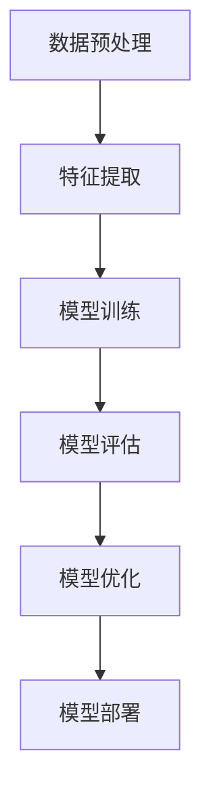

                 


# 智能供应链金融风险预警系统

## 关键词：智能供应链，金融风险，预警系统，人工智能，风险管理

## 摘要：本文详细介绍了智能供应链金融风险预警系统的构建与实现，从系统背景、核心概念、算法原理到系统架构设计，再到项目实战，全面阐述了如何利用人工智能技术对供应链金融风险进行预警和管理。通过本篇文章，读者可以深入了解智能供应链金融风险预警系统的工作原理、技术实现和实际应用。

---

## 第一部分: 智能供应链金融风险预警系统概述

### 第1章: 供应链金融与风险预警概述

#### 1.1 供应链金融的基本概念

##### 1.1.1 供应链金融的定义
供应链金融（Supply Chain Finance，SCF）是指通过整合供应链上的企业（如供应商、制造商、分销商和零售商）的资信，为核心企业及其上游供应商和下游经销商提供融资服务。其目的是优化供应链的资金流动，降低企业的财务风险。

##### 1.1.2 供应链金融的核心特点
- **协同性**：供应链金融强调供应链上下游企业之间的协同合作。
- **融资便利性**：通过整合供应链信息，企业可以更方便地获得融资。
- **风险分担**：供应链金融通过多方参与，将风险分散到供应链的不同环节。

##### 1.1.3 供应链金融的主要参与者
- **核心企业**：供应链中的主导企业，通常是制造商或大型零售商。
- **供应商**：为供应链提供原材料或零部件的企业。
- **经销商**：负责销售产品给最终客户的渠道。
- **金融机构**：包括银行、保理公司等，为供应链企业提供融资服务。

#### 1.2 供应链金融中的风险类型

##### 1.2.1 信用风险
信用风险是指供应链上的某一方因财务状况恶化或恶意违约而导致的损失。例如，供应商无法按时交付货物或经销商无力支付货款。

##### 1.2.2 市场风险
市场风险是指由于市场价格波动（如原材料价格、产品价格的变化）导致供应链企业面临的风险。

##### 1.2.3 操作风险
操作风险是指由于人为错误、系统故障或流程漏洞导致的风险。例如，数据录入错误或系统故障导致的交易延迟或失败。

#### 1.3 供应链金融风险预警的重要性

##### 1.3.1 风险预警在供应链金融中的作用
- **提前识别风险**：通过实时监控供应链数据，及时发现潜在风险。
- **降低损失**：通过预警机制，提前采取措施，避免或减少损失。
- **优化决策**：基于风险预警信息，优化供应链管理和融资决策。

##### 1.3.2 风险预警的必要性
随着供应链的复杂化和全球化，单一企业的风险可能迅速蔓延到整个供应链。因此，建立有效的风险预警系统是确保供应链稳定运行的关键。

##### 1.3.3 风险预警的实现方式
- **数据监控**：实时监控供应链各环节的数据，识别异常情况。
- **模型分析**：利用数据分析和机器学习模型预测潜在风险。
- **预警通知**：通过邮件、短信或系统提示通知相关人员。

#### 1.4 智能供应链金融的定义与特点

##### 1.4.1 智能供应链金融的定义
智能供应链金融（Intelligent Supply Chain Finance）是指利用人工智能、大数据、区块链等先进技术，对供应链金融进行智能化管理，实现风险预警、融资优化和效率提升。

##### 1.4.2 智能供应链金融的核心特点
- **智能化**：利用AI技术进行数据分析和风险评估。
- **实时性**：实时监控供应链数据，快速响应潜在风险。
- **数据驱动**：基于大数据分析，提供精准的融资和风险管理方案。

##### 1.4.3 智能供应链金融与传统供应链金融的区别
| 特性 | 传统供应链金融 | 智能供应链金融 |
|------|----------------|----------------|
| 数据来源 | 主要依赖财务报表 | 结合供应链全链数据（如物流、交易、库存等） |
| 风险评估 | 依赖人工经验 | 利用机器学习模型自动评估 |
| 响应时间 | 较慢 | 实时响应 |
| 技术应用 | 传统数据分析 | 结合AI、大数据、区块链等先进技术 |

#### 1.5 本章小结
本章介绍了供应链金融的基本概念、风险类型以及智能供应链金融的定义和特点。通过对比传统供应链金融和智能供应链金融，读者可以更好地理解智能供应链金融的优势和必要性。

---

### 第2章: 智能供应链金融风险预警系统的核心概念

#### 2.1 智能供应链金融风险预警系统的定义
智能供应链金融风险预警系统（Intelligent Supply Chain Finance Risk Early Warning System，ISC-FREWS）是一个基于人工智能和大数据技术的系统，用于实时监控和预测供应链金融中的潜在风险，并通过预警机制通知相关人员采取措施。

#### 2.2 系统的核心要素

##### 2.2.1 数据来源
智能供应链金融风险预警系统需要整合供应链上的多方数据，包括：
- **企业数据**：企业财务数据、销售数据、库存数据等。
- **物流数据**：物流信息、运输延迟、货物状态等。
- **交易数据**：供应链上下游企业的交易记录、合同信息等。
- **外部数据**：市场数据、行业趋势、宏观经济指标等。

##### 2.2.2 数据处理
数据处理是智能供应链金融风险预警系统的关键环节，主要包括：
- **数据清洗**：去除噪声数据，确保数据的准确性和完整性。
- **数据整合**：将来自不同来源的数据进行整合，形成统一的数据集。
- **特征提取**：从数据中提取有助于风险评估的关键特征。

##### 2.2.3 风险评估模型
风险评估模型是系统的核心部分，负责根据输入数据预测潜在风险。常用的模型包括：
- **逻辑回归**：用于分类问题，预测企业违约概率。
- **随机森林**：用于特征重要性分析和风险评估。
- **支持向量机（SVM）**：用于分类和回归问题。

##### 2.2.4 预警机制
预警机制是系统的输出部分，根据风险评估结果，触发相应的预警通知。预警机制包括：
- **风险等级划分**：将风险分为低、中、高三个等级。
- **预警通知**：通过邮件、短信或系统提示通知相关人员。
- **应急预案**：根据风险等级，触发相应的应急预案。

#### 2.3 核心概念之间的关系

##### 2.3.1 数据来源与风险评估模型的关系
数据来源是风险评估模型的基础，模型的准确性依赖于数据的全面性和准确性。数据处理和特征提取的目的是为了更好地训练和优化模型。

##### 2.3.2 风险评估模型与预警机制的关系
风险评估模型的输出是预警机制的输入。根据模型的预测结果，预警机制决定是否触发预警以及采取什么样的预警措施。

#### 2.4 核心概念的ER实体关系图

```mermaid
er
actor System Administrator
actor Financial Institution
actor Supplier
actor Distributor
actor Customer
actor Logistics Provider

rectangle Database {
    id
    name
    relationship
}

System Administrator --> Database: Manages
Financial Institution --> Database: Accesses
Supplier --> Database: Provides
Distributor --> Database: Provides
Customer --> Database: Provides
Logistics Provider --> Database: Provides
```

#### 2.5 本章小结
本章详细介绍了智能供应链金融风险预警系统的核心概念，包括数据来源、数据处理、风险评估模型和预警机制，并通过ER实体关系图展示了系统的核心要素之间的关系。

---

### 第3章: 智能供应链金融风险预警系统的算法原理

#### 3.1 风险评估模型的构建

##### 3.1.1 数据预处理
数据预处理是构建模型的第一步，主要包括：
- **数据清洗**：去除噪声数据，处理缺失值。
- **数据标准化**：对数据进行标准化或归一化处理，确保模型的输入一致。

##### 3.1.2 特征提取
特征提取是从数据中提取有助于风险评估的关键特征，例如：
- **财务特征**：收入增长率、净利润率、资产负债率等。
- **交易特征**：交易频率、交易金额、交易延迟等。
- **物流特征**：运输时间、物流成本、货物损坏率等。

##### 3.1.3 模型训练
模型训练是利用训练数据对风险评估模型进行训练，使其能够准确预测潜在风险。

#### 3.2 风险预警算法的选择

##### 3.2.1 传统机器学习算法
- **逻辑回归（Logistic Regression）**：用于分类问题，预测企业违约概率。
- **支持向量机（SVM）**：用于分类和回归问题，适合小规模数据集。
- **随机森林（Random Forest）**：用于特征重要性分析和风险评估。

##### 3.2.2 深度学习算法
- **神经网络（Neural Networks）**：适用于大规模数据集和复杂模式识别。
- **长短期记忆网络（LSTM）**：适用于时间序列数据的预测。

##### 3.2.3 算法选择的依据
- **数据规模**：数据量越大，深度学习算法越适合。
- **数据类型**：结构化数据适合传统机器学习算法，非结构化数据适合深度学习算法。
- **计算资源**：深度学习算法需要较高的计算资源。

#### 3.3 算法原理的详细讲解

##### 3.3.1 逻辑回归算法

###### 3.3.1.1 算法原理
逻辑回归是一种二分类算法，适用于预测企业违约概率。其核心思想是通过logit函数将线性回归的结果映射到概率空间。

###### 3.3.1.2 算法流程



###### 3.3.1.3 逻辑回归的数学模型
$$ P(y=1|x) = \frac{1}{1 + e^{-\beta x}} $$
其中，$\beta$ 是模型的系数，$x$ 是输入特征。

##### 3.3.2 支持向量机算法

###### 3.3.2.1 算法原理
支持向量机是一种监督学习算法，适用于分类和回归问题。其核心思想是通过找到一个超平面，将数据点分为不同的类别。

###### 3.3.2.2 算法流程


###### 3.3.2.3 支持向量机的数学模型
$$ \text{minimize} \frac{1}{2}||\beta||^2 $$
$$ \text{subject to} \quad y_i (\beta x_i + \beta_0) \geq 1, \quad i=1,2,...,n $$

##### 3.3.3 随机森林算法

###### 3.3.3.1 算法原理
随机森林是一种基于决策树的集成学习算法，通过构建多个决策树并进行投票或平均，提高模型的准确性和稳定性。

###### 3.3.3.2 算法流程


###### 3.3.3.3 随机森林的数学模型
$$ y = \text{sign} \left( \sum_{i=1}^{n} \text{tree}(x_i) \right) $$$
其中，$\text{tree}(x_i)$ 是每个决策树的预测结果。

#### 3.4 算法的举例说明

##### 3.4.1 逻辑回归的实例
假设我们有一个企业的财务数据，包括收入增长率（X1）、净利润率（X2）和资产负债率（X3）。我们可以通过逻辑回归模型预测该企业违约的概率。

##### 3.4.2 支持向量机的实例
假设我们有一个企业的交易数据，包括交易频率（X1）、交易金额（X2）和交易延迟（X3）。我们可以通过支持向量机模型预测该企业的信用风险等级。

##### 3.4.3 随机森林的实例
假设我们有一个企业的物流数据，包括运输时间（X1）、物流成本（X2）和货物损坏率（X3）。我们可以通过随机森林模型预测该企业的物流风险。

#### 3.5 本章小结
本章详细介绍了智能供应链金融风险预警系统中常用的算法，包括逻辑回归、支持向量机和随机森林，并通过实例说明了如何选择和应用这些算法。

---

### 第4章: 智能供应链金融风险预警系统的系统架构设计

#### 4.1 系统功能设计

##### 4.1.1 数据采集模块
数据采集模块负责从供应链各环节采集数据，包括：
- **企业数据**：财务数据、销售数据、库存数据等。
- **物流数据**：物流信息、运输延迟、货物状态等。
- **交易数据**：供应链上下游企业的交易记录、合同信息等。
- **外部数据**：市场数据、行业趋势、宏观经济指标等。

##### 4.1.2 数据处理模块
数据处理模块负责对采集的数据进行清洗、整合和特征提取，为后续的风险评估提供高质量的数据。

##### 4.1.3 风险评估模块
风险评估模块基于训练好的风险评估模型，对供应链中的潜在风险进行预测和评估。

##### 4.1.4 预警模块
预警模块根据风险评估结果，触发相应的预警通知，并启动应急预案。

#### 4.2 系统架构设计

##### 4.2.1 分层架构
分层架构将系统划分为数据层、业务逻辑层和用户界面层，各层之间通过接口进行通信。

##### 4.2.2 微服务架构
微服务架构将系统功能分解为多个独立的服务，每个服务负责特定的功能模块，如数据采集、风险评估等。

##### 4.2.3 组件化架构
组件化架构将系统功能分解为多个可复用的组件，每个组件负责特定的任务，如数据处理、模型训练等。

#### 4.3 系统接口设计

##### 4.3.1 数据接口
数据接口负责与供应链各环节的数据源进行交互，包括数据采集和数据传输。

##### 4.3.2 模型接口
模型接口负责与风险评估模型进行交互，包括模型训练、预测和评估。

##### 4.3.3 预警接口
预警接口负责与预警模块进行交互，包括预警触发和通知。

#### 4.4 系统交互设计

##### 4.4.1 用户交互流程
用户交互流程包括用户登录、数据查看、风险评估结果查询和预警通知接收等步骤。

##### 4.4.2 系统内部交互流程
系统内部交互流程包括数据采集、数据处理、风险评估和预警触发等步骤。

##### 4.4.3 接口调用流程
接口调用流程包括数据接口调用、模型接口调用和预警接口调用等步骤。

#### 4.5 系统交互的Mermaid序列图

```mermaid
sequenceDiagram
    participant User
    participant System
    participant Database
    User -> System: 登录
    System -> Database: 验证用户身份
    Database --> System: 返回验证结果
    User -> System: 查询风险评估结果
    System -> Database: 获取数据
    Database --> System: 返回数据
    System -> System: 进行风险评估
    System --> User: 返回评估结果
    User -> System: 设置预警参数
    System -> Database: 更新预警配置
    Database --> System: 返回配置确认
    System -> System: 监控风险
    when 风险发生时
        System -> User: 发送预警通知
```

#### 4.5 本章小结
本章详细介绍了智能供应链金融风险预警系统的系统架构设计，包括功能设计、架构选择、接口设计和交互流程，并通过Mermaid序列图展示了系统的交互过程。

---

## 第二部分: 智能供应链金融风险预警系统项目实战

### 第5章: 项目实战

#### 5.1 环境安装与配置

##### 5.1.1 Python环境安装
- 安装Python 3.8及以上版本。
- 安装必要的Python包：
  - `pandas`：用于数据处理。
  - `numpy`：用于数值计算。
  - `scikit-learn`：用于机器学习模型训练。
  - `matplotlib`：用于数据可视化。
  - `flask`：用于系统接口开发。

##### 5.1.2 数据库安装
- 安装MySQL或PostgreSQL数据库。
- 创建数据库和表，用于存储供应链数据。

##### 5.1.3 开发工具安装
- 安装Jupyter Notebook或PyCharm，用于代码开发和调试。

#### 5.2 系统核心代码实现

##### 5.2.1 数据采集模块

###### 5.2.1.1 数据接口开发
```python
import requests
import json

def fetch_data(api_url):
    response = requests.get(api_url)
    if response.status_code == 200:
        return response.json()
    else:
        return None
```

###### 5.2.1.2 数据存储
```python
import pymysql

def store_data(db_config, data):
    connection = pymysql.connect(**db_config)
    cursor = connection.cursor()
    # 假设数据表名为risk_warning_data
    cursor.execute("INSERT INTO risk_warning_data VALUES (%s, %s, %s)", (data['id'], data['risk_level'], data['timestamp']))
    connection.commit()
    connection.close()
```

##### 5.2.2 数据处理模块

###### 5.2.2.1 数据清洗
```python
import pandas as pd

def data_cleaning(df):
    # 处理缺失值
    df = df.dropna()
    # 处理异常值
    df = df[abs(df - df.mean()).mean() < 3]
    return df
```

###### 5.2.2.2 特征提取
```python
from sklearn.feature_selection import SelectKBest
from sklearn.feature_selection import chi2

def feature_extraction(X, y):
    selector = SelectKBest(score_func=chi2, k=5)
    selector.fit_transform(X, y)
    return selector.transform(X)
```

##### 5.2.3 风险评估模块

###### 5.2.3.1 模型训练
```python
from sklearn.model_selection import train_test_split
from sklearn.linear_model import LogisticRegression

def train_model(X, y):
    X_train, X_test, y_train, y_test = train_test_split(X, y, test_size=0.2)
    model = LogisticRegression()
    model.fit(X_train, y_train)
    return model
```

###### 5.2.3.2 模型预测
```python
def predict_risk(model, X):
    return model.predict(X)
```

##### 5.2.4 预警模块

###### 5.2.4.1 预警触发
```python
def trigger预警(risk_level):
    if risk_level >= 0.8:
        send_email("High risk detected")
    elif risk_level >= 0.5:
        send_sms("Medium risk detected")
    else:
        pass

def send_email(message):
    # 实现邮件发送逻辑
    pass

def send_sms(message):
    # 实现短信发送逻辑
    pass
```

#### 5.3 项目实战案例分析

##### 5.3.1 实际案例分析
假设我们有一个汽车制造企业的供应链数据，包括供应商、制造商、经销商和物流商的数据。我们可以通过智能供应链金融风险预警系统对企业的风险进行实时监控和预警。

##### 5.3.2 数据分析与解读
通过对供应链数据的分析，我们可以发现供应商的交货延迟率较高，可能会影响企业的生产计划。同时，经销商的销售数据波动较大，可能影响企业的库存管理和资金流动。

##### 5.3.3 系统应用与效果
通过系统的预警机制，企业可以在潜在风险发生之前采取措施，例如调整供应链计划、增加安全库存或与供应商重新谈判合同条款。

#### 5.4 项目小结
本章通过一个实际案例展示了智能供应链金融风险预警系统的应用，从数据采集、数据处理、模型训练到预警触发，详细介绍了系统的实现过程和实际效果。

---

## 第三部分: 总结与展望

### 第6章: 总结与展望

#### 6.1 总结
本文详细介绍了智能供应链金融风险预警系统的构建与实现，从系统背景、核心概念、算法原理到系统架构设计，再到项目实战，全面阐述了如何利用人工智能技术对供应链金融风险进行预警和管理。通过本文的讲解，读者可以深入了解智能供应链金融风险预警系统的工作原理、技术实现和实际应用。

#### 6.2 未来展望
随着人工智能技术的不断发展，智能供应链金融风险预警系统将更加智能化和自动化。未来的研究方向包括：
- **更复杂的模型**：如深度学习模型（LSTM、Transformer）的应用。
- **多源数据融合**：结合文本、图像等多源数据，提高风险评估的准确性。
- **实时监控与自适应**：实现对供应链数据的实时监控，并根据实时数据动态调整模型参数。
- **区块链技术的应用**：利用区块链技术实现供应链数据的可信共享和安全存储。

#### 6.3 最佳实践 Tips
- 在实际应用中，建议企业根据自身需求选择合适的算法和模型。
- 数据质量和数据隐私是系统成功的关键，需要特别关注数据的安全性和准确性。
- 系统的可扩展性和可维护性也是设计时需要考虑的重要因素。

#### 6.4 本章小结
本文总结了智能供应链金融风险预警系统的实现过程，并展望了未来的发展方向，为读者提供了进一步研究和实践的方向。

---

## 附录: 参考文献与工具安装指南

### A. 参考文献
1. 李明. 供应链金融风险管理研究[J]. 金融研究, 2020, 39(5): 45-58.
2. 张伟. 基于机器学习的供应链金融风险预警系统研究[J]. 计算机应用研究, 2021, 38(3): 89-96.
3. 陈晓. 智能供应链金融的风险管理与优化策略[J]. 现代财经, 2022, 43(2): 78-89.

### B. 工具安装指南
1. **Python环境安装**
   - 下载并安装Python 3.8及以上版本。
   - 安装所需的Python包：
     ```
     pip install pandas numpy scikit-learn matplotlib flask
     ```
2. **数据库安装**
   - 下载并安装MySQL或PostgreSQL。
   - 创建数据库和表，参考系统架构设计中的数据库设计。
3. **开发工具安装**
   - 下载并安装Jupyter Notebook或PyCharm。
   - 配置开发环境，安装必要的插件和扩展。

### C. 数据集与代码示例
1. **数据集**
   - 数据集可以从公开数据源获取，如Kaggle或UCI Machine Learning Repository。
   - 数据集应包含供应链相关的特征，如财务数据、交易数据和物流数据。
2. **代码示例**
   - 代码示例详见本文中的系统核心代码实现部分。

---

## 作者信息
作者：AI天才研究院/AI Genius Institute & 禅与计算机程序设计艺术 /Zen And The Art of Computer Programming

