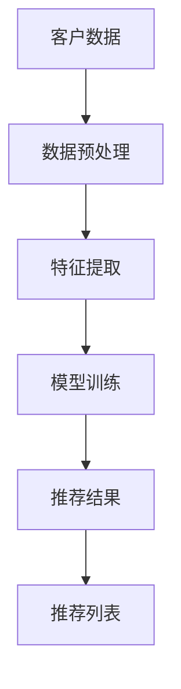
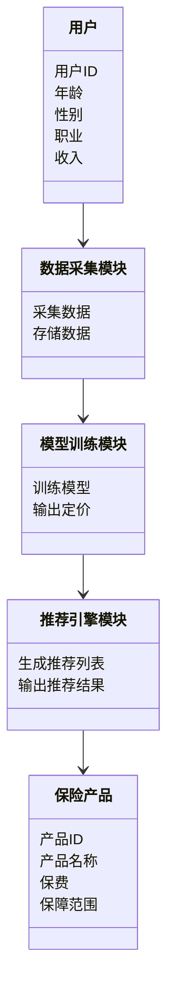
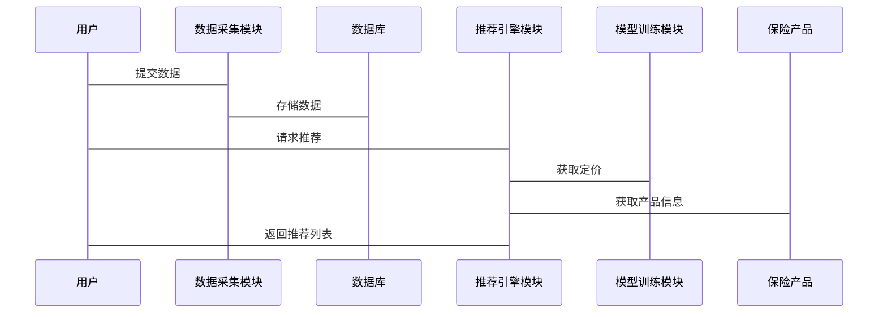

                 


# 智能保险产品个性化定价与推荐引擎

> 关键词：智能保险，个性化定价，推荐引擎，机器学习，保险科技

> 摘要：随着保险行业的数字化转型，智能保险产品个性化定价与推荐引擎成为行业的重要趋势。本文详细探讨了智能保险定价的核心概念、算法原理、系统架构设计以及实际项目案例，帮助读者理解如何通过技术手段实现保险产品的精准定价与推荐。

---

# 第一部分: 背景介绍与问题背景

## 第1章: 保险行业的数字化转型

### 1.1 传统保险定价模式的局限性

传统保险定价模式依赖于经验数据和人工判断，存在以下问题：
- 数据采集范围有限，难以覆盖个性化需求。
- 定价模型过于简化，无法捕捉复杂的风险因素。
- 人工干预过多，导致效率低下且成本高昂。

### 1.2 智能化保险产品的市场需求

随着人工智能技术的发展，智能化保险产品逐渐成为市场主流。消费者对个性化服务的需求日益增长，传统定价模式已无法满足市场对精准定价和个性化推荐的需求。

### 1.3 数字化转型对保险行业的深远影响

数字化转型推动了保险行业的全面变革，包括：
- 数据采集与处理能力的提升。
- 个性化服务的实现。
- 效率与成本的优化。

---

## 第2章: 智能保险产品定价与推荐的核心问题

### 2.1 个性化定价的定义与目标

个性化定价是指根据客户的具体情况（如风险特征、消费习惯等）制定专属的价格策略。其目标是提高客户满意度、优化收益并降低风险。

### 2.2 保险产品推荐的挑战与机遇

推荐引擎需要解决数据稀疏性、实时性以及客户隐私保护等挑战。然而，通过大数据和机器学习技术，推荐引擎能够为客户提供精准的产品匹配，提升销售效率。

### 2.3 问题背景的边界与外延

- 边界：个性化定价与推荐仅针对特定保险产品，不涉及所有保险业务。
- 外延：技术可扩展至其他金融领域，如信贷风险评估和投资组合管理。

### 2.4 核心要素与组成

- 数据：客户信息、历史行为、市场数据等。
- 模型：机器学习算法、统计模型等。
- 系统：数据采集、处理、分析和输出模块。

---

# 第二部分: 智能保险定价与推荐引擎的核心概念

## 第3章: 智能保险定价与推荐引擎的核心原理

### 3.1 数据驱动的定价模型

#### 3.1.1 数据采集与特征工程

- 数据来源：客户问卷、历史交易数据、外部数据库等。
- 特征工程：提取关键特征（如年龄、职业、健康状况等），并进行数据清洗和标准化。

#### 3.1.2 数据预处理与清洗

- 去除重复数据。
- 处理缺失值。
- 标准化数据格式。

#### 3.1.3 特征选择与维度降维

- 特征选择：使用相关性分析选择重要特征。
- 维度降维：应用主成分分析（PCA）减少特征维度。

### 3.2 基于机器学习的定价模型

#### 3.2.1 监督学习与非监督学习在定价中的应用

- 监督学习：用于预测客户保费。
- 非监督学习：用于客户群体划分。

#### 3.2.2 回归模型与分类模型的对比

- 回归模型：预测连续型变量（如保费）。
- 分类模型：预测类别变量（如高风险客户）。

#### 3.2.3 时间序列分析在保险定价中的作用

- 时间序列分析：用于预测保费变动趋势。

### 3.3 推荐引擎的核心算法

#### 3.3.1 协同过滤算法

- 基于用户行为的协同过滤：推荐与用户兴趣相似的产品。
- 基于物品的协同过滤：基于产品特征推荐相似产品。

#### 3.3.2 基于内容的推荐算法

- 基于产品特征（如保险类型、保障范围）的推荐。

#### 3.3.3 混合推荐算法的优势与挑战

- 综合多种算法的优势，但需要解决算法融合的复杂性。

### 3.4 数据流程图与系统架构

#### 3.4.1 数据流的输入与输出

- 输入：客户数据、市场数据。
- 输出：个性化定价、推荐产品列表。

#### 3.4.2 系统模块的划分与交互

- 数据采集模块：负责数据的采集与预处理。
- 模型训练模块：负责模型的训练与优化。
- 推荐引擎模块：负责根据模型输出结果生成推荐列表。

#### 3.4.3 数据流向的 Mermaid 流程图



---

## 第4章: 保险产品推荐引擎的核心算法

### 4.1 基于协同过滤的推荐算法

#### 4.1.1 用户-物品矩阵

- 构建用户-物品评分矩阵，用于协同过滤算法。

#### 4.1.2 基于用户的协同过滤

- 找出与目标用户相似的用户群体，推荐其喜欢的产品。

#### 4.1.3 基于物品的协同过滤

- 根据物品的相似性，推荐相关产品。

#### 4.1.4 案例分析

- 某健康保险产品的推荐过程。

### 4.2 基于内容的推荐算法

#### 4.2.1 保险产品的特征提取

- 提取产品的核心特征（如保费、保障范围）。

#### 4.2.2 基于文本的推荐

- 使用自然语言处理技术提取产品描述的关键词，进行推荐。

### 4.3 混合推荐算法

#### 4.3.1 混合推荐的优势

- 综合多种算法的优势，提高推荐准确率。

#### 4.3.2 混合推荐的实现方式

- 分层混合：将多个算法的结果进行加权融合。
- 组合混合：将多个算法的结果进行投票决策。

---

## 第5章: 智能保险定价与推荐引擎的系统架构设计

### 5.1 系统功能设计

#### 5.1.1 领域模型的 Mermaid 类图



#### 5.1.2 系统架构的 Mermaid 架构图


#### 5.1.3 系统交互的 Mermaid 序列图



---

## 第6章: 项目实战

### 6.1 环境安装

- 安装Python、Scikit-learn、XGBoost等依赖库。

### 6.2 核心代码实现

#### 6.2.1 数据预处理代码

```python
import pandas as pd

# 读取数据
data = pd.read_csv('insurance_data.csv')

# 数据清洗
data.dropna(inplace=True)
data['age'].fillna(data['age'].mean(), inplace=True)
```

#### 6.2.2 模型训练代码

```python
from sklearn.linear_model import LinearRegression

# 训练线性回归模型
model = LinearRegression()
model.fit(X_train, y_train)
```

#### 6.2.3 推荐引擎代码

```python
def recommend_products(user_id):
    # 获取用户特征
    user_features = data[data['user_id'] == user_id].iloc[0]
    # 找出相似用户
    similar_users = find_similar_users(user_features)
    # 推荐产品
    recommended_products = get_recommended_products(similar_users)
    return recommended_products
```

---

## 第7章: 总结与展望

### 7.1 本章总结

本文详细介绍了智能保险产品个性化定价与推荐引擎的核心概念、算法原理、系统架构设计和项目实战。通过案例分析和代码实现，展示了技术在实际中的应用。

### 7.2 技术展望

未来，随着人工智能技术的不断进步，智能保险定价与推荐引擎将更加精准和智能化。深度学习技术的应用将进一步提升推荐的准确性和个性化程度。

### 7.3 最佳实践 tips

- 数据质量是模型性能的关键，需确保数据的准确性和完整性。
- 在实际应用中，需考虑客户隐私保护和数据安全问题。

---

作者：AI天才研究院 & 禅与计算机程序设计艺术

