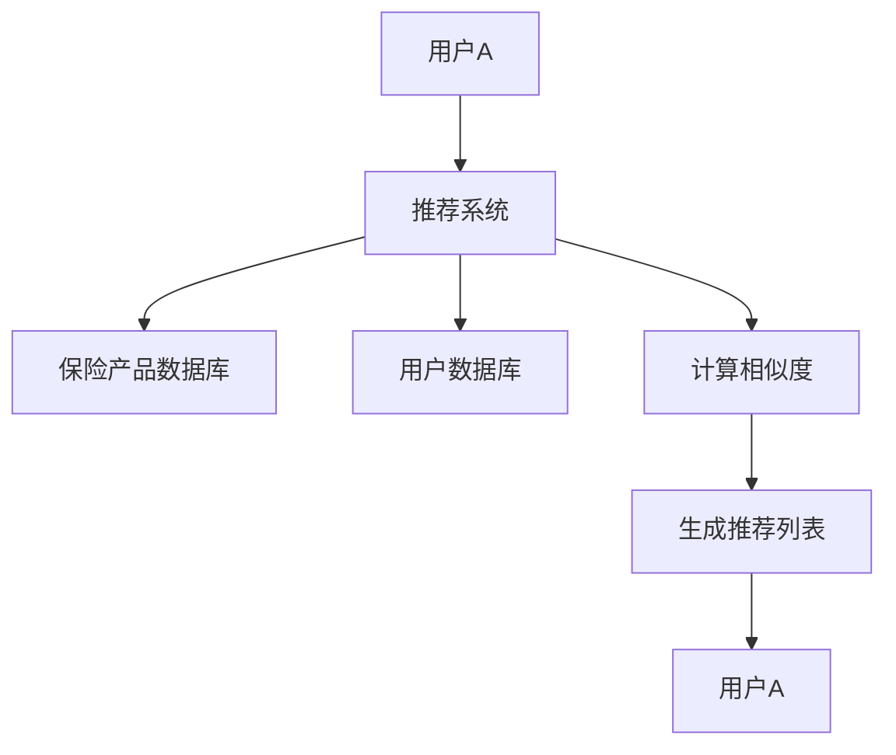
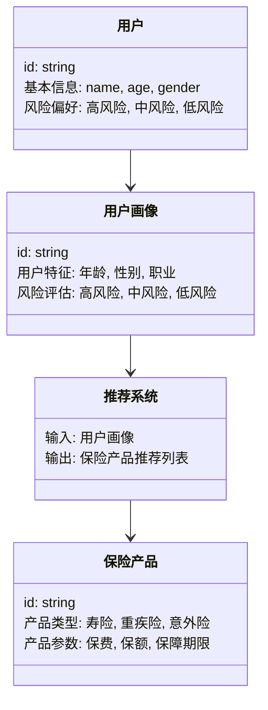
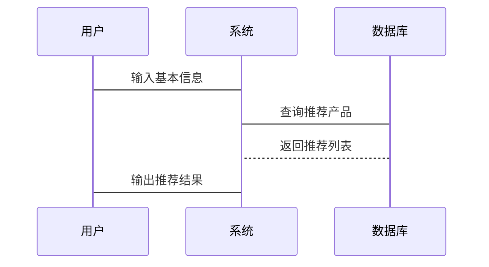

                 


# 智能保险产品个性化定制系统

> 关键词：智能保险、个性化定制、用户画像、推荐算法、系统架构

> 摘要：本文详细探讨了智能保险产品个性化定制系统的设计与实现，从问题背景、核心概念、算法原理、系统架构到项目实战，全面分析了该系统的技术细节和实现步骤。文章结合实际案例，深入讲解了用户画像构建、个性化推荐算法实现、系统功能设计等关键环节，并通过具体代码实现和实际案例分析，帮助读者更好地理解和应用智能保险产品的个性化定制系统。

---

# 第一部分: 智能保险产品个性化定制系统背景介绍

## 第1章: 问题背景与问题描述

### 1.1 问题背景
随着保险行业的快速发展，消费者的需求日益多样化和个性化。传统保险产品往往采用标准化的设计，难以满足不同客户的具体需求。例如，一位年轻的创业者可能需要高风险的保障，而一位中年家庭则可能更关注健康和子女教育的保障。传统保险产品的单一性和标准化设计，使得客户在选择保险产品时常常感到局限，无法找到完全符合自身需求的产品。

### 1.2 问题解决思路
为了满足客户的个性化需求，智能保险产品个性化定制系统应运而生。该系统通过大数据分析和人工智能技术，能够根据客户的具体需求和风险偏好，动态生成个性化的保险产品。这不仅能够提高客户满意度，还能帮助保险公司更好地拓展市场。

### 1.3 系统边界与外延
智能保险产品个性化定制系统的边界主要包括以下几点：
1. **输入端**：用户的基本信息、风险偏好、财务状况等。
2. **输出端**：个性化保险产品的设计方案，包括保费、保额、保障期限等。
3. **核心功能**：用户画像构建、个性化推荐算法、保险产品定制。

## 第2章: 核心概念与系统架构

### 2.1 核心概念
智能保险产品个性化定制系统的核心概念包括以下几点：
1. **用户画像**：通过收集和分析用户的基本信息、风险偏好、消费习惯等，构建用户的个性化画像。
2. **个性化推荐算法**：基于用户画像和历史数据，利用机器学习算法推荐适合的保险产品。
3. **保险产品定制**：根据用户的个性化需求，动态生成保险产品的设计方案。

### 2.2 核心概念属性对比表
以下是对核心概念的属性对比：

| 概念       | 数据来源        | 数据维度      | 数据处理方式      |
|------------|-----------------|---------------|-------------------|
| 用户画像   | 用户基本信息、行为数据 | 年龄、职业、健康状况 | 数据清洗、特征提取、模型训练 |
| 个性化推荐 | 用户画像、历史数据 | 风险偏好、需求偏好 | 推荐算法计算、排序、输出 |

### 2.3 ER实体关系图
以下是系统的核心实体关系图：

```mermaid
er
    actor 用户 {
        id: string
        基本信息: name, age, gender
        风险偏好: 高风险, 中风险, 低风险
    }
    actor 保险产品 {
        id: string
        产品类型: 寿险, 重疾险, 意外险
        产品参数: 保费, 保额, 保障期限
    }
    actor 推荐系统 {
        接收用户信息
        生成推荐列表
        输出推荐结果
    }
    relation 用户-保险产品 {
        用户id
        保险产品id
        关联关系: 根据用户画像匹配保险产品
    }
```

---

# 第三部分: 算法原理

## 第3章: 协同过滤推荐算法

### 3.1 算法原理
协同过滤推荐算法是一种基于用户行为和偏好相似性进行推荐的技术。其核心思想是：如果两个用户在过去的行为（如购买、评价等）相似，那么他们未来的偏好也会相似。在智能保险产品推荐中，我们可以基于用户的保险需求相似性进行推荐。

#### 3.1.1 余弦相似度公式
余弦相似度是衡量两个向量相似程度的重要指标，公式如下：

$$
\cos \theta = \frac{\vec{A} \cdot \vec{B}}{|\vec{A}| |\vec{B}|}
$$

其中，$\vec{A}$ 和 $\vec{B}$ 分别表示两个用户的特征向量。

#### 3.1.2 协同过滤推荐算法流程图
以下是协同过滤推荐算法的流程图：



### 3.2 算法实现

#### 3.2.1 环境安装
推荐使用Python 3.8及以上版本，安装以下库：

```bash
pip install numpy scikit-learn pandas
```

#### 3.2.2 推荐系统实现代码
以下是协同过滤推荐算法的Python代码实现：

```python
import numpy as np
from sklearn.metrics.pairwise import cosine_similarity

# 示例数据：用户-保险产品评分矩阵
# 行表示用户，列表示保险产品，值表示评分
rating_matrix = np.array([
    [4, 3, 2],
    [5, 1, 4],
    [3, 5, 1],
    [2, 4, 3]
])

# 计算余弦相似度
similarity = cosine_similarity(rating_matrix)

# 推荐算法实现
def recommend_users(rating_matrix, user_id, top_n=3):
    similarity = cosine_similarity(rating_matrix)
    user_similarities = similarity[user_id]
    # 去除自身相似度
    user_similarities[user_id] = 0
    # 根据相似度降序排序
    similar_indices = np.argsort(-user_similarities)
    # 推荐top_n个用户
    recommended_users = similar_indices[:top_n]
    return recommended_users

# 示例推荐
user_id = 0
recommended_users = recommend_users(rating_matrix, user_id)
print(f"推荐用户{user_id}的相似用户为：{recommended_users}")
```

---

# 第四部分: 系统分析与架构设计

## 第4章: 系统分析与架构设计

### 4.1 问题场景介绍
智能保险产品个性化定制系统需要解决的主要问题是：如何根据用户的需求和风险偏好，快速生成个性化的保险产品设计方案。系统需要支持用户输入基本信息、选择保险需求、查看推荐结果，并最终生成定制方案。

### 4.2 系统功能设计

#### 4.2.1 用户模块
- 用户信息输入：用户输入基本信息（如年龄、职业）和需求偏好（如健康保障需求）。
- 用户画像构建：基于用户输入数据，构建用户画像。

#### 4.2.2 保险产品模块
- 产品库管理：存储各种保险产品的基本信息和参数。
- 产品推荐：基于用户画像和推荐算法，生成推荐列表。

#### 4.2.3 系统管理模块
- 系统配置：设置推荐算法参数、用户画像模型等。
- 数据管理：存储和管理用户数据、推荐结果等。

### 4.3 系统架构设计

#### 4.3.1 领域模型类图
以下是系统的领域模型类图：



#### 4.3.2 系统架构图
以下是系统的整体架构图：


### 4.4 接口设计与交互流程

#### 4.4.1 接口设计
以下是系统的主要接口：

- **用户信息接口**：用于用户输入基本信息和需求偏好。
- **推荐系统接口**：接收用户画像，返回推荐的保险产品列表。
- **保险产品数据库接口**：存储和管理保险产品的基本信息和参数。

#### 4.4.2 交互流程
以下是用户与系统之间的交互流程图：



---

# 第五部分: 项目实战

## 第5章: 项目实战

### 5.1 环境安装
以下是项目实战所需的环境安装步骤：

```bash
pip install numpy pandas scikit-learn
```

### 5.2 系统核心实现代码

#### 5.2.1 用户画像构建代码
以下是用户画像构建的Python代码：

```python
import pandas as pd

# 示例数据：用户基本信息
user_info = {
    'id': ['u1', 'u2', 'u3'],
    'name': ['Alice', 'Bob', 'Charlie'],
    'age': [25, 30, 35],
    'gender': ['F', 'M', 'M'],
    'risk_preference': ['high', 'medium', 'low']
}

# 创建用户画像数据框
user_df = pd.DataFrame(user_info)
print(user_df)
```

#### 5.2.2 个性化推荐实现代码
以下是个性化推荐实现的Python代码：

```python
from sklearn.neighbors import NearestNeighbors

# 示例数据：用户保险需求
demand_matrix = np.array([
    [4, 3, 2],
    [5, 1, 4],
    [3, 5, 1],
    [2, 4, 3]
])

# 训练最近邻模型
model = NearestNeighbors(n_neighbors=2).fit(demand_matrix)

# 查询用户推荐
query = np.array([[4, 3, 2]])
distances, indices = model.kneighbors(query)

print("推荐用户的索引为：", indices)
```

### 5.3 代码解读与分析
- **用户画像构建代码**：通过Pandas库构建用户数据框，存储用户的基本信息和风险偏好。
- **个性化推荐实现代码**：使用Scikit-learn库中的最近邻算法，基于用户需求的相似性进行推荐。

### 5.4 实际案例分析
假设用户A的年龄为30岁，职业为医生，风险偏好为高风险。系统根据用户的画像，推荐以下保险产品：
1. 高保额的健康保险
2. 针对医生职业的特定保险
3. 综合医疗保险

### 5.5 项目小结
通过实际案例分析，我们可以看到智能保险产品个性化定制系统能够有效满足用户的个性化需求，提高客户满意度和保险公司竞争力。

---

# 第六部分: 未来趋势与最佳实践

## 第6章: 未来趋势与最佳实践

### 6.1 未来发展趋势
随着人工智能和大数据技术的不断发展，智能保险产品个性化定制系统将更加智能化和个性化。未来的系统将更加注重实时数据分析和动态调整，以满足用户需求的变化。

### 6.2 最佳实践
- **数据隐私保护**：在用户画像构建和推荐过程中，必须严格保护用户数据隐私。
- **系统性能优化**：通过优化算法和数据结构，提高系统的推荐效率和响应速度。
- **用户反馈机制**：建立用户反馈机制，不断优化推荐算法和系统功能。

### 6.3 小结
智能保险产品个性化定制系统是保险行业未来发展的重要方向。通过技术创新和实践积累，我们可以更好地满足用户的个性化需求，推动保险行业的数字化转型。

---

# 作者信息

作者：AI天才研究院/AI Genius Institute & 禅与计算机程序设计艺术 /Zen And The Art of Computer Programming

