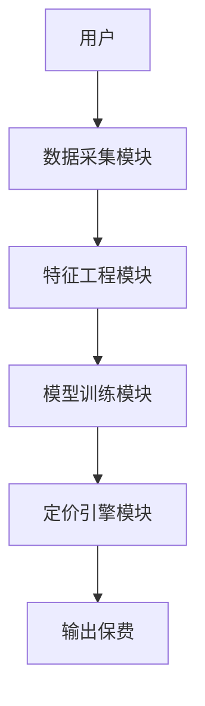

                 


# 智能保险产品定价模型

> 关键词：智能定价、机器学习、保险行业、风险管理、数据科学

> 摘要：本文深入探讨了智能保险产品定价模型的构建与应用，结合背景介绍、核心概念、算法原理、系统架构和项目实战，详细分析了如何利用机器学习技术优化保险定价流程，提升定价效率和精准度。

---

## 目录

1. [智能保险定价的背景与意义](#智能保险定价的背景与意义)
2. [智能定价模型的核心概念](#智能定价模型的核心概念)
3. [常见定价算法的原理与实现](#常见定价算法的原理与实现)
4. [智能保险定价系统的架构与实现](#智能保险定价系统的架构与实现)
5. [智能保险定价模型的项目实战](#智能保险定价模型的项目实战)
6. [总结与展望](#总结与展望)

---

## 第一部分: 智能保险定价的背景与意义

### 1. 智能保险定价的背景与意义

#### 1.1 保险定价的基本概念

保险定价是保险公司确定保费的核心过程，旨在在风险可控的前提下，实现保费收入与赔付支出的平衡。传统定价方法依赖精算师的经验和统计数据，但随着大数据和人工智能的兴起，智能定价模型逐渐成为行业的重要工具。

#### 1.2 传统保险定价方法的局限性

传统定价方法主要依赖历史数据和精算模型，存在以下问题：
- 数据维度有限，难以捕捉复杂风险因素。
- 定价过程缺乏动态调整能力，难以应对市场变化。
- 人工干预较多，效率低下且容易出错。

#### 1.3 智能保险定价的兴起

人工智能和大数据技术的快速发展为保险行业带来了革新。智能定价模型能够实时分析海量数据，快速响应市场变化，提升定价精准度和效率。以下是智能定价的主要优势：
- **数据驱动**：利用大数据技术整合多维度数据，提高定价的科学性。
- **实时更新**：通过机器学习模型实时优化定价策略。
- **个性化定价**：根据客户特征和行为提供个性化保费。

---

## 第二部分: 智能定价模型的核心概念

### 2. 智能定价模型的核心要素

#### 2.1 数据特征与处理

智能定价模型依赖高质量的数据输入，以下是关键的数据特征：
- **客户信息**：年龄、性别、职业等。
- **行为数据**：驾驶习惯（如刹车频率、急加速等）。
- **历史数据**：过往理赔记录、保费支付情况。

数据预处理是构建模型的关键步骤，包括：
- 数据清洗：去除重复、错误或缺失的数据。
- 数据转换：将非数值型数据转化为数值型。
- 特征工程：提取有意义的特征，如将“驾驶习惯”量化。

#### 2.2 模型选择与优化

选择合适的模型是定价成功的关键。以下是几种常见模型及其适用场景：
- **线性回归**：适合简单线性关系，如保费与年龄的线性关系。
- **决策树**：适合复杂非线性关系，能够自动处理特征交互。
- **随机森林**：适合高维数据，具有较强的抗过拟合能力。

模型优化需要结合业务需求，例如：
- 使用交叉验证评估模型性能。
- 调整超参数（如学习率、树深）以优化预测效果。

---

## 第三部分: 常见定价算法的原理与实现

### 3. 常见定价算法的原理与实现

#### 3.1 线性回归模型

线性回归是最简单的定价模型，假设保费与特征变量之间存在线性关系。

##### 3.1.1 线性回归的基本原理

线性回归模型可以表示为：
$$
y = \beta_0 + \beta_1x_1 + \beta_2x_2 + \ldots + \beta_nx_n + \epsilon
$$
其中，$y$是目标变量（保费），$x_i$是特征变量，$\beta_i$是回归系数，$\epsilon$是误差项。

##### 3.1.2 线性回归的实现步骤

1. **数据准备**：收集并清洗数据。
2. **特征选择**：选择相关特征。
3. **模型训练**：使用最小二乘法求解回归系数。
4. **模型评估**：计算R²值和残差分析。

##### 3.1.3 线性回归的优缺点

- **优点**：简单易懂，计算速度快。
- **缺点**：难以捕捉非线性关系，容易受多重共线性影响。

#### 3.2 决策树模型

决策树是一种基于特征分裂的定价模型，能够处理复杂非线性关系。

##### 3.2.1 决策树的构建原理

决策树通过分裂节点来划分数据，每个节点选择最优分裂特征，直到叶子节点。分裂特征的选择通常基于信息增益或基尼指数。

##### 3.2.2 决策树的实现步骤

1. **数据准备**：收集并清洗数据。
2. **特征选择**：选择相关特征。
3. **模型训练**：使用ID3/C4.5算法构建决策树。
4. **模型评估**：计算准确率和F1分数。

##### 3.2.3 决策树的优缺点

- **优点**：易于解释，能够处理非线性关系。
- **缺点**：容易过拟合，计算复杂度较高。

#### 3.3 随机森林与梯度提升树

随机森林和梯度提升树是基于集成学习的定价模型，具有较强的预测能力和鲁棒性。

##### 3.3.1 随机森林的原理与实现

随机森林通过构建多棵决策树并取平均预测值来降低过拟合风险。

##### 3.3.2 梯度提升树的原理与实现

梯度提升树通过逐层优化损失函数来构建模型，具有较强的拟合能力。

---

## 第四部分: 智能保险定价系统的架构与实现

### 4. 智能保险定价系统的架构与实现

#### 4.1 系统功能模块划分

智能保险定价系统主要包括以下模块：
- **数据采集模块**：从数据库或API获取数据。
- **特征工程模块**：对数据进行清洗和特征提取。
- **模型训练模块**：训练定价模型并保存模型。
- **定价引擎模块**：根据输入特征实时计算保费。

#### 4.2 系统架构设计

以下是系统架构的Mermaid图：



---

## 第五部分: 智能保险定价模型的项目实战

### 5. 项目实战

#### 5.1 项目背景

本文以车险定价为例，构建一个基于随机森林的定价模型。

#### 5.2 项目实现

##### 5.2.1 环境搭建

安装必要的库：
```bash
pip install pandas scikit-learn
```

##### 5.2.2 数据处理

```python
import pandas as pd
data = pd.read_csv('car_insurance.csv')
# 数据清洗
data.dropna(inplace=True)
# 特征工程
data['age_range'] = pd.cut(data['age'], 5)
data['age_range'] = data['age_range'].cat.codes
```

##### 5.2.3 模型实现

```python
from sklearn.ensemble import RandomForestRegressor
from sklearn.metrics import mean_squared_error

# 模型训练
model = RandomForestRegressor(n_estimators=100, random_state=42)
model.fit(X_train, y_train)

# 模型预测
y_pred = model.predict(X_test)
print(mean_squared_error(y_test, y_pred))
```

---

## 第六部分: 总结与展望

### 6. 总结与展望

#### 6.1 总结

智能保险定价模型通过机器学习技术优化了传统定价方法的不足，提高了定价的精准度和效率。

#### 6.2 展望

未来，随着AI技术的进步，智能定价模型将更加智能化和个性化，成为保险行业的重要支柱。

---

## 作者

作者：AI天才研究院 & 禅与计算机程序设计艺术

